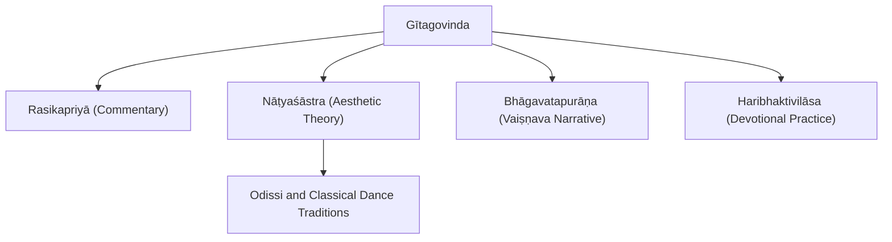
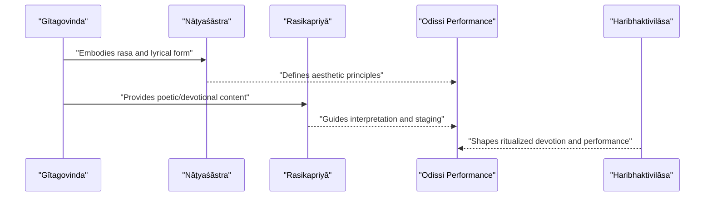
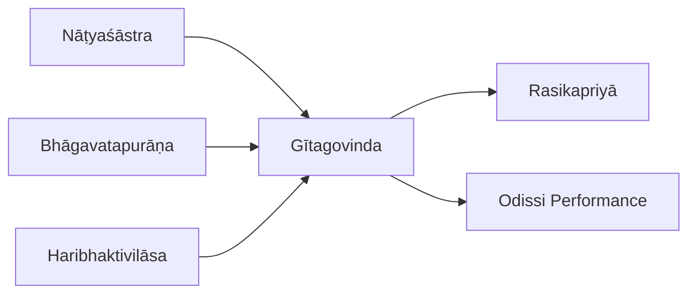
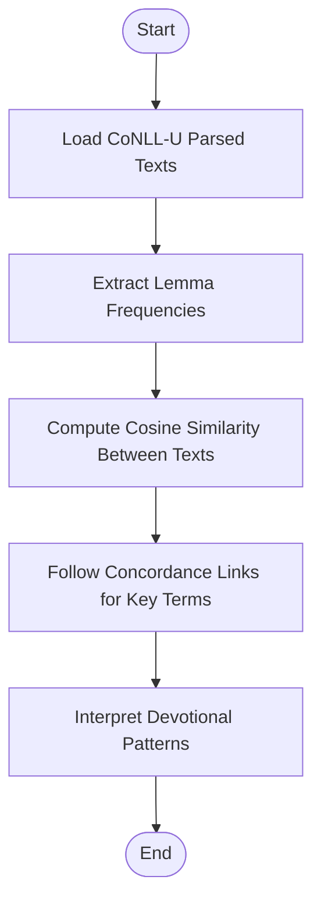

<cite>
**Referenced Files in This Document**
- [gitagovinda.md](file://gitagovinda.md)
- [INDEX.md](file://INDEX.md)
- [rasikapriya.md](file://rasikapriya.md)
- [bhagavatapurana.md](file://bhagavatapurana.md)
- [haribhaktivilasa.md](file://haribhaktivilasa.md)
- [natyasastra.md](file://natyasastra.md)
</cite>

## Table of Contents
1. [Introduction](#introduction)
2. [Project Structure](#project-structure)
3. [Core Components](#core-components)
4. [Architecture Overview](#architecture-overview)
5. [Detailed Component Analysis](#detailed-component-analysis)
6. [Dependency Analysis](#dependency-analysis)
7. [Performance Considerations](#performance-considerations)
8. [Troubleshooting Guide](#troubleshooting-guide)
9. [Conclusion](#conclusion)
10. [Appendices](#appendices)

## Introduction
This document provides a focused, scholarly overview of Vaishnava devotional poetry with an emphasis on Krishna-centered bhakti literature. It centers on Jayadeva’s Gītagovinda as the pinnacle of Sanskrit devotional lyricism and explores its lyrical structure, musical qualities, and depiction of divine love between Rādhā and Kṛṣṇa. It also documents theological concepts such as madhurya rasa (the sweet sentiment), poetic devices used to express divine love, and the influence of these works on classical dance traditions like Odissi. Finally, it outlines computational approaches for analyzing devotional vocabulary patterns, prayer structures, and the evolution of Krishna bhakti themes across literary periods using the repository’s parsed texts.

## Project Structure
The repository organizes Sanskrit texts as concept entries with metadata, tags, and lemma frequency tables derived from CoNLL-U parsed editions. For this documentation, the most relevant files are:
- The Gītagovinda entry, which identifies the text, authorship, thematic focus, and related texts by lexical similarity.
- The Nāṭyaśāstra entry, which grounds aesthetic theory (including rasa) foundational to performance traditions.
- Bhāgavatapurāṇa and Haribhaktivilāsa entries that provide broader Vaiṣṇava context and devotional practice frameworks.
- Rasikapriyā, a commentary on the Gītagovinda that elucidates poetic and devotional nuances.

**Diagram sources**
- [gitagovinda.md:1-11](file://gitagovinda.md#L1-L11)
- [natyasastra.md:1-11](file://natyasastra.md#L1-L11)
- [bhagavatapurana.md:1-11](file://bhagavatapurana.md#L1-L11)
- [haribhaktivilasa.md:1-11](file://haribhaktivilasa.md#L1-L11)
- [rasikapriya.md:1-11](file://rasikapriya.md#L1-L11)

**Section sources**
- [INDEX.md:1-10](file://INDEX.md#L1-L10)
- [gitagovinda.md:1-11](file://gitagovinda.md#L1-L11)
- [natyasastra.md:1-11](file://natyasastra.md#L1-L11)

## Core Components
- Gītagovinda: A lyrical Sanskrit poem depicting the divine love of Rādhā and Kṛṣṇa; recognized as a masterpiece of Sanskrit poetry and source material for classical Odissi dance-drama.
- Rasikapriyā: A commentary on the Gītagovinda that clarifies poetic and devotional nuances, including rasa-theory applications.
- Nāṭyaśāstra: Foundational treatise on drama, dance, music, and rasa theory, providing the theoretical framework for performance aesthetics.
- Bhāgavatapurāṇa: A central Vaiṣṇava Purāṇa centered on the life and teachings of Kṛṣṇa and devotion to Viṣṇu, offering narrative and theological background.
- Haribhaktivilāsa: A Gauḍīya Vaiṣṇava manual detailing rituals, vows, and rules of bhakti practice.

These components collectively support analysis of lyrical structure, musicality, rasa, and performance traditions within Krishna-centered bhakti literature.

**Section sources**
- [gitagovinda.md:1-11](file://gitagovinda.md#L1-L11)
- [rasikapriya.md:1-11](file://rasikapriya.md#L1-L11)
- [natyasastra.md:1-11](file://natyasastra.md#L1-L11)
- [bhagavatapurana.md:1-11](file://bhagavatapurana.md#L1-L11)
- [haribhaktivilasa.md:1-11](file://haribhaktivilasa.md#L1-L11)

## Architecture Overview
The conceptual architecture links poetic composition, aesthetic theory, and performance tradition:
- Poetic Composition: Gītagovinda expresses divine love through lyrical forms and musical cadence.
- Aesthetic Theory: Nāṭyaśāstra defines rasa and performance principles that inform how emotion is evoked and represented.
- Commentary: Rasikapriyā interprets poetic and devotional layers, bridging textual meaning and performative expression.
- Narrative and Practice: Bhāgavatapurāṇa supplies mythic narratives; Haribhaktivilāsa prescribes devotional practices that shape reception and performance.

**Diagram sources**
- [gitagovinda.md:1-11](file://gitagovinda.md#L1-L11)
- [natyasastra.md:1-11](file://natyasastra.md#L1-L11)
- [rasikapriya.md:1-11](file://rasikapriya.md#L1-L11)
- [haribhaktivilasa.md:1-11](file://haribhaktivilasa.md#L1-L11)

## Detailed Component Analysis

### Gītagovinda: Lyrical Structure, Musical Qualities, and Divine Love
- Lyrical Structure: The Gītagovinda is structured as a sequence of songs and verses that dramatize episodes of divine love between Rādhā and Kṛṣṇa, often employing dialogue, seasonal imagery, and emotional shifts.
- Musical Qualities: As a song-poem, it integrates meter, rhyme, and melodic phrasing suitable for performance; its rhythmic patterns and refrain-like elements facilitate musical rendering and dance choreography.
- Depiction of Divine Love: The text portrays intimate, tender exchanges that exemplify madhurya rasa, emphasizing sweetness, longing, union, and separation as modes of spiritual communion.

Computational insights from the repository:
- Lemma frequency highlights recurring devotional vocabulary and relational terms, indicating emphasis on address, deity names, and confidante roles.
- Related-text similarity shows connections to other lyrical and narrative works, suggesting shared motifs and stylistic affinities.

**Section sources**
- [gitagovinda.md:1-11](file://gitagovinda.md#L1-L11)
- [gitagovinda.md:15-30](file://gitagovinda.md#L15-L30)
- [gitagovinda.md:31-47](file://gitagovinda.md#L31-L47)

### Madhurya Rasa: The Sweet Sentiment in Krishna Bhakti
- Theological Concept: Madhurya rasa denotes the sweet, affectionate mode of devotion characterized by intimacy, tenderness, and playful exchange between devotee and deity.
- Poetic Devices: Use of metaphor, simile, epithets, and natural imagery conveys sweetness; repetition and refrain reinforce emotional resonance.
- Performance Integration: Rasa theory underpins how emotions are staged and felt; gestures, expressions, and music translate textual sweetness into embodied experience.

Evidence from the repository:
- Nāṭyaśāstra provides the foundational framework for rasa, essential for interpreting and performing the Gītagovinda’s emotional content.
- Rasikapriyā commentary elucidates poetic nuances and rasa application in the Gītagovinda.

**Section sources**
- [natyasastra.md:1-11](file://natyasastra.md#L1-L11)
- [rasikapriya.md:1-11](file://rasikapriya.md#L1-L11)

### Influence on Classical Dance Traditions (Odissi)
- Source Material: The Gītagovinda serves as a primary repertoire for Odissi dance-drama, with choreographers adapting its songs and verses into expressive movements.
- Aesthetic Alignment: Rasa theory guides the dancer’s portrayal of emotions; musicality informs rhythm and tempo choices in performance.
- Ritual Context: Devotional practice manuals like Haribhaktivilāsa inform the ritual framing of performances, integrating worship and artistic expression.

**Section sources**
- [gitagovinda.md:1-11](file://gitagovinda.md#L1-L11)
- [natyasastra.md:1-11](file://natyasastra.md#L1-L11)
- [haribhaktivilasa.md:1-11](file://haribhaktivilasa.md#L1-L11)

### Computational Analysis of Devotional Vocabulary Patterns
Approach:
- Lemma Frequency Analysis: Examine top lemmas to identify recurring devotional terms, deity names, and relational markers.
- Similarity Mapping: Use cosine similarity to locate texts with comparable lexical profiles, revealing thematic and stylistic affinities.
- Concordance Exploration: Follow concordance links to contextual usage of key terms across the corpus.

Repository-based observations:
- Gītagovinda’s notable lemmas include frequent address forms, deity references, and confidante terms, reflecting intimate devotional discourse.
- Bhāgavatapurāṇa’s lemma profile indicates broad narrative and theological vocabulary consistent with epic storytelling and devotional exposition.
- Haribhaktivilāsa’s lemma distribution aligns with procedural and prescriptive language typical of devotional manuals.

**Section sources**
- [gitagovinda.md:31-47](file://gitagovinda.md#L31-L47)
- [bhagavatapurana.md:31-47](file://bhagavatapurana.md#L31-L47)
- [haribhaktivilasa.md:31-47](file://haribhaktivilasa.md#L31-L47)

### Prayer Structures and Evolution of Krishna Bhakti Themes
Prayer Structures:
- Stotra and Hymn Forms: Repetitive praise, invocation, and enumeration of divine qualities characterize stotra compositions.
- Narrative Prayers: Purāṇic narratives embed prayers within stories, blending devotion with mythic context.
- Manualized Devotion: Practical guides prescribe sequences of recitation, ritual actions, and meditative focuses.

Evolution Across Periods:
- Early Purāṇic Narratives: Bhāgavatapurāṇa establishes Krishna-centric narratives and devotional ideals.
- Medieval Lyric Synthesis: Gītagovinda synthesizes poetic artistry with devotional intensity, influencing later regional literatures.
- Commentarial Elaboration: Rasikapriyā refines interpretation, aligning textual meaning with performance and lived devotion.

**Section sources**
- [bhagavatapurana.md:1-11](file://bhagavatapurana.md#L1-L11)
- [gitagovinda.md:1-11](file://gitagovinda.md#L1-L11)
- [rasikapriya.md:1-11](file://rasikapriya.md#L1-L11)

## Dependency Analysis
Conceptual dependencies among core components:
- Gītagovinda depends on rasa theory (Nāṭyaśāstra) for emotional articulation and performance conventions.
- Rasikapriyā depends on Gītagovinda for interpretive content and on rasa theory for analytical framework.
- Bhāgavatapurāṇa provides narrative foundation that informs both poetic composition and devotional practice.
- Haribhaktivilāsa influences performance context and ritual framing, shaping how texts are received and enacted.

**Diagram sources**
- [natyasastra.md:1-11](file://natyasastra.md#L1-L11)
- [gitagovinda.md:1-11](file://gitagovinda.md#L1-L11)
- [rasikapriya.md:1-11](file://rasikapriya.md#L1-L11)
- [bhagavatapurana.md:1-11](file://bhagavatapurana.md#L1-L11)
- [haribhaktivilasa.md:1-11](file://haribhaktivilasa.md#L1-L11)

**Section sources**
- [natyasastra.md:1-11](file://natyasastra.md#L1-L11)
- [gitagovinda.md:1-11](file://gitagovinda.md#L1-L11)
- [rasikapriya.md:1-11](file://rasikapriya.md#L1-L11)
- [bhagavatapurana.md:1-11](file://bhagavatapurana.md#L1-L11)
- [haribhaktivilasa.md:1-11](file://haribhaktivilasa.md#L1-L11)

## Performance Considerations
- Metrical and Musical Alignment: Ensure that metrical patterns match intended musical settings; analyze lemma distributions to infer rhythmic emphasis.
- Rasa Realization: Apply rasa theory to guide expressive choices; use commentary to refine emotional nuance.
- Ritual Integrity: Integrate devotional manuals’ prescriptions to maintain authenticity in performance contexts.

[No sources needed since this section provides general guidance]

## Troubleshooting Guide
Common issues and resolutions:
- Misinterpretation of Rasa: Consult Nāṭyaśāstra and Rasikapriyā to align performance with established aesthetic principles.
- Lexical Ambiguity: Use concordance links to verify contextual usage of key terms; cross-reference with related texts via similarity metrics.
- Devotional Inconsistency: Refer to Haribhaktivilāsa for standardized practices; ensure alignment with Bhāgavatapurāṇa’s narrative theology.

**Section sources**
- [natyasastra.md:1-11](file://natyasastra.md#L1-L11)
- [rasikapriya.md:1-11](file://rasikapriya.md#L1-L11)
- [haribhaktivilasa.md:1-11](file://haribhaktivilasa.md#L1-L11)
- [bhagavatapurana.md:1-11](file://bhagavatapurana.md#L1-L11)

## Conclusion
Jayadeva’s Gītagovinda stands as a masterwork of Sanskrit devotional poetry, embodying the sweet sentiment (madhurya rasa) through lyrical structure, musicality, and vivid depictions of divine love between Rādhā and Kṛṣṇa. Its integration with rasa theory and performance traditions, especially Odissi, demonstrates the interplay between text, aesthetics, and embodied practice. Computational analyses of lemma frequencies and textual similarities reveal patterns in devotional vocabulary and thematic evolution across periods. Together, these resources offer a robust framework for studying and performing Krishna-centered bhakti literature.

[No sources needed since this section summarizes without analyzing specific files]

## Appendices

### Appendix A: Computational Workflow for Devotional Vocabulary Analysis

[No sources needed since this diagram shows conceptual workflow, not actual code structure]
