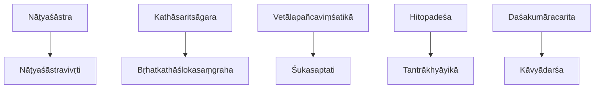
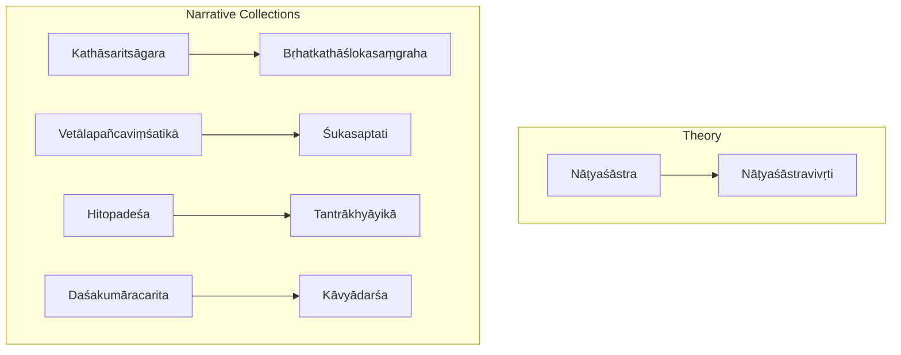
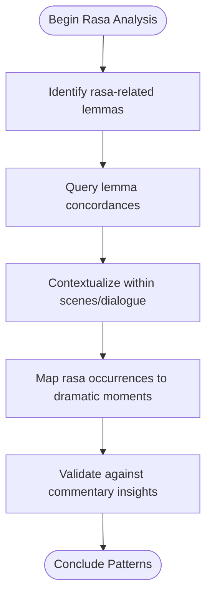
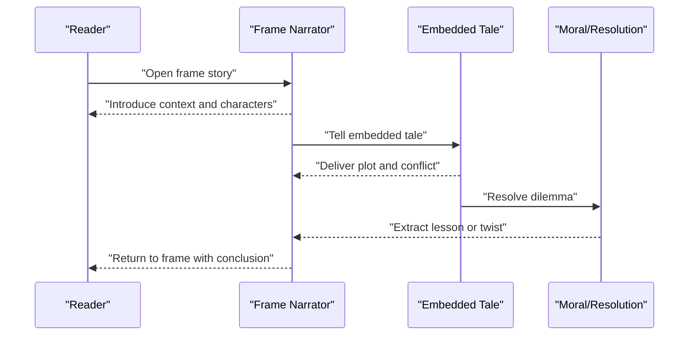
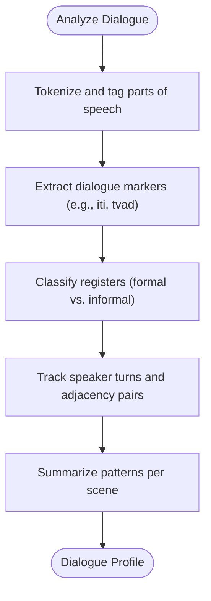
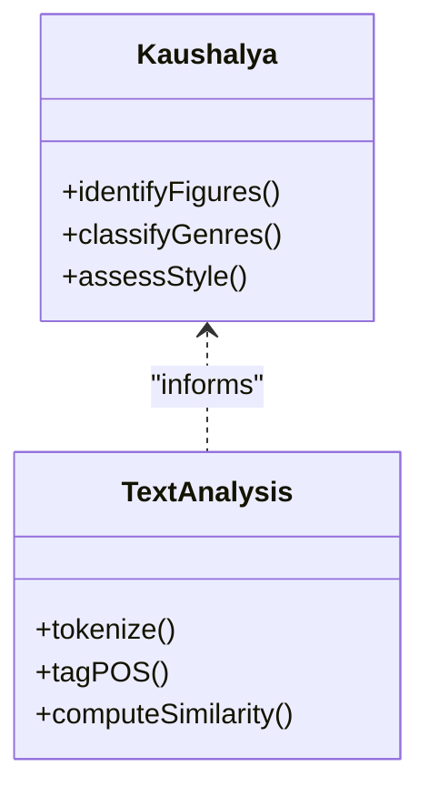
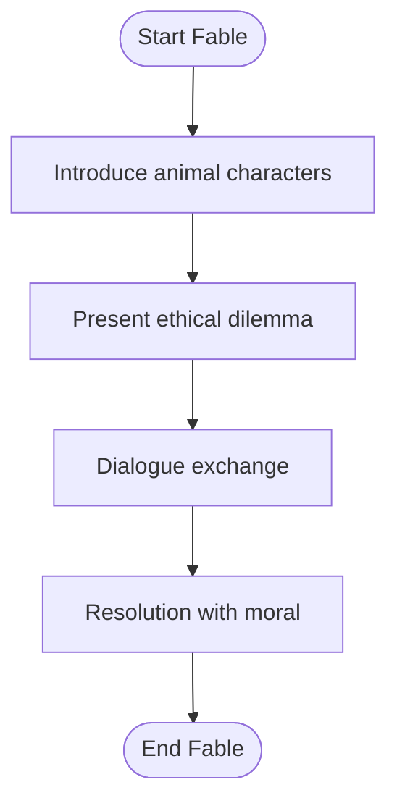
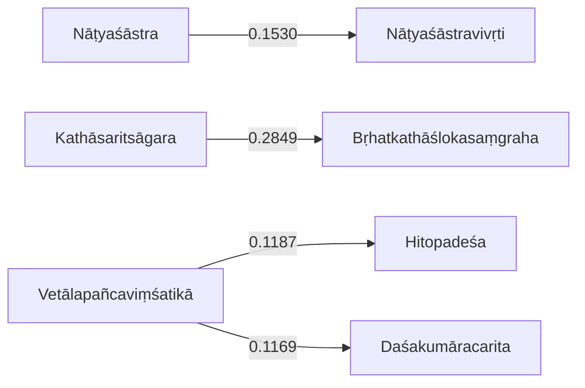

<cite>
**Referenced Files in This Document**
- [natyasastra.md](file://natyasastra.md)
- [natyasastravivrti.md](file://natyasastravivrti.md)
- [kathasaritsagara.md](file://kathasaritsagara.md)
- [vetalapancavimsatika.md](file://vetalapancavimsatika.md)
- [sukasaptati.md](file://sukasaptati.md)
- [brhatkathaslokasamgraha.md](file://brhatkathaslokasamgraha.md)
- [hitopadesa.md](file://hitopadesa.md)
- [tantrakhyayika.md](file://tantrakhyayika.md)
- [dasakumaracarita.md](file://dasakumaracarita.md)
- [kavyadarsa.md](file://kavyadarsa.md)
</cite>

## Table of Contents
1. [Introduction](#introduction)
2. [Project Structure](#project-structure)
3. [Core Components](#core-components)
4. [Architecture Overview](#architecture-overview)
5. [Detailed Component Analysis](#detailed-component-analysis)
6. [Dependency Analysis](#dependency-analysis)
7. [Performance Considerations](#performance-considerations)
8. [Troubleshooting Guide](#troubleshooting-guide)
9. [Conclusion](#conclusion)

## Introduction
This document provides a comprehensive guide to Sanskrit dramatic literature and prose narratives, focusing on nāṭakas (dramas), prahasaṇas (comedies), and major story collections such as the Kathāsaritsāgara, Vetālapañcaviṃśatikā, and Śukasaptati. It explains classical conventions including rasa theory application, character typology, and stage directions, and it documents narrative techniques like frame stories and embedded narratives. Finally, it outlines how computational analysis—using lemma frequency patterns and text similarity—reveals recurring structures in dialogue construction, plot development, and the interplay between spoken and written registers across these traditions.

## Project Structure
The repository organizes each work as a concept file with metadata, related-text similarity rankings, and notable lemmas. These files serve as entry points for both human readers and computational pipelines that analyze lexical patterns and cross-text relationships.

**Diagram sources**
- [natyasastra.md:1-48](file://natyasastra.md#L1-L48)
- [natyasastravivrti.md:1-48](file://natyasastravivrti.md#L1-L48)
- [kathasaritsagara.md:1-48](file://kathasaritsagara.md#L1-L48)
- [brhatkathaslokasamgraha.md:1-48](file://brhatkathaslokasamgraha.md#L1-L48)
- [vetalapancavimsatika.md:1-48](file://vetalapancavimsatika.md#L1-L48)
- [sukasaptati.md:1-12](file://sukasaptati.md#L1-L12)
- [hitopadesa.md:1-48](file://hitopadesa.md#L1-L48)
- [tantrakhyayika.md:1-48](file://tantrakhyayika.md#L1-L48)
- [dasakumaracarita.md:1-48](file://dasakumaracarita.md#L1-L48)
- [kavyadarsa.md:1-48](file://kavyadarsa.md#L1-L48)

**Section sources**
- [natyasastra.md:1-48](file://natyasastra.md#L1-L48)
- [kathasaritsagara.md:1-48](file://kathasaritsagara.md#L1-L48)
- [vetalapancavimsatika.md:1-48](file://vetalapancavimsatika.md#L1-L48)
- [sukasaptati.md:1-12](file://sukasaptati.md#L1-L12)
- [brhatkathaslokasamgraha.md:1-48](file://brhatkathaslokasamgraha.md#L1-L48)
- [hitopadesa.md:1-48](file://hitopadesa.md#L1-L48)
- [tantrakhyayika.md:1-48](file://tantrakhyayika.md#L1-L48)
- [dasakumaracarita.md:1-48](file://dasakumaracarita.md#L1-L48)
- [kavyadarsa.md:1-48](file://kavyadarsa.md#L1-L48)

## Core Components
- Nāṭyaśāstra: Foundational treatise on dramaturgy, performance, gesture, and rasa theory; serves as the theoretical backbone for analyzing nāṭaka and prahasaṇa conventions.
- Nāṭyaśāstravivṛti: Commentary elucidating Bharata’s principles, aiding precise interpretation of stagecraft and aesthetic theory.
- Kathāsaritsāgara: Vast collection of folk tales and frame stories; exemplifies nested narrative structures and oral-to-literary transmission.
- Vetālapañcaviṃśatikā: Frame narrative built around King Vikramāditya and a vetāla; demonstrates puzzle-tale framing and dialogic tension.
- Śukasaptati: Parrot-told frame stories; highlights didactic storytelling and conversational pacing.
- Bṛhatkathāślokasaṃgraha: Poetic condensation preserving ancient frame-story traditions; bridges verse and prose narrative modes.
- Hitopadeśa and Tantrākhyāyikā: Fable collections teaching statecraft and wisdom through animal tales; model concise moral plots and proverbial diction.
- Daśakumāracarita: Prose romance showcasing gadya-kāvya style, complex plotting, and rich dialogue.
- Kāvyādarśa: Poetics treatise defining figures of speech, genres, and stylistic qualities; informs analysis of poetic devices within drama and prose.

**Section sources**
- [natyasastra.md:1-48](file://natyasastra.md#L1-L48)
- [natyasastravivrti.md:1-48](file://natyasastravivrti.md#L1-L48)
- [kathasaritsagara.md:1-48](file://kathasaritsagara.md#L1-L48)
- [vetalapancavimsatika.md:1-48](file://vetalapancavimsatika.md#L1-L48)
- [sukasaptati.md:1-12](file://sukasaptati.md#L1-L12)
- [brhatkathaslokasamgraha.md:1-48](file://brhatkathaslokasamgraha.md#L1-L48)
- [hitopadesa.md:1-48](file://hitopadesa.md#L1-L48)
- [tantrakhyayika.md:1-48](file://tantrakhyayika.md#L1-L48)
- [dasakumaracarita.md:1-48](file://dasakumaracarita.md#L1-L48)
- [kavyadarsa.md:1-48](file://kavyadarsa.md#L1-L48)

## Architecture Overview
At a high level, the corpus is organized into two complementary layers:
- Theoretical layer: Nāṭyaśāstra and its commentary provide the aesthetic and performative framework for drama.
- Narrative layer: Story collections implement frame narratives, embedded tales, and varied registers, which can be analyzed computationally via lemma distributions and similarity metrics.

**Diagram sources**
- [natyasastra.md:1-48](file://natyasastra.md#L1-L48)
- [natyasastravivrti.md:1-48](file://natyasastravivrti.md#L1-L48)
- [kathasaritsagara.md:1-48](file://kathasaritsagara.md#L1-L48)
- [vetalapancavimsatika.md:1-48](file://vetalapancavimsatika.md#L1-L48)
- [sukasaptati.md:1-12](file://sukasaptati.md#L1-L12)
- [brhatkathaslokasamgraha.md:1-48](file://brhatkathaslokasamgraha.md#L1-L48)
- [hitopadesa.md:1-48](file://hitopadesa.md#L1-L48)
- [tantrakhyayika.md:1-48](file://tantrakhyayika.md#L1-L48)
- [dasakumaracarita.md:1-48](file://dasakumaracarita.md#L1-L48)
- [kavyadarsa.md:1-48](file://kavyadarsa.md#L1-L48)

## Detailed Component Analysis

### Nāṭyaśāstra and Rasa Theory
- Purpose: Establishes dramaturgical foundations, including rasa theory, character types, and performance conventions.
- Computational signals: Frequent occurrence of “rasa” and “nāṭya” lemmas indicates focus on aesthetics and theatrical vocabulary.
- Analytical approach: Use lemma concordances to map key terms associated with rasa, bhāva, and abhinaya; correlate with commentary usage to refine interpretations.

**Diagram sources**
- [natyasastra.md:1-48](file://natyasastra.md#L1-L48)
- [natyasastravivrti.md:1-48](file://natyasastravivrti.md#L1-L48)

**Section sources**
- [natyasastra.md:1-48](file://natyasastra.md#L1-L48)
- [natyasastravivrti.md:1-48](file://natyasastravivrti.md#L1-L48)

### Frame Stories and Embedded Narratives
- Kathāsaritsāgara: Demonstrates extensive nesting of tales within a master frame; computational similarity links it closely to Bṛhatkathāślokasaṃgraha, reflecting shared narrative DNA.
- Vetālapañcaviṃśatikā: Uses a puzzle-frame where a spirit narrates riddles; frequent “rājan” lemma suggests royal address and interactive storytelling.
- Śukasaptati: Parrot narrator frames moral tales; shorter corpus size yields distinct lemma profiles emphasizing direct address and instruction.

**Diagram sources**
- [kathasaritsagara.md:1-48](file://kathasaritsagara.md#L1-L48)
- [vetalapancavimsatika.md:1-48](file://vetalapancavimsatika.md#L1-L48)
- [sukasaptati.md:1-12](file://sukasaptati.md#L1-L12)

**Section sources**
- [kathasaritsagara.md:1-48](file://kathasaritsagara.md#L1-L48)
- [vetalapancavimsatika.md:1-48](file://vetalapancavimsatika.md#L1-L48)
- [sukasaptati.md:1-12](file://sukasaptati.md#L1-L12)

### Dialogue Construction and Register Interplay
- Daśakumāracarita: Rich prose romance with extensive dialogue; high frequencies of “tad,” “ca,” “iti,” and “mad” suggest dynamic conversation markers and first-person narration.
- Computational insight: Lemma patterns reveal shifts between elevated literary register and more colloquial speech; dialogue density correlates with plot complexity.

**Diagram sources**
- [dasakumaracarita.md:1-48](file://dasakumaracarita.md#L1-L48)

**Section sources**
- [dasakumaracarita.md:1-48](file://dasakumaracarita.md#L1-L48)

### Poetics and Stylistic Devices
- Kāvyādarśa: Defines poetic figures and genres; influences how drama and prose employ ornamentation, metaphor, and rhythm.
- Computational angle: Compare lemma distributions across poetic texts to identify stylistic signatures and genre-specific markers.

**Diagram sources**
- [kavyadarsa.md:1-48](file://kavyadarsa.md#L1-L48)

**Section sources**
- [kavyadarsa.md:1-48](file://kavyadarsa.md#L1-L48)

### Fables and Didactic Narratives
- Hitopadeśa and Tantrākhyāyikā: Animal fables teach statecraft and ethics; lemma patterns show frequent connectors (“ca,” “api”) and action verbs (“kṛ”), indicating procedural storytelling.
- Computational use: Detect moralizing structures by tracking imperative forms and proverbial phrases.

**Diagram sources**
- [hitopadesa.md:1-48](file://hitopadesa.md#L1-L48)
- [tantrakhyayika.md:1-48](file://tantrakhyayika.md#L1-L48)

**Section sources**
- [hitopadesa.md:1-48](file://hitopadesa.md#L1-L48)
- [tantrakhyayika.md:1-48](file://tantrakhyayika.md#L1-L48)

## Dependency Analysis
Computational similarity among texts reveals clusters of narrative tradition and stylistic affinity:
- Nāṭyaśāstra clusters with its commentary and broader Purāṇic corpora, indicating shared rhetorical and thematic vocabularies.
- Kathāsaritsāgara strongly aligns with Bṛhatkathāślokasaṃgraha, underscoring continuity in frame-story transmission.
- Vetālapañcaviṃśatikā shows moderate similarity to Hitopadeśa and Daśakumāracarita, reflecting overlapping didactic and adventure motifs.

**Diagram sources**
- [natyasastra.md:1-48](file://natyasastra.md#L1-L48)
- [natyasastravivrti.md:1-48](file://natyasastravivrti.md#L1-L48)
- [kathasaritsagara.md:1-48](file://kathasaritsagara.md#L1-L48)
- [brhatkathaslokasamgraha.md:1-48](file://brhatkathaslokasamgraha.md#L1-L48)
- [vetalapancavimsatika.md:1-48](file://vetalapancavimsatika.md#L1-L48)
- [hitopadesa.md:1-48](file://hitopadesa.md#L1-L48)
- [dasakumaracarita.md:1-48](file://dasakumaracarita.md#L1-L48)

**Section sources**
- [natyasastra.md:1-48](file://natyasastra.md#L1-L48)
- [kathasaritsagara.md:1-48](file://kathasaritsagara.md#L1-L48)
- [vetalapancavimsatika.md:1-48](file://vetalapancavimsatika.md#L1-L48)
- [brhatkathaslokasamgraha.md:1-48](file://brhatkathaslokasamgraha.md#L1-L48)
- [hitopadesa.md:1-48](file://hitopadesa.md#L1-L48)
- [dasakumaracarita.md:1-48](file://dasakumaracarita.md#L1-L48)

## Performance Considerations
- Corpus scale: Larger works like Kathāsaritsāgara and Daśakumaracarita require efficient tokenization and indexing to handle extensive dialogue and nested narratives.
- Lemma frequency: High-frequency function words (“tad,” “ca,” “iti”) dominate counts; normalization and stopword handling are essential for meaningful comparisons.
- Similarity computation: TF-IDF cosine similarity provides quick clustering but may obscure nuanced stylistic differences; complement with POS-aware embeddings for deeper analysis.

[No sources needed since this section provides general guidance]

## Troubleshooting Guide
- Misclassification of dialogue markers: Ensure accurate tagging of quotation markers (e.g., “iti”) and discourse particles to avoid conflating narration with speech.
- Overgeneralized similarity scores: Adjust weighting schemes to prioritize content-bearing lemmas over function words when comparing narrative styles.
- Inconsistent lemma indexing: Verify alignment between lemma indices and concordance queries to maintain reproducibility across analyses.

**Section sources**
- [kathasaritsagara.md:1-48](file://kathasaritsagara.md#L1-L48)
- [dasakumaracarita.md:1-48](file://dasakumaracarita.md#L1-L48)
- [kavyadarsa.md:1-48](file://kavyadarsa.md#L1-L48)

## Conclusion
Sanskrit dramatic literature and prose narratives form a rich ecosystem where theory and practice intersect. The Nāṭyaśāstra and its commentary provide the aesthetic scaffolding for rasa-driven performance, while story collections demonstrate sophisticated frame-narrative architectures and varied registers. Computational tools—lemma frequency analysis, concordancing, and similarity clustering—illuminate patterns in dialogue construction, plot development, and stylistic evolution. Together, these approaches enable a nuanced understanding of how Sanskrit authors crafted compelling dramas and narratives that continue to resonate across cultures and centuries.

[No sources needed since this section summarizes without analyzing specific files]
