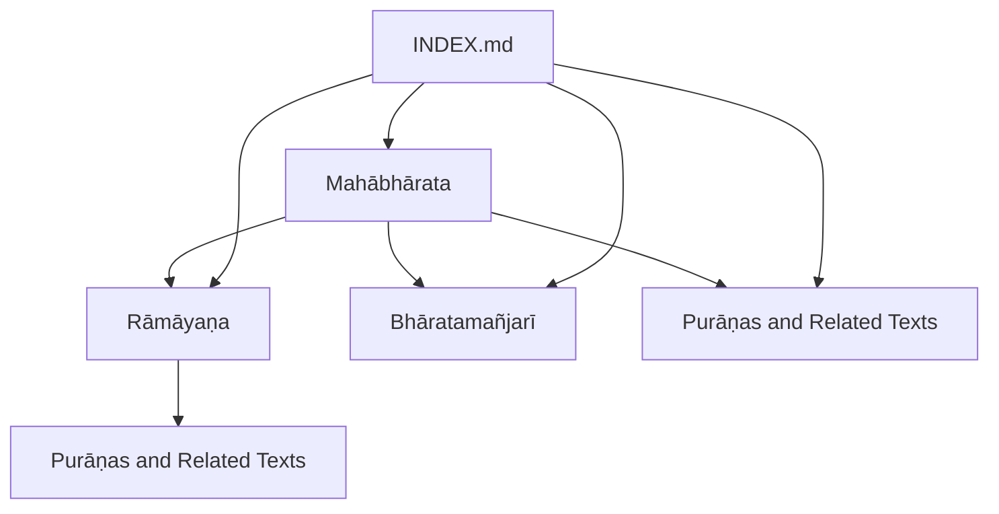
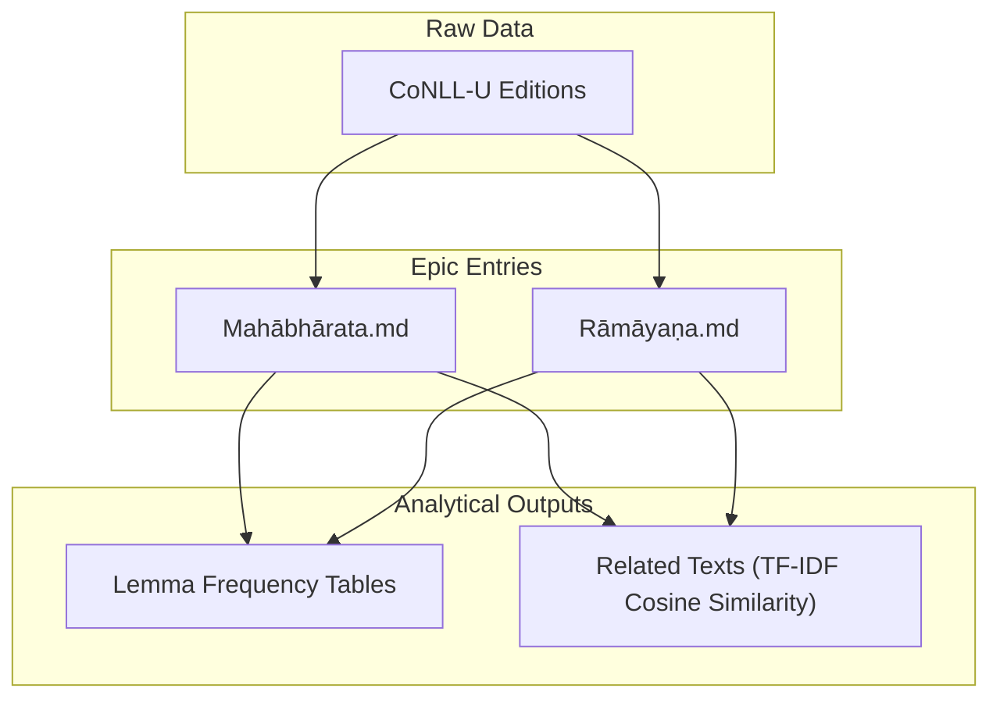
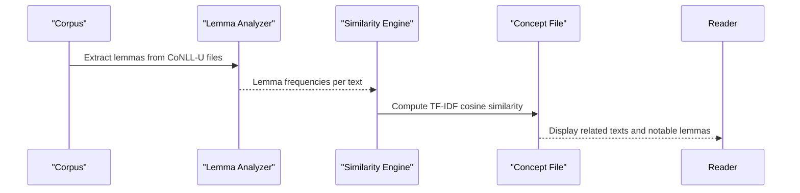
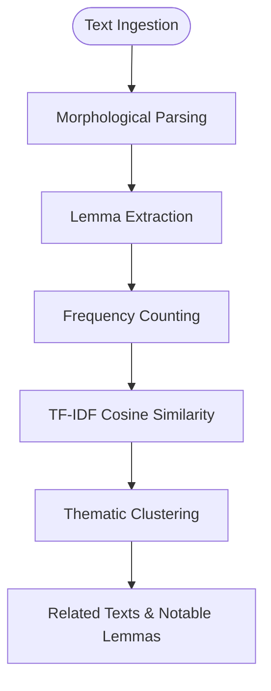
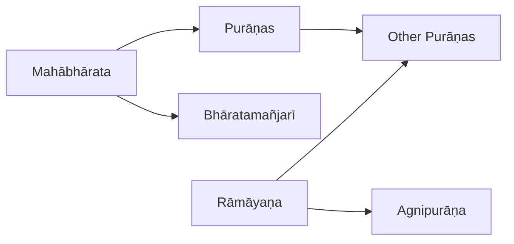
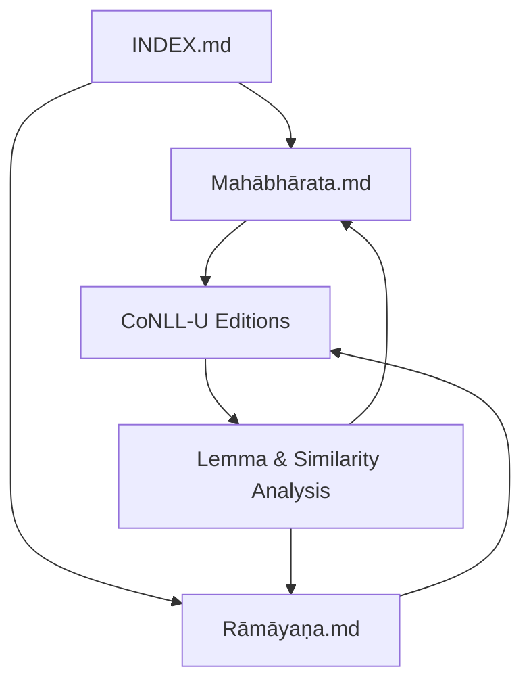

<cite>
**Referenced Files in This Document**
- [mahabharata.md](file://mahabharata.md)
- [ramayana.md](file://ramayana.md)
- [INDEX.md](file://INDEX.md)
- [bharatamanjari.md](file://bharatamanjari.md)
- [kathasaritsagara.md](file://kathasaritsagara.md)
</cite>

## Table of Contents
1. [Introduction](#introduction)
2. [Project Structure](#project-structure)
3. [Core Components](#core-components)
4. [Architecture Overview](#architecture-overview)
5. [Detailed Component Analysis](#detailed-component-analysis)
6. [Dependency Analysis](#dependency-analysis)
7. [Performance Considerations](#performance-considerations)
8. [Troubleshooting Guide](#troubleshooting-guide)
9. [Conclusion](#conclusion)
10. [Appendices](#appendices)

## Introduction
This document provides a comprehensive overview of Sanskrit epic poetry, focusing on the Mahābhārata and Rāmāyaṇa as foundational itihasas of Indian civilization. It explains narrative structure, thematic development, cultural significance, and the philosophical dimensions embedded within these texts. It also documents computational analysis techniques used to study epic patterns, including lemma frequency analysis, thematic clustering via TF-IDF cosine similarity, and cross-textual relationships across the repository’s corpus. Finally, it outlines the evolution from oral tradition to written form, the role of bards and reciters, and the integration of dharma discourse within epic frameworks.

## Project Structure
The repository organizes Sanskrit texts as individual concept files with structured metadata and analytical summaries. The two epics are represented by dedicated entries that include:
- A concise description and scope
- Source references to raw CoNLL-U editions
- Computational metrics such as related texts by lemma similarity and notable lemmas by frequency

**Diagram sources**
- [mahabharata.md:1-11](file://mahabharata.md#L1-L11)
- [ramayana.md:1-11](file://ramayana.md#L1-L11)
- [INDEX.md:129-191](file://INDEX.md#L129-L191)

**Section sources**
- [mahabharata.md:1-11](file://mahabharata.md#L1-L11)
- [ramayana.md:1-11](file://ramayana.md#L1-L11)
- [INDEX.md:1-277](file://INDEX.md#L1-L277)

## Core Components
- Mahābhārata: The longest Sanskrit epic, a vast narrative centered on the Kuru dynasty war, containing the Bhagavadgītā and numerous sub-stories; provided as 2,012 CoNLL-U files for computational analysis.
- Rāmāyaṇa: Vālmīki’s first Sanskrit epic (ādikāvya), recounting the life, exile, and adventures of Rāma and the rescue of Sītā from Rāvaṇa in seven kāṇḍas; provided as 606 CoNLL-U files.

These components serve as anchors for computational studies:
- Lemma frequency analysis reveals high-frequency function words and key content terms.
- Cross-textual similarity identifies related texts through TF-IDF cosine similarity over lemma usage patterns.
- Thematic clustering emerges from co-occurrence of lemmas and shared vocabulary profiles across texts.

**Section sources**
- [mahabharata.md:1-11](file://mahabharata.md#L1-L11)
- [ramayana.md:1-11](file://ramayana.md#L1-L11)

## Architecture Overview
The repository’s architecture supports comparative textual analysis by standardizing each text into a concept file with:
- Metadata (title, description, knowledge-bank, sources, tags)
- Computational outputs (related texts by similarity, notable lemmas by frequency)
- Links to raw CoNLL-U editions for morphological and dependency parsing

**Diagram sources**
- [mahabharata.md:15-47](file://mahabharata.md#L15-L47)
- [ramayana.md:15-47](file://ramayana.md#L15-L47)

## Detailed Component Analysis

### Mahābhārata
- Narrative scope: The epic encompasses the Kuru dynasty conflict, moral dilemmas, and philosophical discourses, notably the Bhagavadgītā.
- Computational profile:
  - Related texts identified by lemma similarity highlight connections to retellings and Purāṇic literature.
  - Notable lemmas include frequent connective and demonstrative forms, reflecting narrative style and rhetorical devices.
- Cultural significance: Foundational to Indian civilization, influencing law, philosophy, religion, and arts.

**Diagram sources**
- [mahabharata.md:15-47](file://mahabharata.md#L15-L47)

**Section sources**
- [mahabharata.md:15-47](file://mahabharata.md#L15-L47)

### Rāmāyaṇa
- Narrative scope: Seven kāṇḍas narrating Rāma’s exile, battles, and restoration of dharma.
- Computational profile:
  - High similarity to Agnipurāṇa indicates shared lexical themes or genre conventions.
  - Notable lemmas reflect both functional language and character-centric vocabulary.
- Cultural significance: Central to ethical ideals, devotion, and kingship models in Indian culture.

**Diagram sources**
- [ramayana.md:15-47](file://ramayana.md#L15-L47)

**Section sources**
- [ramayana.md:15-47](file://ramayana.md#L15-L47)

### Comparative Thematic Clustering
- Cross-textual relationships reveal clusters of texts sharing lemma usage patterns:
  - Mahābhārata shows strong similarity to Bhāratamañjarī and several Purāṇas.
  - Rāmāyaṇa exhibits notable similarity to Agnipurāṇa and other mytho-historical works.
- These clusters help identify shared narrative motifs, theological emphases, and stylistic conventions across genres.

**Diagram sources**
- [mahabharata.md:15-30](file://mahabharata.md#L15-L30)
- [ramayana.md:15-30](file://ramayana.md#L15-L30)

**Section sources**
- [mahabharata.md:15-30](file://mahabharata.md#L15-L30)
- [ramayana.md:15-30](file://ramayana.md#L15-L30)

### Evolution from Oral Tradition to Written Form
- The epics originated in oral traditions performed by bards and reciters, preserving narratives through mnemonic structures and rhythmic forms.
- Over time, these oral performances were codified into written manuscripts, enabling broader dissemination and scholarly commentary.
- The repository’s CoNLL-U editions support computational reconstruction of sandhi and morphological forms, aiding philological study of transmission variants.

[No sources needed since this section provides general guidance]

### Role of Bards and Reciters
- Bards (sūtas, kavi, sūktakāra) served as custodians of epic lore, performing at courts and rituals, embedding didactic and devotional elements.
- Their performance practices influenced textual composition, repetition, and formulaic structures observable in lemma patterns and narrative pacing.

[No sources needed since this section provides general guidance]

### Philosophical Dimensions and Dharma Discourse
- Both epics integrate dharma discourse within narrative frames, exploring duty, righteousness, and cosmic order through dialogues and episodes.
- The Mahābhārata’s inclusion of the Bhagavadgītā exemplifies philosophical synthesis within an epic framework.
- Computational analysis can track thematic shifts by monitoring lemma frequency changes across sections, revealing emphasis on ethical and metaphysical topics.

[No sources needed since this section provides general guidance]

### Key Episodes and Character Development Patterns
- Episodes often dramatize moral choices and consequences, shaping character arcs that model ideal conduct and its complexities.
- Lemma frequency and contextual usage can highlight recurring themes (e.g., duty, sacrifice, devotion) associated with specific characters and events.

[No sources needed since this section provides general guidance]

## Dependency Analysis
The conceptual entries depend on:
- Raw CoNLL-U editions for morphological and syntactic analysis
- Analytical pipelines producing lemma frequencies and similarity metrics
- Index documentation providing cross-references and navigation

**Diagram sources**
- [INDEX.md:129-191](file://INDEX.md#L129-L191)
- [mahabharata.md:1-11](file://mahabharata.md#L1-L11)
- [ramayana.md:1-11](file://ramayana.md#L1-L11)

**Section sources**
- [INDEX.md:129-191](file://INDEX.md#L129-L191)
- [mahabharata.md:1-11](file://mahabharata.md#L1-L11)
- [ramayana.md:1-11](file://ramayana.md#L1-L11)

## Performance Considerations
- Large corpora (thousands of CoNLL-U files) require efficient processing pipelines for lemma extraction and similarity computation.
- TF-IDF weighting helps normalize term importance across texts, improving clustering accuracy.
- Memory and compute constraints may necessitate chunked processing and caching strategies for large-scale analyses.

[No sources needed since this section provides general guidance]

## Troubleshooting Guide
- If similarity scores seem unexpectedly low, verify lemma normalization and stopword handling.
- For inconsistent lemma frequencies, check CoNLL-U parsing quality and sandhi reconstruction steps.
- Use concordance links to inspect lemma contexts and validate computational results against original texts.

[No sources needed since this section provides general guidance]

## Conclusion
The Mahābhārata and Rāmāyaṇa stand as foundational itihasas, embodying rich narrative structures, deep philosophical insights, and enduring cultural influence. The repository’s computational approach—lemma frequency analysis, TF-IDF-based similarity, and cross-textual clustering—enables systematic study of epic patterns and relationships. By bridging traditional scholarship with modern analytics, researchers can explore how oral traditions evolved into written forms, how bards shaped narrative and theme, and how dharma discourse is woven into epic frameworks.

[No sources needed since this section summarizes without analyzing specific files]

## Appendices

### Appendix A: Related Texts and Similarity Highlights
- Mahābhārata shows highest similarity to Bhāratamañjarī and multiple Purāṇas, indicating shared lexical and thematic affinities.
- Rāmāyaṇa exhibits strong similarity to Agnipurāṇa, suggesting common narrative or doctrinal elements.

**Section sources**
- [mahabharata.md:15-30](file://mahabharata.md#L15-L30)
- [ramayana.md:15-30](file://ramayana.md#L15-L30)

### Appendix B: Notable Lemmas and Stylistic Indicators
- Frequent function words (connectives, pronouns) dominate lemma lists, reflecting narrative cohesion and rhetorical flow.
- Content-specific lemmas (e.g., names, deities, actions) provide insight into thematic focus and character prominence.

**Section sources**
- [mahabharata.md:31-47](file://mahabharata.md#L31-L47)
- [ramayana.md:31-47](file://ramayana.md#L31-L47)

### Appendix C: Cross-References and Navigation
- The INDEX provides a comprehensive catalog of texts, facilitating exploration of related materials and thematic overlaps across the corpus.

**Section sources**
- [INDEX.md:1-277](file://INDEX.md#L1-L277)
