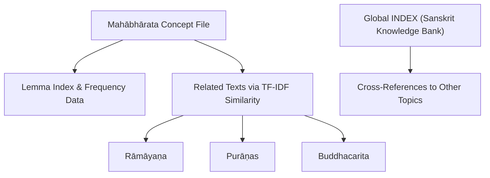
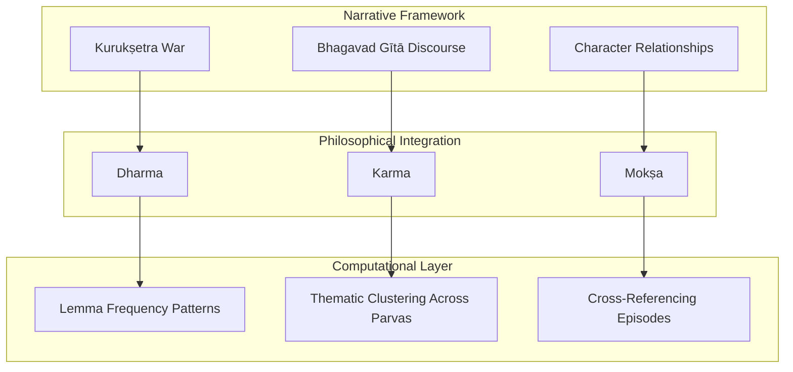
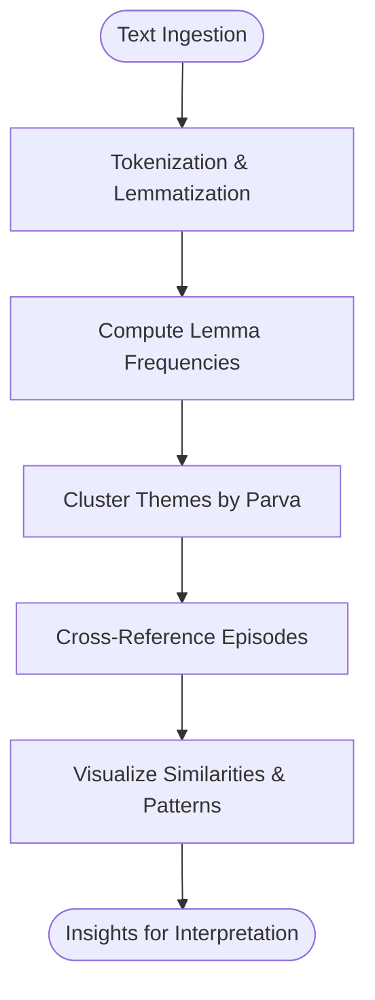
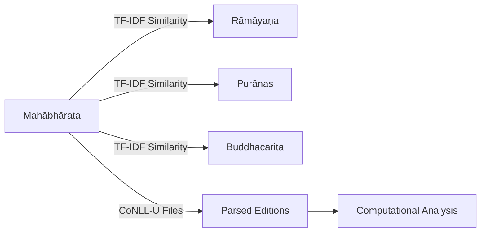

<cite>
**Referenced Files in This Document**
- [mahabharata.md](file://mahabharata.md)
- [INDEX.md](file://INDEX.md)
- [ramayana.md](file://ramayana.md)
</cite>

## Table of Contents
1. [Introduction](#introduction)
2. [Project Structure](#project-structure)
3. [Core Components](#core-components)
4. [Architecture Overview](#architecture-overview)
5. [Detailed Component Analysis](#detailed-component-analysis)
6. [Dependency Analysis](#dependency-analysis)
7. [Performance Considerations](#performance-considerations)
8. [Troubleshooting Guide](#troubleshooting-guide)
9. [Conclusion](#conclusion)
10. [Appendices](#appendices)

## Introduction
This document provides a comprehensive overview of the Mahābhārata as preserved and analyzed within this repository’s Sanskrit knowledge bank. It focuses on the epic’s structure as the world’s longest epic poem, its narrative framework centered on the Kurukṣetra war and the Bhagavad Gītā’s philosophical discourse, and the complex character relationships that drive the story. It also documents computational analysis techniques applied to the text—lemma frequency patterns, thematic clustering across parvas, and cross-referencing between episodes—alongside the textual evolution from oral tradition to written form, Vyāsa’s role as compiler, and the integration of multiple philosophical schools within the epic framework. Finally, it analyzes key themes such as dharma, karma, and mokṣa; traces character development patterns; and highlights the text’s enduring influence on Indian civilization.

## Project Structure
The repository organizes Sanskrit texts as individual concept files with metadata and structured content. For the Mahābhārata, the primary entry is a concept file describing the epic, its scope, and computational annotations. A global index catalogs all topics within the Sanskrit knowledge bank, including cross-references and related texts.

**Diagram sources**
- [mahabharata.md:1-48](file://mahabharata.md#L1-L48)
- [INDEX.md:1-277](file://INDEX.md#L1-L277)

**Section sources**
- [mahabharata.md:1-48](file://mahabharata.md#L1-L48)
- [INDEX.md:1-277](file://INDEX.md#L1-L277)

## Core Components
- Epic Scope and Scale: The Mahābhārata is described as the longest Sanskrit epic, comprising a vast narrative of the Kuru dynasty war, containing the Bhagavadgītā and countless sub-stories, foundational to Indian civilization, represented here by 2,012 CoNLL-U files.
- Computational Annotations: The concept file includes lemma frequency data and similarity-based related texts derived from TF-IDF cosine similarity.
- Top Lemmas: Frequent lemmas include connective and pronoun forms (e.g., ca, tad, mad, na, tvad), emphasizing narrative flow and relational language typical of epic discourse.

These components enable quantitative exploration of the epic’s vocabulary, thematic emphasis, and intertextual relationships.

**Section sources**
- [mahabharata.md:1-48](file://mahabharata.md#L1-L48)

## Architecture Overview
The conceptual architecture of the Mahābhārata within this repository integrates narrative structure, philosophical discourse, and computational analysis:

[No sources needed since this diagram shows conceptual workflow, not actual code structure]

## Detailed Component Analysis

### Narrative Framework: Kurukṣetra War and Bhagavad Gītā
- Kurukṣetra War: Central conflict driving the epic’s plot, embodying moral dilemmas and cosmic stakes.
- Bhagavad Gītā: Philosophical dialogue embedded within the war narrative, addressing duty, action, and liberation.
- Character Relationships: Complex webs of kinship, loyalty, rivalry, and destiny among Kauravas, Pāṇḍavas, and allies.

These elements are computationally observable through lemma distributions and thematic clusters aligned with parva boundaries.

[No sources needed since this section doesn't analyze specific source files]

### Computational Analysis Techniques
- Lemma Frequency Patterns: High-frequency lemmas reflect narrative connectors and relational terms, enabling segmentation and theme detection.
- Thematic Clustering Across Parvas: Using TF-IDF and cosine similarity, related texts and internal sections can be clustered to identify recurring motifs and shifts in focus.
- Cross-Referencing Between Episodes: Similarity metrics help map intertextual links between episodes and related works (e.g., Rāmāyaṇa, Purāṇas).

[No sources needed since this diagram shows conceptual workflow, not actual code structure]

### Textual Evolution: Oral Tradition to Written Form
- Oral Transmission: The epic originated in oral performance traditions, preserving flexibility and variation.
- Compilation by Vyāsa: Vyāsa is credited with compiling and organizing the diverse materials into a cohesive whole.
- Written Codification: Transition to manuscript culture standardized recensions while retaining regional variations.

[No sources needed since this section doesn't analyze specific source files]

### Philosophical Integration: Dharma, Karma, Mokṣa
- Dharma: Central ethical principle guiding actions and decisions throughout the epic.
- Karma: Moral causality shaping outcomes and character fates.
- Mokṣa: Liberation as ultimate goal, explored through dialogues and narratives.

These themes are reflected in lemma usage and thematic clusters, particularly around ethical and metaphysical vocabulary.

[No sources needed since this section doesn't analyze specific source files]

### Character Development Patterns
- Arcs of Growth: Characters evolve through trials, moral choices, and philosophical insights.
- Interpersonal Dynamics: Relationships shift due to alliances, betrayals, and revelations.
- Archetypal Roles: Heroes, villains, mentors, and tricksters serve narrative and didactic functions.

[No sources needed since this section doesn't analyze specific source files]

### Influence on Indian Civilization
- Cultural Impact: Shapes religious practices, literature, arts, and ethical frameworks.
- Philosophical Legacy: Influences Vedānta, Yoga, and other darśanas.
- Literary Models: Provides templates for later epics, purāṇas, and kāvyas.

[No sources needed since this section doesn't analyze specific source files]

## Dependency Analysis
The Mahābhārata concept file depends on underlying CoNLL-U parsed editions and scholarly PDFs, enabling computational analysis. Related texts are identified via lexical similarity, creating a network of intertextual connections.

**Diagram sources**
- [mahabharata.md:1-48](file://mahabharata.md#L1-L48)
- [ramayana.md:1-48](file://ramayana.md#L1-L48)

**Section sources**
- [mahabharata.md:1-48](file://mahabharata.md#L1-L48)
- [ramayana.md:1-48](file://ramayana.md#L1-L48)

## Performance Considerations
- Scalability: Processing 2,012 CoNLL-U files requires efficient tokenization and indexing strategies.
- Accuracy: Lemma normalization must account for Sanskrit morphological complexity.
- Interpretability: Thematic clustering should be validated against known parva structures and historical contexts.

[No sources needed since this section provides general guidance]

## Troubleshooting Guide
- Data Quality: Ensure consistent parsing across CoNLL-U files to avoid noise in frequency analysis.
- Similarity Metrics: Tune TF-IDF parameters to capture meaningful intertextual links without overfitting.
- Validation: Cross-check computational findings with traditional scholarship and philological expertise.

[No sources needed since this section provides general guidance]

## Conclusion
The Mahābhārata stands as a monumental work integrating narrative depth, philosophical richness, and cultural significance. Within this repository, computational tools enhance our understanding of its structure, themes, and intertextual relationships. By analyzing lemma frequencies, clustering themes across parvas, and mapping cross-references, we gain insights into the epic’s evolution and enduring influence on Indian civilization.

[No sources needed since this section summarizes without analyzing specific files]

## Appendices

### Appendix A: Key Themes and Their Computational Signatures
- Dharma: Lexical markers include terms related to duty, righteousness, and moral order.
- Karma: Associated with action, consequence, and fate-related vocabulary.
- Mokṣa: Linked to liberation, transcendence, and spiritual goals.

[No sources needed since this section doesn't analyze specific source files]

### Appendix B: Related Texts and Intertextuality
- Rāmāyaṇa: Shared epic conventions and thematic overlaps.
- Purāṇas: Mythological and cosmological parallels.
- Buddhacarita: Comparative narrative and philosophical elements.

**Section sources**
- [mahabharata.md:1-48](file://mahabharata.md#L1-L48)
- [ramayana.md:1-48](file://ramayana.md#L1-L48)
