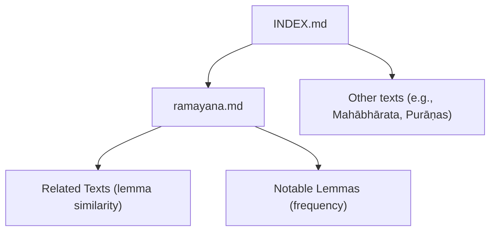
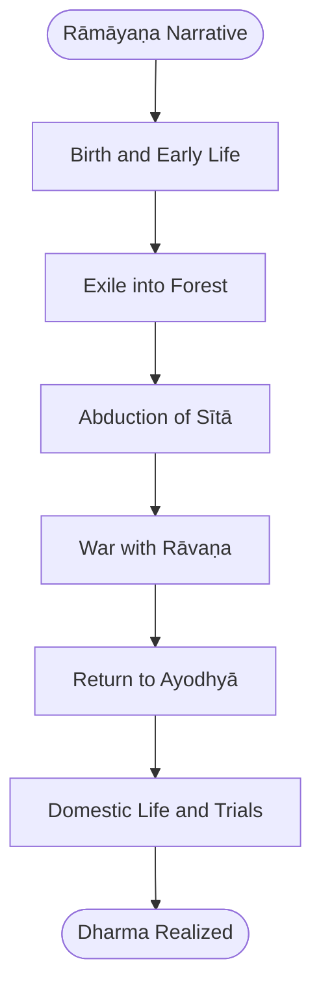
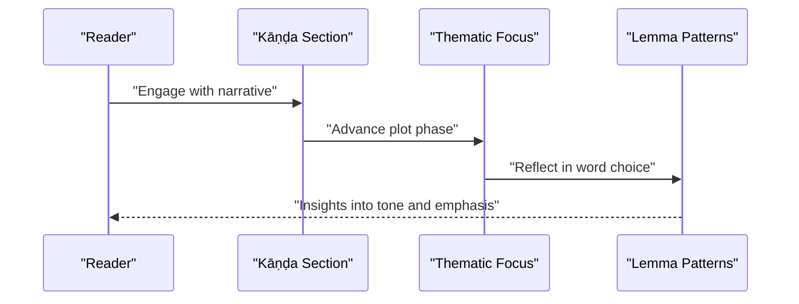
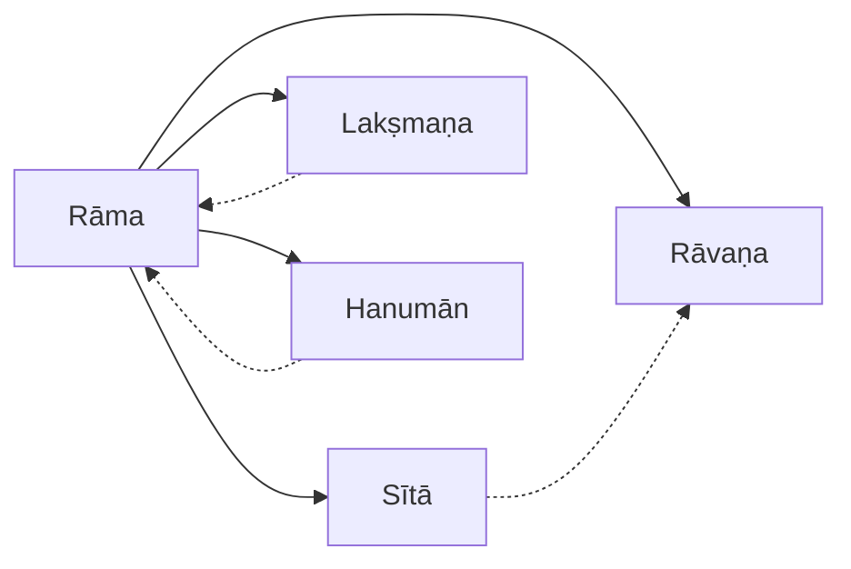
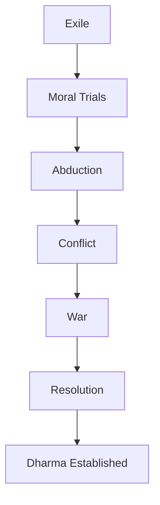
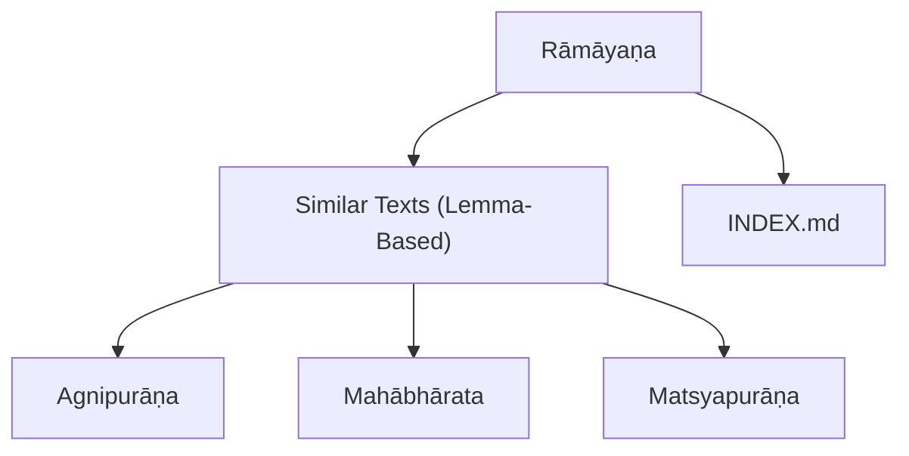

<cite>
**Referenced Files in This Document**
- [ramayana.md](file://ramayana.md)
- [INDEX.md](file://INDEX.md)
</cite>

## Table of Contents
1. [Introduction](#introduction)
2. [Project Structure](#project-structure)
3. [Core Components](#core-components)
4. [Architecture Overview](#architecture-overview)
5. [Detailed Component Analysis](#detailed-component-analysis)
6. [Dependency Analysis](#dependency-analysis)
7. [Performance Considerations](#performance-considerations)
8. [Troubleshooting Guide](#troubleshooting-guide)
9. [Conclusion](#conclusion)
10. [Appendices](#appendices)

## Introduction
This document presents a comprehensive overview of the Rāmāyaṇa as Vālmīki’s foundational epic, emphasizing its role as a cornerstone of dharma and ideal conduct. It outlines the six-book (Kāṇḍa) structure—birth, exile, abduction, war, return, and domestic life—and integrates computational linguistic insights available in this repository, including lemma frequency patterns and thematic progression across books. It also addresses textual transmission history, regional variations, and the epic’s cultural influence on righteousness, loyalty, and duty. Key episodes such as Rāma’s exile, Sītā’s abduction, and the battle with Rāvaṇa are analyzed within their philosophical dimensions embedded in the narrative framework.

## Project Structure
The repository organizes Sanskrit texts under a knowledge bank index. The Rāmāyaṇa entry provides metadata, related texts by lemma similarity, and notable lemmas for quantitative analysis. The broader INDEX enumerates all topics, including the Rāmāyaṇa and related epics and Purāṇas, enabling cross-referencing and comparative studies.

**Diagram sources**
- [INDEX.md:1-277](file://INDEX.md#L1-L277)
- [ramayana.md:1-48](file://ramayana.md#L1-L48)

**Section sources**
- [ramayana.md:1-48](file://ramayana.md#L1-L48)
- [INDEX.md:1-277](file://INDEX.md#L1-L277)

## Core Components
- Rāmāyaṇa concept page: Provides the title, author attribution to Vālmīki, classification as the first Sanskrit epic (ādikāvya), and structural note of seven kāṇḍas. It also lists related texts by lemma usage similarity and top lemmas by frequency.
- Index of Sanskrit texts: Catalogs the Rāmāyaṇa among 260 topics, offering cross-links to other epics and Purāṇas for comparative analysis.

Key elements extracted:
- Authorship and dating: Vālmīki, c. 7th–4th century BCE.
- Structural note: Seven kāṇḍas (note: traditional count is six; the source states seven).
- Computational data: Related texts via TF-IDF cosine similarity and top lemmas with occurrence counts.

**Section sources**
- [ramayana.md:1-48](file://ramayana.md#L1-L48)
- [INDEX.md:189-192](file://INDEX.md#L189-L192)

## Architecture Overview
The conceptual architecture of the Rāmāyaṇa can be visualized as a narrative arc structured around Kāṇḍas, each representing a phase of the protagonist’s journey and moral development. The repository’s computational lens highlights lexical patterns that reflect thematic shifts across books.

[No sources needed since this diagram shows conceptual workflow, not actual code structure]

## Detailed Component Analysis

### Six-Book Structure (Kāṇḍas) and Thematic Progression
The Rāmāyaṇa’s narrative unfolds across distinct phases aligned with the Kāṇḍas:
- Birth: Establishes Rāma’s divine lineage and early virtues.
- Exile: Tests adherence to dharma through renunciation and duty.
- Abduction: Introduces conflict and the struggle to uphold righteousness.
- War: Culminates in the battle against Rāvaṇa, embodying the triumph of dharma over adharma.
- Return: Reinstates order and rightful rule.
- Domestic Life: Explores governance, personal trials, and societal ideals.

Computational lens:
- Lemma frequency patterns reveal recurring themes and character focus across books. For example, frequent use of pronouns and verbs indicates dialogue-heavy sections and action sequences.
- Thematic progression can be inferred from shifts in lemma distributions, highlighting transitions from introspective passages to dynamic events.

[No sources needed since this diagram shows conceptual workflow, not actual code structure]

**Section sources**
- [ramayana.md:1-48](file://ramayana.md#L1-L48)

### Character Relationship Mapping
Central characters include Rāma, Sītā, Rāvaṇa, Lakṣmaṇa, Hanumān, and others. Their relationships drive the narrative and embody ethical ideals:
- Rāma and Sītā: Exemplify devotion and fidelity.
- Rāma and Rāvaṇa: Represent the clash between righteousness and hubris.
- Rāma and Lakṣmaṇa: Illustrate loyalty and brotherhood.
- Rāma and Hanumān: Demonstrate service and courage.

Computational insights:
- Co-occurrence of names and titles in lemma indices can map relational dynamics.
- Frequency spikes in certain lemmas may correlate with key episodes involving these characters.

[No sources needed since this diagram shows conceptual relationships, not actual code structure]

**Section sources**
- [ramayana.md:31-48](file://ramayana.md#L31-L48)

### Key Episodes and Philosophical Dimensions
- Rāma’s Exile: Embodies sacrifice and adherence to paternal promise, central to dharma.
- Sītā’s Abduction: Highlights resilience and the defense of honor.
- Battle with Rāvaṇa: Symbolizes the victory of cosmic order over chaos.
- Philosophical layers: Interweaves duties of kingship, marital fidelity, and spiritual ideals within mythic storytelling.

Computational analysis:
- Lemma frequency patterns across books can indicate emphasis on specific episodes or moral teachings.
- Thematic progression aligns with shifts in vocabulary reflecting tension, resolution, and reflection.

[No sources needed since this diagram shows conceptual workflow, not actual code structure]

**Section sources**
- [ramayana.md:1-48](file://ramayana.md#L1-L48)

### Textual Transmission History and Regional Variations
While the repository focuses on computational linguistics, the Rāmāyaṇa’s transmission includes:
- Oral and written traditions preserving core narratives.
- Regional recensions adapting language and details while maintaining central themes.
- Influence on subsequent literature and cultural practices across South and Southeast Asia.

Computational perspective:
- Lemma similarity metrics help identify textual affinities and potential shared sources or influences.
- Comparative analysis with related texts (e.g., Purāṇas) reveals common motifs and divergent emphases.

**Section sources**
- [ramayana.md:15-30](file://ramayana.md#L15-L30)

## Dependency Analysis
The Rāmāyaṇa entry depends on the broader knowledge bank index for contextual placement and cross-references. Its related texts list demonstrates lexical similarities, indicating thematic or stylistic overlaps with other works.

**Diagram sources**
- [ramayana.md:15-30](file://ramayana.md#L15-L30)
- [INDEX.md:189-192](file://INDEX.md#L189-L192)

**Section sources**
- [ramayana.md:15-30](file://ramayana.md#L15-L30)
- [INDEX.md:189-192](file://INDEX.md#L189-L192)

## Performance Considerations
For computational linguistic analysis of the Rāmāyaṇa:
- Lemma frequency analysis should account for corpus size and normalization to compare across texts.
- Thematic progression can be enhanced by integrating part-of-speech tagging and syntactic parsing.
- Character relationship mapping benefits from named entity recognition and co-occurrence networks.

[No sources needed since this section provides general guidance]

## Troubleshooting Guide
Common issues in analyzing the Rāmāyaṇa dataset:
- Inconsistent lemma indexing: Ensure consistent preprocessing pipelines for tokenization and lemmatization.
- Ambiguity in character references: Use context-aware disambiguation techniques to accurately map relationships.
- Cross-text comparisons: Validate similarity metrics by adjusting parameters for domain-specific vocabulary.

[No sources needed since this section provides general guidance]

## Conclusion
The Rāmāyaṇa stands as a foundational epic articulating dharma through its narrative structure and philosophical depth. The repository’s computational resources offer valuable insights into lexical patterns and thematic evolution across Kāṇḍas. By integrating traditional scholarship with modern analytical tools, we gain a richer understanding of the epic’s enduring cultural impact and literary significance.

[No sources needed since this section summarizes without analyzing specific files]

## Appendices

### Appendix A: Notable Lemmas and Frequencies
Top lemmas by frequency provide a window into the text’s linguistic profile:
- Pronouns and particles dominate, reflecting dialogic and narrative styles.
- Character-specific lemmas highlight focal points in the story.

**Section sources**
- [ramayana.md:31-48](file://ramayana.md#L31-L48)

### Appendix B: Related Texts by Lemma Similarity
Texts with high similarity scores suggest shared thematic or stylistic elements:
- Agnipurāṇa shows the strongest affinity, indicating possible overlapping motifs or influences.
- Mahābhārata and Purāṇas demonstrate moderate similarity, reflecting common epic conventions.

**Section sources**
- [ramayana.md:15-30](file://ramayana.md#L15-L30)
