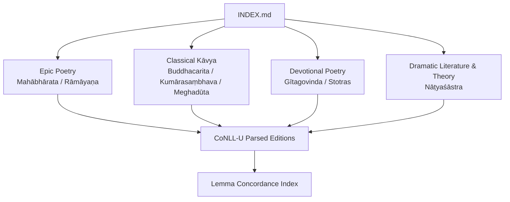
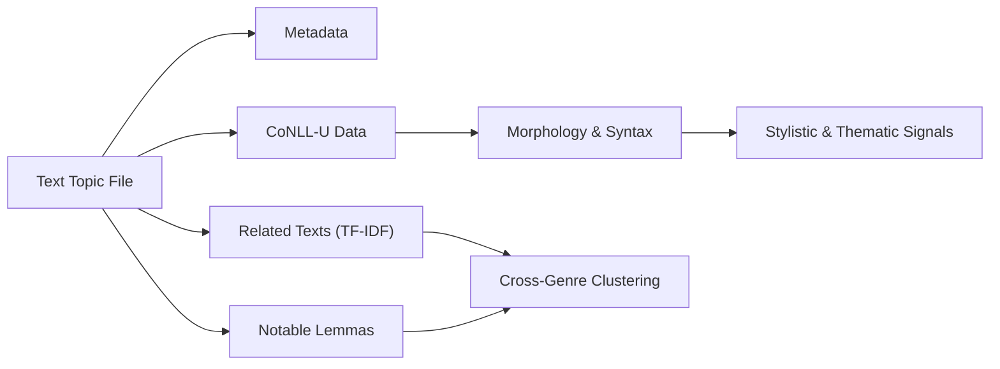
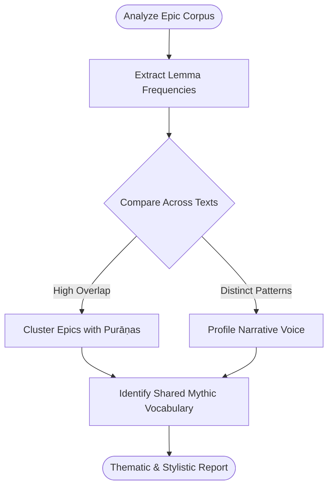
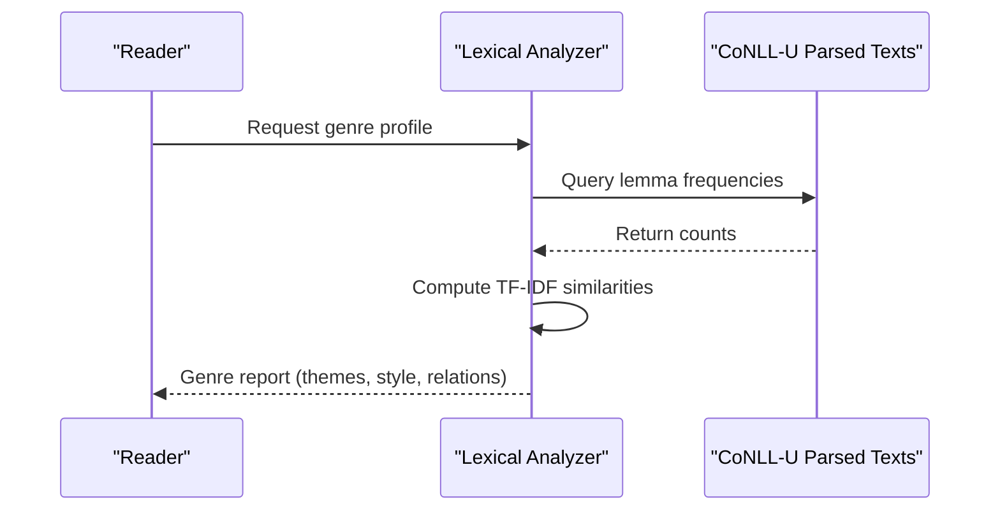
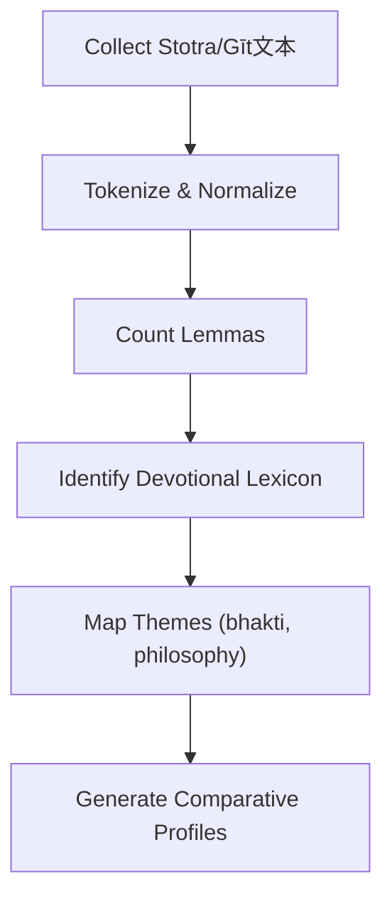
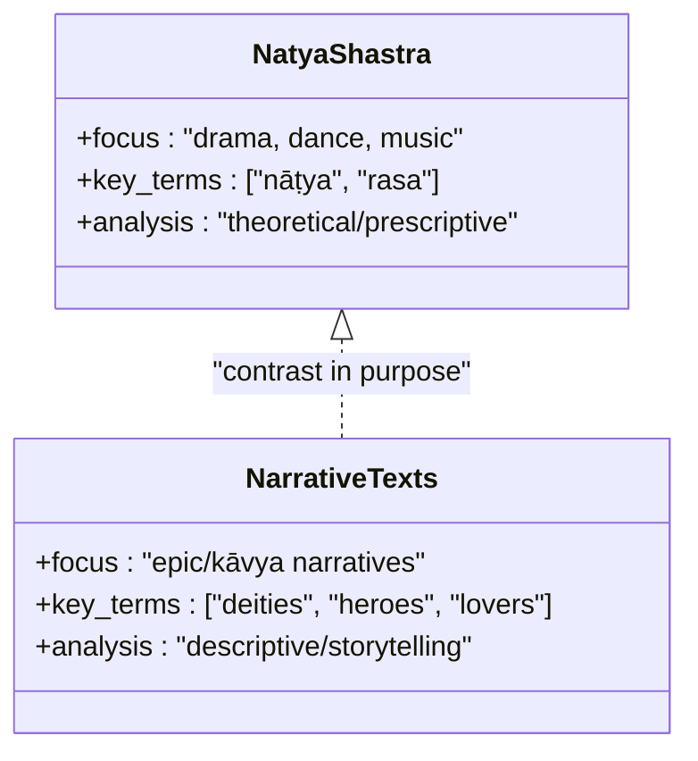
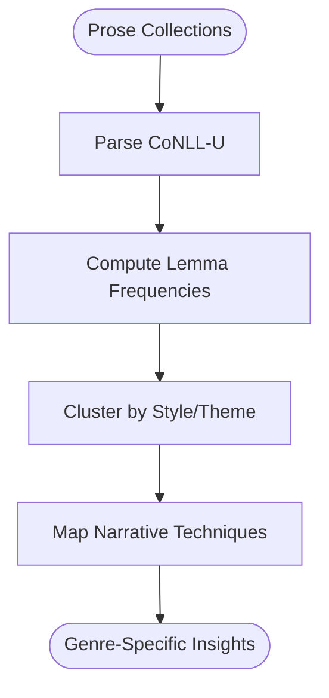
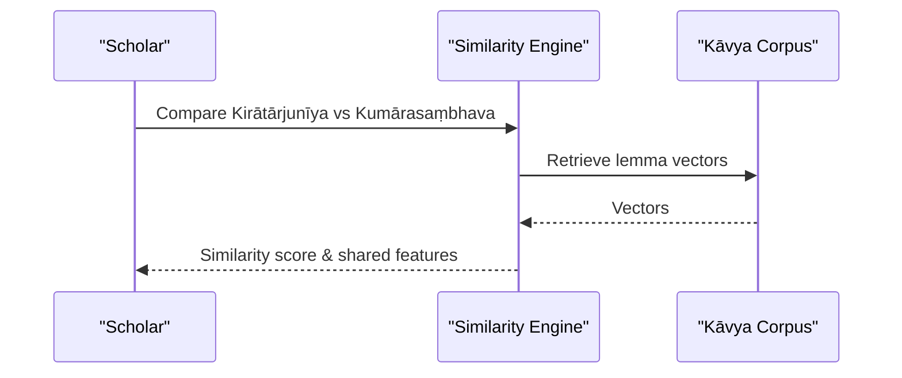
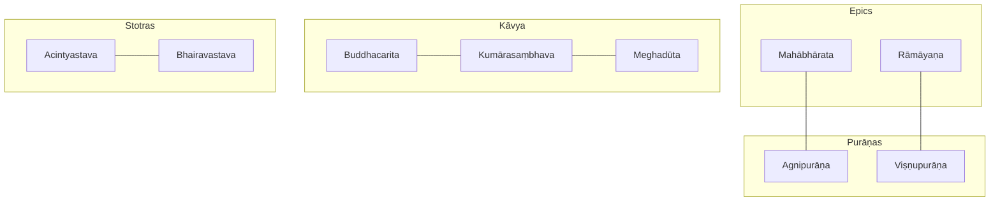

<cite>
**Referenced Files in This Document**
- [INDEX.md](file://INDEX.md)
- [mahabharata.md](file://mahabharata.md)
- [ramayana.md](file://ramayana.md)
- [buddhacarita.md](file://buddhacarita.md)
- [kumarasambhava.md](file://kumarasambhava.md)
- [meghaduta.md](file://meghaduta.md)
- [gitagovinda.md](file://gitagovinda.md)
- [acintyastava.md](file://acintyastava.md)
- [bhairavastava.md](file://bhairavastava.md)
- [natyasastra.md](file://natyasastra.md)
- [harsacarita.md](file://harsacarita.md)
- [kathasaritsagara.md](file://kathasaritsagara.md)
- [dasakumaracarita.md](file://dasakumaracarita.md)
- [kiratarjuniya.md](file://kiratarjuniya.md)
</cite>

## Table of Contents
1. Introduction
2. Project Structure
3. Core Components
4. Architecture Overview
5. Detailed Component Analysis
6. Dependency Analysis
7. Performance Considerations
8. Troubleshooting Guide
9. Conclusion

## Introduction
This document presents a comprehensive overview of the Sanskrit literary works collection, focusing on epic poetry (Mahābhārata, Rāmāyaṇa), classical kāvya (Buddhacarita, Kumārasaṃbhava, Meghadūta), devotional poetry (Gītagovinda, Stotras), and dramatic literature (Nāṭyaśāstra). It explains how computational analysis—using lemma frequency, TF-IDF similarity, and CoNLL-U parsing—reveals patterns in meter, vocabulary, and thematic development across genres and periods. The goal is to make these insights accessible to both scholars and readers with limited technical background while preserving rigorous source-based evidence.

## Project Structure
The repository organizes each literary work as a topic file that includes metadata, a short description, related texts by lexical similarity, and notable lemmas derived from CoNLL-U parsed editions. The INDEX provides a curated catalog of topics spanning Vedic literature, Upaniṣads, Dharmaśāstra, Grammar, Kāvya, Buddhism, Jainism, Tantra, Yoga, Āyurveda, Purāṇas, and more. Each topic links to its raw CoNLL-U files and to a lemma concordance index for deeper exploration.

**Diagram sources**
- [INDEX.md:1-20](file://INDEX.md#L1-L20)

**Section sources**
- [INDEX.md:1-20](file://INDEX.md#L1-L20)

## Core Components
- Epic Poetry
  - Mahābhārata: Longest Sanskrit epic; foundational narrative of the Kuru dynasty war; extensive lemma corpus enabling robust statistical comparisons.
  - Rāmāyaṇa: First Sanskrit epic (ādikāvya); strong lexical overlap with later Purāṇic corpora; central deity names and narrative markers visible in lemma profiles.
- Classical Kāvya
  - Buddhacarita: Early mahākāvya; Buddhist themes and philosophical vocabulary reflected in lemma distributions.
  - Kumārasaṃbhava: Kālidāsa’s celebrated mahākāvya; stylistic markers evident through comparative similarity to other courtly kāvyas.
  - Meghadūta: Exemplary dūta-kāvya; intimate address forms and landscape imagery captured in frequent personal pronouns and locative terms.
- Devotional Poetry
  - Gītagovinda: Lyrical celebration of divine love; high-frequency devotional and relational lemmas indicate bhakti orientation.
  - Stotras: Acintyastava and Bhairavastava showcase hymnic structures, theological vocabulary, and devotional address patterns.
- Dramatic Literature
  - Nāṭyaśāstra: Foundational treatise on drama, dance, music; key aesthetic and performance lexicon (e.g., rasa, nāṭya) distinguishes it narratively and theoretically.

Computational signals:
- Lemma frequencies highlight genre-specific vocabulary (e.g., deity names, performative terms, relational pronouns).
- TF-IDF cosine similarity clusters texts by shared lexical patterns, revealing intertextual affinities across genres and periods.
- CoNLL-U parsing enables morphological and syntactic analysis supporting meter and style studies.

**Section sources**
- [mahabharata.md:1-48](file://mahabharata.md#L1-L48)
- [ramayana.md:1-48](file://ramayana.md#L1-L48)
- [buddhacarita.md:1-58](file://buddhacarita.md#L1-L58)
- [kumarasambhava.md:1-48](file://kumarasambhava.md#L1-L48)
- [meghaduta.md:1-48](file://meghaduta.md#L1-L48)
- [gitagovinda.md:1-48](file://gitagovinda.md#L1-L48)
- [acintyastava.md:1-111](file://acintyastava.md#L1-L111)
- [bhairavastava.md:1-40](file://bhairavastava.md#L1-L40)
- [natyasastra.md:1-48](file://natyasastra.md#L1-L48)

## Architecture Overview
The collection follows a consistent architecture per text:
- Metadata header (type, title, description, knowledge-bank, sources, tags)
- Related texts ranked by TF-IDF cosine similarity
- Notable lemmas with occurrence counts and links to concordances
- Underlying data: CoNLL-U parsed editions enabling morphological and dependency analysis

**Diagram sources**
- [INDEX.md:1-20](file://INDEX.md#L1-L20)
- [mahabharata.md:1-48](file://mahabharata.md#L1-L48)
- [ramayana.md:1-48](file://ramayana.md#L1-L48)
- [buddhacarita.md:1-58](file://buddhacarita.md#L1-L58)
- [kumarasambhava.md:1-48](file://kumarasambhava.md#L1-L48)
- [meghaduta.md:1-48](file://meghaduta.md#L1-L48)
- [gitagovinda.md:1-48](file://gitagovinda.md#L1-L48)
- [acintyastava.md:1-111](file://acintyastava.md#L1-L111)
- [bhairavastava.md:1-40](file://bhairavastava.md#L1-L40)
- [natyasastra.md:1-48](file://natyasastra.md#L1-L48)

## Detailed Component Analysis

### Epic Poetry: Mahābhārata and Rāmāyaṇa
- Lexical signatures:
  - Mahābhārata shows very high frequency of connective and pronominal lemmas, reflecting expansive narration and dialogue.
  - Rāmāyaṇa exhibits strong affinity with Purāṇic corpora via TF-IDF similarity, indicating shared mythic vocabulary and narrative motifs.
- Computational insights:
  - Lemma distributions help identify recurring themes (e.g., deities, kinship terms, action verbs).
  - Similarity rankings reveal intertextual relationships between epics and later mythographic traditions.

**Diagram sources**
- [mahabharata.md:1-48](file://mahabharata.md#L1-L48)
- [ramayana.md:1-48](file://ramayana.md#L1-L48)

**Section sources**
- [mahabharata.md:1-48](file://mahabharata.md#L1-L48)
- [ramayana.md:1-48](file://ramayana.md#L1-L48)

### Classical Kāvya: Buddhacarita, Kumārasaṃbhava, Meghadūta
- Buddhacarita:
  - Buddhist philosophical vocabulary and narrative markers are prominent; similarity to other kāvyas reflects shared courtly style.
- Kumārasaṃbhava:
  - High similarity to Kirātārjunīya indicates common mahākāvya conventions and stylistic choices.
- Meghadūta:
  - Frequent use of second-person address and locative terms aligns with dūta-kāvya conventions of sending messages through natural elements.

**Diagram sources**
- [buddhacarita.md:1-58](file://buddhacarita.md#L1-L58)
- [kumarasambhava.md:1-48](file://kumarasambhava.md#L1-L48)
- [meghaduta.md:1-48](file://meghaduta.md#L1-L48)

**Section sources**
- [buddhacarita.md:1-58](file://buddhacarita.md#L1-L58)
- [kumarasambhava.md:1-48](file://kumarasambhava.md#L1-L48)
- [meghaduta.md:1-48](file://meghaduta.md#L1-L48)

### Devotional Poetry: Gītagovinda and Stotras
- Gītagovinda:
  - Elevated frequency of relational and devotional lemmas underscores bhakti themes and lyrical intimacy.
- Stotras (Acintyastava, Bhairavastava):
  - Hymnic structure and theological vocabulary (e.g., emptiness, fierce divinity) distinguish stotra style; lemma profiles reflect doctrinal focus and devotional address.

**Diagram sources**
- [gitagovinda.md:1-48](file://gitagovinda.md#L1-L48)
- [acintyastava.md:1-111](file://acintyastava.md#L1-L111)
- [bhairavastava.md:1-40](file://bhairavastava.md#L1-L40)

**Section sources**
- [gitagovinda.md:1-48](file://gitagovinda.md#L1-L48)
- [acintyastava.md:1-111](file://acintyastava.md#L1-L111)
- [bhairavastava.md:1-40](file://bhairavastava.md#L1-L40)

### Dramatic Literature: Nāṭyaśāstra
- Lexical signature:
  - Prominent aesthetic and performance-related lemmas (e.g., rasa, nāṭya) differentiate theoretical treatises from narrative texts.
- Computational insight:
  - TF-IDF similarity places Nāṭyaśāstra closer to commentarial and ritual corpora than to narrative epics, highlighting its prescriptive and analytical nature.

**Diagram sources**
- [natyasastra.md:1-48](file://natyasastra.md#L1-L48)

**Section sources**
- [natyasastra.md:1-48](file://natyasastra.md#L1-L48)

### Prose Romances and Frame Stories: Harṣacarita, Daśakumāracarita, Kathāsaritsāgara
- Harṣacarita:
  - Biographical prose kāvya; stylistic markers include elevated simile usage and courtly diction.
- Daśakumāracarita:
  - Prose romance with adventure and intrigue; lemma patterns reflect narrative pacing and character interactions.
- Kathāsaritsāgara:
  - Extensive frame-story collection; high lemma diversity supports rich storytelling and cross-cultural motifs.

**Diagram sources**
- [harsacarita.md:1-48](file://harsacarita.md#L1-L48)
- [dasakumaracarita.md:1-48](file://dasakumaracarita.md#L1-L48)
- [kathasaritsagara.md:1-48](file://kathasaritsagara.md#L1-L48)

**Section sources**
- [harsacarita.md:1-48](file://harsacarita.md#L1-L48)
- [dasakumaracarita.md:1-48](file://dasakumaracarita.md#L1-L48)
- [kathasaritsagara.md:1-48](file://kathasaritsagara.md#L1-L48)

### Mahākāvya Conventions: Kirātārjunīya and Kumārasaṃbhava
- Both texts exhibit high similarity, reflecting shared mahākāvya conventions such as elaborate similes, heroic themes, and divine encounters.
- Lemma profiles show frequent use of comparative particles and honorific forms, characteristic of courtly epic style.

**Diagram sources**
- [kiratarjuniya.md:1-48](file://kiratarjuniya.md#L1-L48)
- [kumarasambhava.md:1-48](file://kumarasambhava.md#L1-L48)

**Section sources**
- [kiratarjuniya.md:1-48](file://kiratarjuniya.md#L1-L48)
- [kumarasambhava.md:1-48](file://kumarasambhava.md#L1-L48)

## Dependency Analysis
- Cross-text dependencies emerge through TF-IDF similarity:
  - Epics cluster with Purāṇic texts due to shared mythic vocabulary.
  - Kāvya texts cluster together, reflecting shared stylistic conventions.
  - Stotras form distinct clusters aligned with theological and devotional vocabularies.
- CoNLL-U parsing underpins all analyses, enabling morphological normalization and dependency-based feature extraction.

**Diagram sources**
- [mahabharata.md:1-48](file://mahabharata.md#L1-L48)
- [ramayana.md:1-48](file://ramayana.md#L1-L48)
- [buddhacarita.md:1-58](file://buddhacarita.md#L1-L58)
- [kumarasambhava.md:1-48](file://kumarasambhava.md#L1-L48)
- [meghaduta.md:1-48](file://meghaduta.md#L1-L48)
- [acintyastava.md:1-111](file://acintyastava.md#L1-L111)
- [bhairavastava.md:1-40](file://bhairavastava.md#L1-L40)

**Section sources**
- [mahabharata.md:1-48](file://mahabharata.md#L1-L48)
- [ramayana.md:1-48](file://ramayana.md#L1-L48)
- [buddhacarita.md:1-58](file://buddhacarita.md#L1-L58)
- [kumarasambhava.md:1-48](file://kumarasambhava.md#L1-L48)
- [meghaduta.md:1-48](file://meghaduta.md#L1-L48)
- [acintyastava.md:1-111](file://acintyastava.md#L1-L111)
- [bhairavastava.md:1-40](file://bhairavastava.md#L1-L40)

## Performance Considerations
- Large corpora (e.g., Mahābhārata) benefit from chunked processing and indexing to manage memory and query latency.
- Lemma normalization and stopword handling improve signal-to-noise ratio in similarity computations.
- Using CoNLL-U dependency features can enhance stylistic classification beyond surface-level token counts.

[No sources needed since this section provides general guidance]

## Troubleshooting Guide
- Inconsistent lemma counts:
  - Verify CoNLL-U parsing quality and ensure consistent normalization across texts.
- Unexpected similarity results:
  - Check preprocessing steps (tokenization, lemmatization) and consider adjusting TF-IDF parameters.
- Missing concordance links:
  - Confirm that the lemma concordance index is up to date and linked correctly in topic files.

**Section sources**
- [INDEX.md:270-277](file://INDEX.md#L270-L277)

## Conclusion
Computational analysis of the Sanskrit literary corpus reveals clear patterns in vocabulary, style, and thematic development across genres and periods. Epics share mythic and ritualistic lexicon with Purāṇas; classical kāvyas exhibit courtly conventions; devotional stotras emphasize theological and relational language; and dramatic theory stands apart with aesthetic terminology. The consistent architecture of topic files, grounded in CoNLL-U parsing and lemma indices, enables scalable, reproducible research into Sanskrit literary evolution.

[No sources needed since this section summarizes without analyzing specific files]
