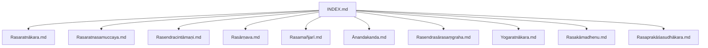
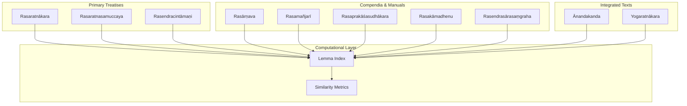
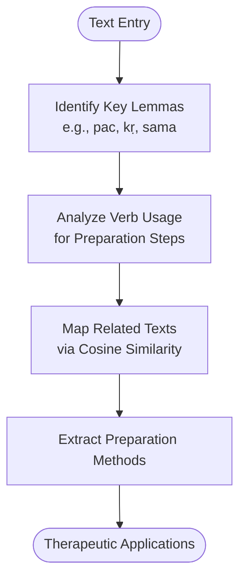
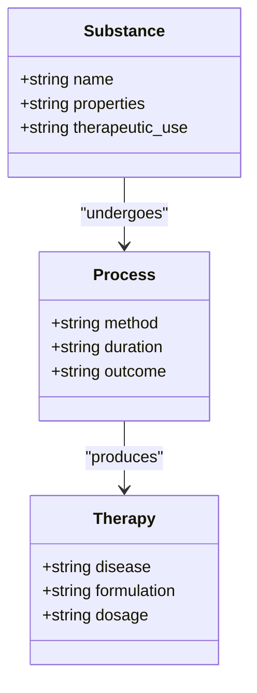
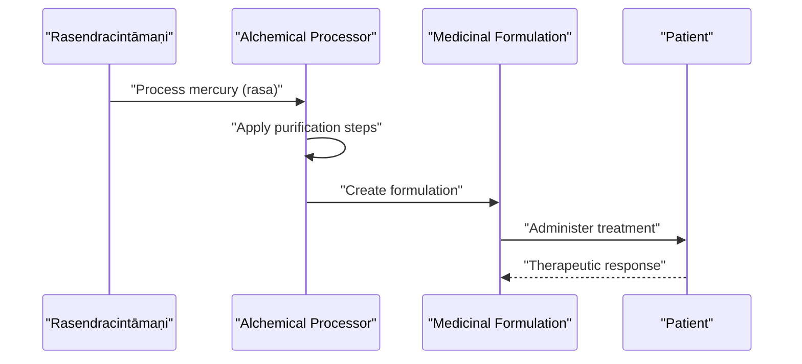
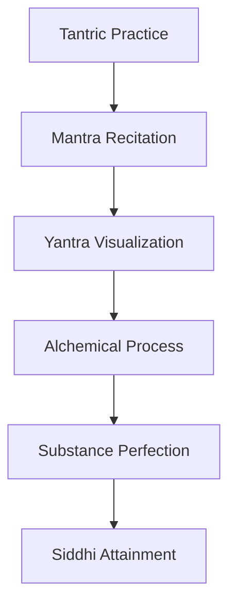
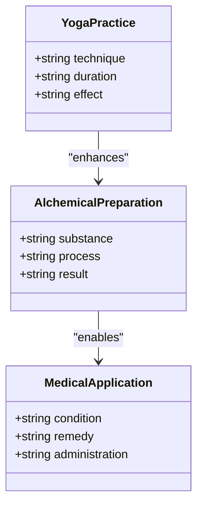
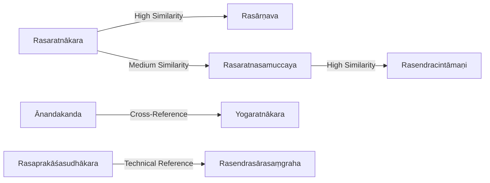

<cite>
**Referenced Files in This Document**
- [INDEX.md](file://INDEX.md)
- [rasaratnakara.md](file://rasaratnakara.md)
- [rasaratnasamuccaya.md](file://rasaratnasamuccaya.md)
- [rasendracintamani.md](file://rasendracintamani.md)
- [rasarnava.md](file://rasarnava.md)
- [rasamanjari.md](file://rasamanjari.md)
- [anandakanda.md](file://anandakanda.md)
- [rasendrasarasamgraha.md](file://rasendrasarasamgraha.md)
- [yogaratnakara.md](file://yogaratnakara.md)
- [rasakamadhenu.md](file://rasakamadhenu.md)
- [rasaprakasasudhakara.md](file://rasaprakasasudhakara.md)
</cite>

## Table of Contents
1. [Introduction](#introduction)
2. [Project Structure](#project-structure)
3. [Core Components](#core-components)
4. [Architecture Overview](#architecture-overview)
5. [Detailed Component Analysis](#detailed-component-analysis)
6. [Dependency Analysis](#dependency-analysis)
7. [Performance Considerations](#performance-considerations)
8. [Troubleshooting Guide](#troubleshooting-guide)
9. [Conclusion](#conclusion)
10. [Appendices](#appendices)

## Introduction
This document provides a comprehensive overview of the Rasaśāstra tradition as represented in the repository’s Sanskrit knowledge bank. It focuses on key alchemical texts such as Rasaratnākara, Rasaratnasamuccaya, and Rasendracintāmaṇi, and explains how these works systematize mineral and metallic medicines, purification processes, pharmaceutical preparations, and the integration of spiritual practices with chemical transformations. The analysis also outlines computational approaches to analyzing alchemical terminology, metal classifications, preparation methods, and therapeutic applications using the CoNLL-U parsed editions available in the corpus.

## Project Structure
The repository organizes Rasaśāstra materials under the 11-sanskrit knowledge bank. Each major text is represented by a dedicated markdown file that summarizes its scope, tags, and related texts based on lemma similarity. These files serve as entry points for deeper exploration into the raw CoNLL-U datasets referenced within each description.

**Diagram sources**
- [INDEX.md:167-184](file://INDEX.md#L167-L184)

**Section sources**
- [INDEX.md:1-277](file://INDEX.md#L1-L277)

## Core Components
The core components of the Rasaśāstra corpus include:
- Primary treatises on mercury and minerals (e.g., Rasaratnākara, Rasaratnasamuccaya, Rasendracintāmaṇi)
- Compendia integrating alchemy with medicine and yoga (e.g., Yogaratnākara)
- Tantric-alchemical synthesis texts (e.g., Ānandakanda)
- Specialized manuals and glossaries (e.g., Rasendrasārasaṃgraha, Rasakāmadhenu, Rasaprakāśasudhākara)

These components share common lexical patterns centered around rasa (mercury), śuddhi (purification), dhātu (metal/mineral), and medicinal terms like gandhaka (sulfur), sūta (mercury), and viṣa (poison/toxicity). Computational analyses leverage CoNLL-U parsing to extract lemmas, concordances, and similarity metrics across texts.

**Section sources**
- [rasaratnakara.md:1-48](file://rasaratnakara.md#L1-L48)
- [rasaratnasamuccaya.md:1-58](file://rasaratnasamuccaya.md#L1-L58)
- [rasendracintamani.md:1-48](file://rasendracintamani.md#L1-L48)
- [yogaratnakara.md:1-48](file://yogaratnakara.md#L1-L48)
- [anandakanda.md:1-57](file://anandakanda.md#L1-L57)
- [rasendrasarasamgraha.md:1-48](file://rasendrasarasamgraha.md#L1-L48)
- [rasakamadhenu.md:1-48](file://rasakamadhenu.md#L1-L48)
- [rasaprakasasudhakara.md:1-48](file://rasaprakasasudhakara.md#L1-L48)

## Architecture Overview
The Rasaśāstra architecture integrates textual scholarship, computational linguistics, and historical alchemical practice. At the center are the primary treatises, which describe systematic procedures for purifying metals and preparing medicinal formulations. These are complemented by commentaries and compendia that expand on techniques and therapeutic applications. The computational layer uses lemma frequency and cosine similarity to map relationships between texts and identify shared terminology.

**Diagram sources**
- [INDEX.md:167-184](file://INDEX.md#L167-L184)
- [rasaratnakara.md:15-31](file://rasaratnakara.md#L15-L31)
- [rasaratnasamuccaya.md:15-31](file://rasaratnasamuccaya.md#L15-L31)
- [rasendracintamani.md:15-31](file://rasendracintamani.md#L15-L31)

## Detailed Component Analysis

### Rasaratnākara: Comprehensive Alchemical Compendium
Rasaratnākara serves as a foundational text covering mercury, minerals, and medicinal formulations. Its lemma analysis highlights frequent use of verbs like pac (cook/prepare) and kṛ (make/do), indicating procedural emphasis. Related texts show strong similarity with other major rasaśāstra works, reflecting shared terminology and methodologies.

**Diagram sources**
- [rasaratnakara.md:31-47](file://rasaratnakara.md#L31-L47)

**Section sources**
- [rasaratnakara.md:1-48](file://rasaratnakara.md#L1-L48)

### Rasaratnasamuccaya: Mercury-Based Iatrochemistry
Rasaratnasamuccaya emphasizes mercury-based alchemy and iatrochemistry, with notable lemmas including rasa (taste/substance), gandhaka (sulfur), and roga (disease). The text’s structure supports systematic classification of substances and their therapeutic effects.

**Diagram sources**
- [rasaratnasamuccaya.md:31-57](file://rasaratnasamuccaya.md#L31-L57)

**Section sources**
- [rasaratnasamuccaya.md:1-58](file://rasaratnasamuccaya.md#L1-L58)

### Rasendracintāmaṇi: Mercury Processing and Medicinal Formulations
Rasendracintāmaṇi focuses on mercury processing and medicinal formulations, with high-frequency lemmas like rasa, bhū (be/become), and kṛ. The text integrates alchemical transformation with therapeutic outcomes.

**Diagram sources**
- [rasendracintamani.md:31-47](file://rasendracintamani.md#L31-L47)

**Section sources**
- [rasendracintamani.md:1-48](file://rasendracintamani.md#L1-L48)

### Ānandakanda: Tantric-Alchemical Synthesis
Ānandakanda represents the integration of tantric practices with alchemical processes, emphasizing mantra, yantra, and the attainment of siddhi through perfected substances. The text bridges spiritual practice with material transformation.

**Diagram sources**
- [anandakanda.md:25-47](file://anandakanda.md#L25-L47)

**Section sources**
- [anandakanda.md:1-57](file://anandakanda.md#L1-L57)

### Yogaratnākara: Integration of Yoga, Alchemy, and Medicine
Yogaratnākara combines yoga practices with alchemical and medical knowledge, featuring lemmas like viṣa (poison) and śudh (purify). This text demonstrates the holistic approach of classical Indian medicine and alchemy.

**Diagram sources**
- [yogaratnakara.md:31-47](file://yogaratnakara.md#L31-L47)

**Section sources**
- [yogaratnakara.md:1-48](file://yogaratnakara.md#L1-L48)

## Dependency Analysis
The Rasaśāstra texts exhibit strong interdependencies through shared terminology and methodological approaches. Lemma similarity analysis reveals clusters of related texts, while CoNLL-U parsing enables computational extraction of procedural knowledge.

**Diagram sources**
- [rasaratnakara.md:15-31](file://rasaratnakara.md#L15-L31)
- [rasaratnasamuccaya.md:15-31](file://rasaratnasamuccaya.md#L15-L31)
- [rasendracintamani.md:15-31](file://rasendracintamani.md#L15-L31)
- [rasarnava.md:15-31](file://rasarnava.md#L15-L31)

**Section sources**
- [rasaratnakara.md:15-31](file://rasaratnakara.md#L15-L31)
- [rasaratnasamuccaya.md:15-31](file://rasaratnasamuccaya.md#L15-L31)
- [rasendracintamani.md:15-31](file://rasendracintamani.md#L15-L31)

## Performance Considerations
Computational analysis of Rasaśāstra texts benefits from several performance optimizations:
- Efficient lemma indexing for rapid concordance searches
- Optimized cosine similarity calculations for text clustering
- Parallel processing of CoNLL-U files for large-scale analysis
- Memory-efficient storage of parsed linguistic data

[No sources needed since this section provides general guidance]

## Troubleshooting Guide
Common issues in analyzing Rasaśāstra texts include:
- Inconsistent terminology across different manuscript traditions
- Ambiguous meanings of technical alchemical terms
- Missing contextual information for specialized procedures
- Variations in measurement units and preparation methods

Recommended solutions:
- Cross-reference multiple texts for term disambiguation
- Use concordance tools to examine usage contexts
- Consult commentaries and secondary sources for interpretation
- Standardize terminology through computational lexicons

**Section sources**
- [INDEX.md:270-277](file://INDEX.md#L270-L277)

## Conclusion
The Rasaśāstra tradition represents a sophisticated system of alchemical knowledge that integrated material transformation with spiritual practice. The repository’s computational infrastructure enables detailed analysis of these texts, revealing systematic approaches to mineral and metallic medicines, purification processes, and therapeutic applications. The integration of CoNLL-U parsing with traditional scholarship provides new opportunities for understanding historical Indian alchemy.

[No sources needed since this section summarizes without analyzing specific files]

## Appendices

### Computational Analysis Framework
The computational framework for analyzing Rasaśāstra texts includes:
- CoNLL-U parsing for linguistic analysis
- Lemma frequency analysis for vocabulary studies
- Cosine similarity for text relationship mapping
- Concordance generation for contextual analysis

### Key Terminology Glossary
- **Rasa**: Mercury or essence; central concept in alchemy
- **Śuddhi**: Purification process
- **Dhātu**: Metal or mineral substance
- **Gandhaka**: Sulfur
- **Sūta**: Mercury
- **Viṣa**: Poison or toxicity
- **Siddhi**: Spiritual power or perfection

[No sources needed since this section provides reference information]
