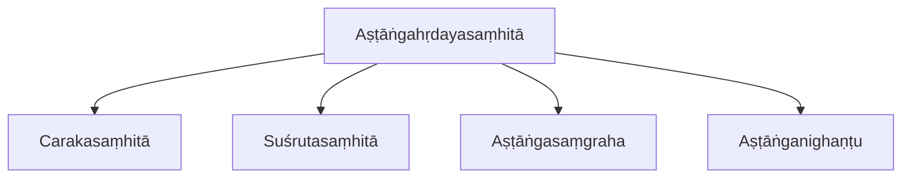
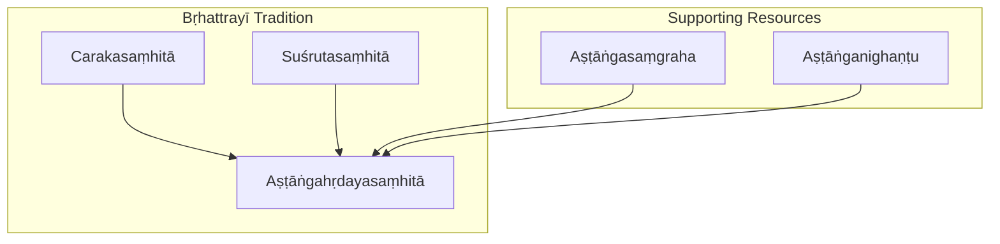
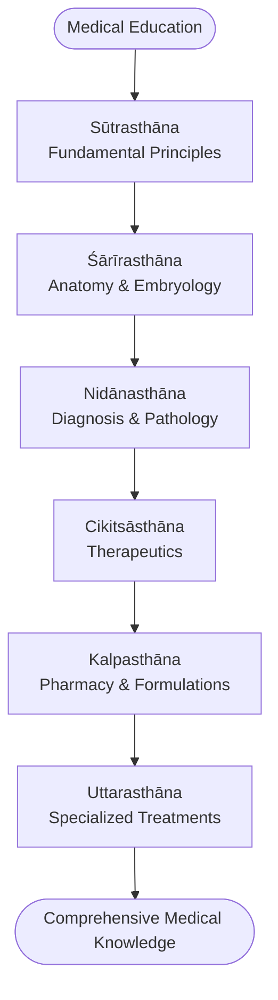
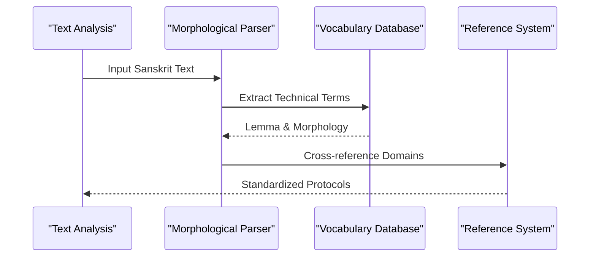
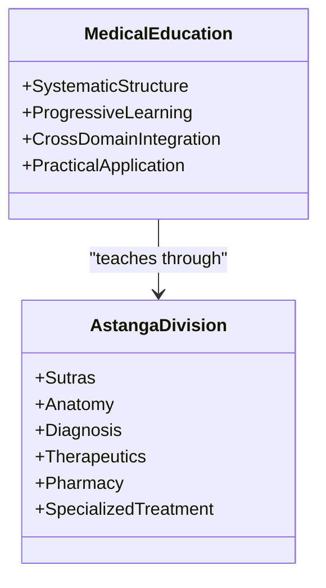
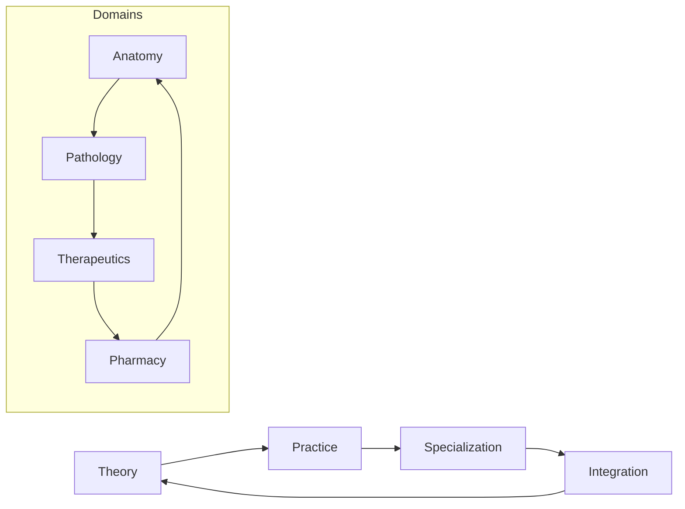
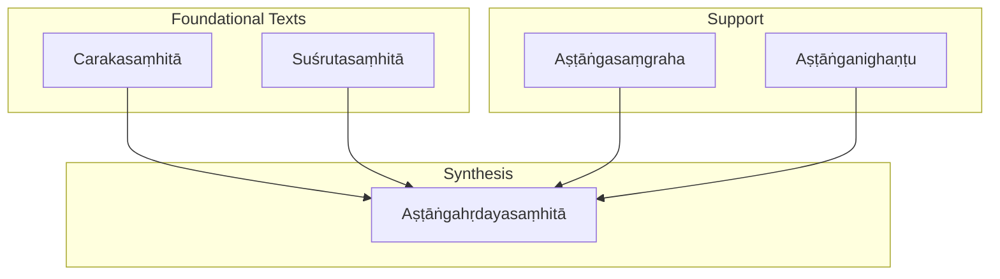

<cite>
**Referenced Files in This Document**
- [astangahrdayasamhita.md](file://astangahrdayasamhita.md)
- [carakasamhita.md](file://carakasamhita.md)
- [susrutasamhita.md](file://susrutasamhita.md)
- [astangasamgraha.md](file://astangasamgraha.md)
- [astanganighantu.md](file://astanganighantu.md)
</cite>

## Table of Contents
1. [Introduction](#introduction)
2. [Project Structure](#project-structure)
3. [Core Components](#core-components)
4. [Architecture Overview](#architecture-overview)
5. [Detailed Component Analysis](#detailed-component-analysis)
6. [Dependency Analysis](#dependency-analysis)
7. [Performance Considerations](#performance-considerations)
8. [Troubleshooting Guide](#troubleshooting-guide)
9. [Conclusion](#conclusion)
10. [Appendices](#appendices)

## Introduction
This document provides a comprehensive overview of the Aṣṭāṅgahṛdayasaṃhitā as a synthesized compilation of earlier Ayurvedic knowledge, focusing on its eight-fold division of medicine, systematic presentation of theory and practice, and pedagogical approach to medical education. It also explains how computational analysis of condensed medical terminology supports standardized treatment protocols and cross-referencing across different medical domains. The text’s five main sections are contextualized within the broader Bṛhattrayī tradition, highlighting its influence on medical curricula and its accessibility compared to the larger Caraka and Suśruta texts.

## Project Structure
The repository includes a dedicated entry for the Aṣṭāṅgahṛdayasaṃhitā alongside related Ayurvedic texts and glossaries. The primary file describes the work’s purpose, structure, and technical edition details, while companion files provide comparative context with the other two members of the Bṛhattrayī and related nighaṇṭu resources.

**Diagram sources**
- [astangahrdayasamhita.md:20-45](file://astangahrdayasamhita.md#L20-L45)
- [carakasamhita.md:1-11](file://carakasamhita.md#L1-L11)
- [susrutasamhita.md:1-11](file://susrutasamhita.md#L1-L11)
- [astangasamgraha.md:19-33](file://astangasamgraha.md#L19-L33)
- [astanganighantu.md:21-41](file://astanganighantu.md#L21-L41)

**Section sources**
- [astangahrdayasamhita.md:20-45](file://astangahrdayasamhita.md#L20-L45)
- [carakasamhita.md:1-11](file://carakasamhita.md#L1-L11)
- [susrutasamhita.md:1-11](file://susrutasamhita.md#L1-L11)
- [astangasamgraha.md:19-33](file://astangasamgraha.md#L19-L33)
- [astanganighantu.md:21-41](file://astanganighantu.md#L21-L41)

## Core Components
The Aṣṭāṅgahṛdayasaṃhitā is organized around an eight-fold framework that systematically covers foundational principles, anatomy, diagnosis, therapeutics, pharmacy, specialized treatments, and further subdivisions such as pediatrics, toxicology, and rejuvenation. Its concise and structured format makes it highly suitable for teaching and reference.

Key components include:
- Sūtrasthāna: Fundamental principles
- Śārīrasthāna: Anatomy and embryology
- Nidānasthāna: Diagnosis and pathology
- Cikitsāsthāna: Therapeutics
- Kalpasthāna: Pharmacy and formulations
- Uttarasthāna: Specialized treatments
- Additional divisions covering specialized domains

The text’s CoNLL-U edition provides full morphological analysis of technical medical vocabulary, enabling computational processing and cross-domain comparisons.

**Section sources**
- [astangahrdayasamhita.md:32-45](file://astangahrdayasamhita.md#L32-L45)

## Architecture Overview
The architecture of the Aṣṭāṅgahṛdayasaṃhitā reflects a synthesis of earlier Ayurvedic traditions, integrating theoretical foundations with practical guidance. Its eight-fold structure ensures comprehensive coverage of medical domains while maintaining clarity and accessibility for students and practitioners.

**Diagram sources**
- [astangahrdayasamhita.md:20-45](file://astangahrdayasamhita.md#L20-L45)
- [carakasamhita.md:1-11](file://carakasamhita.md#L1-L11)
- [susrutasamhita.md:1-11](file://susrutasamhita.md#L1-L11)
- [astangasamgraha.md:19-33](file://astangasamgraha.md#L19-L33)
- [astanganighantu.md:21-41](file://astanganighantu.md#L21-L41)

**Section sources**
- [astangahrdayasamhita.md:20-45](file://astangahrdayasamhita.md#L20-L45)
- [carakasamhita.md:1-11](file://carakasamhita.md#L1-L11)
- [susrutasamhita.md:1-11](file://susrutasamhita.md#L1-L11)
- [astangasamgraha.md:19-33](file://astangasamgraha.md#L19-L33)
- [astanganighantu.md:21-41](file://astanganighantu.md#L21-L41)

## Detailed Component Analysis

### Eight-Fold Division of Medicine
The Aṣṭāṅgahṛdayasaṃhitā organizes medical knowledge into eight branches, each addressing a specific domain of Ayurvedic science. This structure facilitates systematic learning and reference, making it particularly effective for educational purposes.

**Diagram sources**
- [astangahrdayasamhita.md:32-41](file://astangahrdayasamhita.md#L32-L41)

**Section sources**
- [astangahrdayasamhita.md:32-41](file://astangahrdayasamhita.md#L32-L41)

### Computational Analysis of Condensed Medical Terminology
The CoNLL-U edition of the Aṣṭāṅgahṛdayasaṃhitā provides detailed morphological analysis of technical medical vocabulary, enabling computational processing and comparison with other Ayurvedic texts. This facilitates standardized treatment protocols and cross-referencing between different medical domains.

**Diagram sources**
- [astangahrdayasamhita.md:43-45](file://astangahrdayasamhita.md#L43-L45)
- [astanganighantu.md:39-41](file://astanganighantu.md#L39-L41)

**Section sources**
- [astangahrdayasamhita.md:43-45](file://astangahrdayasamhita.md#L43-L45)
- [astanganighantu.md:39-41](file://astanganighantu.md#L39-L41)

### Pedagogical Approach to Medical Education
The Aṣṭāṅgahṛdayasaṃhitā's systematic organization and concise presentation make it highly suitable for medical education. Its eight-fold structure provides a clear learning pathway from fundamental principles to specialized treatments.

**Diagram sources**
- [astangahrdayasamhita.md:32-41](file://astangahrdayasamhita.md#L32-L41)

**Section sources**
- [astangahrdayasamhita.md:32-41](file://astangahrdayasamhita.md#L32-L41)

### Cross-Referencing Between Medical Domains
The text enables cross-referencing between different medical domains through its integrated approach to Ayurvedic knowledge. This facilitates comprehensive understanding and application of medical principles across various specialties.

**Diagram sources**
- [astangahrdayasamhita.md:32-41](file://astangahrdayasamhita.md#L32-L41)

**Section sources**
- [astangahrdayasamhita.md:32-41](file://astangahrdayasamhita.md#L32-L41)

### Influence on Medical Curricula
The Aṣṭāṅgahṛdayasaṃhitā has significantly influenced medical curricula due to its accessible format and comprehensive coverage. Its position as one of the Bṛhattrayī texts establishes it as a cornerstone of Ayurvedic education.

**Section sources**
- [astangahrdayasamhita.md:20-22](file://astangahrdayasamhita.md#L20-L22)

### Accessibility Compared to Bṛhattrayī Texts
The Aṣṭāṅgahṛdayasaṃhitā is considered more concise and systematically organized than the Caraka and Suśruta texts, making it more accessible for students and practitioners while maintaining comprehensive coverage of Ayurvedic knowledge.

**Section sources**
- [astangahrdayasamhita.md:20-22](file://astangahrdayasamhita.md#L20-L22)
- [carakasamhita.md:1-11](file://carakasamhita.md#L1-L11)
- [susrutasamhita.md:1-11](file://susrutasamhita.md#L1-L11)

## Dependency Analysis
The Aṣṭāṅgahṛdayasaṃhitā demonstrates strong dependencies on earlier Ayurvedic traditions while providing synthesis and standardization. Its relationship with other Bṛhattrayī texts shows both continuity and innovation in medical knowledge presentation.

**Diagram sources**
- [astangahrdayasamhita.md:20-45](file://astangahrdayasamhita.md#L20-L45)
- [carakasamhita.md:1-11](file://carakasamhita.md#L1-L11)
- [susrutasamhita.md:1-11](file://susrutasamhita.md#L1-L11)
- [astangasamgraha.md:19-33](file://astangasamgraha.md#L19-L33)
- [astanganighantu.md:21-41](file://astanganighantu.md#L21-L41)

**Section sources**
- [astangahrdayasamhita.md:20-45](file://astangahrdayasamhita.md#L20-L45)
- [carakasamhita.md:1-11](file://carakasamhita.md#L1-L11)
- [susrutasamhita.md:1-11](file://susrutasamhita.md#L1-L11)
- [astangasamgraha.md:19-33](file://astangasamgraha.md#L19-L33)
- [astanganighantu.md:21-41](file://astanganighantu.md#L21-L41)

## Performance Considerations
The computational analysis of the Aṣṭāṅgahṛdayasaṃhitā benefits from its well-structured format and extensive CoNLL-U parsing. The 120-file edition provides comprehensive morphological analysis, enabling efficient processing of medical terminology and cross-referencing capabilities.

[No sources needed since this section provides general guidance]

## Troubleshooting Guide
When working with the Aṣṭāṅgahṛdayasaṃhitā digital edition, users should be aware of the extensive scope of the CoNLL-U parsing (120 files) and utilize appropriate tools for navigating large datasets. The morphological analysis provides detailed insights into technical medical vocabulary, supporting accurate interpretation and cross-referencing.

**Section sources**
- [astangahrdayasamhita.md:43-45](file://astangahrdayasamhita.md#L43-L45)

## Conclusion
The Aṣṭāṅgahṛdayasaṃhitā stands as a masterful synthesis of Ayurvedic knowledge, combining the strengths of earlier traditions into a cohesive and accessible framework. Its eight-fold division systematizes medical education while facilitating computational analysis and cross-domain integration. As one of the Bṛhattrayī texts, it continues to influence medical curricula worldwide, offering both historical significance and contemporary relevance in Ayurvedic practice and research.

[No sources needed since this section summarizes without analyzing specific files]

## Appendices

### Related Texts and Similarity Analysis
The Aṣṭāṅgahṛdayasaṃhitā shows strong textual relationships with other Ayurvedic works, particularly the Suśrutasaṃhitā and Carakasaṃhitā, reflecting its role as a synthesizing work within the Bṛhattrayī tradition.

**Section sources**
- [astangahrdayasamhita.md:54-69](file://astangahrdayasamhita.md#L54-L69)

### Notable Lemmas and Vocabulary Analysis
The top lemmas in the Aṣṭāṅgahṛdayasaṃhitā reveal the frequency of key Ayurvedic concepts, with terms like pitta appearing prominently among the most frequent lemmas, indicating the importance of dosha theory in the text.

**Section sources**
- [astangahrdayasamhita.md:70-87](file://astangahrdayasamhita.md#L70-L87)
