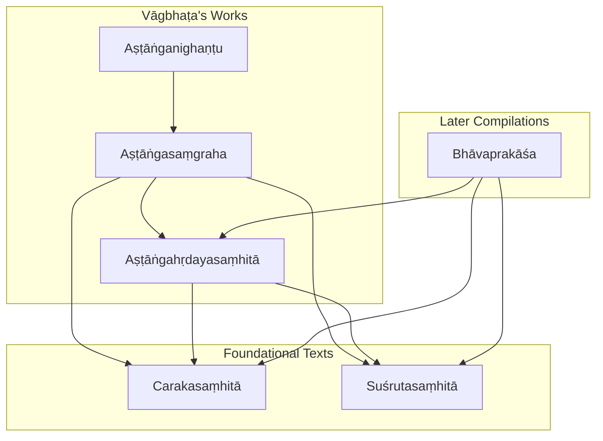
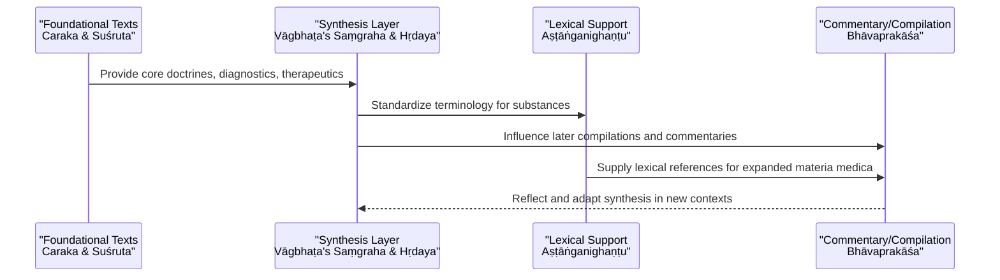
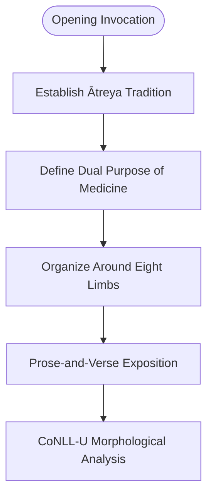
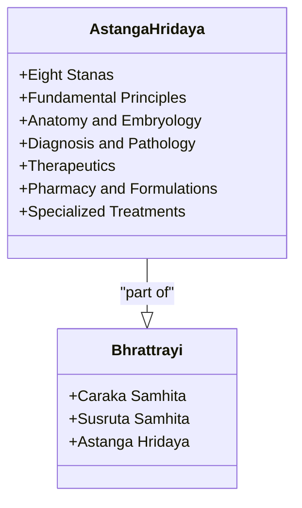
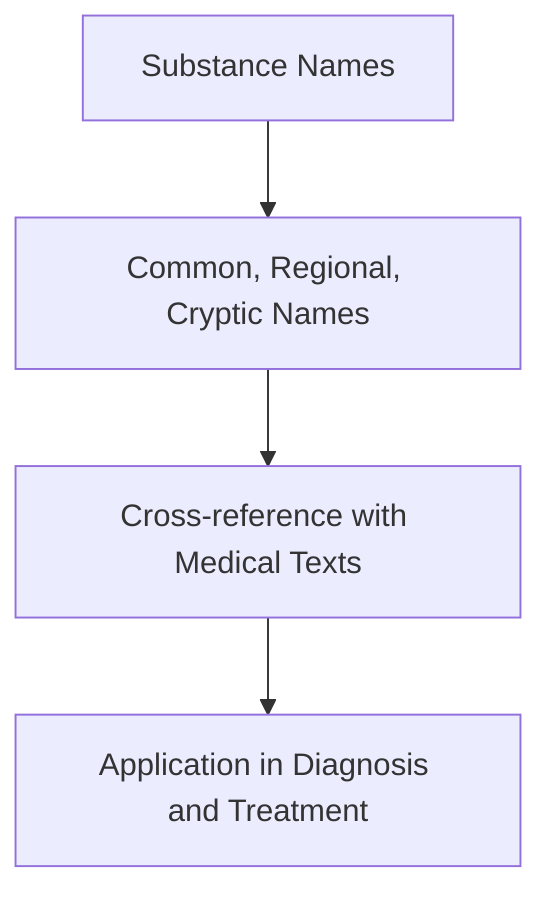
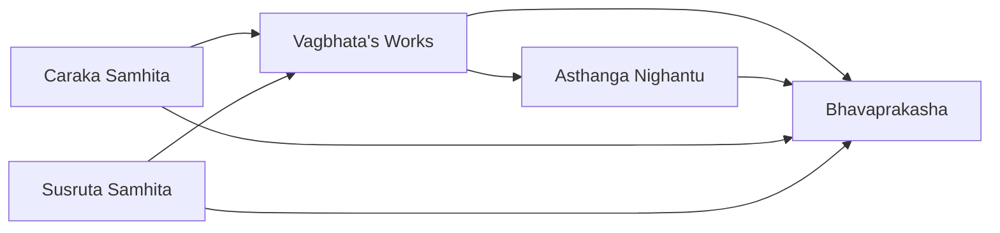
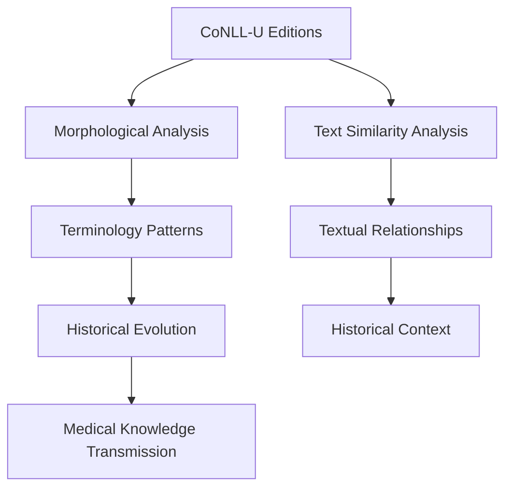

<cite>
**Referenced Files in This Document**
- [astangasamgraha.md](file://astangasamgraha.md)
- [astangahrdayasamhita.md](file://astangahrdayasamhita.md)
- [astanganighantu.md](file://astanganighantu.md)
- [carakasamhita.md](file://carakasamhita.md)
- [susrutasamhita.md](file://susrutasamhita.md)
- [bhavaprakasa.md](file://bhavaprakasa.md)
- [INDEX.md](file://INDEX.md)
</cite>

## Table of Contents
1. [Introduction](#introduction)
2. [Project Structure](#project-structure)
3. [Core Components](#core-components)
4. [Architecture Overview](#architecture-overview)
5. [Detailed Component Analysis](#detailed-component-analysis)
6. [Dependency Analysis](#dependency-analysis)
7. [Performance Considerations](#performance-considerations)
8. [Troubleshooting Guide](#troubleshooting-guide)
9. [Conclusion](#conclusion)
10. [Appendices](#appendices)

## Introduction
This document provides comprehensive documentation for the Aṣṭāṅgasaṃgraha, focusing on Vāgbhaṭa’s later synthesis that builds upon earlier Ayurvedic thought, especially as reflected in the Bṛhattrayī (Caraka and Suśruta). It explains how the Saṃgraha represents a refined medical compendium with prose-and-verse exposition, complements the metrical Aṣṭāṅgahṛdayasaṃhitā, and participates in the broader commentary tradition through related texts such as Bhāvaprakāśa. The document also outlines computational analysis opportunities using CoNLL-U editions to study updated terminology, diagnostic criteria, and therapeutic approaches across these texts.

## Project Structure
The repository organizes Sanskrit texts as concept pages with metadata, summaries, and links to parsed editions. For this project:
- The Aṣṭāṅgasaṃgraha is documented as a prose-and-verse treatise organized around the eight limbs of Āyurveda.
- The Aṣṭāṅgahṛdayasaṃhitā is presented as the metrical counterpart and part of the Bṛhattrayī.
- Related texts include foundational works (Caraka, Suśruta), glossaries (Aṣṭāṅganighaṇṭu), and later compendia/commentaries (Bhāvaprakāśa).
- The INDEX provides cross-references and context for the 11-sanskrit knowledge bank.

**Diagram sources**
- [astangasamgraha.md:19-41](file://astangasamgraha.md#L19-L41)
- [astangahrdayasamhita.md:20-45](file://astangahrdayasamhita.md#L20-L45)
- [astanganighantu.md:21-41](file://astanganighantu.md#L21-L41)
- [carakasamhita.md:1-11](file://carakasamhita.md#L1-L11)
- [susrutasamhita.md:1-11](file://susrutasamhita.md#L1-L11)
- [bhavaprakasa.md:1-11](file://bhavaprakasa.md#L1-L11)

**Section sources**
- [astangasamgraha.md:19-41](file://astangasamgraha.md#L19-L41)
- [astangahrdayasamhita.md:20-45](file://astangahrdayasamhita.md#L20-L45)
- [astanganighantu.md:21-41](file://astanganighantu.md#L21-L41)
- [INDEX.md:20-26](file://INDEX.md#L20-L26)

## Core Components
- Aṣṭāṅgasaṃgraha: Prose-and-verse compendium by Vāgbhaṭa, structured around the eight branches of Āyurveda; opens with lineage to the Ātreya tradition and emphasizes medicine’s dual role in invigoration and disease destruction.
- Aṣṭāṅgahṛdayasaṃhitā: Metrical condensation of Vāgbhaṭa’s system, part of the Bṛhattrayī; organized into eight sthānas covering principles, anatomy, diagnosis, therapeutics, pharmacy, and specialized treatments.
- Aṣṭāṅganighaṇṭu: Lexical companion cataloging synonyms and cryptic names of medicinal substances used in the Aṣṭāṅgasaṃgraha tradition.
- Foundational texts: Carakasaṃhitā and Suśrutasaṃhitā provide core frameworks for medicine and surgery respectively, forming the Bṛhattrayī alongside Vāgbhaṭa’s works.
- Later compilation: Bhāvaprakāśa synthesizes pathology, pharmacology, and therapeutics, reflecting continued evolution of Ayurvedic thought.

**Section sources**
- [astangasamgraha.md:19-41](file://astangasamgraha.md#L19-L41)
- [astangahrdayasamhita.md:20-45](file://astangahrdayasamhita.md#L20-L45)
- [astanganighantu.md:21-41](file://astanganighantu.md#L21-L41)
- [carakasamhita.md:1-11](file://carakasamhita.md#L1-L11)
- [susrutasamhita.md:1-11](file://susrutasamhita.md#L1-L11)
- [bhavaprakasa.md:1-11](file://bhavaprakasa.md#L1-L11)

## Architecture Overview
The architecture of Vāgbhaṭa’s synthesis can be understood as a layered transmission model:
- Foundational layer: Caraka and Suśruta establish core doctrines, diagnostics, and therapeutics.
- Synthesis layer: Vāgbhaṭa’s Saṃgraha and Hṛdaya consolidate and refine these teachings, adding systematic organization and accessible formats (prose vs verse).
- Lexical support: Nighaṇṭus standardize terminology for materia medica.
- Commentary/compilation layer: Later texts like Bhāvaprakāśa expand and adapt knowledge for new contexts.

**Diagram sources**
- [carakasamhita.md:1-11](file://carakasamhita.md#L1-L11)
- [susrutasamhita.md:1-11](file://susrutasamhita.md#L1-L11)
- [astangasamgraha.md:19-41](file://astangasamgraha.md#L19-L41)
- [astangahrdayasamhita.md:20-45](file://astangahrdayasamhita.md#L20-L45)
- [astanganighantu.md:21-41](file://astanganighantu.md#L21-L41)
- [bhavaprakasa.md:1-11](file://bhavaprakasa.md#L1-L11)

## Detailed Component Analysis

### Aṣṭāṅgasaṃgraha: Prose-and-Verse Synthesis
- Opens with Ātreya lineage and defines medicine’s dual purpose: invigorating and disease-destroying.
- Structured around the eight limbs of Āyurveda, providing a comprehensive framework.
- Represents an earlier, fuller prose exposition compared to the later metrical Hṛdaya.
- Available in CoNLL-U format for morphological analysis of technical vocabulary.

**Diagram sources**
- [astangasamgraha.md:19-41](file://astangasamgraha.md#L19-L41)

**Section sources**
- [astangasamgraha.md:19-41](file://astangasamgraha.md#L19-L41)

### Aṣṭāṅgahṛdayasaṃhitā: Metrical Condensation
- Part of the Bṛhattrayī, considered concise and systematically organized.
- Organized into eight sthānas covering fundamental principles, anatomy, diagnosis, therapeutics, pharmacy, and specialized treatments.
- Provides extensive CoNLL-U coverage for detailed linguistic analysis.

**Diagram sources**
- [astangahrdayasamhita.md:20-45](file://astangahrdayasamhita.md#L20-L45)
- [carakasamhita.md:1-11](file://carakasamhita.md#L1-L11)
- [susrutasamhita.md:1-11](file://susrutasamhita.md#L1-L11)

**Section sources**
- [astangahrdayasamhita.md:20-45](file://astangahrdayasamhita.md#L20-L45)

### Aṣṭāṅganighaṇṭu: Lexical Foundation
- Catalogs synonyms and cryptic names of medicinal substances used in the Aṣṭāṅgasaṃgraha tradition.
- Serves as a specialized glossary supporting materia medica identification and classification.
- Provides extensive CoNLL-U parsing for botanical and technical vocabulary analysis.

**Diagram sources**
- [astanganighantu.md:21-41](file://astanganighantu.md#L21-L41)

**Section sources**
- [astanganighantu.md:21-41](file://astanganighantu.md#L21-L41)

### Relationship to Earlier Works and Commentary Tradition
- Vāgbhaṭa’s works synthesize and refine teachings from Caraka and Suśruta, representing continuity and evolution in Ayurvedic thought.
- The commentary tradition, exemplified by texts like Bhāvaprakāśa, continues to expand and adapt these foundations for contemporary practice.
- Computational analysis through CoNLL-U editions enables tracking of terminology evolution and conceptual shifts across time periods.

**Section sources**
- [carakasamhita.md:1-11](file://carakasamhita.md#L1-L11)
- [susrutasamhita.md:1-11](file://susrutasamhita.md#L1-L11)
- [bhavaprakasa.md:1-11](file://bhavaprakasa.md#L1-L11)

## Dependency Analysis
The dependency relationships between texts show a clear transmission pattern:
- Vāgbhaṭa’s works depend on foundational texts (Caraka, Suśruta) for core concepts.
- Lexical resources (nighaṇṭus) support both primary texts and later compilations.
- Later compilations like Bhāvaprakāśa build upon Vāgbhaṭa’s synthesis while maintaining connections to foundational sources.

**Diagram sources**
- [carakasamhita.md:1-11](file://carakasamhita.md#L1-L11)
- [susrutasamhita.md:1-11](file://susrutasamhita.md#L1-L11)
- [astangasamgraha.md:19-41](file://astangasamgraha.md#L19-L41)
- [astanganighantu.md:21-41](file://astanganighantu.md#L21-L41)
- [bhavaprakasa.md:1-11](file://bhavaprakasa.md#L1-L11)

**Section sources**
- [astangasamgraha.md:19-41](file://astangasamgraha.md#L19-L41)
- [astangahrdayasamhita.md:20-45](file://astangahrdayasamhita.md#L20-L45)
- [astanganighantu.md:21-41](file://astanganighantu.md#L21-L41)
- [bhavaprakasa.md:1-11](file://bhavaprakasa.md#L1-L11)

## Performance Considerations
For computational analysis of these texts:
- CoNLL-U editions enable morphological analysis of technical vocabulary across different time periods.
- TF-IDF similarity metrics help identify textual relationships and evolution of terminology.
- Lemma frequency analysis reveals shifts in emphasis between foundational and synthesized texts.
- Cross-textual analysis can track the transmission and transformation of key Ayurvedic concepts.

[No sources needed since this section provides general guidance]

## Troubleshooting Guide
When working with these texts computationally:
- Ensure proper handling of Sanskrit diacritics and transliteration standards.
- Account for variant spellings and regional terminology in nighaṇṭus.
- Consider historical context when analyzing semantic shifts in medical terminology.
- Validate cross-references between primary texts and their commentaries.

[No sources needed since this section provides general guidance]

## Conclusion
The Aṣṭāṅgasaṃgraha represents a crucial synthesis in the development of Ayurvedic medicine, bridging foundational teachings with later refinements. Through its prose-and-verse format and systematic organization, it contributes significantly to the transmission of Ayurvedic knowledge. The availability of CoNLL-U editions enables sophisticated computational analysis of terminology evolution, diagnostic criteria refinement, and therapeutic approach expansion across centuries of medical scholarship.

[No sources needed since this section summarizes without analyzing specific files]

## Appendices

### Computational Analysis Framework
The repository structure supports several types of computational analysis:

**Diagram sources**
- [astangasamgraha.md:39-41](file://astangasamgraha.md#L39-L41)
- [astangahrdayasamhita.md:43-45](file://astangahrdayasamhita.md#L43-L45)
- [astanganighantu.md:39-41](file://astanganighantu.md#L39-L41)

### Key Research Directions
- Tracking terminology evolution from foundational texts to Vāgbhaṭa’s synthesis
- Analyzing diagnostic criteria refinement across different periods
- Studying therapeutic approach expansion in later compilations
- Mapping commentary traditions and their influence on medical practice

[No sources needed since this section provides general guidance]
