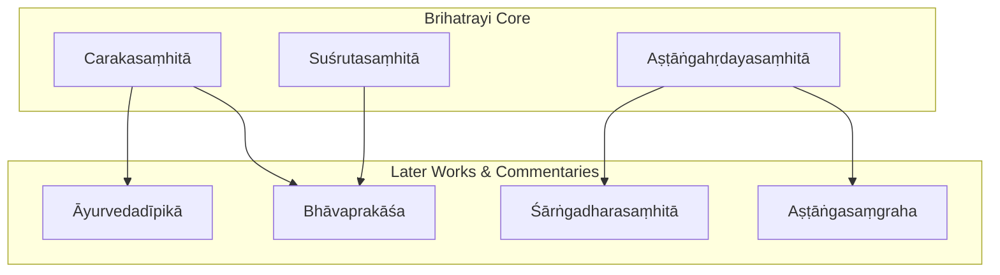
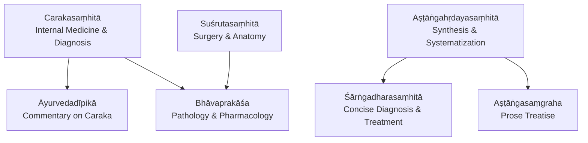
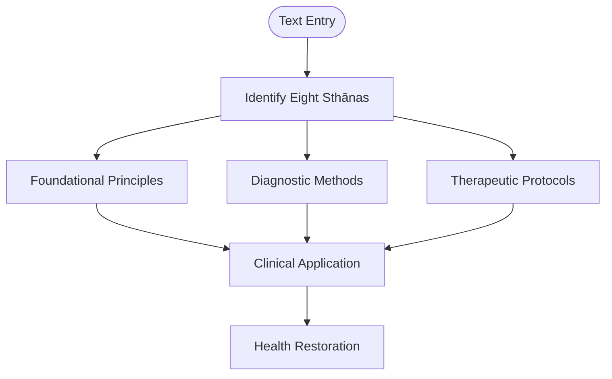
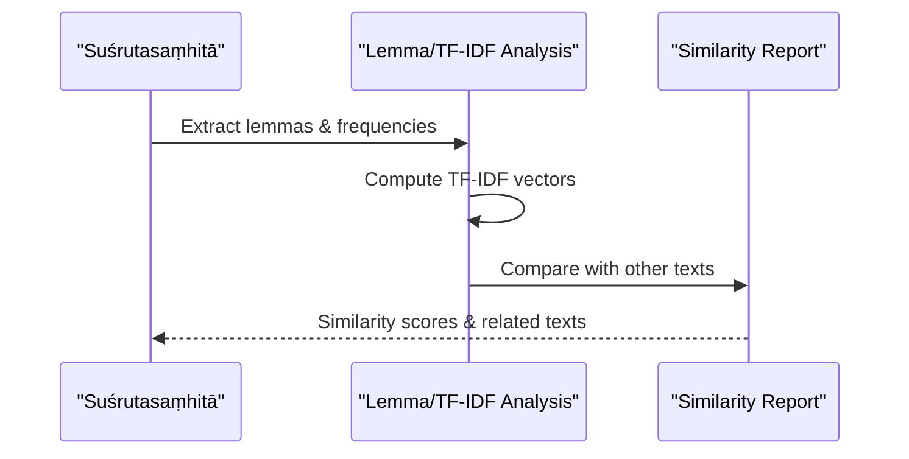
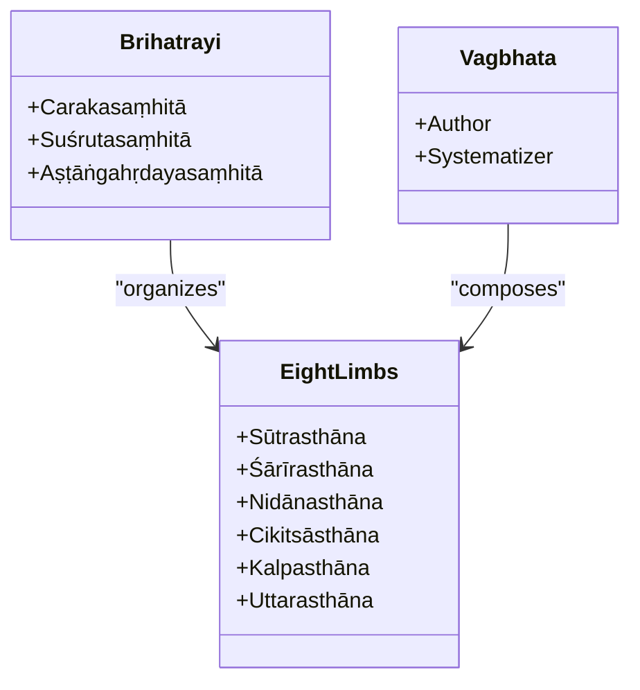
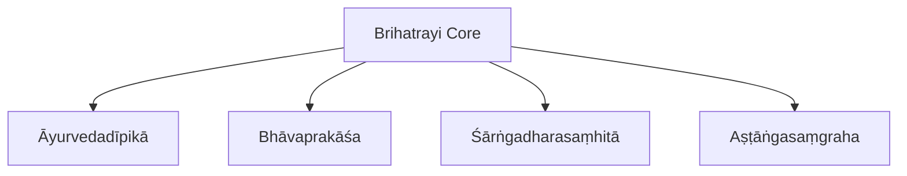
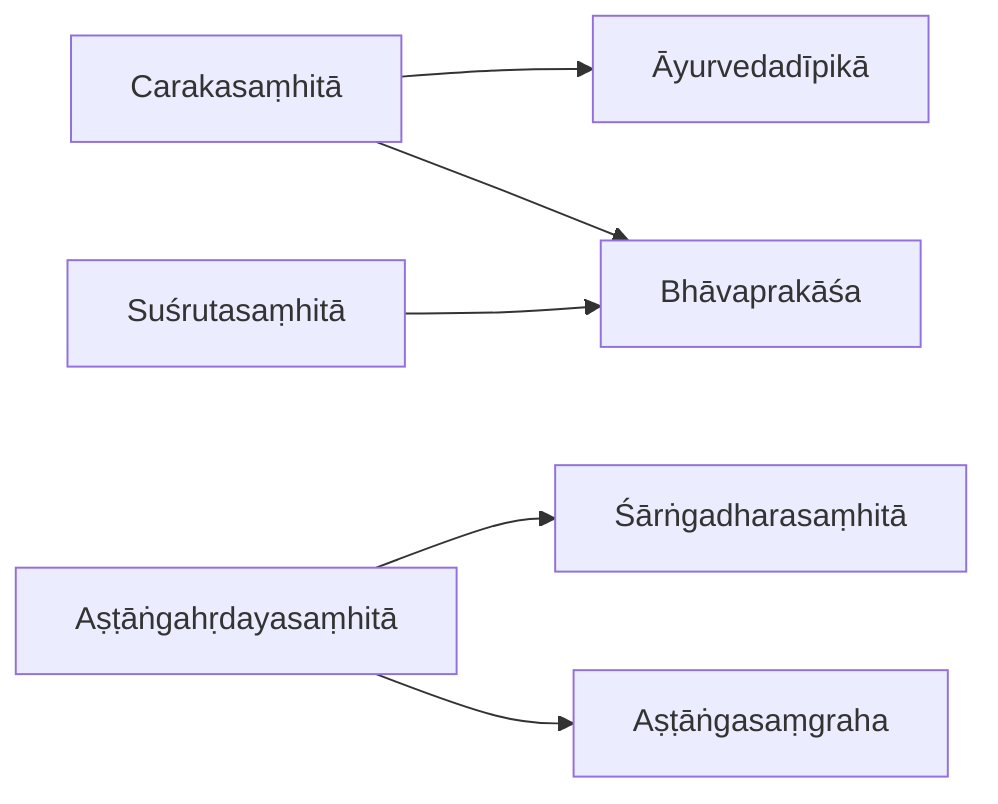

<cite>
**Referenced Files in This Document**
- [carakasamhita.md](file://carakasamhita.md)
- [susrutasamhita.md](file://susrutasamhita.md)
- [astangahrdayasamhita.md](file://astangahrdayasamhita.md)
- [INDEX.md](file://INDEX.md)
- [astangasamgraha.md](file://astangasamgraha.md)
- [ayurvedadipika.md](file://ayurvedadipika.md)
- [bhavaprakasa.md](file://bhavaprakasa.md)
- [sarngadharasamhita.md](file://sarngadharasamhita.md)
</cite>

## Table of Contents
1. [Introduction](#introduction)
2. [Project Structure](#project-structure)
3. [Core Components](#core-components)
4. [Architecture Overview](#architecture-overview)
5. [Detailed Component Analysis](#detailed-component-analysis)
6. [Dependency Analysis](#dependency-analysis)
7. [Performance Considerations](#performance-considerations)
8. [Troubleshooting Guide](#troubleshooting-guide)
9. [Conclusion](#conclusion)
10. [Appendices](#appendices)

## Introduction
This document provides a comprehensive overview of the Āyurvedic corpus centered on the foundational texts Carakasaṃhitā, Suśrutasaṃhitā, and Aṣṭāṅgahṛdayasaṃhitā—collectively known as the Bṛhattrayī (Three Greats). It explains the systematic approach to medicine, diagnostic methods, therapeutic protocols, and the theoretical framework of doshas, dhatus, and malas as reflected across these classical works. It also outlines how computational analysis is applied to medical terminology, disease classifications, and treatment methodologies using CoNLL-U parsed editions and lemma frequency data. Finally, it highlights the influence of the Bṛhattrayī tradition on subsequent medical literature such as commentaries and later compendia.

## Project Structure
The repository organizes each major text as a standalone topic file with metadata describing its scope, sources, tags, and related texts. The three core texts are:
- Carakasaṃhitā: foundational internal medicine, diagnosis, therapeutics; 8 sthānas; 82 CoNLL-U files
- Suśrutasaṃhitā: foundational surgery, anatomy, therapeutics; 80 CoNLL-U files
- Aṣṭāṅgahṛdayasaṃhitā: concise synthesis by Vāgbhaṭa; 120 CoNLL-U files

Related texts include commentaries and later compendia that extend or summarize the Bṛhattrayī tradition:
- Āyurvedadīpikā: authoritative commentary on Caraka
- Bhāvaprakāśa: comprehensive compendium covering pathology, pharmacology, therapeutics
- Śārṅgadharasaṃhitā: concise presentation of diagnosis and treatment
- Aṣṭāṅgasaṃgraha: prose-and-verse treatise by Vāgbhaṭa, earlier than the Hṛdayasaṃhitā

**Diagram sources**
- [carakasamhita.md:1-11](file://carakasamhita.md#L1-L11)
- [susrutasamhita.md:1-11](file://susrutasamhita.md#L1-L11)
- [astangahrdayasamhita.md:1-18](file://astangahrdayasamhita.md#L1-L18)
- [ayurvedadipika.md:1-12](file://ayurvedadipika.md#L1-L12)
- [bhavaprakasa.md:1-12](file://bhavaprakasa.md#L1-L12)
- [sarngadharasamhita.md:1-12](file://sarngadharasamhita.md#L1-L12)
- [astangasamgraha.md:1-17](file://astangasamgraha.md#L1-L17)

**Section sources**
- [carakasamhita.md:1-11](file://carakasamhita.md#L1-L11)
- [susrutasamhita.md:1-11](file://susrutasamhita.md#L1-L11)
- [astangahrdayasamhita.md:1-18](file://astangahrdayasamhita.md#L1-L18)
- [INDEX.md:20-26](file://INDEX.md#L20-L26)

## Core Components
- Carakasaṃhitā: Foundational internal medicine, diagnosis, therapeutics; structured into eight sthānas; extensive CoNLL-U parsing supports lexical and morphological analysis.
- Suśrutasaṃhitā: Foundational surgical text; covers anatomy, procedures, therapeutics; high similarity to Aṣṭāṅgahṛdayasaṃhitā indicates shared terminology and concepts.
- Aṣṭāṅgahṛdayasaṃhitā: Concise, systematic synthesis by Vāgbhaṭa; organized around eight limbs (sthānas), including fundamental principles, anatomy, diagnosis, therapeutics, pharmacy, specialized treatments.

Computational features:
- Lemma frequency tables enable identification of key medical vocabulary (e.g., pitta appears prominently in Aṣṭāṅgahṛdayasaṃhitā).
- TF-IDF cosine similarity between texts reveals conceptual overlap and lineage (e.g., Suśruta–Hṛdaya similarity at 0.8316; Caraka–Hṛdaya at 0.6407).

**Section sources**
- [carakasamhita.md:1-11](file://carakasamhita.md#L1-L11)
- [susrutasamhita.md:1-11](file://susrutasamhita.md#L1-L11)
- [astangahrdayasamhita.md:20-45](file://astangahrdayasamhita.md#L20-L45)
- [astangahrdayasamhita.md:70-87](file://astangahrdayasamhita.md#L70-L87)

## Architecture Overview
The Āyurvedic corpus architecture centers on the Bṛhattrayī as the canonical foundation, with later works providing commentary, synthesis, and practical manuals. The relationship is both historical and conceptual:
- Caraka establishes internal medicine frameworks and diagnostic paradigms.
- Suśruta contributes surgical knowledge and anatomical detail.
- Vāgbhaṭa’s Hṛdaya synthesizes and condenses prior traditions into an accessible, systematic format.
- Later texts like Āyurvedadīpikā, Bhāvaprakāśa, and Śārṅgadharasaṃhitā expand, clarify, and adapt the core doctrines for evolving clinical practice.

**Diagram sources**
- [carakasamhita.md:1-11](file://carakasamhita.md#L1-L11)
- [susrutasamhita.md:1-11](file://susrutasamhita.md#L1-L11)
- [astangahrdayasamhita.md:20-45](file://astangahrdayasamhita.md#L20-L45)
- [ayurvedadipika.md:1-12](file://ayurvedadipika.md#L1-L12)
- [bhavaprakasa.md:1-12](file://bhavaprakasa.md#L1-L12)
- [sarngadharasamhita.md:1-12](file://sarngadharasamhita.md#L1-L12)
- [astangasamgraha.md:19-41](file://astangasamgraha.md#L19-L41)

## Detailed Component Analysis

### Carakasaṃhitā
- Scope: Internal medicine, diagnosis, therapeutics; organized into eight sthānas; foundational for Āyurvedic theory and practice.
- Computational insights: High similarity to Suśrutasaṃhitā (0.7028) and Aṣṭāṅgahṛdayasaṃhitā (0.6407) indicates shared terminology and conceptual overlap.
- Notable lemmas: Frequent use of connective and functional words suggests dense technical exposition; verb forms indicate procedural descriptions.

**Diagram sources**
- [carakasamhita.md:1-11](file://carakasamhita.md#L1-L11)

**Section sources**
- [carakasamhita.md:1-11](file://carakasamhita.md#L1-L11)
- [carakasamhita.md:15-30](file://carakasamhita.md#L15-L30)

### Suśrutasaṃhitā
- Scope: Surgery, anatomy, therapeutics; emphasizes procedural knowledge and anatomical understanding.
- Computational insights: Highest similarity to Aṣṭāṅgahṛdayasaṃhitā (0.8316) reflects strong terminological alignment; frequent verbs indicate procedural language.
- Notable lemmas: High frequency of action-oriented terms aligns with surgical and therapeutic content.

**Diagram sources**
- [susrutasamhita.md:1-11](file://susrutasamhita.md#L1-L11)
- [susrutasamhita.md:15-30](file://susrutasamhita.md#L15-L30)

**Section sources**
- [susrutasamhita.md:1-11](file://susrutasamhita.md#L1-L11)
- [susrutasamhita.md:15-30](file://susrutasamhita.md#L15-L30)

### Aṣṭāṅgahṛdayasaṃhitā
- Scope: Comprehensive synthesis by Vāgbhaṭa; eight limbs cover fundamentals, anatomy, diagnosis, therapeutics, pharmacy, specialized treatments.
- Computational insights: Prominent appearance of pitta among top lemmas indicates emphasis on doshic theory; high similarity to Suśrutasaṃhitā shows shared surgical/anatomical vocabulary.
- Notable lemmas: Frequent use of connectives and verbs supports systematic exposition and procedural guidance.

**Diagram sources**
- [astangahrdayasamhita.md:20-45](file://astangahrdayasamhita.md#L20-L45)
- [astangahrdayasamhita.md:70-87](file://astangahrdayasamhita.md#L70-L87)

**Section sources**
- [astangahrdayasamhita.md:20-45](file://astangahrdayasamhita.md#L20-L45)
- [astangahrdayasamhita.md:70-87](file://astangahrdayasamhita.md#L70-L87)

### Later Works & Commentaries
- Āyurvedadīpikā: Authoritative commentary on Caraka; clarifies doctrines and therapeutic methods; substantial CoNLL-U coverage enables detailed lexical analysis.
- Bhāvaprakāśa: Comprehensive compendium covering pathology, pharmacology, therapeutics; includes frequent medicinal and pathological terms.
- Śārṅgadharasaṃhitā: Concise manual for diagnosis and treatment; useful for comparative studies of condensed medical knowledge.
- Aṣṭāṅgasaṃgraha: Prose-and-verse treatise by Vāgbhaṭa; earlier than Hṛdaya; establishes Ātreya tradition and dual purpose of medicine.

**Diagram sources**
- [ayurvedadipika.md:1-12](file://ayurvedadipika.md#L1-L12)
- [bhavaprakasa.md:1-12](file://bhavaprakasa.md#L1-L12)
- [sarngadharasamhita.md:1-12](file://sarngadharasamhita.md#L1-L12)
- [astangasamgraha.md:19-41](file://astangasamgraha.md#L19-L41)

**Section sources**
- [ayurvedadipika.md:1-12](file://ayurvedadipika.md#L1-L12)
- [bhavaprakasa.md:1-12](file://bhavaprakasa.md#L1-L12)
- [sarngadharasamhita.md:1-12](file://sarngadharasamhita.md#L1-L12)
- [astangasamgraha.md:19-41](file://astangasamgraha.md#L19-L41)

## Dependency Analysis
Conceptual dependencies among texts reflect historical lineage and methodological continuity:
- Caraka influences commentary and later compendia through foundational internal medicine frameworks.
- Suśruta’s surgical and anatomical knowledge informs later syntheses and manuals.
- Vāgbhaṭa’s Hṛdaya serves as a bridge, synthesizing prior traditions into a concise, systematic format.
- Later works depend on the Bṛhattrayī for doctrinal authority while adapting content to evolving clinical needs.

**Diagram sources**
- [carakasamhita.md:1-11](file://carakasamhita.md#L1-L11)
- [susrutasamhita.md:1-11](file://susrutasamhita.md#L1-L11)
- [astangahrdayasamhita.md:20-45](file://astangahrdayasamhita.md#L20-L45)
- [ayurvedadipika.md:1-12](file://ayurvedadipika.md#L1-L12)
- [bhavaprakasa.md:1-12](file://bhavaprakasa.md#L1-L12)
- [sarngadharasamhita.md:1-12](file://sarngadharasamhita.md#L1-L12)
- [astangasamgraha.md:19-41](file://astangasamgraha.md#L19-L41)

**Section sources**
- [carakasamhita.md:15-30](file://carakasamhita.md#L15-L30)
- [susrutasamhita.md:15-30](file://susrutasamhita.md#L15-L30)
- [astangahrdayasamhita.md:54-69](file://astangahrdayasamhita.md#L54-L69)

## Performance Considerations
- CoNLL-U parsing enables robust morphological and lexical analysis across large corpora; larger file counts (e.g., Hṛdaya with 120 files) support deeper statistical insights.
- TF-IDF similarity metrics help identify textual relationships and lineage; higher similarity scores indicate stronger conceptual overlap.
- Lemma frequency analysis highlights domain-specific vocabulary (e.g., pitta in Hṛdaya), aiding targeted research on doshic theory.

[No sources needed since this section provides general guidance]

## Troubleshooting Guide
When analyzing Āyurvedic texts computationally:
- Ensure consistent preprocessing of Sanskrit text to handle diacritics and variant spellings.
- Validate lemma normalization to avoid fragmentation of medical terms across different inflections.
- Cross-reference similarity results with known historical relationships to confirm plausibility.
- Use commentary texts (e.g., Āyurvedadīpikā) to resolve ambiguities in primary source interpretations.

[No sources needed since this section provides general guidance]

## Conclusion
The Āyurvedic corpus, anchored by the Bṛhattrayī, presents a systematic and enduring framework for medicine, encompassing diagnosis, therapeutics, and theoretical foundations. Computational analysis of CoNLL-U parsed editions reveals strong conceptual continuity across texts, with lemma frequency and similarity metrics illuminating the evolution of medical terminology and methodology. Later works build upon the Bṛhattrayī tradition, adapting and expanding its teachings for contemporary practice while preserving core doctrines.

[No sources needed since this section summarizes without analyzing specific files]

## Appendices
- Related texts and their roles in the Āyurvedic tradition:
  - Āyurvedadīpikā: Commentary on Caraka
  - Bhāvaprakāśa: Comprehensive compendium
  - Śārṅgadharasaṃhitā: Concise manual
  - Aṣṭāṅgasaṃgraha: Earlier prose treatise by Vāgbhaṭa

**Section sources**
- [INDEX.md:20-26](file://INDEX.md#L20-L26)
- [ayurvedadipika.md:1-12](file://ayurvedadipika.md#L1-L12)
- [bhavaprakasa.md:1-12](file://bhavaprakasa.md#L1-L12)
- [sarngadharasamhita.md:1-12](file://sarngadharasamhita.md#L1-L12)
- [astangasamgraha.md:19-41](file://astangasamgraha.md#L19-L41)
