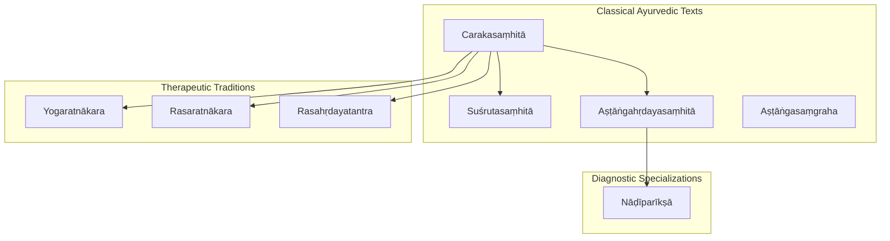
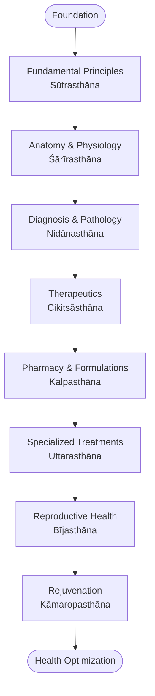
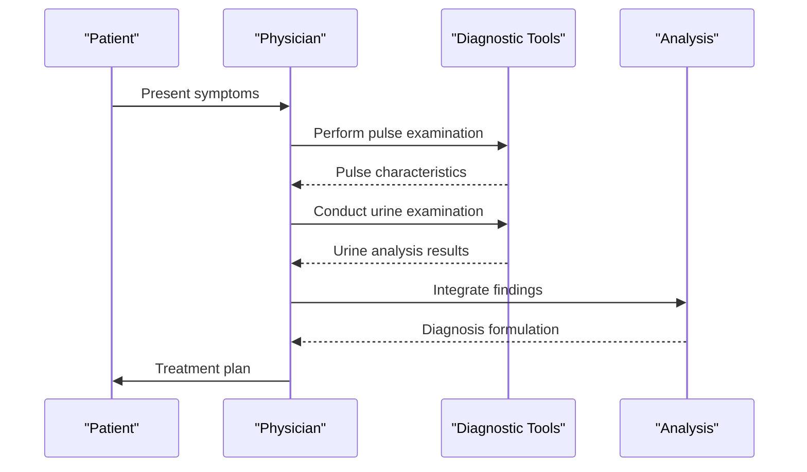
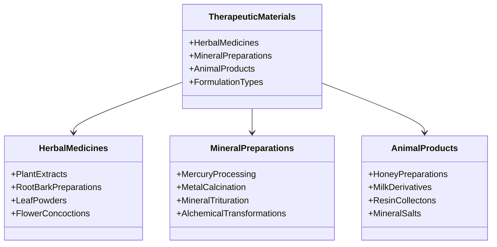
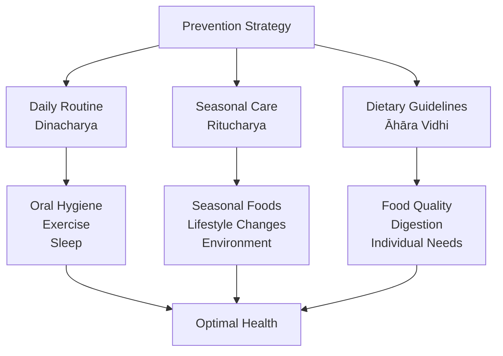
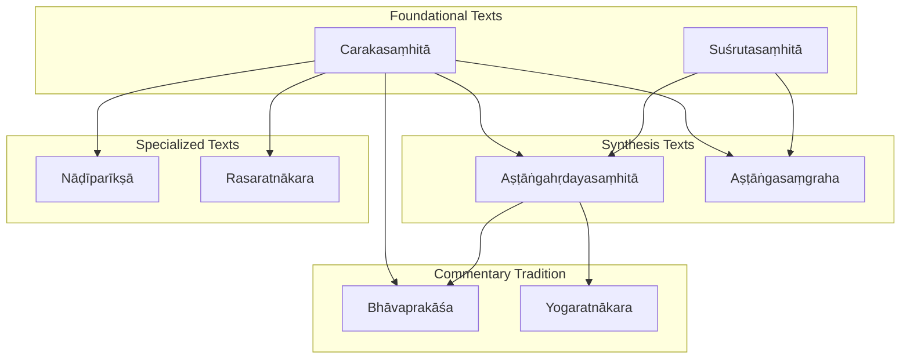

<cite>
**Referenced Files in This Document**
- [carakasamhita.md](file://carakasamhita.md)
- [astangahrdayasamhita.md](file://astangahrdayasamhita.md)
- [susrutasamhita.md](file://susrutasamhita.md)
- [astangasamgraha.md](file://astangasamgraha.md)
- [bhavaprakasa.md](file://bhavaprakasa.md)
- [yogaratnakara.md](file://yogaratnakara.md)
- [rasaratnakara.md](file://rasaratnakara.md)
- [rasahrdayatantra.md](file://rasahrdayatantra.md)
- [nadipariksa.md](file://nadipariksa.md)
</cite>

## Table of Contents
1. [Introduction](#introduction)
2. [Project Structure](#project-structure)
3. [Core Components](#core-components)
4. [Architecture Overview](#architecture-overview)
5. [Detailed Component Analysis](#detailed-component-analysis)
6. [Dependency Analysis](#dependency-analysis)
7. [Performance Considerations](#performance-considerations)
8. [Troubleshooting Guide](#troubleshooting-guide)
9. [Conclusion](#conclusion)
10. [Appendices](#appendices)

## Introduction
This document provides a comprehensive overview of the Carakasaṃhitā’s approach to internal medicine (Kāyacikitsā), focusing on its foundational role in Āyurveda, its eightfold division of medicine, diagnostic methods including pulse and urine examination, therapeutic protocols using herbs, minerals, and animal products, disease classification systems, prevention and lifestyle management, and its influence on subsequent Ayurvedic literature. The analysis draws from the repository’s metadata and related texts to present an accessible yet detailed guide for both technical and non-technical readers.

## Project Structure
The repository includes a dedicated entry for the Carakasaṃhitā along with closely related classical Ayurvedic texts that contextualize its structure, methodology, and influence. The Carakasaṃhitā is described as the foundational text of Āyurveda and the first of the Bṛhattrayī (Three Greats), covering medicine, diagnosis, and therapeutics across eight sthānas (sections). Related texts such as the Suśrutasaṃhitā and Aṣṭāṅgahṛdayasaṃhitā provide complementary perspectives on the eight limbs of medicine and diagnostic practices.

**Diagram sources**
- [carakasamhita.md:1-11](file://carakasamhita.md#L1-L11)
- [astangahrdayasamhita.md:1-17](file://astangahrdayasamhita.md#L1-L17)
- [susrutasamhita.md:1-11](file://susrutasamhita.md#L1-L11)
- [astangasamgraha.md:1-16](file://astangasamgraha.md#L1-L16)
- [nadipariksa.md:1-12](file://nadipariksa.md#L1-L12)
- [yogaratnakara.md:1-11](file://yogaratnakara.md#L1-L11)
- [rasaratnakara.md:1-11](file://rasaratnakara.md#L1-L11)
- [rasahrdayatantra.md:1-11](file://rasahrdayatantra.md#L1-L11)

**Section sources**
- [carakasamhita.md:1-11](file://carakasamhita.md#L1-L11)
- [astangahrdayasamhita.md:1-17](file://astangahrdayasamhita.md#L1-L17)
- [susrutasamhita.md:1-11](file://susrutasamhita.md#L1-L11)

## Core Components
The Carakasaṃhitā establishes the foundation of Āyurvedic internal medicine through its systematic organization into eight sthānas, each addressing distinct aspects of health, disease, and treatment. While the repository metadata confirms the eight-sthana structure, the broader Ayurvedic tradition elaborates these sections as follows:

1. **Sūtrasthāna** — Fundamental principles and general concepts
2. **Śārīrasthāna** — Anatomy, physiology, and embryology
3. **Nidānasthāna** — Diagnosis and pathology
4. **Cikitsāsthāna** — Therapeutics and treatment protocols
5. **Kalpasthāna** — Pharmacy and formulations
6. **Uttarasthāna** — Specialized treatments and post-therapeutic care
7. **Bījasthāna** — Fertility and reproductive health
8. **Kāmaropasthāna** — Rejuvenation and aphrodisiac therapies

The text emphasizes the dual nature of medicine as both invigorating and disease-destroying, establishing Āyurveda’s holistic approach to health promotion rather than mere disease intervention.

**Section sources**
- [carakasamhita.md:1-11](file://carakasamhita.md#L1-L11)
- [astangasamgraha.md:23-33](file://astangasamgraha.md#L23-L33)

## Architecture Overview
The Carakasaṃhitā’s architecture follows a systematic progression from foundational principles to specialized treatments, integrating diagnostic methodologies with therapeutic interventions. This structure reflects the comprehensive nature of Kāyacikitsā, which addresses the complete spectrum of internal medicine.

**Diagram sources**
- [astangahrdayasamhita.md:32-41](file://astangahrdayasamhita.md#L32-L41)
- [carakasamhita.md:1-11](file://carakasamhita.md#L1-L11)

## Detailed Component Analysis

### Diagnostic Methods in Carakasaṃhitā
The Carakasaṃhitā employs comprehensive diagnostic approaches that form the cornerstone of Kāyacikitsā. These methods include:

#### Pulse Diagnosis (Nāḍīparīkṣā)
Pulse diagnosis represents a sophisticated diagnostic technique where practitioners assess various characteristics of the pulse to determine the state of doshas, dhatus, and overall health status. The Nāḍīparīkṣā text specifically focuses on this art of reading nāḍī (pulse) for diagnosing health conditions.

#### Urine Examination (Mutra Parīkṣā)
Urine examination serves as another crucial diagnostic tool, allowing physicians to observe physical properties, color, consistency, and other characteristics that indicate underlying pathological conditions.

#### Comprehensive Assessment Framework
The diagnostic process integrates multiple observation points including:
- Patient history and symptom assessment
- Physical examination findings
- Laboratory observations (historically including urine analysis)
- Pulse characteristics and rhythm analysis
- Mental and emotional state evaluation

**Diagram sources**
- [nadipariksa.md:1-12](file://nadipariksa.md#L1-L12)
- [carakasamhita.md:1-11](file://carakasamhita.md#L1-L11)

**Section sources**
- [nadipariksa.md:1-12](file://nadipariksa.md#L1-L12)
- [carakasamhita.md:1-11](file://carakasamhita.md#L1-L11)

### Therapeutic Protocols and Materia Medica
The Carakasaṃhitā outlines comprehensive therapeutic protocols utilizing diverse medicinal substances:

#### Herbal Medicine (Oṣadhi)
Herbal preparations form the backbone of Āyurvedic therapeutics, with extensive documentation of plant-based remedies, their preparation methods, and specific indications.

#### Mineral and Metallic Preparations (Rasa)
Mineral and metallic medicines represent advanced therapeutic approaches, particularly in rasaśāstra traditions. Texts like Rasaratnākara and Rasahṛdayatantra detail mercury processing and mineral-based formulations.

#### Animal Products (Daṁśtādi)
Animal-derived substances contribute to specific therapeutic applications, though their use requires careful consideration of ethical and practical factors.

#### Formulation Classes
The therapeutic system encompasses various formulation types:
- Decoctions (Kwatha)
- Powders (Chūrṇa)
- Tablets (Vati)
- Pastes (Lehya)
- Medicinal oils (Taila)
- Ghee preparations (Ghṛta)

**Diagram sources**
- [rasaratnakara.md:1-11](file://rasaratnakara.md#L1-L11)
- [rasahrdayatantra.md:1-11](file://rasahrdayatantra.md#L1-L11)
- [yogaratnakara.md:1-11](file://yogaratnakara.md#L1-L11)

**Section sources**
- [rasaratnakara.md:1-11](file://rasaratnakara.md#L1-L11)
- [rasahrdayatantra.md:1-11](file://rasahrdayatantra.md#L1-L11)
- [yogaratnakara.md:1-11](file://yogaratnakara.md#L1-L11)

### Disease Classification Systems
The Carakasaṃhitā employs sophisticated disease classification frameworks based on fundamental Ayurvedic principles:

#### Dosha-Based Classification
Diseases are categorized according to predominant dosha involvement:
- Vāta disorders
- Pitta disorders  
- Kapha disorders
- Tridosha imbalances

#### Etiological Framework
Classification considers multiple causative factors:
- Dietary indiscretions
- Lifestyle violations
- Environmental influences
- Psychological stressors
- Seasonal variations

#### Anatomical System Involvement
Diseases are further classified by affected anatomical systems:
- Tissue-level disorders (Dhātu vyādhi)
- Organ-specific pathologies
- Systemic conditions affecting multiple tissues

### Prevention and Lifestyle Management
The Carakasaṃhitā places significant emphasis on preventive medicine and lifestyle optimization:

#### Daily Routine (Dinacharya)
Structured daily practices including:
- Wake-up time regulation
- Oral hygiene procedures
- Exercise and physical activity
- Meditation and mental discipline
- Proper sleep hygiene

#### Seasonal Regimen (Ritucharya)
Season-specific adaptations for:
- Dietary modifications
- Lifestyle adjustments
- Preventive therapies
- Environmental protection measures

#### Dietary Guidelines (Āhāra Vidhi)
Comprehensive dietary principles including:
- Food combinations and incompatibilities
- Digestive capacity assessment
- Seasonal food selection
- Individual dietary requirements

**Section sources**
- [astangahrdayasamhita.md:24-31](file://astangahrdayasamhita.md#L24-L31)
- [astangasamgraha.md:23-33](file://astangasamgraha.md#L23-L33)

### Influence on Subsequent Ayurvedic Literature
The Carakasaṃhitā’s impact on Ayurvedic literature is profound and far-reaching:

#### Foundational Influence
As the first of the Bṛhattrayī, it established core principles that influenced all subsequent medical texts:
- Suśrutasaṃhitā built upon Caraka’s diagnostic and therapeutic foundations
- Aṣṭāṅgahṛdayasaṃhitā synthesized and condensed earlier knowledge
- Later commentaries and compilations consistently referenced Caraka’s authority

#### Methodological Legacy
The text’s methodological contributions include:
- Standardized diagnostic approaches
- Systematic disease classification
- Evidence-based therapeutic protocols
- Holistic patient assessment frameworks

#### Terminological Foundation
Many technical terms and concepts originated or were standardized in the Carakasaṃhitā, becoming part of the universal Ayurvedic vocabulary used across traditions.

**Section sources**
- [carakasamhita.md:1-11](file://carakasamhita.md#L1-L11)
- [susrutasamhita.md:1-11](file://susrutasamhita.md#L1-L11)
- [astangahrdayasamhita.md:1-17](file://astangahrdayasamhita.md#L1-L17)

## Dependency Analysis
The Carakasaṃhitā exists within a rich ecosystem of Ayurvedic literature, with clear dependency relationships between texts:

**Diagram sources**
- [carakasamhita.md:15-30](file://carakasamhita.md#L15-L30)
- [astangahrdayasamhita.md:54-69](file://astangahrdayasamhita.md#L54-L69)
- [bhavaprakasa.md:15-30](file://bhavaprakasa.md#L15-L30)

**Section sources**
- [carakasamhita.md:15-30](file://carakasamhita.md#L15-L30)
- [astangahrdayasamhita.md:54-69](file://astangahrdayasamhita.md#L54-L69)

## Performance Considerations
When analyzing the Carakasaṃhitā’s computational representation and usage patterns, several considerations emerge:

### Text Processing Efficiency
- The 82 CoNLL-U files representing the Carakasaṃhitā provide comprehensive morphological analysis
- High-frequency lemma usage indicates complex grammatical structures requiring sophisticated parsing
- Technical Sanskrit terminology demands specialized linguistic processing capabilities

### Computational Linguistics Challenges
- Ancient Sanskrit medical terminology presents unique parsing challenges
- Context-dependent meaning requires semantic analysis beyond syntactic processing
- Cross-referencing between texts necessitates robust entity resolution systems

### Data Integration Complexity
- Multiple related texts require coordinated analysis for comprehensive understanding
- Historical language evolution affects interpretation accuracy
- Cross-textual dependencies demand sophisticated knowledge graph construction

## Troubleshooting Guide
Common issues when working with Carakasaṃhitā data and analysis:

### Language Processing Issues
- **Technical Terminology Recognition**: Ensure proper handling of specialized Ayurvedic vocabulary
- **Contextual Meaning Disambiguation**: Implement domain-specific semantic analysis
- **Cross-Reference Resolution**: Establish reliable connections between related concepts across texts

### Data Quality Concerns
- **Text Fragmentation**: Verify completeness of CoNLL-U file sets
- **Annotation Consistency**: Maintain uniform tagging standards across different sections
- **Historical Variants**: Account for textual variations in manuscript traditions

### Analytical Limitations
- **Semantic Interpretation**: Recognize limitations in automated translation of ancient medical concepts
- **Contextual Understanding**: Acknowledge cultural and historical context requirements
- **Expert Validation**: Require domain expert review for critical interpretations

## Conclusion
The Carakasaṃhitā represents the foundational text of Āyurvedic internal medicine, establishing comprehensive frameworks for diagnosis, treatment, and prevention that continue to influence medical practice today. Its eightfold division of medicine provides systematic coverage of all aspects of Kāyacikitsā, from fundamental principles to specialized therapeutic interventions. The text’s emphasis on prevention, lifestyle management, and holistic patient care demonstrates remarkable sophistication for its time. Through its influence on subsequent Ayurvedic literature, the Carakasaṃhitā has shaped the development of Indian medicine for over two millennia, maintaining its relevance in contemporary healthcare discussions about integrative and holistic approaches to wellness.

## Appendices

### Key Terminology Reference
- **Kāyacikitsā**: Internal medicine branch of Ayurveda
- **Sthāna**: Major section or division of Ayurvedic texts
- **Dosha**: Fundamental biological humors (Vāta, Pitta, Kapha)
- **Nāḍīparīkṣā**: Pulse diagnosis methodology
- **Mutra Parīkṣā**: Urine examination diagnostic technique
- **Rasaśāstra**: Alchemical and iatrochemical traditions
- **Bṛhattrayī**: The three great classical texts of Ayurveda

### Related Research Areas
- Computational linguistics for ancient Sanskrit texts
- Digital humanities approaches to medical heritage
- Cross-cultural medical knowledge transfer
- Historical pharmacology and materia medica studies
