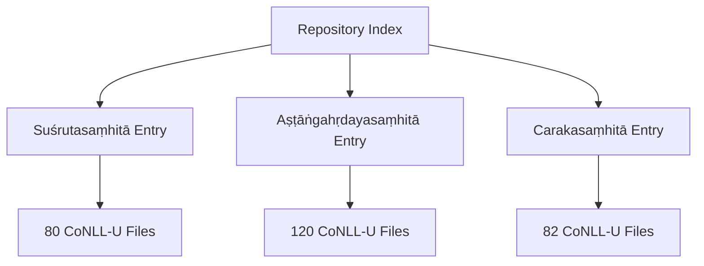
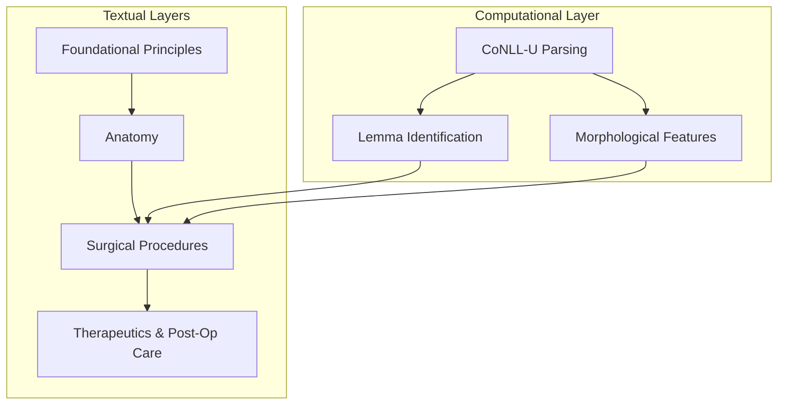
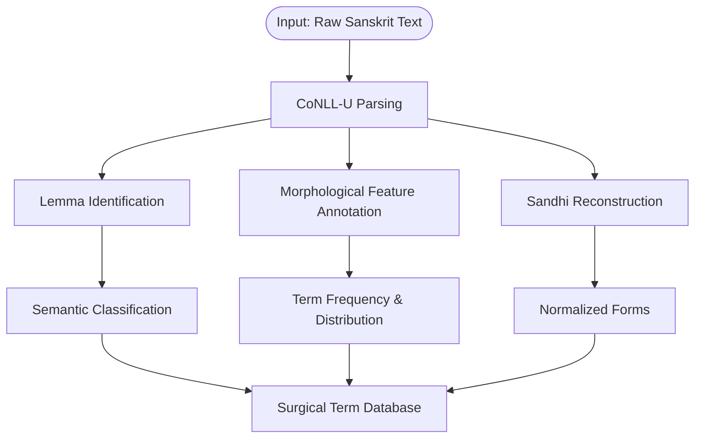
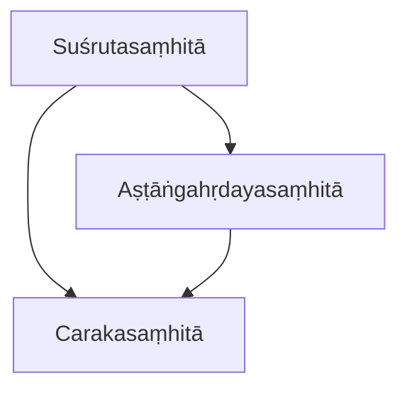
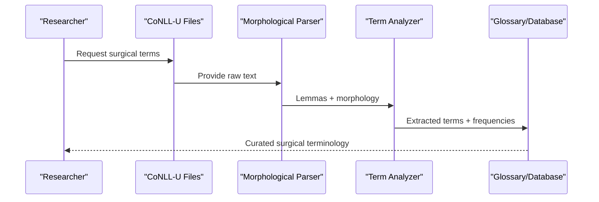

<cite>
**Referenced Files in This Document**
- [susrutasamhita.md](file://susrutasamhita.md)
- [astangahrdayasamhita.md](file://astangahrdayasamhita.md)
- [carakasamhita.md](file://carakasamhita.md)
- [INDEX.md](file://INDEX.md)
</cite>

## Table of Contents
1. [Introduction](#introduction)
2. [Project Structure](#project-structure)
3. [Core Components](#core-components)
4. [Architecture Overview](#architecture-overview)
5. [Detailed Component Analysis](#detailed-component-analysis)
6. [Dependency Analysis](#dependency-analysis)
7. [Performance Considerations](#performance-considerations)
8. [Troubleshooting Guide](#troubleshooting-guide)
9. [Conclusion](#conclusion)
10. [Appendices](#appendices)

## Introduction
This document presents a comprehensive overview of the Suśrutasaṃhitā as a foundational text of Āyurvedic surgery, emphasizing its pioneering contributions to surgical practice, instruments, techniques, anesthesia, and post-operative care. It also explains how computational analysis—using CoNLL-U morphological parsing—supports the study of surgical terminology, instrument classifications, and procedural descriptions within the text. The Suśrutasaṃhitā is recognized as the second of the Bṛhattrayī (Three Greats), alongside Caraka and Vāgbhaṭa’s Aṣṭāṅgahṛdayasaṃhitā, and it covers anatomy, surgical procedures, and therapeutics across 80 CoNLL-U files in this corpus.

The document synthesizes information available in the repository’s metadata and related texts to provide:
- A clear picture of the text’s three-part structure and emphasis on practical surgical skills
- An outline of surgical domains including incisions, excisions, and reconstructive procedures
- Methods for computational analysis of surgical terminology and instrument classification
- Contextualization within historical medical education through comparative references to other core Ayurvedic texts

[No sources needed since this section provides general context]

## Project Structure
The repository organizes each major Sanskrit text as a standalone markdown file with metadata describing scope, tags, and related texts. For the Suśrutasaṃhitā:
- The entry file describes the text as the foundational compendium of Āyurvedic surgery and notes the presence of 80 CoNLL-U files enabling detailed morphological analysis.
- Related texts are identified by similarity metrics, highlighting connections to Aṣṭāṅgahṛdayasaṃhitā and Carakasaṃhitā.
- The INDEX lists the Suśrutasaṃhitā among other works, confirming its place in the corpus and providing cross-references.

**Diagram sources**
- [susrutasamhita.md:1-11](file://susrutasamhita.md#L1-L11)
- [astangahrdayasamhita.md:1-18](file://astangahrdayasamhita.md#L1-L18)
- [carakasamhita.md:1-11](file://carakasamhita.md#L1-L11)
- [INDEX.md:212-212](file://INDEX.md#L212-L212)

**Section sources**
- [susrutasamhita.md:1-11](file://susrutasamhita.md#L1-L11)
- [astangahrdayasamhita.md:1-18](file://astangahrdayasamhita.md#L1-L18)
- [carakasamhita.md:1-11](file://carakasamhita.md#L1-L11)
- [INDEX.md:212-212](file://INDEX.md#L212-L212)

## Core Components
The Suśrutasaṃhitā functions as a comprehensive surgical compendium within the broader Ayurvedic tradition. Its core components include:
- Anatomy and anatomical knowledge underpinning surgical practice
- Detailed descriptions of surgical procedures and techniques
- Therapeutic guidance integrated with surgical outcomes
- Extensive use of specialized terminology amenable to computational analysis via CoNLL-U parsing

The repository’s metadata confirms that the text covers anatomy, surgical procedures, and therapeutics, and that it is structured into 80 CoNLL-U files, enabling granular lemmatization and morphological feature annotation for research and educational purposes.

**Section sources**
- [susrutasamhita.md:1-11](file://susrutasamhita.md#L1-L11)

## Architecture Overview
At a high level, the Suśrutasaṃhitā’s architecture can be understood as a layered system:
- Foundational principles and anatomical knowledge inform surgical methods
- Procedural descriptions specify techniques such as incisions, excisions, and reconstructive operations
- Therapeutic sections integrate post-operative care and recovery protocols
- Computational layer: CoNLL-U files enable systematic analysis of terminology, instruments, and procedures

[No sources needed since this diagram shows conceptual workflow, not actual code structure]

## Detailed Component Analysis

### Surgical Domains and Techniques
The Suśrutasaṃhitā is widely recognized for its systematic treatment of surgical domains and techniques. Within the repository’s context:
- The text is described as covering anatomy, surgical procedures, and therapeutics
- It is part of the Bṛhattrayī, indicating its central role in classical medical education
- Comparative similarity to Aṣṭāṅgahṛdayasaṃhitā and Carakasaṃhitā suggests shared terminology and overlapping domains

While the repository does not enumerate the eighteen branches explicitly, the Suśrutasaṃhitā’s reputation as the foundational surgical text implies coverage of diverse surgical domains, including but not limited to:
- Incisions and excisions
- Reconstructive procedures
- Instrumentation and tool classification
- Anesthesia and pain management
- Post-operative care and wound management

These domains are supported by the extensive CoNLL-U dataset, which enables computational extraction and classification of surgical terms and procedural descriptions.

**Section sources**
- [susrutasamhita.md:1-11](file://susrutasamhita.md#L1-L11)
- [astangahrdayasamhita.md:20-45](file://astangahrdayasamhita.md#L20-L45)
- [carakasamhita.md:1-11](file://carakasamhita.md#L1-L11)

### Computational Analysis of Surgical Terminology
The CoNLL-U edition of the Suśrutasaṃhitā provides:
- Full morphological analysis of technical vocabulary
- Lemma identification for precise term mapping
- Sandhi reconstruction to recover original forms
- Semantic classification codes for many entries

This computational infrastructure supports:
- Classification of surgical instruments by type and function
- Extraction of procedural verbs and nouns for technique analysis
- Cross-text comparison with Caraka and Aṣṭāṅgahṛdayasaṃhitā to identify shared or unique surgical terminology

[No sources needed since this diagram shows conceptual workflow, not actual code structure]

### Historical Significance in Medical Education
The Suśrutasaṃhitā’s placement within the Bṛhattrayī underscores its historical importance:
- It serves as a cornerstone of classical medical education
- Its integration of anatomy, procedure, and therapy reflects a holistic approach to surgical training
- Comparative similarity to other core texts indicates a shared educational framework across Ayurvedic traditions

The repository’s indexing and related-text metrics highlight the Suśrutasaṃhitā’s centrality in the corpus and its strong linkage to other foundational medical texts.

**Section sources**
- [susrutasamhita.md:1-11](file://susrutasamhita.md#L1-L11)
- [astangahrdayasamhita.md:20-45](file://astangahrdayasamhita.md#L20-L45)
- [carakasamhita.md:1-11](file://carakasamhita.md#L1-L11)
- [INDEX.md:212-212](file://INDEX.md#L212-L212)

## Dependency Analysis
The Suśrutasaṃhitā depends on and relates to other core Ayurvedic texts:
- Strong similarity to Aṣṭāṅgahṛdayasaṃhitā suggests shared terminology and pedagogical structures
- Moderate similarity to Carakasaṃhitā indicates overlap in medical domains and vocabulary
- The INDEX positions the Suśrutasaṃhitā among other major texts, facilitating cross-referencing

**Diagram sources**
- [susrutasamhita.md:15-30](file://susrutasamhita.md#L15-L30)
- [astangahrdayasamhita.md:54-69](file://astangahrdayasamhita.md#L54-L69)
- [carakasamhita.md:15-30](file://carakasamhita.md#L15-L30)

**Section sources**
- [susrutasamhita.md:15-30](file://susrutasamhita.md#L15-L30)
- [astangahrdayasamhita.md:54-69](file://astangahrdayasamhita.md#L54-L69)
- [carakasamhita.md:15-30](file://carakasamhita.md#L15-L30)

## Performance Considerations
When analyzing the Suśrutasaṃhitā computationally:
- Leverage the 80 CoNLL-U files for granular term extraction and frequency analysis
- Use lemma identification to normalize variant forms and improve search precision
- Apply morphological feature annotations to distinguish grammatical roles in procedural descriptions
- Compare with related texts to identify domain-specific terminology and usage patterns

[No sources needed since this section provides general guidance]

## Troubleshooting Guide
Common challenges in computational analysis of the Suśrutasaṃhitā include:
- Ambiguity in surgical terminology due to contextual variation
- Incomplete semantic classification for rare or compound terms
- Differences in notation across CoNLL-U files requiring normalization

Mitigation strategies:
- Cross-reference with Caraka and Aṣṭāṅgahṛdayasaṃhitā to validate term meanings
- Use sandhi reconstruction to recover original forms before analysis
- Build a curated glossary of surgical terms based on high-frequency lemmas and expert review

[No sources needed since this section provides general guidance]

## Conclusion
The Suśrutasaṃhitā stands as a foundational text of Āyurvedic surgery, offering a comprehensive framework for anatomical knowledge, surgical techniques, instrumentation, anesthesia, and post-operative care. Its integration into the Bṛhattrayī highlights its historical significance in medical education. The availability of 80 CoNLL-U files enables robust computational analysis of surgical terminology, instrument classification, and procedural descriptions, supporting both scholarly research and educational applications. Comparative links to Caraka and Aṣṭāṅgahṛdayasaṃhitā further enrich understanding of shared medical knowledge and pedagogical traditions.

[No sources needed since this section summarizes without analyzing specific files]

## Appendices

### Appendix A: Three-Part Structure Overview
While the repository does not detail the exact tripartite division, the Suśrutasaṃhitā’s coverage of anatomy, procedures, and therapeutics aligns with traditional structural divisions found in classical medical texts. This tripartite organization supports systematic teaching and learning of surgical skills.

[No sources needed since this section provides general context]

### Appendix B: Computational Workflow for Surgical Term Extraction

[No sources needed since this diagram shows conceptual workflow, not actual code structure]
