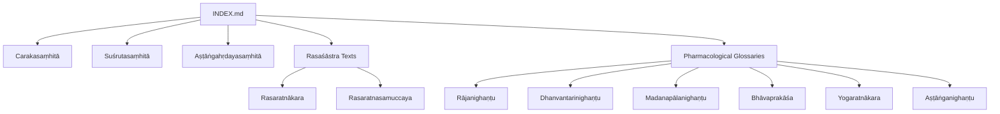
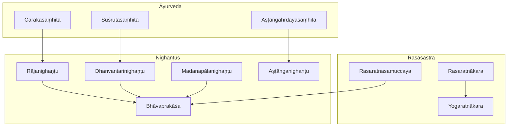
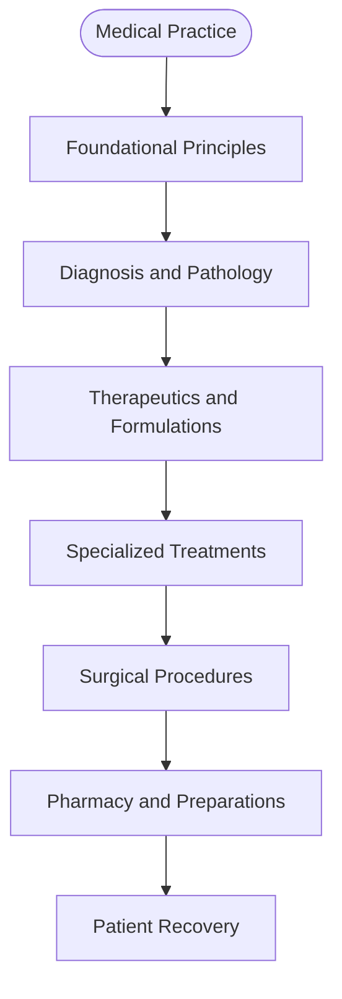
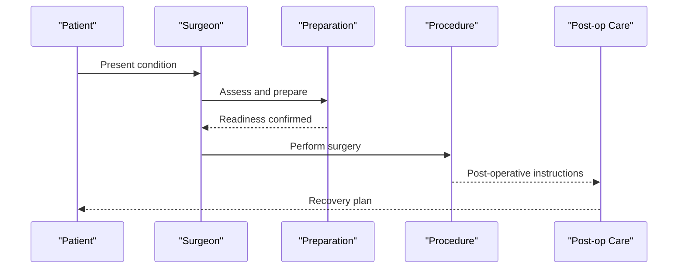
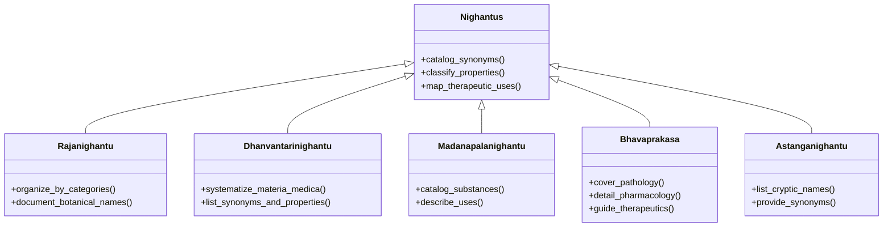
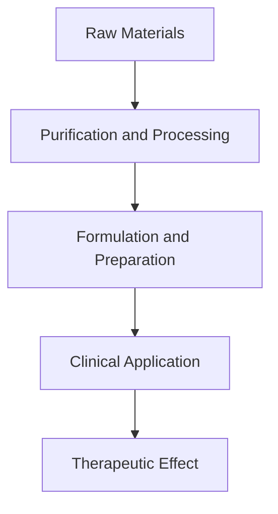
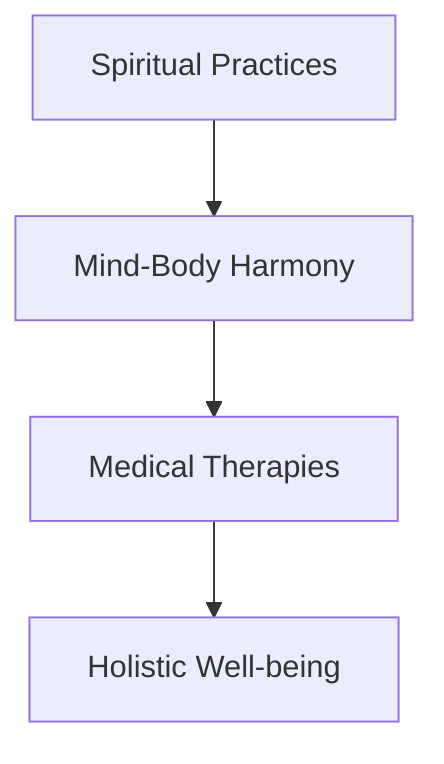
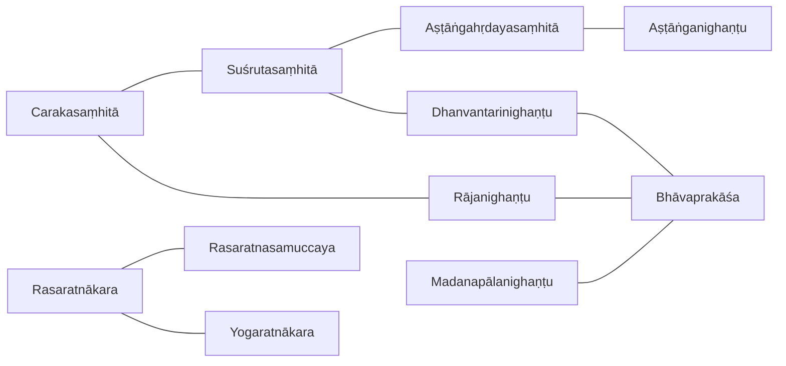

<cite>
**Referenced Files in This Document**
- [INDEX.md](file://INDEX.md)
- [carakasamhita.md](file://carakasamhita.md)
- [susrutasamhita.md](file://susrutasamhita.md)
- [astangahrdayasamhita.md](file://astangahrdayasamhita.md)
- [rasaratnakara.md](file://rasaratnakara.md)
- [rasaratnasamuccaya.md](file://rasaratnasamuccaya.md)
- [rajanighantu.md](file://rajanighantu.md)
- [dhanvantarinighantu.md](file://dhanvantarinighantu.md)
- [bhavaprakasa.md](file://bhavaprakasa.md)
- [madanapalanighantu.md](file://madanapalanighantu.md)
- [yogaratnakara.md](file://yogaratnakara.md)
- [astanganighantu.md](file://astanganighantu.md)
</cite>

## Table of Contents
1. [Introduction](#introduction)
2. [Project Structure](#project-structure)
3. [Core Components](#core-components)
4. [Architecture Overview](#architecture-overview)
5. [Detailed Component Analysis](#detailed-component-analysis)
6. [Dependency Analysis](#dependency-analysis)
7. [Performance Considerations](#performance-considerations)
8. [Troubleshooting Guide](#troubleshooting-guide)
9. [Conclusion](#conclusion)
10. [Appendices](#appendices)

## Introduction
This document provides a comprehensive overview of the medical sciences collection within the repository, focusing on Āyurvedic texts (Carakasaṃhitā, Suśrutasaṃhitā, Aṣṭāṅgahṛdayasaṃhitā), alchemical works (Rasaśāstra), and pharmacological glossaries (Nighaṇṭus). It explains the systematic approach to medicine, surgical techniques, herbal knowledge, and the integration of spiritual practices with healing. It also outlines how computational analysis can be applied to medical terminology, drug classifications, and treatment protocols across different periods of Indian medical literature using the CoNLL-U parsed editions available in this corpus.

## Project Structure
The medical sciences materials are organized as individual topic files under the 11-sanskrit knowledge bank. Each file documents a text’s scope, related texts by lemma similarity, and notable lemmas extracted from its CoNLL-U edition. The INDEX enumerates all topics and cross-references, including medical and alchemical works.

**Diagram sources**
- [INDEX.md:1-277](file://INDEX.md#L1-L277)

**Section sources**
- [INDEX.md:1-277](file://INDEX.md#L1-L277)

## Core Components
- Āyurvedic foundational texts (Bṛhattrayī): Carakasaṃhitā, Suśrutasaṃhitā, Aṣṭāṅgahṛdayasaṃhitā
- Alchemical and iatrochemical treatises (Rasaśāstra): Rasaratnākara, Rasaratnasamuccaya, Yogaratnākara
- Pharmacological glossaries (Nighaṇṭus): Rājanighaṇṭu, Dhanvantarinighaṇṭu, Madanapālanighaṇṭu, Bhāvaprakāśa, Aṣṭāṅganighaṇṭu

These components collectively cover diagnosis, therapeutics, surgery, materia medica, formulations, and the integration of spiritual practices with healing.

**Section sources**
- [carakasamhita.md:1-48](file://carakasamhita.md#L1-L48)
- [susrutasamhita.md:1-48](file://susrutasamhita.md#L1-L48)
- [astangahrdayasamhita.md:1-87](file://astangahrdayasamhita.md#L1-L87)
- [rasaratnakara.md:1-48](file://rasaratnakara.md#L1-L48)
- [rasaratnasamuccaya.md:1-58](file://rasaratnasamuccaya.md#L1-L58)
- [rajanighantu.md:1-48](file://rajanighantu.md#L1-L48)
- [dhanvantarinighantu.md:1-48](file://dhanvantarinighantu.md#L1-L48)
- [bhavaprakasa.md:1-48](file://bhavaprakasa.md#L1-L48)
- [madanapalanighantu.md:1-48](file://madanapalanighantu.md#L1-L48)
- [yogaratnakara.md:1-48](file://yogaratnakara.md#L1-L48)
- [astanganighantu.md:1-47](file://astanganighantu.md#L1-L47)

## Architecture Overview
The corpus is structured around three pillars that interrelate through shared terminology and therapeutic concepts:

- Āyurveda Pillar: Foundational theory, diagnosis, therapeutics, and specialized treatments
- Rasaśāstra Pillar: Mercury-based alchemy and iatrochemistry, mineral processing, and formulations
- Nighaṇṭu Pillar: Lexical resources cataloging medicinal substances, synonyms, and properties

**Diagram sources**
- [carakasamhita.md:1-48](file://carakasamhita.md#L1-L48)
- [susrutasamhita.md:1-48](file://susrutasamhita.md#L1-L48)
- [astangahrdayasamhita.md:1-87](file://astangahrdayasamhita.md#L1-L87)
- [rasaratnakara.md:1-48](file://rasaratnakara.md#L1-L48)
- [rasaratnasamuccaya.md:1-58](file://rasaratnasamuccaya.md#L1-L58)
- [rajanighantu.md:1-48](file://rajanighantu.md#L1-L48)
- [dhanvantarinighantu.md:1-48](file://dhanvantarinighantu.md#L1-L48)
- [bhavaprakasa.md:1-48](file://bhavaprakasa.md#L1-L48)
- [madanapalanighantu.md:1-48](file://madanapalanighantu.md#L1-L48)
- [yogaratnakara.md:1-48](file://yogaratnakara.md#L1-L48)
- [astanganighantu.md:1-47](file://astanganighantu.md#L1-L47)

## Detailed Component Analysis

### Āyurvedic Foundations: Bṛhattrayī
- Carakasaṃhitā: Foundational compendium covering medicine, diagnosis, and therapeutics; includes extensive technical vocabulary for pathology and treatment.
- Suśrutasaṃhitā: Focuses on anatomy and surgical procedures; integrates therapeutics with detailed procedural guidance.
- Aṣṭāṅgahṛdayasaṃhitā: Concise, systematically organized compendium; emphasizes eight limbs of medicine including principles, anatomy, diagnosis, therapeutics, pharmacy, and specialized treatments.

**Diagram sources**
- [astangahrdayasamhita.md:20-45](file://astangahrdayasamhita.md#L20-L45)

**Section sources**
- [carakasamhita.md:1-48](file://carakasamhita.md#L1-L48)
- [susrutasamhita.md:1-48](file://susrutasamhita.md#L1-L48)
- [astangahrdayasamhita.md:1-87](file://astangahrdayasamhita.md#L1-L87)

### Surgical Techniques: Suśrutasaṃhitā
- Emphasizes anatomical knowledge and stepwise surgical procedures.
- Integrates preoperative preparation, operative techniques, postoperative care, and therapeutic adjuncts.
- Provides detailed descriptions of instruments, incisions, and wound management.

**Diagram sources**
- [susrutasamhita.md:1-48](file://susrutasamhita.md#L1-L48)

**Section sources**
- [susrutasamhita.md:1-48](file://susrutasamhita.md#L1-L48)

### Herbal Knowledge and Pharmacology: Nighaṇṭus
- Rājanighaṇṭu: Comprehensive lexicon organizing botanical synonyms and properties by therapeutic categories.
- Dhanvantarinighaṇṭu: Systematizes botanical materia medica with synonyms and properties.
- Madanapālanighaṇṭu: Catalogues synonyms, properties, and uses of medicinal plants and substances.
- Bhāvaprakāśa: Covers pathology, pharmacology, and therapeutics; integrates clinical insights with materia medica.
- Aṣṭāṅganighaṇṭu: Lists synonyms and cryptic names of medicinal substances used in the Aṣṭāṅgasaṃgraha tradition.

**Diagram sources**
- [rajanighantu.md:1-48](file://rajanighantu.md#L1-L48)
- [dhanvantarinighantu.md:1-48](file://dhanvantarinighantu.md#L1-L48)
- [madanapalanighantu.md:1-48](file://madanapalanighantu.md#L1-L48)
- [bhavaprakasa.md:1-48](file://bhavaprakasa.md#L1-L48)
- [astanganighantu.md:1-47](file://astanganighantu.md#L1-L47)

**Section sources**
- [rajanighantu.md:1-48](file://rajanighantu.md#L1-L48)
- [dhanvantarinighantu.md:1-48](file://dhanvantarinighantu.md#L1-L48)
- [madanapalanighantu.md:1-48](file://madanapalanighantu.md#L1-L48)
- [bhavaprakasa.md:1-48](file://bhavaprakasa.md#L1-L48)
- [astanganighantu.md:1-47](file://astanganighantu.md#L1-L47)

### Alchemical Works: Rasaśāstra
- Rasaratnākara: Comprehensive treatise covering mercury, minerals, and medicinal formulations; integrates iatrochemistry with therapeutic applications.
- Rasaratnasamuccaya: 13th-century text focused on mercury-based alchemy and iatrochemistry; details processes and preparations.
- Yogaratnākara: Integrates yoga, alchemy, and medicine; bridges spiritual practices with therapeutic outcomes.

**Diagram sources**
- [rasaratnakara.md:1-48](file://rasaratnakara.md#L1-L48)
- [rasaratnasamuccaya.md:1-58](file://rasaratnasamuccaya.md#L1-L58)
- [yogaratnakara.md:1-48](file://yogaratnakara.md#L1-L48)

**Section sources**
- [rasaratnakara.md:1-48](file://rasaratnakara.md#L1-L48)
- [rasaratnasamuccaya.md:1-58](file://rasaratnasamuccaya.md#L1-L58)
- [yogaratnakara.md:1-48](file://yogaratnakara.md#L1-L48)

### Integration of Spiritual Practices with Healing
- Yoga and Āyurveda: Yogaratnākara demonstrates integration of yogic practices with medical therapies.
- Ritual and Mantra: Many texts incorporate spiritual elements alongside physical treatments, reflecting holistic healing paradigms.
- Ethical and Philosophical Foundations: Āyurveda’s purpose often invokes ethical and spiritual goals, aligning health with dharma and well-being.

[No sources needed since this diagram shows conceptual workflow, not actual code structure]

## Dependency Analysis
The texts exhibit strong lexical and thematic dependencies, reflected in lemma similarity metrics and shared terminology:

- Āyurvedic texts share high similarity with each other and with nighaṇṭus due to common medical vocabulary.
- Rasaśāstra texts show strong internal cohesion and overlap with nighaṇṭus for substance classification.
- Nighaṇṭus serve as reference points for both Āyurveda and Rasaśāstra, providing standardized terminology.

**Diagram sources**
- [carakasamhita.md:15-30](file://carakasamhita.md#L15-L30)
- [susrutasamhita.md:15-30](file://susrutasamhita.md#L15-L30)
- [astangahrdayasamhita.md:54-69](file://astangahrdayasamhita.md#L54-L69)
- [rasaratnakara.md:15-30](file://rasaratnakara.md#L15-L30)
- [rasaratnasamuccaya.md:15-30](file://rasaratnasamuccaya.md#L15-L30)
- [rajanighantu.md:15-30](file://rajanighantu.md#L15-L30)
- [dhanvantarinighantu.md:15-30](file://dhanvantarinighantu.md#L15-L30)
- [bhavaprakasa.md:15-30](file://bhavaprakasa.md#L15-L30)
- [madanapalanighantu.md:15-30](file://madanapalanighantu.md#L15-L30)
- [yogaratnakara.md:15-30](file://yogaratnakara.md#L15-L30)
- [astanganighantu.md:25-41](file://astanganighantu.md#L25-L41)

**Section sources**
- [carakasamhita.md:15-30](file://carakasamhita.md#L15-L30)
- [susrutasamhita.md:15-30](file://susrutasamhita.md#L15-L30)
- [astangahrdayasamhita.md:54-69](file://astangahrdayasamhita.md#L54-L69)
- [rasaratnakara.md:15-30](file://rasaratnakara.md#L15-L30)
- [rasaratnasamuccaya.md:15-30](file://rasaratnasamuccaya.md#L15-L30)
- [rajanighantu.md:15-30](file://rajanighantu.md#L15-L30)
- [dhanvantarinighantu.md:15-30](file://dhanvantarinighantu.md#L15-L30)
- [bhavaprakasa.md:15-30](file://bhavaprakasa.md#L15-L30)
- [madanapalanighantu.md:15-30](file://madanapalanighantu.md#L15-L30)
- [yogaratnakara.md:15-30](file://yogaratnakara.md#L15-L30)
- [astanganighantu.md:25-41](file://astanganighantu.md#L25-L41)

## Performance Considerations
- Corpus Size: Large CoNLL-U editions enable robust statistical analysis but require efficient indexing and querying strategies.
- Vocabulary Complexity: Technical Sanskrit demands precise tokenization and morphological analysis to capture domain-specific terms.
- Cross-Text Similarity: TF-IDF cosine similarity helps identify thematic clusters and supports comparative studies across periods and genres.
- Resource Constraints: Processing hundreds of thousands of lines requires scalable pipelines for parsing, normalization, and retrieval.

[No sources needed since this section provides general guidance]

## Troubleshooting Guide
- Terminology Ambiguity: Use concordance indices and lemma mappings to resolve polysemy in medical and alchemical contexts.
- Inconsistent Naming: Cross-reference nighaṇṭus to standardize plant and substance names across texts.
- Data Quality: Validate CoNLL-U annotations for morphological accuracy, especially for rare or compound terms.
- Contextual Gaps: Supplement computational findings with scholarly commentaries and historical context.

**Section sources**
- [astanganighantu.md:25-41](file://astanganighantu.md#L25-L41)
- [INDEX.md:270-277](file://INDEX.md#L270-L277)

## Conclusion
The medical sciences collection offers a rich, computationally accessible corpus spanning Āyurveda, Rasaśāstra, and pharmacological glossaries. By leveraging CoNLL-U editions and computational methods, researchers can analyze medical terminology, classify drugs, trace treatment protocols, and explore the integration of spiritual practices with healing across historical periods. The structured organization and cross-referencing capabilities of this repository support both traditional scholarship and modern digital humanities approaches.

[No sources needed since this section summarizes without analyzing specific files]

## Appendices

### Computational Analysis Framework
- Lemma Extraction: Identify frequent and domain-specific lemmas to map core concepts.
- Similarity Clustering: Use TF-IDF cosine similarity to group related texts and identify thematic overlaps.
- Concordance Search: Leverage lemma indices to locate usage patterns and contextual meanings.
- Cross-Reference Mapping: Connect nighaṇṭus with primary texts to build ontologies of substances and therapies.

[No sources needed since this section provides general guidance]
