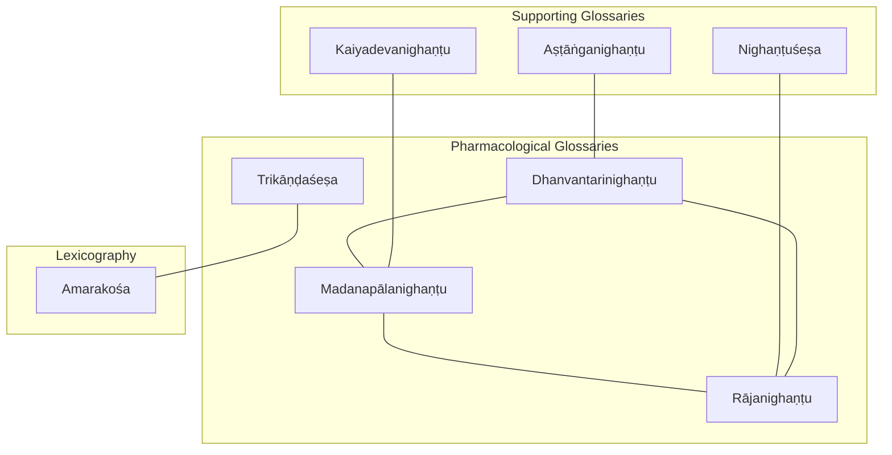
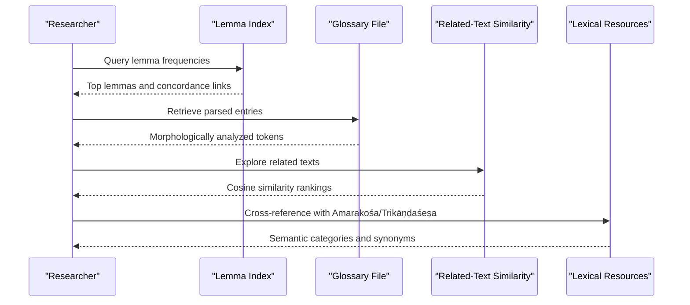
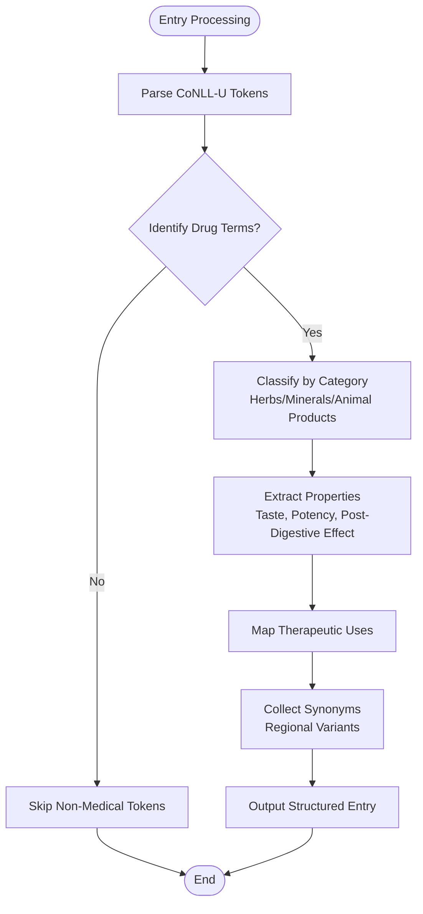
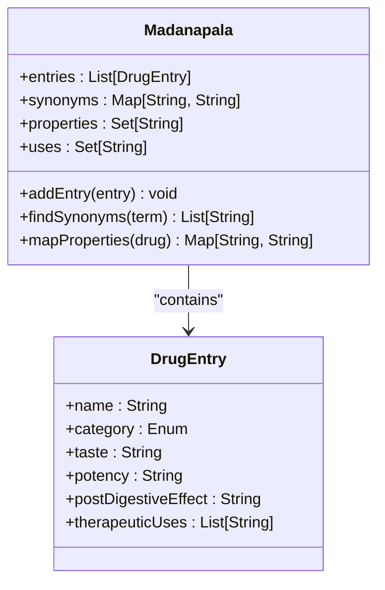
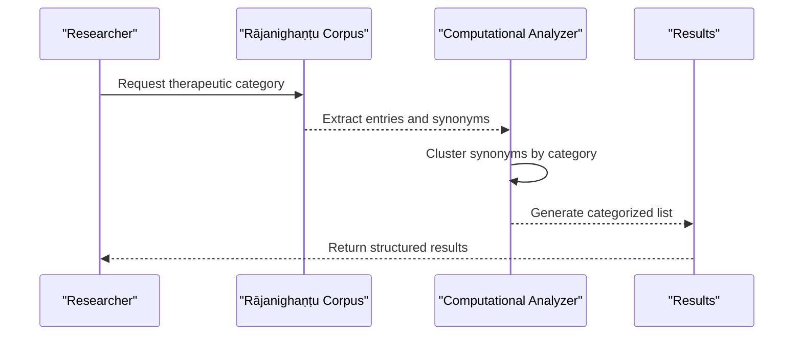
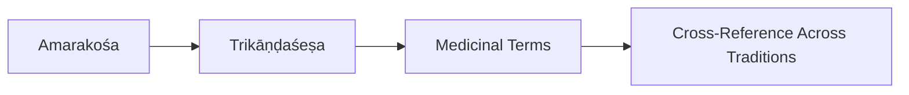
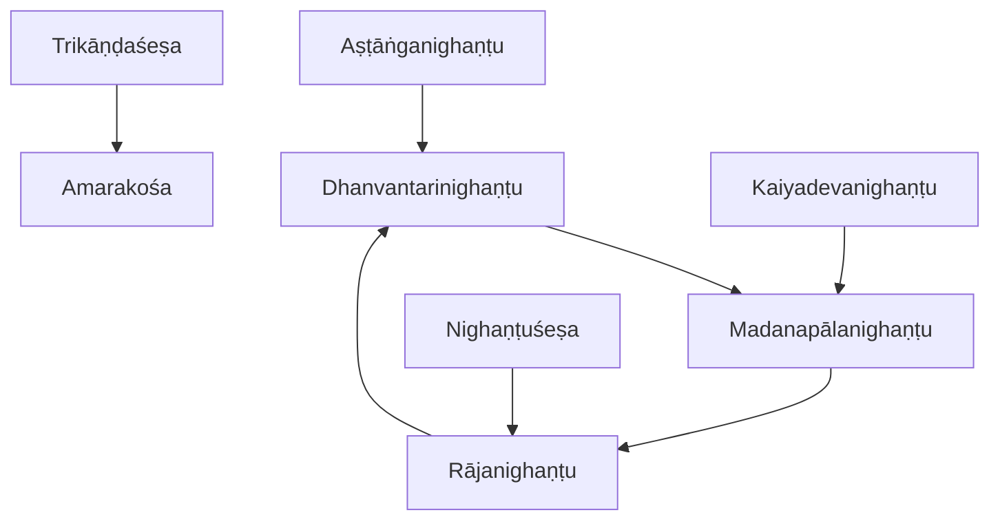
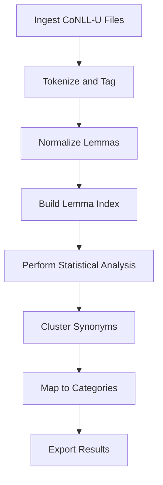

<cite>
**Referenced Files in This Document**
- [dhanvantarinighantu.md](file://dhanvantarinighantu.md)
- [madanapalanighantu.md](file://madanapalanighantu.md)
- [rajanighantu.md](file://rajanighantu.md)
- [trikandasesa.md](file://trikandasesa.md)
- [astanganighantu.md](file://astanganighantu.md)
- [kaiyadevanighantu.md](file://kaiyadevanighantu.md)
- [nighantusesa.md](file://nighantusesa.md)
- [amarakosa.md](file://amarakosa.md)
- [INDEX.md](file://INDEX.md)
</cite>

## Table of Contents
1. Introduction
2. Project Structure
3. Core Components
4. Architecture Overview
5. Detailed Component Analysis
6. Dependency Analysis
7. Performance Considerations
8. Troubleshooting Guide
9. Conclusion
10. Appendices

## Introduction
This document provides comprehensive documentation for the pharmacological glossaries (nighaṇṭus) Dhanvantarinighaṇṭu, Madanapālanighaṇṭu, Rājanighaṇṭu, and Trikāṇḍaśeṣa as represented in the repository. It explains how these texts systematically classify herbs, minerals, and animal products; describe their properties and therapeutic uses; and capture regional variations through synonymy. It also outlines computational approaches to drug nomenclature, botanical identification, and cross-referencing across different pharmacological traditions using CoNLL-U parsed editions and lexicographical methods.

## Project Structure
The repository organizes each text as a concept file with metadata, related-text similarity tables, and notable lemma indices. The four target glossaries are:
- Dhanvantarinighaṇṭu: an Āyurvedic glossary of medicinal plants with synonyms and properties
- Madanapālanighaṇṭu: an Āyurvedic lexicon cataloguing synonyms, properties, and uses
- Rājanighaṇṭu: a comprehensive Āyurvedic lexicon organizing botanical synonyms and properties by therapeutic categories
- Trikāṇḍaśeṣa: a Sanskrit thesaurus supplementing Amarakośa with additional lexical entries

Additional supporting glossaries include Aṣṭāṅganighaṇṭu, Kaiyadevanighaṇṭu, and Nighaṇṭuśeṣa, which extend the materia medica coverage.

**Diagram sources**
- [dhanvantarinighantu.md:1-48](file://dhanvantarinighantu.md#L1-L48)
- [madanapalanighantu.md:1-48](file://madanapalanighantu.md#L1-L48)
- [rajanighantu.md:1-48](file://rajanighantu.md#L1-L48)
- [trikandasesa.md:1-12](file://trikandasesa.md#L1-L12)
- [astanganighantu.md:1-47](file://astanganighantu.md#L1-L47)
- [kaiyadevanighantu.md:1-48](file://kaiyadevanighantu.md#L1-L48)
- [nighantusesa.md:1-48](file://nighantusesa.md#L1-L48)
- [amarakosa.md:1-72](file://amarakosa.md#L1-L72)

**Section sources**
- [dhanvantarinighantu.md:1-48](file://dhanvantarinighantu.md#L1-L48)
- [madanapalanighantu.md:1-48](file://madanapalanighantu.md#L1-L48)
- [rajanighantu.md:1-48](file://rajanighantu.md#L1-L48)
- [trikandasesa.md:1-12](file://trikandasesa.md#L1-L12)
- [astanganighantu.md:1-47](file://astanganighantu.md#L1-L47)
- [kaiyadevanighantu.md:1-48](file://kaiyadevanighantu.md#L1-L48)
- [nighantusesa.md:1-48](file://nighantusesa.md#L1-L48)
- [amarakosa.md:1-72](file://amarakosa.md#L1-L72)
- [INDEX.md:1-277](file://INDEX.md#L1-L277)

## Core Components
- Dhanvantarinighaṇṭu: An Āyurvedic glossary focusing on medicinal plants, listing synonyms and properties; frequently used lemmas include terms for taste and dosha modifiers such as bitter and hot, indicating emphasis on pharmacodynamics.
- Madanapālanighaṇṭu: A 14th-century lexicon that catalogs synonyms, properties, and uses; frequent lemmas highlight doshic terminology and plant-related terms, reflecting systematic classification.
- Rājanighaṇṭu: A comprehensive lexicon organized by therapeutic categories; high-frequency lemmas include connectors and dosha/taste descriptors, evidencing structured categorization of botanical synonyms and properties.
- Trikāṇḍaśeṣa: A thesaurus supplementing Amarakośa; while not exclusively pharmacological, it contributes lexical entries relevant to medicinal vocabulary and supports cross-referencing across traditions.

These components collectively enable:
- Systematic classification of herbs, minerals, and animal products
- Documentation of properties (taste, potency, post-digestive effect) and therapeutic uses
- Capture of regional variations via synonym clusters
- Cross-referencing between Ayurvedic and general lexicographical traditions

**Section sources**
- [dhanvantarinighantu.md:1-48](file://dhanvantarinighantu.md#L1-L48)
- [madanapalanighantu.md:1-48](file://madanapalanighantu.md#L1-L48)
- [rajanighantu.md:1-48](file://rajanighantu.md#L1-L48)
- [trikandasesa.md:1-12](file://trikandasesa.md#L1-L12)

## Architecture Overview
The architecture centers on CoNLL-U parsed editions of each glossary, enabling computational analysis of lemmas, morphological features, and semantic relationships. Related-text similarity tables provide cross-references among texts, while lemma frequency indices support quantitative profiling of pharmacological vocabulary.

**Diagram sources**
- [dhanvantarinighantu.md:1-48](file://dhanvantarinighantu.md#L1-L48)
- [rajanighantu.md:1-48](file://rajanighantu.md#L1-L48)
- [amarakosa.md:1-72](file://amarakosa.md#L1-L72)

## Detailed Component Analysis

### Dhanvantarinighaṇṭu
- Purpose: Āyurvedic glossary of medicinal plants with synonyms and properties
- Classification approach: Emphasizes botanical materia medica; lemmas indicate focus on taste and dosha modifiers
- Regional variation: Captured via synonym clusters within entries
- Computational utility: CoNLL-U parsing enables lemma indexing and concordance exploration

**Diagram sources**
- [dhanvantarinighantu.md:1-48](file://dhanvantarinighantu.md#L1-L48)

**Section sources**
- [dhanvantarinighantu.md:1-48](file://dhanvantarinighantu.md#L1-L48)

### Madanapālanighaṇṭu
- Purpose: Lexicon cataloguing synonyms, properties, and uses of medicinal substances
- Classification approach: Organized entries with frequent dosha and taste lemmas, indicating systematic pharmacodynamic mapping
- Regional variation: Synonym-rich entries reflect local naming conventions
- Computational utility: High lemma frequency data supports comparative analysis across glossaries

**Diagram sources**
- [madanapalanighantu.md:1-48](file://madanapalanighantu.md#L1-L48)

**Section sources**
- [madanapalanighantu.md:1-48](file://madanapalanighantu.md#L1-L48)

### Rājanighaṇṭu
- Purpose: Comprehensive lexicon organizing botanical synonyms and properties by therapeutic categories
- Classification approach: Therapeutic categorization facilitates cross-referencing and targeted retrieval
- Regional variation: Extensive synonym sets capture diverse regional names
- Computational utility: Large corpus (35 CoNLL-U files) enables robust statistical analysis and clustering

**Diagram sources**
- [rajanighantu.md:1-48](file://rajanighantu.md#L1-L48)

**Section sources**
- [rajanighantu.md:1-48](file://rajanighantu.md#L1-L48)

### Trikāṇḍaśeṣa
- Purpose: Thesaurus supplementing Amarakośa with additional lexical entries
- Role in pharmacology: Provides broader lexical context and cross-references for medicinal terms beyond strict Ayurvedic scope
- Integration: Supports lexicographical methods by expanding synonym networks and semantic categories

**Diagram sources**
- [trikandasesa.md:1-12](file://trikandasesa.md#L1-L12)
- [amarakosa.md:1-72](file://amarakosa.md#L1-L72)

**Section sources**
- [trikandasesa.md:1-12](file://trikandasesa.md#L1-L12)
- [amarakosa.md:1-72](file://amarakosa.md#L1-L72)

### Supporting Glossaries
- Aṣṭāṅganighaṇṭu: Catalogues synonyms and cryptic names of dravyas (plants, minerals, animal products), enhancing materia medica coverage
- Kaiyadevanighaṇṭu: Focuses on grain category (dhanya-varga) lexicon, contributing to dietary and medicinal substance classification
- Nighaṇṭuśeṣa: Supplements main nighaṇṭu tradition with additional botanical and pharmacological synonyms

**Section sources**
- [astanganighantu.md:1-47](file://astanganighantu.md#L1-L47)
- [kaiyadevanighantu.md:1-48](file://kaiyadevanighantu.md#L1-L48)
- [nighantusesa.md:1-48](file://nighantusesa.md#L1-L48)

## Dependency Analysis
The glossaries exhibit strong intertextual dependencies through shared lemmas and thematic overlap:
- Dhanvantarinighaṇṭu and Madanapālanighaṇṭu show high similarity, indicating common pharmacological vocabulary
- Rājanighaṇṭu connects closely with both, reflecting its comprehensive nature
- Trikāṇḍaśeṣa integrates with Amarakośa, extending lexical coverage

**Diagram sources**
- [dhanvantarinighantu.md:1-48](file://dhanvantarinighantu.md#L1-L48)
- [madanapalanighantu.md:1-48](file://madanapalanighantu.md#L1-L48)
- [rajanighantu.md:1-48](file://rajanighantu.md#L1-L48)
- [trikandasesa.md:1-12](file://trikandasesa.md#L1-L12)
- [amarakosa.md:1-72](file://amarakosa.md#L1-L72)
- [astanganighantu.md:1-47](file://astanganighantu.md#L1-L47)
- [kaiyadevanighantu.md:1-48](file://kaiyadevanighantu.md#L1-L48)
- [nighantusesa.md:1-48](file://nighantusesa.md#L1-L48)

**Section sources**
- [dhanvantarinighantu.md:1-48](file://dhanvantarinighantu.md#L1-L48)
- [madanapalanighantu.md:1-48](file://madanapalanighantu.md#L1-L48)
- [rajanighantu.md:1-48](file://rajanighantu.md#L1-L48)
- [trikandasesa.md:1-12](file://trikandasesa.md#L1-L12)
- [amarakosa.md:1-72](file://amarakosa.md#L1-L72)

## Performance Considerations
- Corpus size: Rājanighaṇṭu’s large number of CoNLL-U files enables detailed analysis but requires efficient indexing
- Lemma frequency: High-frequency connectors and pharmacological terms necessitate filtering strategies for meaningful insights
- Cross-referencing: Leveraging related-text similarity tables improves retrieval efficiency across glossaries
- Parsing quality: CoNLL-U morphological analysis ensures accurate token-level processing for downstream tasks

[No sources needed since this section provides general guidance]

## Troubleshooting Guide
Common issues and resolutions:
- Ambiguous drug names: Use synonym clusters from multiple glossaries to disambiguate
- Missing properties: Cross-check with supporting glossaries like Aṣṭāṅganighaṇṭu or Nighaṇṭuśeṣa
- Regional variants: Consult Trikāṇḍaśeṣa and Amarakośa for broader lexical coverage
- Data consistency: Validate entries against lemma indices and concordance links

**Section sources**
- [astanganighantu.md:1-47](file://astanganighantu.md#L1-L47)
- [nighantusesa.md:1-48](file://nighantusesa.md#L1-L48)
- [amarakosa.md:1-72](file://amarakosa.md#L1-L72)

## Conclusion
The pharmacological glossaries in this repository provide a rich foundation for studying traditional Indian materia medica. Through systematic classification, property documentation, and synonym capture, they enable both scholarly research and computational analysis. The integration of CoNLL-U parsing, lemma indices, and related-text similarity supports robust cross-referencing across Ayurvedic and lexicographical traditions, facilitating modern applications in botanical identification and drug nomenclature.

[No sources needed since this section summarizes without analyzing specific files]

## Appendices

### Appendix A: Computational Analysis Workflow

[No sources needed since this diagram shows conceptual workflow, not actual code structure]

### Appendix B: Cross-Referencing Strategy
- Use related-text similarity tables to identify overlapping vocabulary
- Leverage lemma indices to trace term usage across glossaries
- Integrate Amarakośa and Trikāṇḍaśeṣa for broader lexical context
- Validate findings with supporting glossaries for completeness

**Section sources**
- [INDEX.md:1-277](file://INDEX.md#L1-L277)
