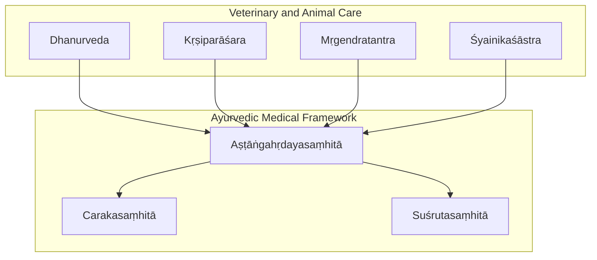
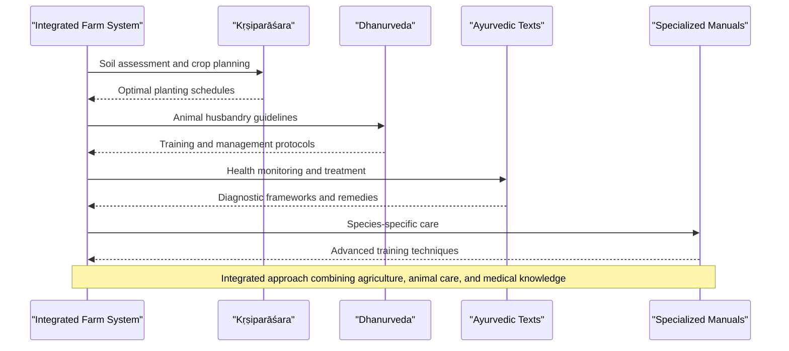
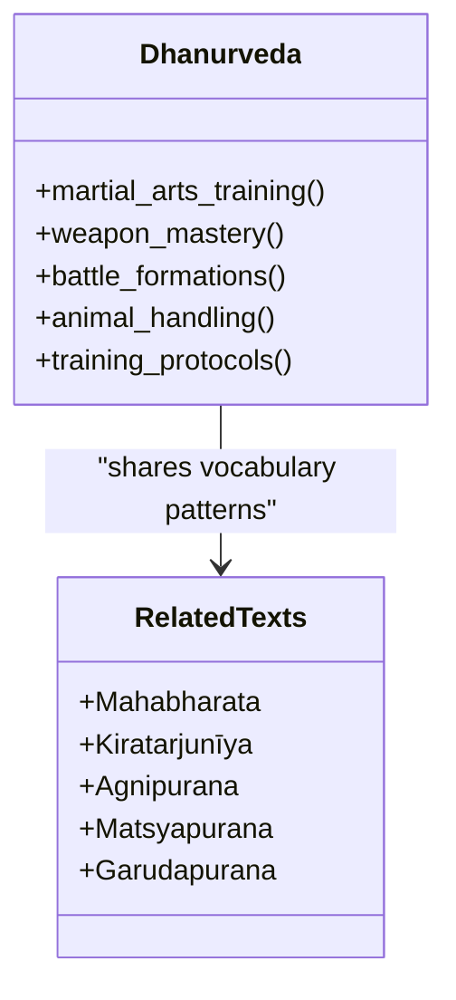
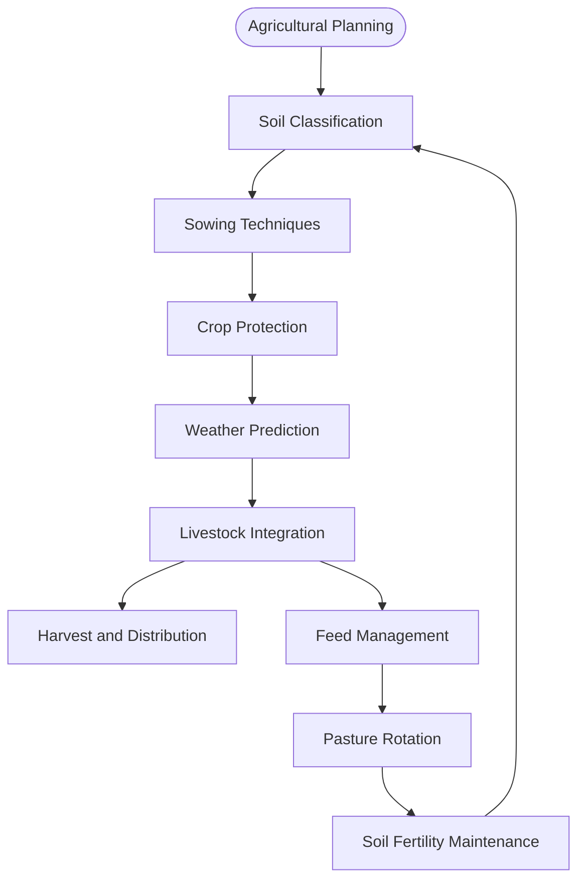
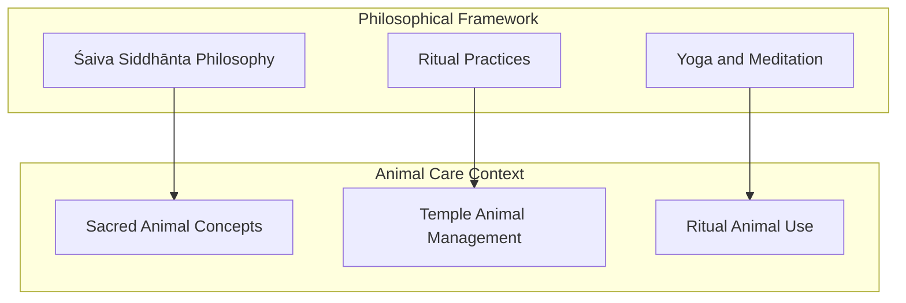
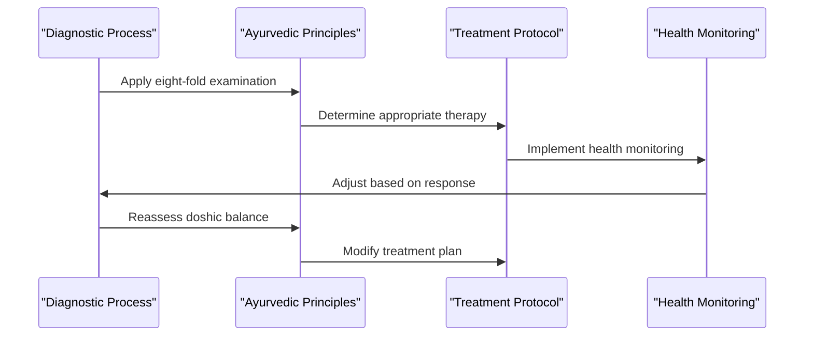
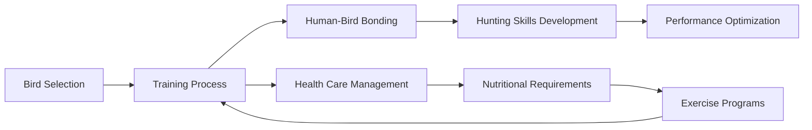
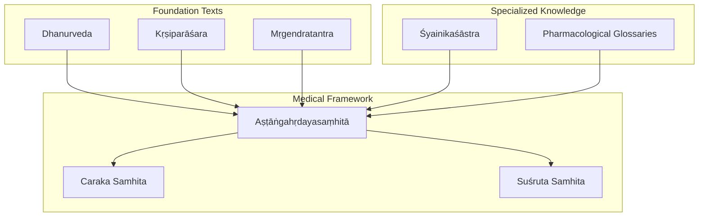

<cite>
**Referenced Files in This Document**
- [dhanurveda.md](file://dhanurveda.md)
- [krsiparasara.md](file://krsiparasara.md)
- [mrgendratantra.md](file://mrgendratantra.md)
- [INDEX.md](file://INDEX.md)
- [astangahrdayasamhita.md](file://astangahrdayasamhita.md)
- [carakasamhita.md](file://carakasamhita.md)
- [susrutasamhita.md](file://susrutasamhita.md)
- [syainikasastra.md](file://syainikasastra.md)
</cite>

## Table of Contents
1. [Introduction](#introduction)
2. [Project Structure](#project-structure)
3. [Core Components](#core-components)
4. [Architecture Overview](#architecture-overview)
5. [Detailed Component Analysis](#detailed-component-analysis)
6. [Dependency Analysis](#dependency-analysis)
7. [Performance Considerations](#performance-considerations)
8. [Troubleshooting Guide](#troubleshooting-guide)
9. [Conclusion](#conclusion)
10. [Appendices](#appendices)

## Introduction
This document provides a comprehensive overview of classical Indian veterinary and animal-care traditions as represented in the repository, focusing on Dhanurveda, Kṛṣiparāsara, and Mṛgendratantra. It explains how these texts contribute to systematic animal husbandry, veterinary diagnosis, treatment protocols for domestic and wild animals, and the integration of agriculture with animal care. It also outlines computational approaches to analyzing veterinary terminology, species-specific treatments, and the relationship between human and veterinary medicine in classical Indian traditions.

## Project Structure
The repository organizes Sanskrit texts by topic with metadata files that describe each text’s scope, sources, and related works. For veterinary and animal-related domains:
- Dhanurveda is cataloged as an upaveda focused on archery and military science, but it belongs to the broader tradition of practical sciences including animal management and martial training.
- Kṛṣiparāsara covers agriculture, soil classification, sowing, crop protection, and weather prediction—foundational knowledge for integrated farming systems where livestock and crops are managed together.
- Mṛgendratantra is a Śaiva Siddhānta Āgama covering philosophy, ritual, yoga, and the nature of the soul; while not a veterinary manual per se, it reflects cultural and philosophical contexts that influenced traditional practices around animals and their care.
- The INDEX provides cross-references to Ayurvedic medical texts (Caraka, Suśruta, Vāgbhaṭa), which contain diagnostic frameworks and pharmacological resources applicable to both human and veterinary medicine.
- Śyainikaśāstra documents falconry techniques, representing specialized animal handling and training practices.

**Diagram sources**
- [dhanurveda.md:1-11](file://dhanurveda.md#L1-L11)
- [krsiparasara.md:1-11](file://krsiparasara.md#L1-L11)
- [mrgendratantra.md:1-11](file://mrgendratantra.md#L1-L11)
- [syainikasastra.md:1-11](file://syainikasastra.md#L1-L11)
- [astangahrdayasamhita.md:1-16](file://astangahrdayasamhita.md#L1-L16)
- [carakasamhita.md:1-11](file://carakasamhita.md#L1-L11)
- [susrutasamhita.md:1-11](file://susrutasamhita.md#L1-L11)

**Section sources**
- [dhanurveda.md:1-11](file://dhanurveda.md#L1-L11)
- [krsiparasara.md:1-11](file://krsiparasara.md#L1-L11)
- [mrgendratantra.md:1-11](file://mrgendratantra.md#L1-L11)
- [INDEX.md:67-142](file://INDEX.md#L67-L142)
- [syainikasastra.md:1-11](file://syainikasastra.md#L1-L11)

## Core Components
- Dhanurveda: As an upaveda, it encompasses martial arts, weaponry, and training methodologies that historically included animal handling and management within broader societal practices. Its lemma analysis reveals frequent terms related to weapons and combat, indicating its primary focus on martial disciplines.
- Kṛṣiparāsara: Provides foundational agricultural knowledge including soil classification, sowing techniques, crop protection, and weather prediction—essential for integrated farming systems where livestock and crops are managed together.
- Mṛgendratantra: A Śaiva Siddhānta text that, while primarily philosophical and ritualistic, offers cultural context for understanding traditional attitudes toward animals and their role in spiritual practices.
- Ayurvedic Texts: Caraka Samhita, Suśruta Samhita, and Aṣṭāṅgahṛdayasaṃhitā provide diagnostic frameworks, therapeutic principles, and pharmacological resources that can be adapted for veterinary applications.
- Śyainikaśāstra: Documents specialized animal training techniques, particularly for birds of prey, demonstrating sophisticated understanding of animal behavior and training methods.

**Section sources**
- [dhanurveda.md:1-11](file://dhanurveda.md#L1-L11)
- [krsiparasara.md:1-11](file://krsiparasara.md#L1-L11)
- [mrgendratantra.md:1-11](file://mrgendratantra.md#L1-L11)
- [astangahrdayasamhita.md:20-45](file://astangahrdayasamhita.md#L20-L45)
- [carakasamhita.md:1-11](file://carakasamhita.md#L1-L11)
- [susrutasamhita.md:1-11](file://susrutasamhita.md#L1-L11)
- [syainikasastra.md:1-11](file://syainikasastra.md#L1-L11)

## Architecture Overview
The veterinary medicine framework in this repository integrates multiple textual traditions to create a comprehensive approach to animal care:

**Diagram sources**
- [krsiparasara.md:1-11](file://krsiparasara.md#L1-L11)
- [dhanurveda.md:1-11](file://dhanurveda.md#L1-L11)
- [astangahrdayasamhita.md:20-45](file://astangahrdayasamhita.md#L20-L45)
- [syainikasastra.md:1-11](file://syainikasastra.md#L1-L11)

## Detailed Component Analysis

### Dhanurveda: Martial and Animal Management Traditions
Dhanurveda represents the upaveda tradition encompassing martial arts, weaponry, and training methodologies. While primarily focused on military science, it contains elements relevant to animal handling and management within the broader context of ancient Indian practical knowledge.

**Diagram sources**
- [dhanurveda.md:15-30](file://dhanurveda.md#L15-L30)

**Section sources**
- [dhanurveda.md:1-58](file://dhanurveda.md#L1-L58)

### Kṛṣiparāsara: Agricultural Integration with Animal Husbandry
Kṛṣiparāsara provides essential agricultural knowledge that forms the foundation for integrated farming systems where livestock and crops are managed together.

**Diagram sources**
- [krsiparasara.md:1-11](file://krsiparasara.md#L1-L11)

**Section sources**
- [krsiparasara.md:1-11](file://krsiparasara.md#L1-L11)

### Mṛgendratantra: Cultural Context for Animal Care
Mṛgendratantra, as a Śaiva Siddhānta Āgama, provides cultural and philosophical context that influenced traditional attitudes toward animals and their care within religious and social practices.

**Diagram sources**
- [mrgendratantra.md:1-11](file://mrgendratantra.md#L1-L11)

**Section sources**
- [mrgendratantra.md:1-48](file://mrgendratantra.md#L1-L48)

### Ayurvedic Medical Framework for Veterinary Applications
The Ayurvedic texts provide diagnostic frameworks and therapeutic principles that can be adapted for veterinary medicine.

**Diagram sources**
- [astangahrdayasamhita.md:32-45](file://astangahrdayasamhita.md#L32-L45)
- [carakasamhita.md:1-11](file://carakasamhita.md#L1-L11)
- [susrutasamhita.md:1-11](file://susrutasamhita.md#L1-L11)

**Section sources**
- [astangahrdayasamhita.md:20-69](file://astangahrdayasamhita.md#L20-L69)
- [carakasamhita.md:1-30](file://carakasamhita.md#L1-L30)
- [susrutasamhita.md:1-30](file://susrutasamhita.md#L1-L30)

### Śyainikaśāstra: Specialized Animal Training
Śyainikaśāstra documents sophisticated techniques for training birds of prey, demonstrating advanced understanding of animal behavior and training methodologies.

**Diagram sources**
- [syainikasastra.md:1-11](file://syainikasastra.md#L1-L11)

**Section sources**
- [syainikasastra.md:1-11](file://syainikasastra.md#L1-L11)

## Dependency Analysis
The veterinary medicine framework demonstrates interconnected dependencies between different textual traditions:

**Diagram sources**
- [INDEX.md:67-142](file://INDEX.md#L67-L142)
- [astangahrdayasamhita.md:54-69](file://astangahrdayasamhita.md#L54-L69)

**Section sources**
- [INDEX.md:67-142](file://INDEX.md#L67-L142)
- [astangahrdayasamhita.md:54-69](file://astangahrdayasamhita.md#L54-L69)

## Performance Considerations
When applying computational analysis to veterinary terminology across these texts, consider:
- Lexical similarity patterns between martial and veterinary terminology
- Cross-referencing agricultural and animal care vocabulary
- Integration of philosophical concepts with practical animal management
- Comparative analysis of diagnostic terminology across human and veterinary contexts

## Troubleshooting Guide
Common challenges in analyzing veterinary medicine texts include:
- Distinguishing between literal and metaphorical uses of animal-related terminology
- Identifying species-specific treatment protocols within general medical texts
- Integrating cultural and philosophical contexts with practical veterinary knowledge
- Managing the complexity of cross-referencing between different textual traditions

## Conclusion
The repository provides a rich foundation for understanding classical Indian veterinary medicine through the integration of Dhanurveda, Kṛṣiparāsara, and Mṛgendratantra with Ayurvedic medical frameworks. This multi-textual approach enables comprehensive analysis of animal husbandry practices, veterinary diagnosis, treatment protocols, and the cultural contexts that shaped traditional veterinary knowledge.

## Appendices

### Computational Analysis Framework
For analyzing veterinary terminology across these texts:
- Use TF-IDF similarity to identify shared vocabulary patterns
- Map diagnostic terminology from Ayurvedic texts to veterinary applications
- Track agricultural-animal care integration through keyword co-occurrence analysis
- Analyze cultural references to animals in philosophical texts

### Species-Specific Treatment Protocols
Based on the available texts, treatment approaches can be categorized as:
- General veterinary principles derived from Ayurvedic frameworks
- Specialized training techniques documented in Śyainikaśāstra
- Integrated farming practices from Kṛṣiparāsara
- Cultural and ritual considerations from Mṛgendratantra

**Section sources**
- [dhanurveda.md:31-58](file://dhanurveda.md#L31-L58)
- [mrgendratantra.md:31-48](file://mrgendratantra.md#L31-L48)
- [astangahrdayasamhita.md:54-69](file://astangahrdayasamhita.md#L54-L69)
