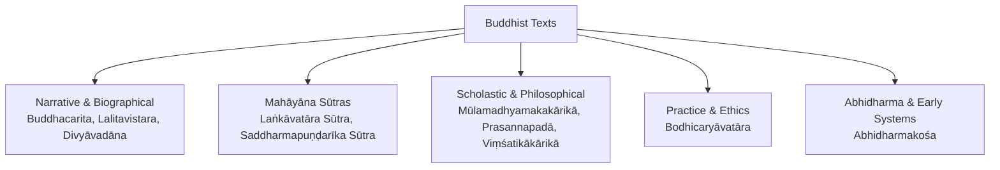
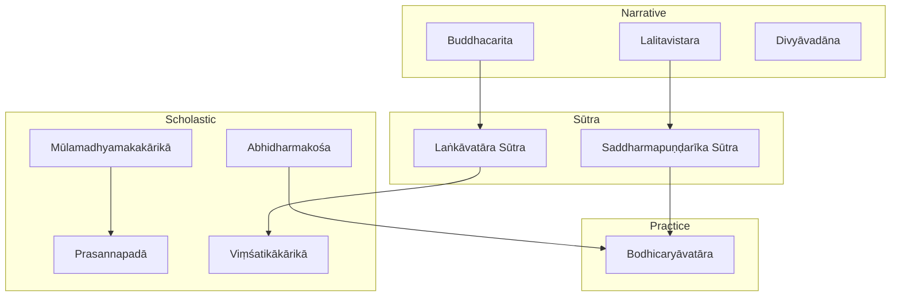
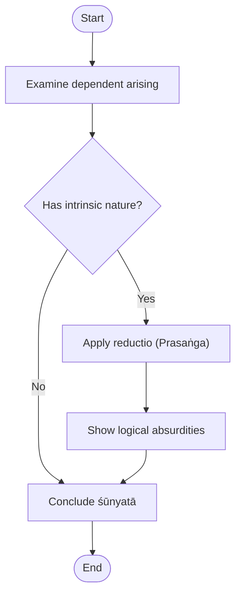
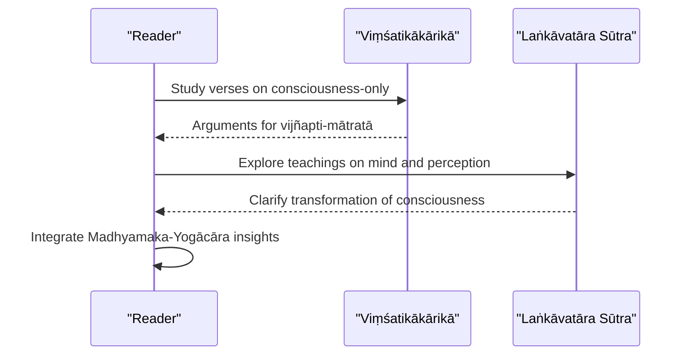
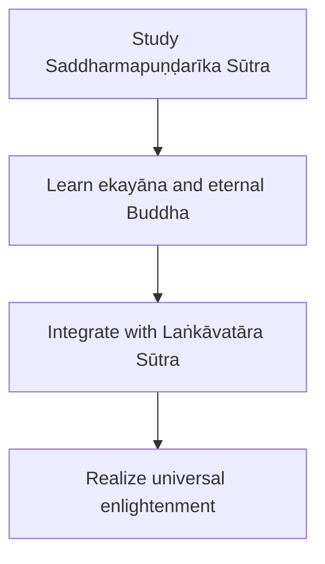
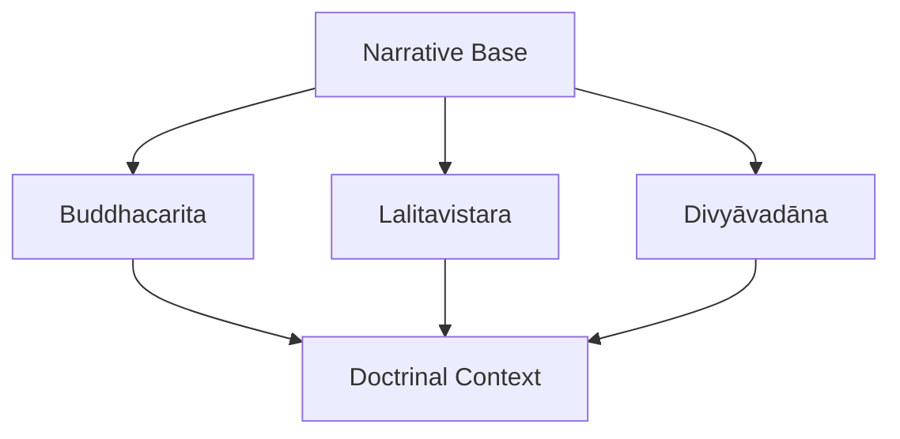
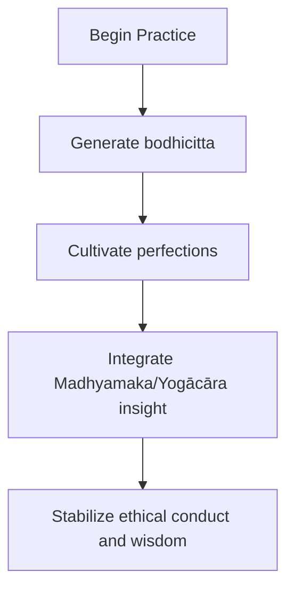
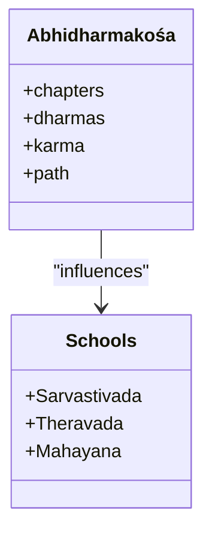
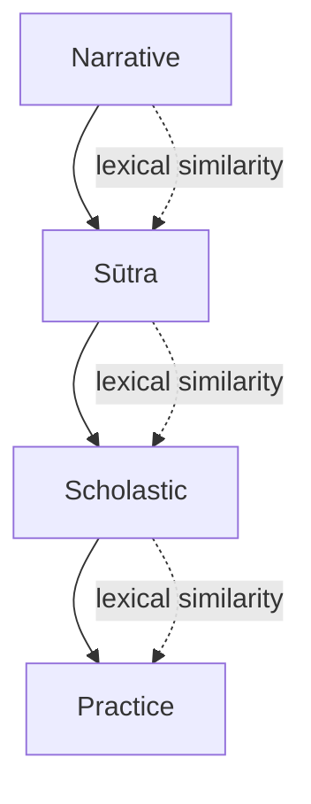

<cite>
**Referenced Files in This Document**
- [buddhacarita.md](file://buddhacarita.md)
- [mulamadhyamakarikah.md](file://mulamadhyamakarikah.md)
- [lankavatarasutra.md](file://lankavatarasutra.md)
- [saddharmapundarikasutra.md](file://saddharmapundarikasutra.md)
- [prasannapada.md](file://prasannapada.md)
- [vimsatikakarika.md](file://vimsatikakarika.md)
- [bodhicaryavatara.md](file://bodhicaryavatara.md)
- [acintyastava.md](file://acintyastava.md)
- [abhidharmakosa.md](file://abhidharmakosa.md)
- [lalitavistara.md](file://lalitavistara.md)
- [divyavadana.md](file://divyavadana.md)
- [nyayasutra.md](file://nyayasutra.md)
- [samkhyakarika.md](file://samkhyakarika.md)
- [yogasutra.md](file://yogasutra.md)
- [indian-epistemology-and-metaphysics.md](file://indian-epistemology-and-metaphysics.md)
- [glossary-of-sanskrit-terms.md](file://glossary-of-sanskrit-terms.md)
</cite>

## Table of Contents
1. [Introduction](#introduction)
2. [Project Structure](#project-structure)
3. [Core Components](#core-components)
4. [Architecture Overview](#architecture-overview)
5. [Detailed Component Analysis](#detailed-component-analysis)
6. [Dependency Analysis](#dependency-analysis)
7. [Performance Considerations](#performance-considerations)
8. [Troubleshooting Guide](#troubleshooting-guide)
9. [Conclusion](#conclusion)
10. [Appendices](#appendices)

## Introduction
This document presents a comprehensive overview of Buddhist philosophical traditions represented in the Sanskrit text collection, with emphasis on Mahāyāna and Theravāda perspectives. It covers key texts including Buddhacarita, Mūlamadhyamakakārikā, Laṅkāvatāra Sūtra, and Saddharmapuṇḍarīka Sūtra, and explains fundamental concepts such as śūnyatā (emptiness), pratītyasamutpāda (dependent origination), anātman (no-self), and the Four Noble Truths. It also addresses Madhyamaka and Yogācāra schools, their debates with Hindu philosophers, and their influence on Indian thought. Finally, it provides computational linguistics insights derived from the corpus metadata, focusing on vocabulary patterns and argumentation markers observable in the lemma indices and related-text similarity tables.

## Project Structure
The repository is organized as a flat collection of concept pages for major Sanskrit texts. Each page summarizes the work’s provenance, thematic scope, and computational annotations (e.g., CoNLL-U file counts, notable lemmas, and related texts by TF-IDF cosine similarity). The Buddhist corpus spans early narrative works, sūtras, and scholastic treatises across Mahāyāna and Abhidharma traditions.

**Diagram sources**
- [buddhacarita.md:1-11](file://buddhacarita.md#L1-L11)
- [lalitavistara.md:1-11](file://lalitavistara.md#L1-L11)
- [divyavadana.md:1-11](file://divyavadana.md#L1-L11)
- [lankavatarasutra.md:1-11](file://lankavatarasutra.md#L1-L11)
- [saddharmapundarikasutra.md:1-11](file://saddharmapundarikasutra.md#L1-L11)
- [mulamadhyamakarikah.md:1-11](file://mulamadhyamakarikah.md#L1-L11)
- [prasannapada.md:1-11](file://prasannapada.md#L1-L11)
- [vimsatikakarika.md:1-11](file://vimsatikakarika.md#L1-L11)
- [bodhicaryavatara.md:1-11](file://bodhicaryavatara.md#L1-L11)
- [abhidharmakosa.md:1-20](file://abhidharmakosa.md#L1-L20)

**Section sources**
- [buddhacarita.md:1-11](file://buddhacarita.md#L1-L11)
- [mulamadhyamakarikah.md:1-11](file://mulamadhyamakarikah.md#L1-L11)
- [lankavatarasutra.md:1-11](file://lankavatarasutra.md#L1-L11)
- [saddharmapundarikasutra.md:1-11](file://saddharmapundarikasutra.md#L1-L11)
- [bodhicaryavatara.md:1-11](file://bodhicaryavatara.md#L1-L11)
- [abhidharmakosa.md:1-20](file://abhidharmakosa.md#L1-L20)

## Core Components
This section introduces the principal textual components that anchor the Buddhist philosophical tradition in the corpus.

- Buddhacarita: A Sanskrit mahākāvya recounting the life of Gautama Buddha from birth to enlightenment and parinirvāṇa, providing narrative context for core teachings and biographical framing.
- Mūlamadhyamakakārikā: The foundational Madhyamaka text by Nāgārjuna, systematically critiquing metaphysical positions through the doctrine of emptiness (śūnyatā).
- Laṅkāvatāra Sūtra: A Mahāyāna sūtra central to Yogācāra, teaching consciousness-only (vijñapti-mātratā) and the nature of mind.
- Saddharmapuṇḍarīka Sūtra: A highly influential Mahāyāna sūtra teaching the one vehicle (ekayāna), the eternal Buddha, and universal enlightenment.
- Prasannapadā: Candrakīrti’s celebrated commentary on Nāgārjuna’s Mūlamadhyamakakārikā, articulating the Prāsaṅgika interpretation of emptiness.
- Viṃśatikākārikā: Vasubandhu’s concise defense of consciousness-only, a cornerstone of Yogācāra.
- Bodhicaryāvatāra: Śāntideva’s guide to bodhisattva practice, emphasizing bodhicitta and the perfections.
- Abhidharmakośa: Vasubandhu’s systematic compendium of Sarvāstivāda philosophy, outlining categories of reality, karma, and path.

These components collectively map the doctrinal spectrum from narrative and sūtra-based Mahāyāna to scholastic Madhyamaka and Yogācāra, alongside Abhidharma foundations.

**Section sources**
- [buddhacarita.md:1-11](file://buddhacarita.md#L1-L11)
- [mulamadhyamakarikah.md:1-11](file://mulamadhyamakarikah.md#L1-L11)
- [lankavatarasutra.md:1-11](file://lankavatarasutra.md#L1-L11)
- [saddharmapundarikasutra.md:1-11](file://saddharmapundarikasutra.md#L1-L11)
- [prasannapada.md:1-11](file://prasannapada.md#L1-L11)
- [vimsatikakarika.md:1-11](file://vimsatikakarika.md#L1-L11)
- [bodhicaryavatara.md:1-11](file://bodhicaryavatara.md#L1-L11)
- [abhidharmakosa.md:1-20](file://abhidharmakosa.md#L1-L20)

## Architecture Overview
The Buddhist philosophical architecture in this corpus can be understood as a layered system:

- Narrative Layer: Biographical and hagiographic texts (Buddhacarita, Lalitavistara, Divyāvadāna) provide contextual grounding for doctrines and practices.
- Sūtra Layer: Mahāyāna sūtras (Laṅkāvatāra Sūtra, Saddharmapuṇḍarīka Sūtra) articulate advanced teachings such as ekayāna and vijñapti-mātratā.
- Scholastic Layer: Treatises and commentaries (Mūlamadhyamakakārikā, Prasannapadā, Viṃśatikākārikā, Abhidharmakośa) formalize metaphysics, epistemology, and path theory.
- Practice Layer: Ethical and meditative guides (Bodhicaryāvatāra) integrate philosophy into lived cultivation.

**Diagram sources**
- [buddhacarita.md:1-11](file://buddhacarita.md#L1-L11)
- [lalitavistara.md:1-11](file://lalitavistara.md#L1-L11)
- [divyavadana.md:1-11](file://divyavadana.md#L1-L11)
- [lankavatarasutra.md:1-11](file://lankavatarasutra.md#L1-L11)
- [saddharmapundarikasutra.md:1-11](file://saddharmapundarikasutra.md#L1-L11)
- [mulamadhyamakarikah.md:1-11](file://mulamadhyamakarikah.md#L1-L11)
- [prasannapada.md:1-11](file://prasannapada.md#L1-L11)
- [vimsatikakarika.md:1-11](file://vimsatikakarika.md#L1-L11)
- [abhidharmakosa.md:1-20](file://abhidharmakosa.md#L1-L20)
- [bodhicaryavatara.md:1-11](file://bodhicaryavatara.md#L1-L11)

## Detailed Component Analysis

### Madhyamaka: Emptiness and Dependent Origination
Madhyamaka centers on śūnyatā (emptiness) and pratītyasamutpāda (dependent origination). Nāgārjuna’s Mūlamadhyamakakārikā critiques all metaphysical positions by showing phenomena lack intrinsic nature (svabhāva). Candrakīrti’s Prasannapadā clarifies the Prāsaṅgika approach, using reductio arguments to demonstrate the inconceivable nature of ultimate truth.

**Diagram sources**
- [mulamadhyamakarikah.md:1-11](file://mulamadhyamakarikah.md#L1-L11)
- [prasannapada.md:1-11](file://prasannapada.md#L1-L11)
- [acintyastava.md:22-48](file://acintyastava.md#L22-L48)

**Section sources**
- [mulamadhyamakarikah.md:1-11](file://mulamadhyamakarikah.md#L1-L11)
- [prasannapada.md:1-11](file://prasannapada.md#L1-L11)
- [acintyastava.md:22-48](file://acintyastava.md#L22-L48)

### Yogācāra: Consciousness-Only and Mind-Only
Yogācāra emphasizes vijñapti-mātratā (consciousness-only), arguing that perceived objects are manifestations of mind. Vasubandhu’s Viṃśatikākārikā defends this view through concise verses, while the Laṅkāvatāra Sūtra expounds on the nature of consciousness and its transformations.

**Diagram sources**
- [vimsatikakarika.md:1-11](file://vimsatikakarika.md#L1-L11)
- [lankavatarasutra.md:1-11](file://lankavatarasutra.md#L1-L11)

**Section sources**
- [vimsatikakarika.md:1-11](file://vimsatikakarika.md#L1-L11)
- [lankavatarasutra.md:1-11](file://lankavatarasutra.md#L1-L11)

### Mahāyāna Sūtras: One Vehicle and Universal Enlightenment
The Saddharmapuṇḍarīka Sūtra teaches ekayāna (one vehicle), presenting the Buddha’s timeless presence and the universality of enlightenment. The Laṅkāvatāra Sūtra complements this by detailing the structure of mind and the path to realization.

**Diagram sources**
- [saddharmapundarikasutra.md:1-11](file://saddharmapundarikasutra.md#L1-L11)
- [lankavatarasutra.md:1-11](file://lankavatarasutra.md#L1-L11)

**Section sources**
- [saddharmapundarikasutra.md:1-11](file://saddharmapundarikasutra.md#L1-L11)
- [lankavatarasutra.md:1-11](file://lankavatarasutra.md#L1-L11)

### Narrative Foundations: Life of the Buddha and Karmic Tales
Narrative texts like Buddhacarita, Lalitavistara, and Divyāvadāna frame doctrinal teachings within biographical and karmic contexts, making abstract philosophy accessible through story.

**Diagram sources**
- [buddhacarita.md:1-11](file://buddhacarita.md#L1-L11)
- [lalitavistara.md:1-11](file://lalitavistara.md#L1-L11)
- [divyavadana.md:1-11](file://divyavadana.md#L1-L11)

**Section sources**
- [buddhacarita.md:1-11](file://buddhacarita.md#L1-L11)
- [lalitavistara.md:1-11](file://lalitavistara.md#L1-L11)
- [divyavadana.md:1-11](file://divyavadana.md#L1-L11)

### Practice and Ethics: Cultivating Bodhicitta
Śāntideva’s Bodhicaryāvatāra offers a practical roadmap for cultivating bodhicitta and practicing the perfections, bridging philosophy and daily discipline.

**Diagram sources**
- [bodhicaryavatara.md:1-11](file://bodhicaryavatara.md#L1-L11)

**Section sources**
- [bodhicaryavatara.md:1-11](file://bodhicaryavatara.md#L1-L11)

### Abhidharma: Systematic Categories and Path
The Abhidharmakośa organizes Buddhist metaphysics and psychology into precise categories, informing both Theravāda and Mahāyāna scholasticism.

**Diagram sources**
- [abhidharmakosa.md:1-20](file://abhidharmakosa.md#L1-L20)

**Section sources**
- [abhidharmakosa.md:1-20](file://abhidharmakosa.md#L1-L20)

## Dependency Analysis
The corpus exhibits clear dependency relationships between narrative, sūtra, scholastic, and practice layers. Similarity metrics in the “Related Texts” tables reveal lexical affinities that reflect shared themes and terminology.

**Diagram sources**
- [buddhacarita.md:15-31](file://buddhacarita.md#L15-L31)
- [mulamadhyamakarikah.md:15-31](file://mulamadhyamakarikah.md#L15-L31)
- [saddharmapundarikasutra.md:15-31](file://saddharmapundarikasutra.md#L15-L31)
- [lalitavistara.md:15-31](file://lalitavistara.md#L15-L31)
- [divyavadana.md:15-31](file://divyavadana.md#L15-L31)

**Section sources**
- [buddhacarita.md:15-31](file://buddhacarita.md#L15-L31)
- [mulamadhyamakarikah.md:15-31](file://mulamadhyamakarikah.md#L15-L31)
- [saddharmapundarikasutra.md:15-31](file://saddharmapundarikasutra.md#L15-L31)
- [lalitavistara.md:15-31](file://lalitavistara.md#L15-L31)
- [divyavadana.md:15-31](file://divyavadana.md#L15-L31)

## Performance Considerations
When analyzing large corpora of Sanskrit texts computationally:

- Tokenization and normalization: Ensure robust handling of sandhi and diacritics to preserve lemma accuracy.
- Vocabulary sparsity: Use TF-IDF and cosine similarity judiciously; rare philosophical terms may skew similarity if not normalized.
- Parsing quality: CoNLL-U dependency parsing improves argumentation pattern detection but requires careful error handling for ambiguous structures.
- Scalability: Batch processing of lemma indices and concordances reduces overhead; consider incremental updates for new editions.

[No sources needed since this section provides general guidance]

## Troubleshooting Guide
Common issues and resolutions when working with the corpus:

- Inconsistent lemma indexing: Verify alignment between raw files and lemma indices; cross-check concordance links for missing entries.
- Ambiguous philosophical terms: Use glossaries and cross-references to disambiguate terms like svabhāva, śūnyatā, and vijñapti.
- Similarity noise: Filter out high-frequency function words (ca, tad, na) when computing conceptual similarity to emphasize domain-specific vocabulary.
- Cross-school comparisons: Be mindful of differing terminologies across Madhyamaka, Yogācāra, and Abhidharma; use contextual windows around key lemmas for accurate comparison.

**Section sources**
- [glossary-of-sanskrit-terms.md:23-48](file://glossary-of-sanskrit-terms.md#L23-L48)
- [indian-epistemology-and-metaphysics.md:26-62](file://indian-epistemology-and-metaphysics.md#L26-L62)

## Conclusion
The Sanskrit text collection provides a rich foundation for studying Buddhist philosophy across narrative, sūtra, scholastic, and practice dimensions. Madhyamaka and Yogācāra offer complementary frameworks for understanding emptiness and consciousness-only, respectively, while Mahāyāna sūtras expand the vision toward universal enlightenment. Computational linguistics tools—lemma frequency analysis, concordancing, and similarity metrics—reveal argumentation patterns and lexical affinities that illuminate doctrinal evolution and intertextual relationships. Together, these resources enable both scholarly inquiry and practical study of Buddhist thought.

[No sources needed since this section summarizes without analyzing specific files]

## Appendices

### Fundamental Concepts Index
- Śūnyatā (emptiness): Central to Madhyamaka; absence of intrinsic nature in phenomena.
- Pratītyasamutpāda (dependent origination): All phenomena arise dependently; basis for emptiness.
- Anātman (no-self): Rejection of permanent self; applies to persons and phenomena.
- Four Noble Truths: Foundation of Buddhist teaching; suffering, cause, cessation, path.

[No sources needed since this section provides general guidance]

### Computational Linguistics Notes
- Notable lemmas often include negation particles (na), copulas (as), and connectives (ca), reflecting argumentative style.
- Domain-specific lemmas (e.g., bhāva, svabhāva, vijñapti) signal philosophical focus areas.
- Related-text similarity highlights thematic clusters across narrative, sūtra, and scholastic genres.

**Section sources**
- [mulamadhyamakarikah.md:31-47](file://mulamadhyamakarikah.md#L31-L47)
- [vimsatikakarika.md:13-29](file://vimsatikakarika.md#L13-L29)
- [saddharmapundarikasutra.md:31-47](file://saddharmapundarikasutra.md#L31-L47)
- [buddhacarita.md:31-57](file://buddhacarita.md#L31-L57)
