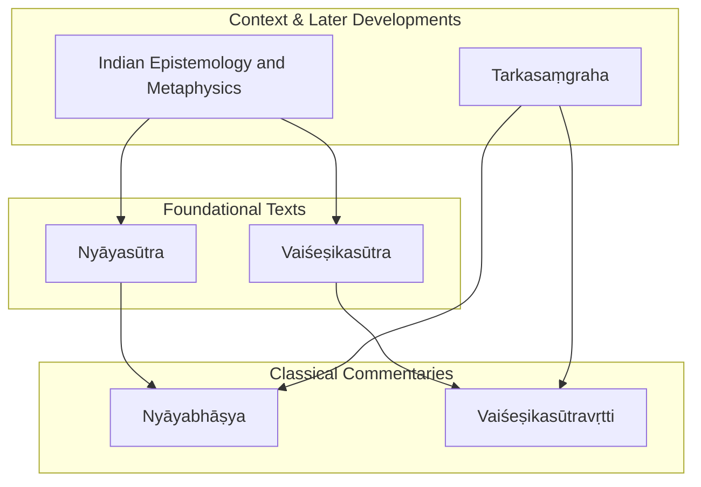
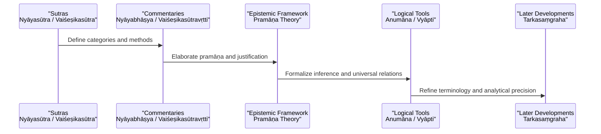
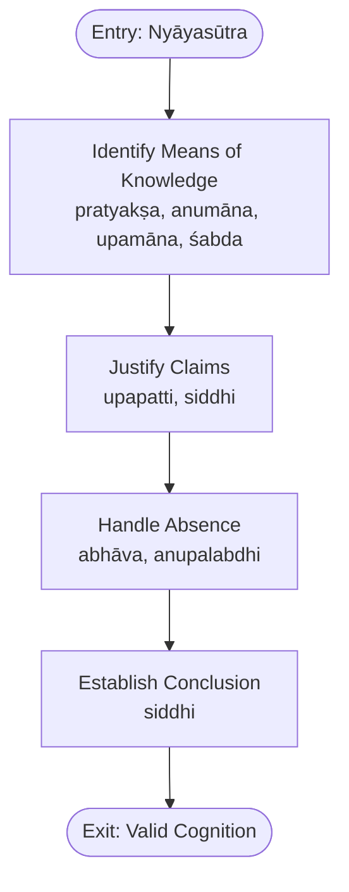
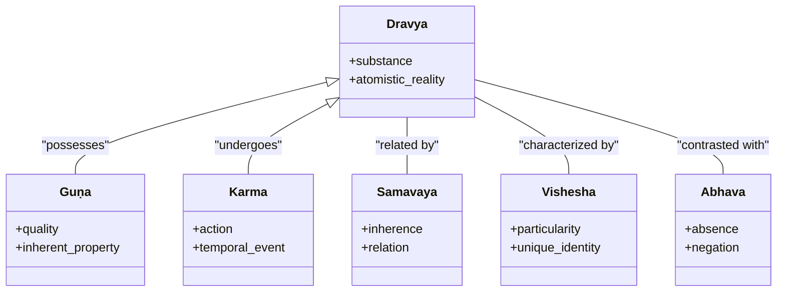
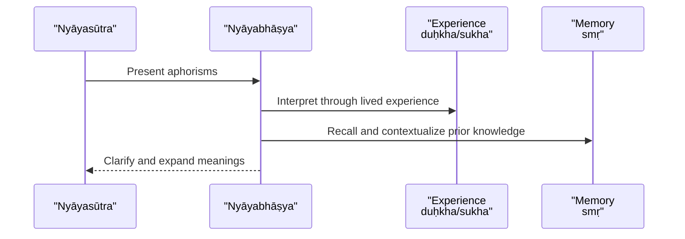
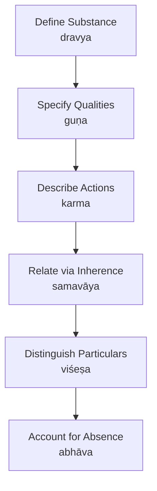
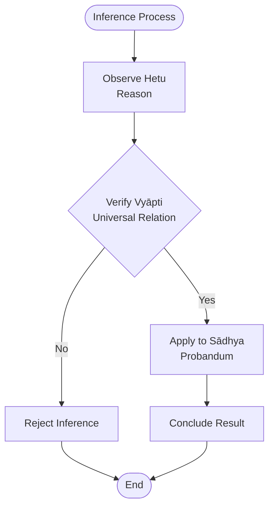
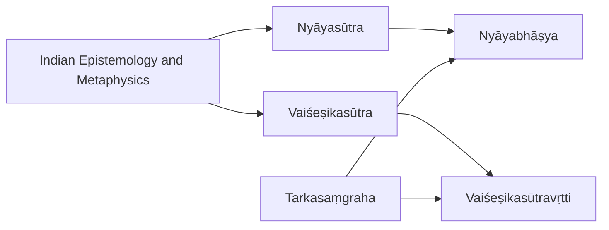

<cite>
**Referenced Files in This Document**
- [nyayasutra.md](file://nyayasutra.md)
- [vaisesikasutra.md](file://vaisesikasutra.md)
- [nyayabhasya.md](file://nyayabhasya.md)
- [vaisesikasutravrtti.md](file://vaisesikasutravrtti.md)
- [indian-epistemology-and-metaphysics.md](file://indian-epistemology-and-metaphysics.md)
- [tarkasamgraha.md](file://tarkasamgraha.md)
</cite>

## Table of Contents
1. [Introduction](#introduction)
2. [Project Structure](#project-structure)
3. [Core Components](#core-components)
4. [Architecture Overview](#architecture-overview)
5. [Detailed Component Analysis](#detailed-component-analysis)
6. [Dependency Analysis](#dependency-analysis)
7. [Performance Considerations](#performance-considerations)
8. [Troubleshooting Guide](#troubleshooting-guide)
9. [Conclusion](#conclusion)
10. [Appendices](#appendices)

## Introduction
This document provides a comprehensive overview of the Nyāya-Vaiśeṣika philosophical tradition as represented in the repository’s texts. It focuses on:
- Foundational sutras: Nyāyasūtra and Vaiśeṣikasūtra
- Classical commentaries: Nyāyabhāṣya and Vaiśeṣikasūtravṛtti
- Epistemological framework (pramāṇa), logical reasoning (anumāna, vyāpti), and ontological categories (padārtha)
- Development from early sutras to classical commentaries
- Computational linguistics insights for analyzing argumentation patterns and logical structure

The goal is to make these complex traditions accessible while grounding analysis in the repository’s texts and metadata.

## Project Structure
The repository contains concept pages that summarize key texts with metadata such as descriptions, related texts, and notable lemmas. For Nyāya-Vaiśeṣika, the core files are:
- nyayasutra.md: foundational Nyāya text summary
- vaisesikasutra.md: foundational Vaiśeṣika text summary
- nyayabhasya.md: classical Nyāya commentary
- vaisesikasutravrtti.md: classical Vaiśeṣika commentary
- indian-epistemology-and-metaphysics.md: comparative epistemology context including pramāṇa frameworks
- tarkasamgraha.md: later Navya-Nyāya logic compendium useful for advanced logical analysis

**Diagram sources**
- [nyayasutra.md:1-48](file://nyayasutra.md#L1-L48)
- [vaisesikasutra.md:1-48](file://vaisesikasutra.md#L1-L48)
- [nyayabhasya.md:1-48](file://nyayabhasya.md#L1-L48)
- [vaisesikasutravrtti.md:1-48](file://vaisesikasutravrtti.md#L1-L48)
- [indian-epistemology-and-metaphysics.md:1-70](file://indian-epistemology-and-metaphysics.md#L1-L70)
- [tarkasamgraha.md:1-48](file://tarkasamgraha.md#L1-L48)

**Section sources**
- [nyayasutra.md:1-48](file://nyayasutra.md#L1-L48)
- [vaisesikasutra.md:1-48](file://vaisesikasutra.md#L1-L48)
- [nyayabhasya.md:1-48](file://nyayabhasya.md#L1-L48)
- [vaisesikasutravrtti.md:1-48](file://vaisesikasutravrtti.md#L1-L48)
- [indian-epistemology-and-metaphysics.md:1-70](file://indian-epistemology-and-metaphysics.md#L1-L70)
- [tarkasamgraha.md:1-48](file://tarkasamgraha.md#L1-L48)

## Core Components
- Nyāyasūtra: Foundational Nyāya text systematizing logic, epistemology, and debate theory; includes frequent use of terms like artha, abhāva, upapatti, anupalabdhi, siddhi indicating focus on justification, negation, inference support, non-perception, and establishment of conclusions.
- Vaiśeṣikasūtra: Foundational Vaiśeṣika text articulating atomistic ontology and category theory; prominent lemmas include dravya, guṇa, karma, saṃyoga, kāraṇa, viśeṣa reflecting substance, qualities, action, relations, cause, and particularity.
- Nyāyabhāṣya: Earliest surviving commentary on Nyāyasūtras by Vātsyāyana, establishing classical Nyāya logic and epistemology; frequent terms like duḥkha, sukha, smṛ indicate engagement with experience and memory in knowledge formation.
- Vaiśeṣikasūtravṛtti: Commentary on Vaiśeṣikasūtra expounding atomistic ontology and categories; high frequency of tva, ādi, iti, ca, nitya indicates structural exposition and emphasis on permanence and definitions.
- Indian Epistemology and Metaphysics: Comparative syllabus outlining pramāṇa frameworks across schools; identifies Nyāya’s four pramāṇas (perception, inference, comparison, testimony) and Vaiśeṣika’s seven padārthas (substance, quality, action, universals, particulars, inherence, absence).
- Tarkasaṃgraha: Navya-Nyāya compendium introducing refined categories and logical tools; frequent terms like śabda, jñāna, vṛtti reflect linguistic precision and cognitive processes.

**Section sources**
- [nyayasutra.md:1-48](file://nyayasutra.md#L1-L48)
- [vaisesikasutra.md:1-48](file://vaisesikasutra.md#L1-L48)
- [nyayabhasya.md:1-48](file://nyayabhasya.md#L1-L48)
- [vaisesikasutravrtti.md:1-48](file://vaisesikasutravrtti.md#L1-L48)
- [indian-epistemology-and-metaphysics.md:24-47](file://indian-epistemology-and-metaphysics.md#L24-L47)
- [tarkasamgraha.md:1-48](file://tarkasamgraha.md#L1-L48)

## Architecture Overview
The Nyāya-Vaiśeṣika tradition can be understood as a layered architecture:
- Foundational layer: Nyāyasūtra and Vaiśeṣikasūtra establish core concepts and categories.
- Commentary layer: Nyāyabhāṣya and Vaiśeṣikasūtravṛtti elaborate, clarify, and systematize the sutras.
- Contextual layer: Indian Epistemology and Metaphysics situates Nyāya-Vaiśeṣika within broader Indian philosophy and compares pramāṇa theories.
- Advanced layer: Tarkasaṃgraha introduces refined logical vocabulary and analytical techniques used in later debates.

**Diagram sources**
- [nyayasutra.md:1-48](file://nyayasutra.md#L1-L48)
- [vaisesikasutra.md:1-48](file://vaisesikasutra.md#L1-L48)
- [nyayabhasya.md:1-48](file://nyayabhasya.md#L1-L48)
- [vaisesikasutravrtti.md:1-48](file://vaisesikasutravrtti.md#L1-L48)
- [indian-epistemology-and-metaphysics.md:24-47](file://indian-epistemology-and-metaphysics.md#L24-L47)
- [tarkasamgraha.md:1-48](file://tarkasamgraha.md#L1-L48)

## Detailed Component Analysis

### Nyāyasūtra: Foundations of Logic and Epistemology
- Purpose: Systematizes logic, epistemology, and debate theory.
- Key themes indicated by notable lemmas:
  - artha: meaning/object of cognition
  - abhāva: absence/negation
  - upapatti: justification/support
  - anupalabdhi: non-perception as a means of knowledge
  - siddhi: establishment/proof
- Related texts show strong similarity to Vaiśeṣika commentaries and other philosophical treatises, indicating cross-school conceptual exchange.

**Diagram sources**
- [nyayasutra.md:31-47](file://nyayasutra.md#L31-L47)
- [indian-epistemology-and-metaphysics.md:24-38](file://indian-epistemology-and-metaphysics.md#L24-L38)

**Section sources**
- [nyayasutra.md:1-48](file://nyayasutra.md#L1-L48)
- [indian-epistemology-and-metaphysics.md:24-38](file://indian-epistemology-and-metaphysics.md#L24-L38)

### Vaiśeṣikasūtra: Ontology and Categories
- Purpose: Articulates atomistic ontology and category theory.
- Key themes indicated by notable lemmas:
  - dravya: substance
  - guṇa: quality
  - karma: action
  - saṃyoga: conjunction/relation
  - kāraṇa: cause
  - viśeṣa: particularity
- Strong lexical similarity to its commentary (Vaiśeṣikasūtravṛtti), showing continuity in exposition.

**Diagram sources**
- [vaisesikasutra.md:31-47](file://vaisesikasutra.md#L31-L47)
- [indian-epistemology-and-metaphysics.md:40-47](file://indian-epistemology-and-metaphysics.md#L40-L47)

**Section sources**
- [vaisesikasutra.md:1-48](file://vaisesikasutra.md#L1-L48)
- [indian-epistemology-and-metaphysics.md:40-47](file://indian-epistemology-and-metaphysics.md#L40-L47)

### Nyāyabhāṣya: Classical Commentary and Systematization
- Purpose: Earliest surviving commentary on Nyāyasūtras; establishes classical Nyāya logic and epistemology.
- Notable lemmas suggest engagement with experience (duḥkha, sukha) and memory (smṛ) in forming valid knowledge.
- Shows moderate similarity to Vaiśeṣika commentary, indicating shared conceptual vocabulary.

**Diagram sources**
- [nyayabhasya.md:31-47](file://nyayabhasya.md#L31-L47)
- [nyayasutra.md:31-47](file://nyayasutra.md#L31-L47)

**Section sources**
- [nyayabhasya.md:1-48](file://nyayabhasya.md#L1-L48)
- [nyayasutra.md:1-48](file://nyayasutra.md#L1-L48)

### Vaiśeṣikasūtravṛtti: Exegesis of Categories
- Purpose: Gloss on Vaiśeṣikasūtra; expounds atomistic ontology and category theory.
- High frequency of tva (abstract noun suffix), ādi (and so forth), iti (thus), ca (and), nitya (eternal) indicates systematic definition and classification.
- Strong similarity to Vaiśeṣikasūtra confirms close exegetical relationship.

**Diagram sources**
- [vaisesikasutravrtti.md:31-47](file://vaisesikasutravrtti.md#L31-L47)
- [vaisesikasutra.md:31-47](file://vaisesikasutra.md#L31-L47)

**Section sources**
- [vaisesikasutravrtti.md:1-48](file://vaisesikasutravrtti.md#L1-L48)
- [vaisesikasutra.md:1-48](file://vaisesikasutra.md#L1-L48)

### Pramāṇa Framework and Logical Reasoning
- Nyāya recognizes four pramāṇas: perception (pratyakṣa), inference (anumāna), comparison (upamāna), testimony (śabda).
- Vaiśeṣika contributes seven padārthas: substance, quality, action, universals, particulars, inherence, absence.
- Anumāna (inference) relies on vyāpti (universal relation) between hetu (reason) and sādhya (probandum).
- Computational linguistics can analyze lemma frequencies and co-occurrence patterns to identify argumentative structures and definitional sequences.

**Diagram sources**
- [indian-epistemology-and-metaphysics.md:24-38](file://indian-epistemology-and-metaphysics.md#L24-L38)
- [nyayasutra.md:31-47](file://nyayasutra.md#L31-L47)

**Section sources**
- [indian-epistemology-and-metaphysics.md:24-38](file://indian-epistemology-and-metaphysics.md#L24-L38)
- [nyayasutra.md:1-48](file://nyayasutra.md#L1-L48)

### Tarkasaṃgraha: Refined Logical Vocabulary
- Navya-Nyāya compendium introduces precise categories and analytical tools.
- Frequent terms like śabda (word/testimony), jñāna (knowledge), vṛtti (function/activity) reflect emphasis on linguistic precision and cognitive processes.
- Useful for computational analysis of argumentation patterns due to structured categorization.

**Section sources**
- [tarkasamgraha.md:1-48](file://tarkasamgraha.md#L1-L48)

## Dependency Analysis
The texts exhibit clear dependency relationships:
- Sutras depend on shared philosophical vocabulary and conceptual frameworks.
- Commentaries depend on sutras for exegesis and elaboration.
- Later works depend on both sutras and commentaries for refined analysis.
- Cross-school similarities indicate shared conceptual resources and debate contexts.

**Diagram sources**
- [nyayasutra.md:15-30](file://nyayasutra.md#L15-L30)
- [vaisesikasutra.md:15-30](file://vaisesikasutra.md#L15-L30)
- [nyayabhasya.md:15-30](file://nyayabhasya.md#L15-L30)
- [vaisesikasutravrtti.md:15-30](file://vaisesikasutravrtti.md#L15-L30)
- [indian-epistemology-and-metaphysics.md:1-70](file://indian-epistemology-and-metaphysics.md#L1-L70)
- [tarkasamgraha.md:15-30](file://tarkasamgraha.md#L15-L30)

**Section sources**
- [nyayasutra.md:15-30](file://nyayasutra.md#L15-L30)
- [vaisesikasutra.md:15-30](file://vaisesikasutra.md#L15-L30)
- [nyayabhasya.md:15-30](file://nyayabhasya.md#L15-L30)
- [vaisesikasutravrtti.md:15-30](file://vaisesikasutravrtti.md#L15-L30)
- [indian-epistemology-and-metaphysics.md:1-70](file://indian-epistemology-and-metaphysics.md#L1-L70)
- [tarkasamgraha.md:15-30](file://tarkasamgraha.md#L15-L30)

## Performance Considerations
- Lemma frequency analysis can highlight dominant themes and conceptual priorities in each text.
- Co-occurrence networks can reveal argumentative structures and definitional sequences.
- Similarity metrics (TF-IDF cosine similarity) help map textual relationships and influence across schools.
- For large-scale analysis, consider tokenization strategies that preserve Sanskrit compound structures and technical terms.

[No sources needed since this section provides general guidance]

## Troubleshooting Guide
- When analyzing argumentation patterns, ensure proper segmentation of Sanskrit compounds and technical terms to avoid misclassification.
- Use concordance links provided in lemma indices to verify contextual usage of key terms.
- Cross-reference related texts to validate interpretations and identify shared vocabulary.
- Be cautious of overgeneralizing from lemma frequencies without considering syntactic and semantic context.

[No sources needed since this section provides general guidance]

## Conclusion
The Nyāya-Vaiśeṣika tradition, as represented in the repository, offers a rich foundation for understanding Indian logic, epistemology, and metaphysics. The sutras establish core concepts, the commentaries elaborate and systematize them, and later works refine analytical tools. Computational linguistics can enhance analysis by identifying patterns in argumentation and logical structure, enabling deeper insights into how these texts construct knowledge and reality.

[No sources needed since this section summarizes without analyzing specific files]

## Appendices

### Appendix A: Key Concepts Summary
- Pramāṇa: Means of valid knowledge (Nyāya: perception, inference, comparison, testimony)
- Anumāna: Inference based on universal relations (vyāpti)
- Padārtha: Categories of reality (Vaiśeṣika: substance, quality, action, universals, particulars, inherence, absence)
- Argumentation: Structured reasoning using defined terms and logical relations

**Section sources**
- [indian-epistemology-and-metaphysics.md:24-47](file://indian-epistemology-and-metaphysics.md#L24-L47)
- [nyayasutra.md:31-47](file://nyayasutra.md#L31-L47)
- [vaisesikasutra.md:31-47](file://vaisesikasutra.md#L31-L47)
