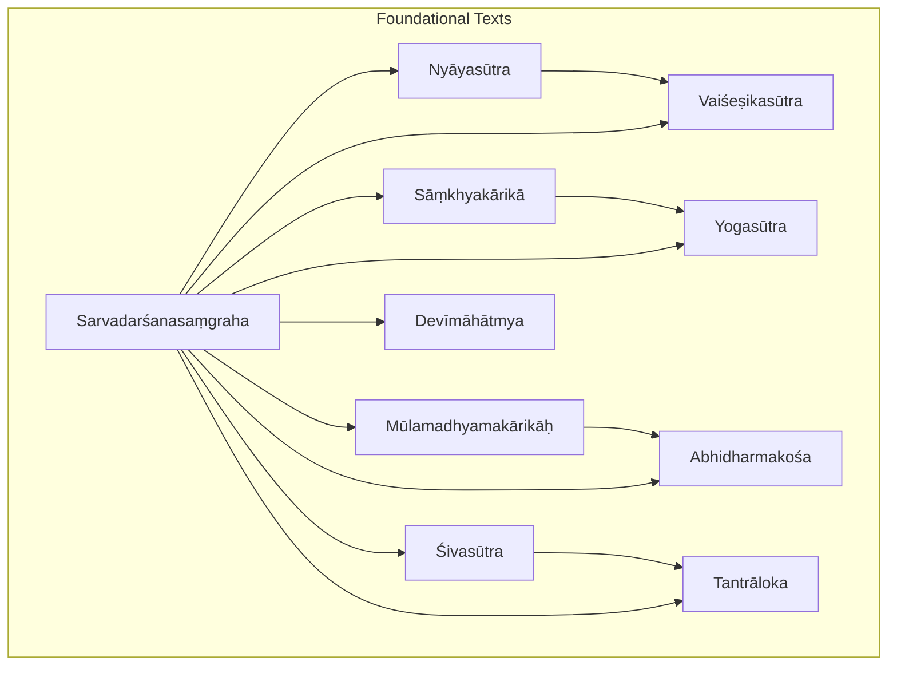
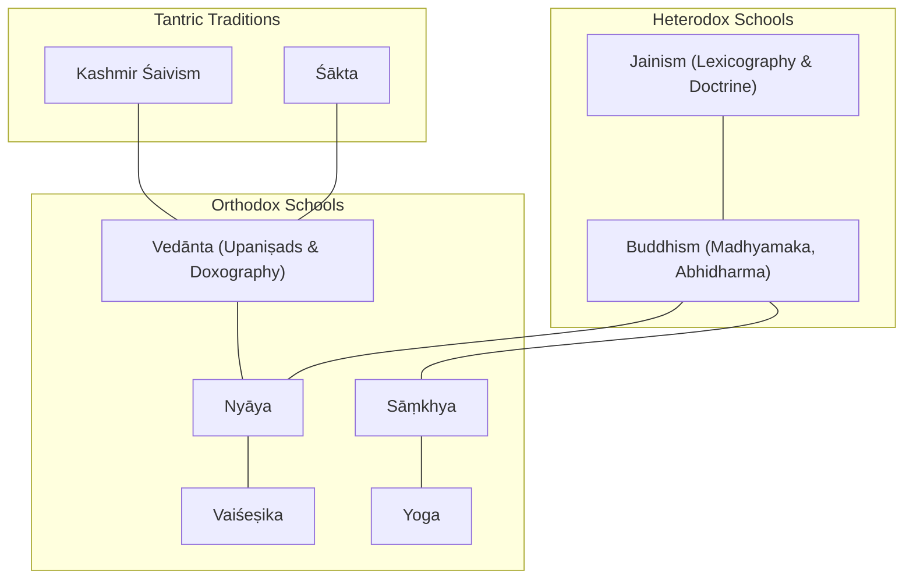
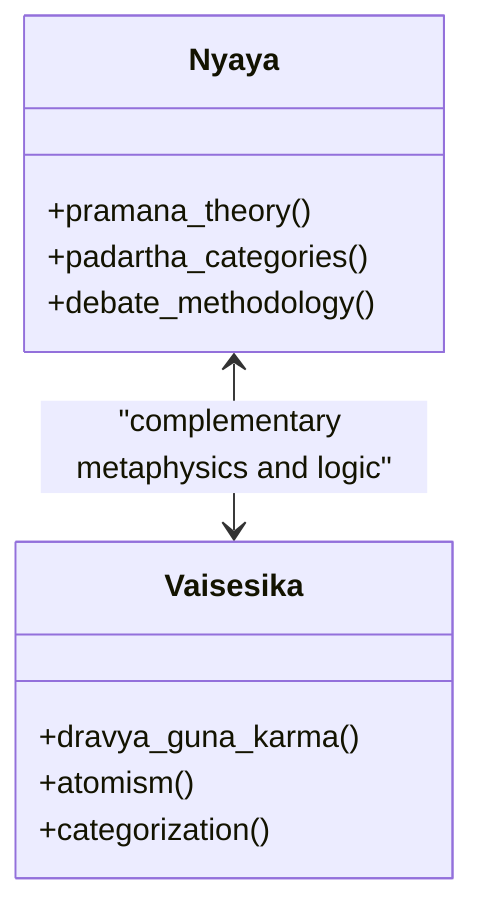
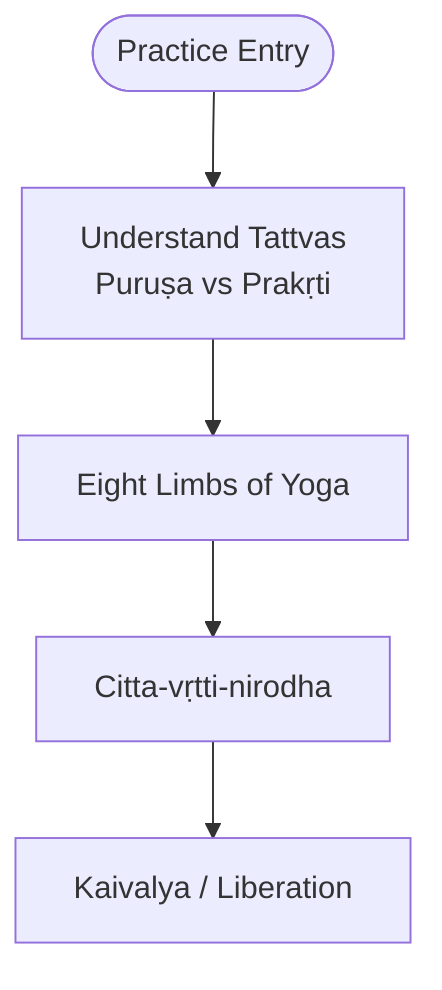
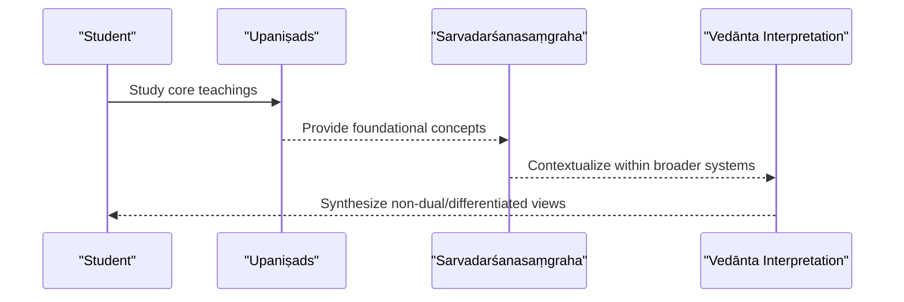
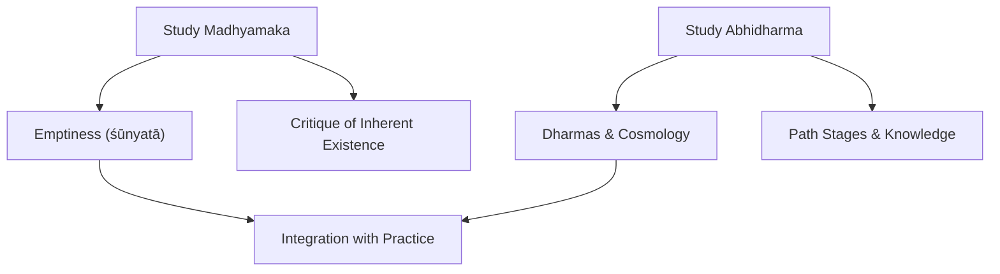
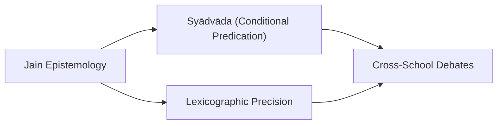
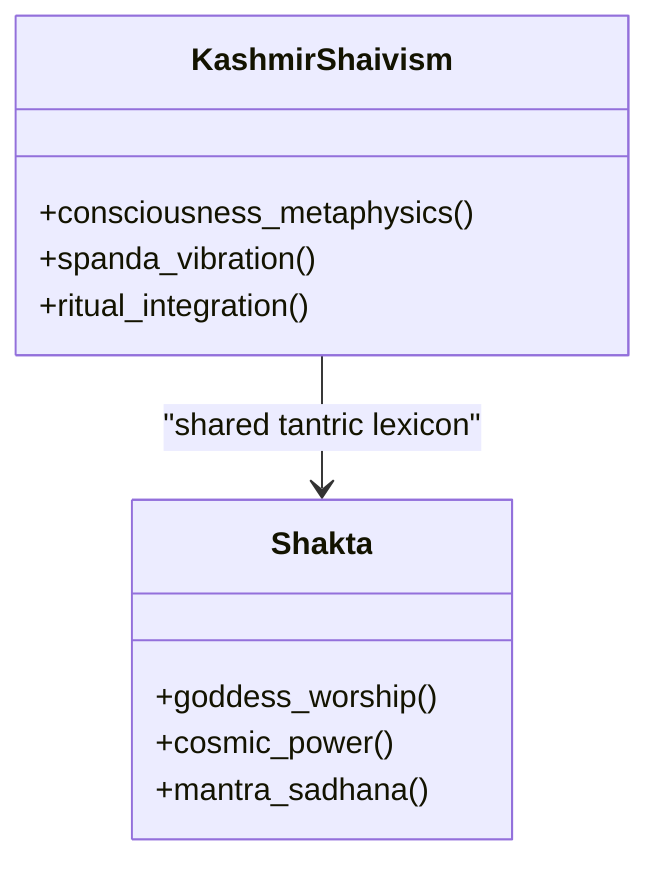
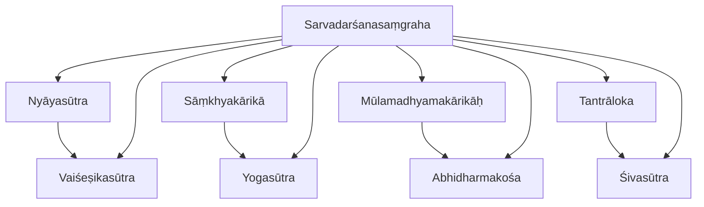

<cite>
**Referenced Files in This Document**
- [INDEX.md](file://INDEX.md)
- [indian-epistemology-and-metaphysics.md](file://indian-epistemology-and-metaphysics.md)
- [nyayasutra.md](file://nyayasutra.md)
- [vaisesikasutra.md](file://vaisesikasutra.md)
- [samkhyakarika.md](file://samkhyakarika.md)
- [yogasutra.md](file://yogasutra.md)
- [mulamadhyamakarikah.md](file://mulamadhyamakarikah.md)
- [abhidharmakosa.md](file://abhidharmakosa.md)
- [sivasutra.md](file://sivasutra.md)
- [tantraloka.md](file://tantraloka.md)
- [devimahatmya.md](file://devimahatmya.md)
- [sarvadarsanasamgraha.md](file://sarvadarsanasamgraha.md)
</cite>

## Table of Contents
1. [Introduction](#introduction)
2. [Project Structure](#project-structure)
3. [Core Components](#core-components)
4. [Architecture Overview](#architecture-overview)
5. [Detailed Component Analysis](#detailed-component-analysis)
6. [Dependency Analysis](#dependency-analysis)
7. [Performance Considerations](#performance-considerations)
8. [Troubleshooting Guide](#troubleshooting-guide)
9. [Conclusion](#conclusion)
10. [Appendices](#appendices)

## Introduction
This document synthesizes the philosophical systems represented across a curated collection of Sanskrit texts, focusing on major Indian traditions: Nyāya-Vaiśeṣika, Sāṃkhya-Yoga, Vedānta schools (as reflected in Upaniṣadic and doxographical materials), Buddhist philosophy (including Madhyamaka and Abhidharma), Jainism (via lexicographic and doctrinal references), and Śaiva-Śākta Tantra. It explains key texts, authors, historical context, and philosophical contributions; maps relationships among schools; and highlights how computational linguistics can reveal patterns in philosophical discourse across traditions.

## Project Structure
The repository organizes 260 topics spanning Vedic literature, Upaniṣads, Dharmaśāstra, Grammar, Kāvya, Buddhism, Jainism, Tantra, Yoga, Āyurveda, Purāṇas, and more. For this documentation, we focus on the philosophical core: foundational sūtras, commentaries, and compendia that define each school’s epistemology, metaphysics, and soteriology. The index provides cross-references and thematic groupings that help navigate related texts.

**Diagram sources**
- [nyayasutra.md:1-48](file://nyayasutra.md#L1-L48)
- [vaisesikasutra.md:1-48](file://vaisesikasutra.md#L1-L48)
- [samkhyakarika.md:1-48](file://samkhyakarika.md#L1-L48)
- [yogasutra.md:1-48](file://yogasutra.md#L1-L48)
- [mulamadhyamakarikah.md:1-48](file://mulamadhyamakarikah.md#L1-L48)
- [abhidharmakosa.md:1-100](file://abhidharmakosa.md#L1-L100)
- [sivasutra.md:1-12](file://sivasutra.md#L1-L12)
- [tantraloka.md:1-48](file://tantraloka.md#L1-L48)
- [devimahatmya.md:1-30](file://devimahatmya.md#L1-L30)
- [sarvadarsanasamgraha.md:1-48](file://sarvadarsanasamgraha.md#L1-L48)

**Section sources**
- [INDEX.md:1-277](file://INDEX.md#L1-L277)

## Core Components
This section outlines the primary textual anchors for each tradition and their conceptual roles within the corpus.

- Nyāya: Logic, epistemology, debate theory; central to pramāṇa analysis and categories of reality.
- Vaiśeṣika: Atomistic ontology and categorical system; complements Nyāya with metaphysical taxonomy.
- Sāṃkhya: Dualism of puruṣa and prakṛti; framework for tattvas and evolution.
- Yoga: Meditative practice aligned with Sāṃkhya metaphysics; eight limbs toward kaivalya.
- Buddhism: Madhyamaka (emptiness) and Abhidharma (dharmas, cosmology, path).
- Śaiva-Śākta Tantra: Kashmir Śaivism and Goddess-centered practices; metaphysics of consciousness and śakti.
- Doxography: Sarvadarśanasaṃgraha surveys multiple schools, enabling comparative study.

**Section sources**
- [indian-epistemology-and-metaphysics.md:20-62](file://indian-epistemology-and-metaphysics.md#L20-L62)
- [nyayasutra.md:1-48](file://nyayasutra.md#L1-L48)
- [vaisesikasutra.md:1-48](file://vaisesikasutra.md#L1-L48)
- [samkhyakarika.md:1-48](file://samkhyakarika.md#L1-L48)
- [yogasutra.md:1-48](file://yogasutra.md#L1-L48)
- [mulamadhyamakarikah.md:1-48](file://mulamadhyamakarikah.md#L1-L48)
- [abhidharmakosa.md:24-100](file://abhidharmakosa.md#L24-L100)
- [sivasutra.md:1-12](file://sivasutra.md#L1-L12)
- [tantraloka.md:1-48](file://tantraloka.md#L1-L48)
- [devimahatmya.md:1-30](file://devimahatmya.md#L1-L30)
- [sarvadarsanasamgraha.md:1-48](file://sarvadarsanasamgraha.md#L1-L48)

## Architecture Overview
The philosophical architecture is best understood as an interlocking network of schools that share vocabulary, debate common problems (self, knowledge, causation, liberation), and respond to one another through commentary and refutation. Computational linguistics reveals these relationships via lemma frequency, similarity metrics, and co-occurrence patterns.

[No sources needed since this diagram shows conceptual workflow, not actual code structure]

## Detailed Component Analysis

### Nyāya-Vaiśeṣika
- Nyāya focuses on logic, epistemology, and debate theory; its foundational text systematizes means of valid knowledge and categories of reality.
- Vaiśeṣika contributes atomistic ontology and a detailed categorical scheme; it often pairs with Nyāya in classical Indian thought.
- Lemma patterns show strong overlap between Nyāya and Vaiśeṣika texts, indicating shared technical vocabulary and argumentative strategies.

**Diagram sources**
- [nyayasutra.md:1-48](file://nyayasutra.md#L1-L48)
- [vaisesikasutra.md:1-48](file://vaisesikasutra.md#L1-L48)

**Section sources**
- [nyayasutra.md:1-48](file://nyayasutra.md#L1-L48)
- [vaisesikasutra.md:1-48](file://vaisesikasutra.md#L1-L48)

### Sāṃkhya-Yoga
- Sāṃkhya articulates dualism of puruṣa and prakṛti and enumerates tattvas; it provides metaphysical grounding for Yoga.
- Yoga prescribes meditative and ethical practices aligned with Sāṃkhya’s ontology, aiming at kaivalya (isolation/liberation).
- Lemma similarities highlight shared terminology around mind, faculties, and liberation.

**Diagram sources**
- [samkhyakarika.md:1-48](file://samkhyakarika.md#L1-L48)
- [yogasutra.md:1-48](file://yogasutra.md#L1-L48)

**Section sources**
- [samkhyakarika.md:1-48](file://samkhyakarika.md#L1-L48)
- [yogasutra.md:1-48](file://yogasutra.md#L1-L48)

### Vedānta Schools
- While specific Brahma-sūtras are not listed here, Upaniṣads and doxographical works frame Vedānta’s non-dual or differentiated ultimate reality.
- The syllabus notes parallels with Western idealism and emphasizes pramāṇa diversity across schools.
- Doxography enables comparative mapping of Vedānta positions against other systems.

**Diagram sources**
- [indian-epistemology-and-metaphysics.md:20-62](file://indian-epistemology-and-metaphysics.md#L20-L62)
- [sarvadarsanasamgraha.md:1-48](file://sarvadarsanasamgraha.md#L1-L48)

**Section sources**
- [indian-epistemology-and-metaphysics.md:20-62](file://indian-epistemology-and-metaphysics.md#L20-L62)
- [sarvadarsanasamgraha.md:1-48](file://sarvadarsanasamgraha.md#L1-L48)

### Buddhist Philosophy
- Madhyamaka (Nāgārjuna) critiques all metaphysical positions via emptiness; foundational verses articulate the middle way.
- Abhidharma (Vasubandhu) offers systematic classification of dharmas, cosmology, karma, and path stages.
- Lemma patterns show distinct vocabularies but also intersections with Yoga and Tantra in later syntheses.

**Diagram sources**
- [mulamadhyamakarikah.md:1-48](file://mulamadhyamakarikah.md#L1-L48)
- [abhidharmakosa.md:24-100](file://abhidharmakosa.md#L24-L100)

**Section sources**
- [mulamadhyamakarikah.md:1-48](file://mulamadhyamakarikah.md#L1-L48)
- [abhidharmakosa.md:24-100](file://abhidharmakosa.md#L24-L100)

### Jainism
- Jainism appears through lexicographic resources and doctrinal references; its epistemic pluralism (syādvāda) contrasts with monistic or strict realist frameworks.
- Lexicography supports precise categorization of terms used across philosophical debates.

[No sources needed since this diagram shows conceptual workflow, not actual code structure]

**Section sources**
- [indian-epistemology-and-metaphysics.md:20-62](file://indian-epistemology-and-metaphysics.md#L20-L62)

### Śaiva-Śākta Tantra
- Kashmir Śaivism centers on consciousness and divine vibration; Tantrāloka synthesizes metaphysics, ritual, and aesthetics.
- Śākta traditions emphasize Goddess worship; Devīmāhātmya narrates cosmic battles and divine power.
- Lemma overlaps indicate shared tantric vocabulary and conceptual themes across Śaiva and Śākta texts.

**Diagram sources**
- [sivasutra.md:1-12](file://sivasutra.md#L1-L12)
- [tantraloka.md:1-48](file://tantraloka.md#L1-L48)
- [devimahatmya.md:1-30](file://devimahatmya.md#L1-L30)

**Section sources**
- [sivasutra.md:1-12](file://sivasutra.md#L1-L12)
- [tantraloka.md:1-48](file://tantraloka.md#L1-L48)
- [devimahatmya.md:1-30](file://devimahatmya.md#L1-L30)

## Dependency Analysis
Computational similarity metrics reveal dependency-like relationships among texts:
- Nyāya and Vaiśeṣika show high lexical similarity, reflecting shared technical vocabulary.
- Sāṃkhya and Yoga exhibit strong lemma overlap due to shared metaphysical and practical terminology.
- Buddhist texts (Madhyamaka and Abhidharma) demonstrate both divergence and convergence with Yoga/Tantra in later periods.
- Doxography connects multiple schools by summarizing and contrasting their positions.

**Diagram sources**
- [nyayasutra.md:1-48](file://nyayasutra.md#L1-L48)
- [vaisesikasutra.md:1-48](file://vaisesikasutra.md#L1-L48)
- [samkhyakarika.md:1-48](file://samkhyakarika.md#L1-L48)
- [yogasutra.md:1-48](file://yogasutra.md#L1-L48)
- [mulamadhyamakarikah.md:1-48](file://mulamadhyamakarikah.md#L1-L48)
- [abhidharmakosa.md:24-100](file://abhidharmakosa.md#L24-L100)
- [sivasutra.md:1-12](file://sivasutra.md#L1-L12)
- [tantraloka.md:1-48](file://tantraloka.md#L1-L48)
- [sarvadarsanasamgraha.md:1-48](file://sarvadarsanasamgraha.md#L1-L48)

**Section sources**
- [nyayasutra.md:1-48](file://nyayasutra.md#L1-L48)
- [vaisesikasutra.md:1-48](file://vaisesikasutra.md#L1-L48)
- [samkhyakarika.md:1-48](file://samkhyakarika.md#L1-L48)
- [yogasutra.md:1-48](file://yogasutra.md#L1-L48)
- [mulamadhyamakarikah.md:1-48](file://mulamadhyamakarikah.md#L1-L48)
- [abhidharmakosa.md:24-100](file://abhidharmakosa.md#L24-L100)
- [sivasutra.md:1-12](file://sivasutra.md#L1-L12)
- [tantraloka.md:1-48](file://tantraloka.md#L1-L48)
- [sarvadarsanasamgraha.md:1-48](file://sarvadarsanasamgraha.md#L1-L48)

## Performance Considerations
- Use lemma frequency and TF-IDF cosine similarity to identify clusters of related texts across traditions.
- Track co-occurrence of key philosophical terms (e.g., pramāṇa, tattva, dhātu, śūnyatā) to map conceptual overlaps.
- Leverage CoNLL-U parsed editions for morphological analysis and dependency parsing to uncover syntactic patterns in argumentation.

[No sources needed since this section provides general guidance]

## Troubleshooting Guide
- When comparing schools, ensure consistent preprocessing of Sanskrit sandhi and lemmatization to avoid false negatives in similarity metrics.
- Validate doxographical summaries against primary texts to prevent mischaracterization of positions.
- Cross-check lemma lists with concordances to confirm contextual usage in philosophical arguments.

**Section sources**
- [abhidharmakosa.md:50-63](file://abhidharmakosa.md#L50-L63)
- [sarvadarsanasamgraha.md:1-48](file://sarvadarsanasamgraha.md#L1-L48)

## Conclusion
The collection presents a rich tapestry of Indian philosophical traditions, from rigorous logic and atomistic metaphysics to meditative practices and tantric metaphysics of consciousness. Computational linguistics enhances our ability to trace relationships, compare vocabularies, and understand debates across schools. By leveraging lemma patterns and parsed editions, scholars can map the intellectual landscape with precision and depth.

[No sources needed since this section summarizes without analyzing specific files]

## Appendices
- Comparative pramāṇa frameworks and school classifications provide a scaffold for understanding epistemological differences.
- Doxographical surveys enable structured comparison of metaphysical claims and soteriological goals.

**Section sources**
- [indian-epistemology-and-metaphysics.md:20-62](file://indian-epistemology-and-metaphysics.md#L20-L62)
- [sarvadarsanasamgraha.md:1-48](file://sarvadarsanasamgraha.md#L1-L48)
