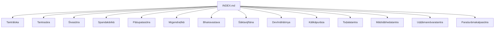
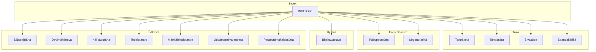
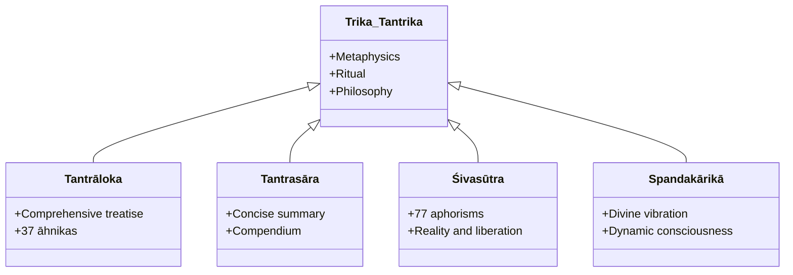
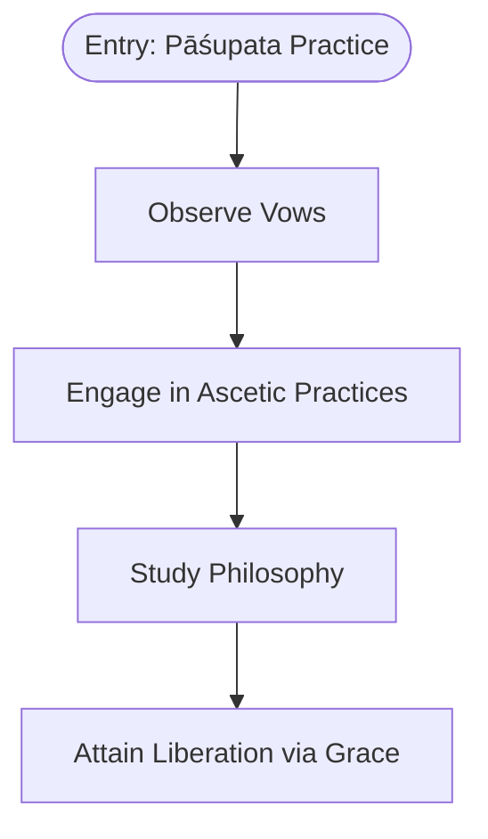
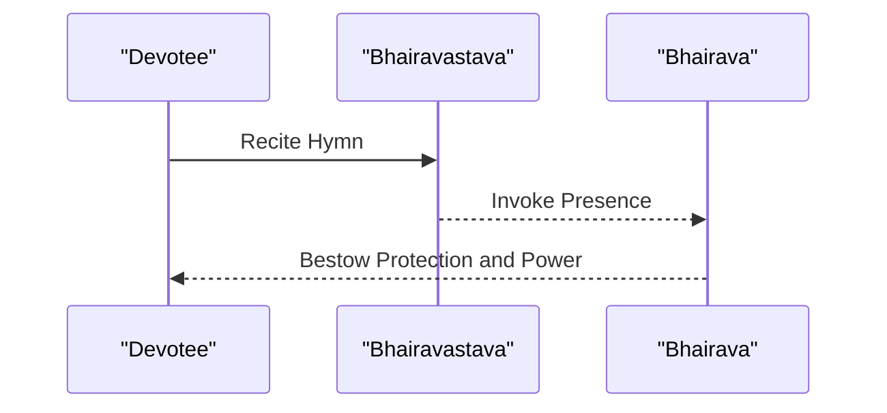
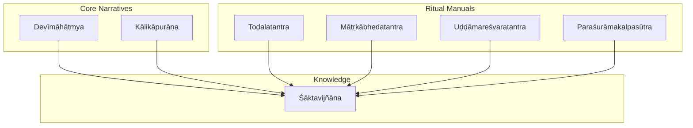
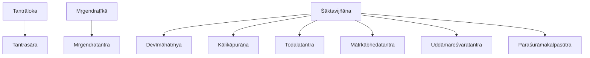

<cite>
**Referenced Files in This Document**
- [INDEX.md](file://INDEX.md)
- [Tantrāloka](file://tantraloka.md)
- [Tantrasāra](file://tantrasara.md)
- [Śivasūtra](file://sivasutra.md)
- [Spandakārikā](file://spandakarika.md)
- [Pāśupatasūtra](file://pasupatasutra.md)
- [Mṛgendraṭīkā](file://mrgendratika.md)
- [Bhairavastava](file://bhairavastava.md)
- [Śāktavijñāna](file://saktavijnana.md)
- [Devīmāhātmya](file://devimahatmya.md)
- [Kālikāpurāṇa](file://kalikapurana.md)
- [Toḍalatantra](file://todalatantra.md)
- [Mātṛkābhedatantra](file://matrkabhedatantra.md)
- [Uḍḍāmareśvaratantra](file://uddamaresvaratantra.md)
- [Paraśurāmakalpasūtra](file://parasuramakalpasutra.md)
</cite>

## Table of Contents
1. Introduction
2. Project Structure
3. Core Components
4. Architecture Overview
5. Detailed Component Analysis
6. Dependency Analysis
7. Performance Considerations
8. Troubleshooting Guide
9. Conclusion
10. Appendices

## Introduction
This document provides a comprehensive overview of Śaiva and Śākta Tantric traditions as represented in the repository’s Sanskrit text collection. It focuses on key texts such as Tantrāloka, Śivasūtra, Pāśupatasūtra, and Śāktavijñāna, and explains their metaphysics, cosmology, soteriology, ritual practices, and meditation techniques. It also highlights computational linguistics insights derived from lemma frequency and similarity analyses across these texts.

The repository organizes 260 topics spanning Vedic literature, Upaniṣads, Dharmaśāstra, grammar, kāvya, Buddhism, Jainism, Tantra, Yoga, Āyurveda, and Purāṇas. Within this corpus, the Śaiva-Śākta materials include foundational aphorisms, commentaries, hymns, and tantric manuals that together map the philosophical and practical landscape of non-dual Śaivism (Trika), early ascetic Śaivism (Pāśupata), and Goddess-centered Śāktism.

## Project Structure
The project is organized by topic with each file representing a specific text or concept. For Śaiva-Śākta Tantra, the relevant files include:
- Foundational Trika texts: Tantrāloka, Tantrasāra, Śivasūtra, Spandakārikā
- Early Śaivism: Pāśupatasūtra and its commentary Mṛgendraṭīkā
- Hymnic and devotional material: Bhairavastava
- Śākta core and manuals: Śāktavijñāna, Devīmāhātmya, Kālikāpurāṇa, Toḍalatantra, Mātṛkābhedatantra, Uḍḍāmareśvaratantra, Paraśurāmakalpasūtra
- Index and cross-references: INDEX.md

**Diagram sources**
- [INDEX.md:1-277](file://INDEX.md#L1-L277)

**Section sources**
- [INDEX.md:1-277](file://INDEX.md#L1-L277)

## Core Components
This section outlines the principal components of Śaiva-Śākta Tantra present in the repository and their roles within the tradition.

- Trika (Non-dual Śaivism):
  - Tantrāloka: Comprehensive treatise on Kashmir Śaivism covering metaphysics, ritual, and philosophy.
  - Tantrasāra: Concise summary of Tantrāloka, serving as a compendium for study and practice.
  - Śivasūtra: Foundational aphorisms on ultimate reality, consciousness, and liberation.
  - Spandakārikā: Verses on divine vibration (spanda) as the dynamic principle of consciousness.

- Early Śaivism:
  - Pāśupatasūtra: Aphorisms prescribing vows, practices, and philosophy of the earliest Śaiva ascetic order.
  - Mṛgendraṭīkā: Commentary elucidating Śaiva Siddhānta doctrines, rituals, and concepts.

- Hymnic and Devotional:
  - Bhairavastava: Hymn to Bhairava, emphasizing protection, destruction of evil, and tantric practice.

- Śāktism (Goddess-centered):
  - Śāktavijñāna: Knowledge of Śāktism focusing on Goddess worship.
  - Devīmāhātmya: Foundational narrative of the Goddess’s victories and power.
  - Kālikāpurāṇa: Upapurāṇa devoted to Kālī, describing yoginīs and sacred geography.
  - Toḍalatantra: Text devoted to Tārā, including rituals, mantras, and Mahāvidyās.
  - Mātṛkābhedatantra: Manual on worship of Mātṛkās, yantras, mantras, and rituals.
  - Uḍḍāmareśvaratantra: Bhairava tradition text on Goddess worship, mantras, and sādhanā.
  - Paraśurāmakalpasūtra: Śrīvidyā manual prescribing rituals, mantra sādhanā, and Goddess worship.

**Section sources**
- [Tantrāloka:1-48](file://tantraloka.md#L1-L48)
- [Tantrasāra:1-48](file://tantrasara.md#L1-L48)
- [Śivasūtra:1-12](file://sivasutra.md#L1-L12)
- [Spandakārikā:1-30](file://spandakarika.md#L1-L30)
- [Pāśupatasūtra:1-30](file://pasupatasutra.md#L1-L30)
- [Mṛgendraṭīkā:1-48](file://mrgendratika.md#L1-L48)
- [Bhairavastava:1-40](file://bhairavastava.md#L1-L40)
- [Śāktavijñāna:1-12](file://saktavijnana.md#L1-L12)
- [Devīmāhātmya:1-30](file://devimahatmya.md#L1-L30)
- [Kālikāpurāṇa:1-48](file://kalikapurana.md#L1-L48)
- [Toḍalatantra:1-48](file://todalatantra.md#L1-L48)
- [Mātṛkābhedatantra:1-48](file://matrkabhedatantra.md#L1-L48)
- [Uḍḍāmareśvaratantra:1-48](file://uddamaresvaratantra.md#L1-L48)
- [Paraśurāmakalpasūtra:1-48](file://parasuramakalpasutra.md#L1-L48)

## Architecture Overview
The repository’s architecture reflects a layered structure of primary texts, commentaries, and related materials. The index serves as a central hub linking all topics, while individual files provide focused content on specific texts.

**Diagram sources**
- [INDEX.md:1-277](file://INDEX.md#L1-L277)
- [Tantrāloka:1-48](file://tantraloka.md#L1-L48)
- [Tantrasāra:1-48](file://tantrasara.md#L1-L48)
- [Śivasūtra:1-12](file://sivasutra.md#L1-L12)
- [Spandakārikā:1-30](file://spandakarika.md#L1-L30)
- [Pāśupatasūtra:1-30](file://pasupatasutra.md#L1-L30)
- [Mṛgendraṭīkā:1-48](file://mrgendratika.md#L1-L48)
- [Bhairavastava:1-40](file://bhairavastava.md#L1-L40)
- [Śāktavijñāna:1-12](file://saktavijnana.md#L1-L12)
- [Devīmāhātmya:1-30](file://devimahatmya.md#L1-L30)
- [Kālikāpurāṇa:1-48](file://kalikapurana.md#L1-L48)
- [Toḍalatantra:1-48](file://todalatantra.md#L1-L48)
- [Mātṛkābhedatantra:1-48](file://matrkabhedatantra.md#L1-L48)
- [Uḍḍāmareśvaratantra:1-48](file://uddamaresvaratantra.md#L1-L48)
- [Paraśurāmakalpasūtra:1-48](file://parasuramakalpasutra.md#L1-L48)

## Detailed Component Analysis

### Trika (Non-dual Śaivism)
Trika represents the non-dual Śaiva tradition centered on consciousness and its dynamic expression. Key texts include:
- Tantrāloka: Comprehensive treatment of metaphysics, ritual, and philosophy.
- Tantrasāra: Summary of Tantrāloka, useful for study and practice.
- Śivasūtra: Foundational aphorisms on reality, consciousness, and liberation.
- Spandakārikā: Verses on spanda (divine vibration) as the principle of ultimate reality.

**Diagram sources**
- [Tantrāloka:1-48](file://tantraloka.md#L1-L48)
- [Tantrasāra:1-48](file://tantrasara.md#L1-L48)
- [Śivasūtra:1-12](file://sivasutra.md#L1-L12)
- [Spandakārikā:1-30](file://spandakarika.md#L1-L30)

**Section sources**
- [Tantrāloka:1-48](file://tantraloka.md#L1-L48)
- [Tantrasāra:1-48](file://tantrasara.md#L1-L48)
- [Śivasūtra:1-12](file://sivasutra.md#L1-L12)
- [Spandakārikā:1-30](file://spandakarika.md#L1-L30)

### Early Śaivism (Pāśupata)
The Pāśupata tradition emphasizes ascetic discipline, vows, and philosophical inquiry into liberation through Śiva’s grace.

**Diagram sources**
- [Pāśupatasūtra:1-30](file://pasupatasutra.md#L1-L30)
- [Mṛgendraṭīkā:1-48](file://mrgendratika.md#L1-L48)

**Section sources**
- [Pāśupatasūtra:1-30](file://pasupatasutra.md#L1-L30)
- [Mṛgendraṭīkā:1-48](file://mrgendratika.md#L1-L48)

### Hymnic and Devotional (Bhairava)
Bhairava represents the fierce aspect of Śiva associated with protection and tantric practice.

**Diagram sources**
- [Bhairavastava:1-40](file://bhairavastava.md#L1-L40)

**Section sources**
- [Bhairavastava:1-40](file://bhairavastava.md#L1-L40)

### Śāktism (Goddess-Centered)
Śāktism centers on the Goddess as supreme reality and power. Texts include foundational narratives, ritual manuals, and meditative practices.

**Diagram sources**
- [Devīmāhātmya:1-30](file://devimahatmya.md#L1-L30)
- [Kālikāpurāṇa:1-48](file://kalikapurana.md#L1-L48)
- [Toḍalatantra:1-48](file://todalatantra.md#L1-L48)
- [Mātṛkābhedatantra:1-48](file://matrkabhedatantra.md#L1-L48)
- [Uḍḍāmareśvaratantra:1-48](file://uddamaresvaratantra.md#L1-L48)
- [Paraśurāmakalpasūtra:1-48](file://parasuramakalpasutra.md#L1-L48)
- [Śāktavijñāna:1-12](file://saktavijnana.md#L1-L12)

**Section sources**
- [Devīmāhātmya:1-30](file://devimahatmya.md#L1-L30)
- [Kālikāpurāṇa:1-48](file://kalikapurana.md#L1-L48)
- [Toḍalatantra:1-48](file://todalatantra.md#L1-L48)
- [Mātṛkābhedatantra:1-48](file://matrkabhedatantra.md#L1-L48)
- [Uḍḍāmareśvaratantra:1-48](file://uddamaresvaratantra.md#L1-L48)
- [Paraśurāmakalpasūtra:1-48](file://parasuramakalpasutra.md#L1-L48)
- [Śāktavijñāna:1-12](file://saktavijnana.md#L1-L12)

## Dependency Analysis
The repository exhibits clear dependencies between texts and their commentaries or related materials. For example:
- Mṛgendraṭīkā depends on Mṛgendratantra (not listed here but referenced in context).
- Tantrasāra summarizes Tantrāloka.
- Śāktavijñāna relates to various Śākta manuals and narratives.

**Diagram sources**
- [Tantrāloka:1-48](file://tantraloka.md#L1-L48)
- [Tantrasāra:1-48](file://tantrasara.md#L1-L48)
- [Mṛgendraṭīkā:1-48](file://mrgendratika.md#L1-L48)
- [Śāktavijñāna:1-12](file://saktavijnana.md#L1-L12)
- [Devīmāhātmya:1-30](file://devimahatmya.md#L1-L30)
- [Kālikāpurāṇa:1-48](file://kalikapurana.md#L1-L48)
- [Toḍalatantra:1-48](file://todalatantra.md#L1-L48)
- [Mātṛkābhedatantra:1-48](file://matrkabhedatantra.md#L1-L48)
- [Uḍḍāmareśvaratantra:1-48](file://uddamaresvaratantra.md#L1-L48)
- [Paraśurāmakalpasūtra:1-48](file://parasuramakalpasutra.md#L1-L48)

**Section sources**
- [Tantrāloka:1-48](file://tantraloka.md#L1-L48)
- [Tantrasāra:1-48](file://tantrasara.md#L1-L48)
- [Mṛgendraṭīkā:1-48](file://mrgendratika.md#L1-L48)
- [Śāktavijñāna:1-12](file://saktavijnana.md#L1-L12)
- [Devīmāhātmya:1-30](file://devimahatmya.md#L1-L30)
- [Kālikāpurāṇa:1-48](file://kalikapurana.md#L1-L48)
- [Toḍalatantra:1-48](file://todalatantra.md#L1-L48)
- [Mātṛkābhedatantra:1-48](file://matrkabhedatantra.md#L1-L48)
- [Uḍḍāmareśvaratantra:1-48](file://uddamaresvaratantra.md#L1-L48)
- [Paraśurāmakalpasūtra:1-48](file://parasuramakalpasutra.md#L1-L48)

## Performance Considerations
From a computational linguistics perspective, analyzing lemma frequencies and text similarities can help identify thematic clusters and textual relationships. For instance:
- High-frequency lemmas like tad, ca, api, eva indicate common connective and demonstrative usage across texts.
- Similarity scores (e.g., Tantrāloka and Tantrasāra at 0.6441) suggest strong lexical overlap due to summarization.
- Ritual-focused texts (e.g., Uḍḍāmareśvaratantra) show elevated frequencies of mantra-related terms like mantra, oṃ, jap.

These insights can guide further research into semantic networks, topic modeling, and comparative analysis of tantric vocabulary.

[No sources needed since this section provides general guidance]

## Troubleshooting Guide
When working with these texts, consider the following:
- Ensure correct identification of text types (e.g., sūtra vs. tantra vs. purāṇa) to contextualize content appropriately.
- Use lemma concordances to trace recurring themes and verify interpretations.
- Cross-reference related texts using similarity metrics to build a coherent understanding of doctrinal developments.

**Section sources**
- [INDEX.md:1-277](file://INDEX.md#L1-L277)

## Conclusion
The repository offers a rich corpus of Śaiva-Śākta Tantric texts that illuminate metaphysical doctrines, ritual practices, and meditative techniques. Through systematic analysis of these materials, one can appreciate the diversity and depth of non-dual Śaivism and Goddess-centered Śāktism. Computational linguistics tools enhance this exploration by revealing patterns in vocabulary and thematic relationships across texts.

[No sources needed since this section summarizes without analyzing specific files]

## Appendices
- Appendix A: Lemma Frequency Highlights
  - Tantrāloka: tad, ca, api, eva, na, yad, iti, idam, ādi, tu
  - Tantrasāra: tad, eva, ca, iti, tva, api, rūpa, tatra, tā, ādi
  - Pāśupatasūtra: ca, sarva, vā, bhū, idam, na, brahman, rudra, nitya, yoga
  - Bhairavastava: tvad, mad, maya, nātha, idam, as, ātman, eva, para, amṛta
  - Kālikāpurāṇa: ca, tad, tu, mantra, pā, tathā, mad, na, tatas, sarva
  - Toḍalatantra: ca, devī, tad, tatas, vac, eva, śrī, śiva, tu, mantra
  - Mātṛkābhedatantra: ca, tad, na, devī, bhū, eva, vac, śrī, yad, kṛ
  - Uḍḍāmareśvaratantra: bhū, ca, tad, mantra, kṛ, svāhā, idam, yad, oṃ, jap
  - Paraśurāmakalpasūtra: tad, iti, namas, ādi, ca, ātman, mantra, uccāray, sarva, mūla

[No sources needed since this appendix lists data already referenced in section sources]
