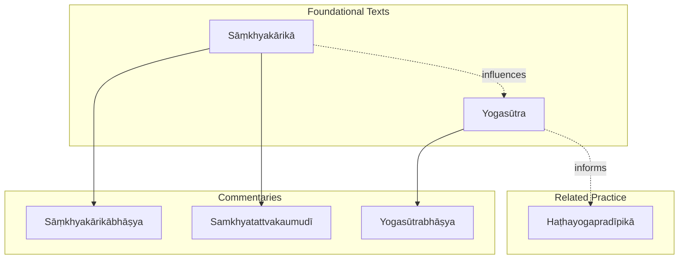
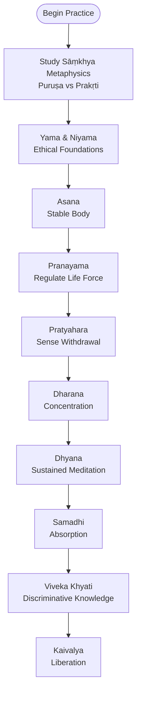
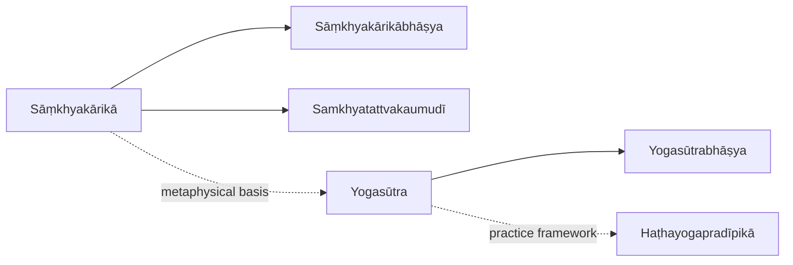
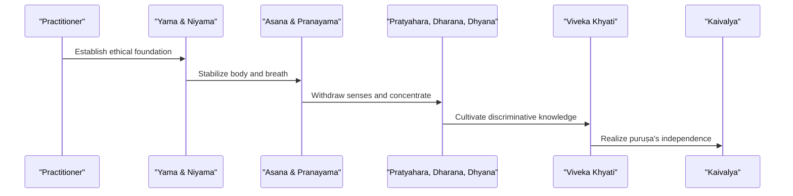

<cite>
**Referenced Files in This Document**
- [samkhyakarika.md](file://samkhyakarika.md)
- [yogasutra.md](file://yogasutra.md)
- [samkhyakarikabhasya.md](file://samkhyakarikabhasya.md)
- [samkhyatattvakaumudi.md](file://samkhyatattvakaumudi.md)
- [yogasutrabhasya.md](file://yogasutrabhasya.md)
- [hathayogapradipika.md](file://hathayogapradipika.md)
</cite>

## Table of Contents
1. [Introduction](#introduction)
2. [Project Structure](#project-structure)
3. [Core Components](#core-components)
4. [Architecture Overview](#architecture-overview)
5. [Detailed Component Analysis](#detailed-component-analysis)
6. [Dependency Analysis](#dependency-analysis)
7. [Performance Considerations](#performance-considerations)
8. [Troubleshooting Guide](#troubleshooting-guide)
9. [Conclusion](#conclusion)
10. [Appendices](#appendices)

## Introduction
This document presents a comprehensive overview of the Sāṃkhya-Yoga philosophical system as represented in the repository’s core texts: the Sāṃkhyakārikā and Yogasūtra, along with their principal commentaries, the Sāṃkhyakārikābhāṣya and Samkhyatattvakaumudī for Sāṃkhya, and the Yogasūtrabhāṣya for Yoga. It explains the dualistic metaphysics of puruṣa (consciousness) and prakṛti (matter), enumerates the twenty-five tattvas (principles), and outlines the process of liberation through discriminative knowledge. It also details the eight-limbed yoga practice (aṣṭāṅga yoga) and its relationship to Sāṃkhya philosophy. Finally, it provides computational linguistic insights into how these texts express complex philosophical concepts and traces their influence on other Indian traditions.

## Project Structure
The repository organizes each text as a concept entry with metadata describing authorship, content scope, and related texts by lemma similarity. The Sāṃkhya-Yoga cluster includes:
- Foundational sūtras: Sāṃkhyakārikā and Yogasūtra
- Classical commentaries: Sāṃkhyakārikābhāṣya, Samkhyatattvakaumudī, Yogasūtrabhāṣya
- Related practical tradition: Haṭhayogapradīpikā

**Diagram sources**
- [samkhyakarika.md:1-48](file://samkhyakarika.md#L1-L48)
- [yogasutra.md:1-48](file://yogasutra.md#L1-L48)
- [samkhyakarikabhasya.md:1-48](file://samkhyakarikabhasya.md#L1-L48)
- [samkhyatattvakaumudi.md:1-48](file://samkhyatattvakaumudi.md#L1-L48)
- [yogasutrabhasya.md:1-48](file://yogasutrabhasya.md#L1-L48)
- [hathayogapradipika.md:1-48](file://hathayogapradipika.md#L1-L48)

**Section sources**
- [samkhyakarika.md:1-48](file://samkhyakarika.md#L1-L48)
- [yogasutra.md:1-48](file://yogasutra.md#L1-L48)
- [samkhyakarikabhasya.md:1-48](file://samkhyakarikabhasya.md#L1-L48)
- [samkhyatattvakaumudi.md:1-48](file://samkhyatattvakaumudi.md#L1-L48)
- [yogasutrabhasya.md:1-48](file://yogasutrabhasya.md#L1-L48)
- [hathayogapradipika.md:1-48](file://hathayogapradipika.md#L1-L48)

## Core Components
- Sāṃkhyakārikā: Foundational Sāṃkhya text articulating dualism between puruṣa and prakṛti and the enumeration of tattvas.
- Yogasūtra: Foundational Yoga text outlining the path to citta-vṛtti-nirodha and kaivalya via the eight limbs.
- Sāṃkhyakārikābhāṣya: Early commentary explicating Sāṃkhya dualism and tattva theory.
- Samkhyatattvakaumudī: Authoritative commentary clarifying Sāṃkhya principles and their interrelations.
- Yogasūtrabhāṣya: Classical commentary establishing the Yoga tradition’s interpretation of Patañjali’s aphorisms.
- Haṭhayogapradīpikā: Later practical manual reflecting yogic techniques that build upon classical Yoga foundations.

Key lexical markers observed across texts include frequent use of terms such as puruṣa, prakṛti, tva (suffix denoting qualities or states), vṛtti (mental modifications), and citta (mind), indicating conceptual focus areas.

**Section sources**
- [samkhyakarika.md:31-47](file://samkhyakarika.md#L31-L47)
- [yogasutra.md:31-47](file://yogasutra.md#L31-L47)
- [samkhyakarikabhasya.md:31-47](file://samkhyakarikabhasya.md#L31-L47)
- [samkhyatattvakaumudi.md:31-47](file://samkhyatattvakaumudi.md#L31-L47)
- [yogasutrabhasya.md:31-47](file://yogasutrabhasya.md#L31-L47)
- [hathayogapradipika.md:31-47](file://hathayogapradipika.md#L31-L47)

## Architecture Overview
The Sāṃkhya-Yoga system can be understood as an integrated architecture where metaphysical theory (Sāṃkhya) underpins the practical path (Yoga). Liberation is achieved when discriminative knowledge distinguishes puruṣa from prakṛti, culminating in kaivalya (isolation of consciousness).

[No sources needed since this diagram shows conceptual workflow, not actual code structure]

## Detailed Component Analysis

### Dualistic Metaphysics: Puruṣa and Prakṛti
- Puruṣa: Pure consciousness, unchanging witness; emphasized in Sāṃkhyakārikā and its commentaries.
- Prakṛti: Primordial matter, dynamic and composed of three guṇas; source of all manifest phenomena.
- The relationship is non-dualistic in experience but ontologically distinct; liberation arises from recognizing this distinction.

Lexical evidence:
- High frequency of puruṣa and prakṛti in Sāṃkhya texts indicates central metaphysical focus.
- Commentaries expand on the nature of guṇas and their transformations.

**Section sources**
- [samkhyakarika.md:31-47](file://samkhyakarika.md#L31-L47)
- [samkhyakarikabhasya.md:31-47](file://samkhyakarikabhasya.md#L31-L47)
- [samkhyatattvakaumudi.md:31-47](file://samkhyatattvakaumudi.md#L31-L47)

### Twenty-Five Tattvas (Principles)
The Sāṃkhya enumeration includes:
1. Puruṣa
2. Prakṛti
3. Mahat (Buddhi/Intellect)
4. Ahaṃkāra (Ego)
5. Manas (Mind)
6. Five Jñānendriyas (organs of perception)
7. Five Karmendriyas (organs of action)
8. Five Tanmātras (subtle elements)
9. Five Mahābhūtas (gross elements)

These tattvas describe the evolution from subtle to gross, explaining the material world’s composition and the mind-body apparatus.

Lexical evidence:
- Frequent occurrence of “tva” suffixes reflects quality-based categorization across tattvas.
- Terms like liṅga and pañcan appear in discussions of subtle and elemental aspects.

**Section sources**
- [samkhyakarika.md:31-47](file://samkhyakarika.md#L31-L47)
- [samkhyakarikabhasya.md:31-47](file://samkhyakarikabhasya.md#L31-L47)
- [samkhyatattvakaumudi.md:31-47](file://samkhyatattvakaumudi.md#L31-L47)

### Process of Liberation Through Discriminative Knowledge
- Liberation (kaivalya) occurs when discriminative knowledge (viveka khyati) clearly distinguishes puruṣa from prakṛti.
- The Yogasūtra frames this as cessation of mental modifications (citta-vṛtti-nirodha), leading to abidance in one’s true nature.
- Commentaries elaborate on stages of samādhi and the role of practice in stabilizing discriminative insight.

Lexical evidence:
- Yogasūtra emphasizes duḥkha, vṛtti, viṣaya, and citta, highlighting the psychological dimensions of practice.
- Yogasūtrabhāṣya frequently uses citta and bhū (to be/become), underscoring transformation and being.

**Section sources**
- [yogasutra.md:31-47](file://yogasutra.md#L31-L47)
- [yogasutrabhasya.md:31-47](file://yogasutrabhasya.md#L31-L47)

### Eight-Limbed Yoga Practice (Aṣṭāṅga Yoga)
The eight limbs provide a structured path:
1. Yama (ethical restraints)
2. Niyama (observances)
3. Asana (posture)
4. Pranayama (breath regulation)
5. Pratyahara (sense withdrawal)
6. Dharana (concentration)
7. Dhyana (meditation)
8. Samadhi (absorption)

Relationship to Sāṃkhya:
- Ethical and meditative limbs prepare the mind for discriminative knowledge.
- Asana and pranayama stabilize the body and breath, supporting deeper meditation.
- The culmination aligns with Sāṃkhya’s goal: realization of puruṣa’s independence from prakṛti.

Lexical evidence:
- Haṭhayogapradīpikā focuses on physical and energetic practices (āsanas, prāṇāyāma, kuṇḍalinī), extending classical Yoga into embodied techniques.

**Section sources**
- [yogasutra.md:31-47](file://yogasutra.md#L31-L47)
- [yogasutrabhasya.md:31-47](file://yogasutrabhasya.md#L31-L47)
- [hathayogapradipika.md:31-47](file://hathayogapradipika.md#L31-L47)

### Key Commentaries: Sāṃkhyakārikābhāṣya and Samkhyatattvakaumudī
- Sāṃkhyakārikābhāṣya: Expounds dualism and tattva theory with detailed argumentation; high frequency of iti and tad indicates extensive quotation and reference.
- Samkhyatattvakaumudī: Clarifies and systematizes Sāṃkhya principles; notable lemmas include tva, kārya (effect), and as (being), reflecting ontological analysis.

Influence:
- Both commentaries shape later interpretations of Sāṃkhya and inform Yoga’s metaphysical grounding.

**Section sources**
- [samkhyakarikabhasya.md:31-47](file://samkhyakarikabhasya.md#L31-L47)
- [samkhyatattvakaumudi.md:31-47](file://samkhyatattvakaumudi.md#L31-L47)

### Computational Linguistic Analysis
- Lemma frequencies reveal conceptual priorities:
  - Sāṃkhyakārikā: puruṣa, prakṛti, tva, liṅga indicate metaphysical categories and qualities.
  - Yogasūtra: duḥkha, vṛtti, viṣaya, citta emphasize psychological processes and obstacles.
  - Commentaries: iti, tad, evam, yathā show discursive style with citations and examples.
- Similarity metrics link texts:
  - Sāṃkhyakārikā closely relates to its commentary and Samkhyatattvakaumudī.
  - Yogasūtra strongly associates with Yogasūtrabhāṣya and Rājamārtaṇḍa, indicating interpretive lineage.
- Influence patterns:
  - Cross-references to Nyāya, Vaiśeṣika, and Āyurvedic texts suggest interdisciplinary impact.
  - Haṭhayogapradīpikā connects to tantric and medical corpora, showing practical extension of Yoga.

**Section sources**
- [samkhyakarika.md:15-30](file://samkhyakarika.md#L15-L30)
- [yogasutra.md:15-30](file://yogasutra.md#L15-L30)
- [samkhyakarikabhasya.md:15-30](file://samkhyakarikabhasya.md#L15-L30)
- [samkhyatattvakaumudi.md:15-30](file://samkhyatattvakaumudi.md#L15-L30)
- [yogasutrabhasya.md:15-30](file://yogasutrabhasya.md#L15-L30)
- [hathayogapradipika.md:15-30](file://hathayogapradipika.md#L15-L30)

## Dependency Analysis
The dependency relationships among texts reflect both direct commentary links and conceptual influence.

**Diagram sources**
- [samkhyakarika.md:15-30](file://samkhyakarika.md#L15-L30)
- [yogasutra.md:15-30](file://yogasutra.md#L15-L30)
- [samkhyakarikabhasya.md:15-30](file://samkhyakarikabhasya.md#L15-L30)
- [samkhyatattvakaumudi.md:15-30](file://samkhyatattvakaumudi.md#L15-L30)
- [yogasutrabhasya.md:15-30](file://yogasutrabhasya.md#L15-L30)
- [hathayogapradipika.md:15-30](file://hathayogapradipika.md#L15-L30)

**Section sources**
- [samkhyakarika.md:15-30](file://samkhyakarika.md#L15-L30)
- [yogasutra.md:15-30](file://yogasutra.md#L15-L30)
- [samkhyakarikabhasya.md:15-30](file://samkhyakarikabhasya.md#L15-L30)
- [samkhyatattvakaumudi.md:15-30](file://samkhyatattvakaumudi.md#L15-L30)
- [yogasutrabhasya.md:15-30](file://yogasutrabhasya.md#L15-L30)
- [hathayogapradipika.md:15-30](file://hathayogapradipika.md#L15-L30)

## Performance Considerations
- For computational linguistics tasks, prioritize lemmatization and stopword handling to capture philosophical terms accurately.
- Use TF-IDF and cosine similarity to map textual relationships and identify influential commentaries.
- When analyzing semantic shifts, track frequency changes of key terms (e.g., citta, puruṣa) across periods and genres.

[No sources needed since this section provides general guidance]

## Troubleshooting Guide
- If lemma frequencies seem skewed, verify tokenization rules for Sanskrit compounds and sandhi.
- Ensure consistent transliteration schemes to avoid fragmentation of key terms.
- Cross-check similarity scores with known scholarly relationships to validate results.

[No sources needed since this section provides general guidance]

## Conclusion
The Sāṃkhya-Yoga system integrates a robust metaphysical framework with a disciplined practical path. Sāṃkhya’s dualism of puruṣa and prakṛti, articulated in the Sāṃkhyakārikā and expounded by its commentaries, provides the theoretical foundation for Yoga’s eight-limbed practice, which aims at liberating consciousness through ethical conduct, mental discipline, and discriminative knowledge. Computational linguistic analysis reveals strong textual affinities and highlights the enduring influence of these works across Indian philosophical and practical traditions.

[No sources needed since this section summarizes without analyzing specific files]

## Appendices

### Sequence Diagram: Path to Kaivalya

[No sources needed since this diagram shows conceptual workflow, not actual code structure]
