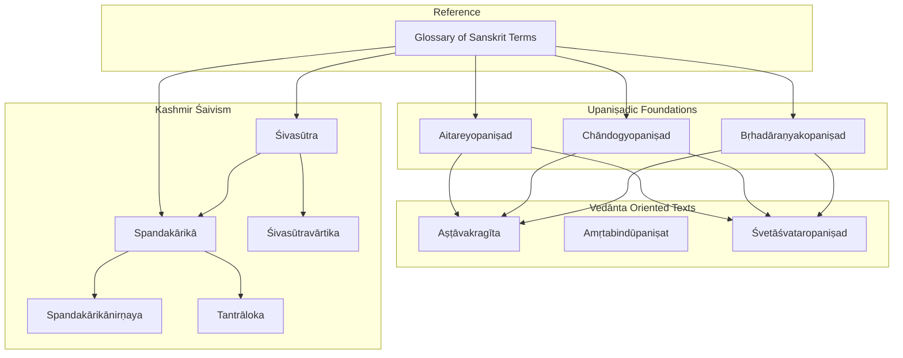
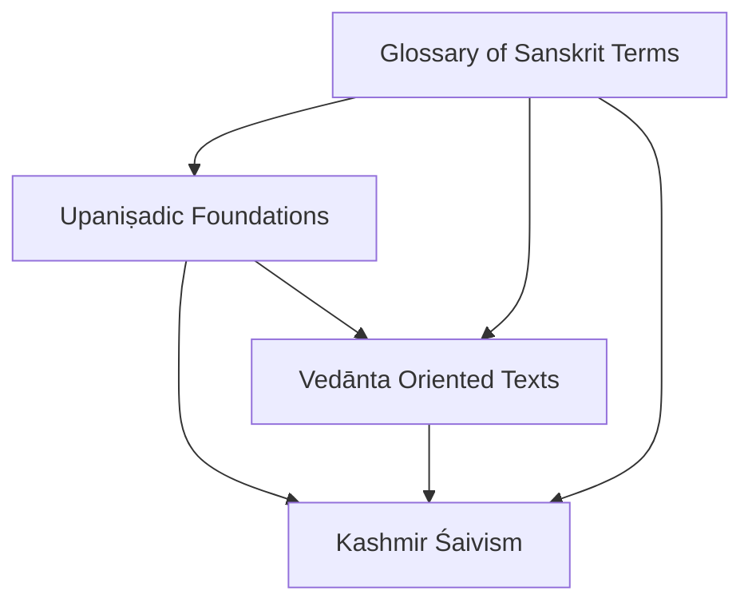
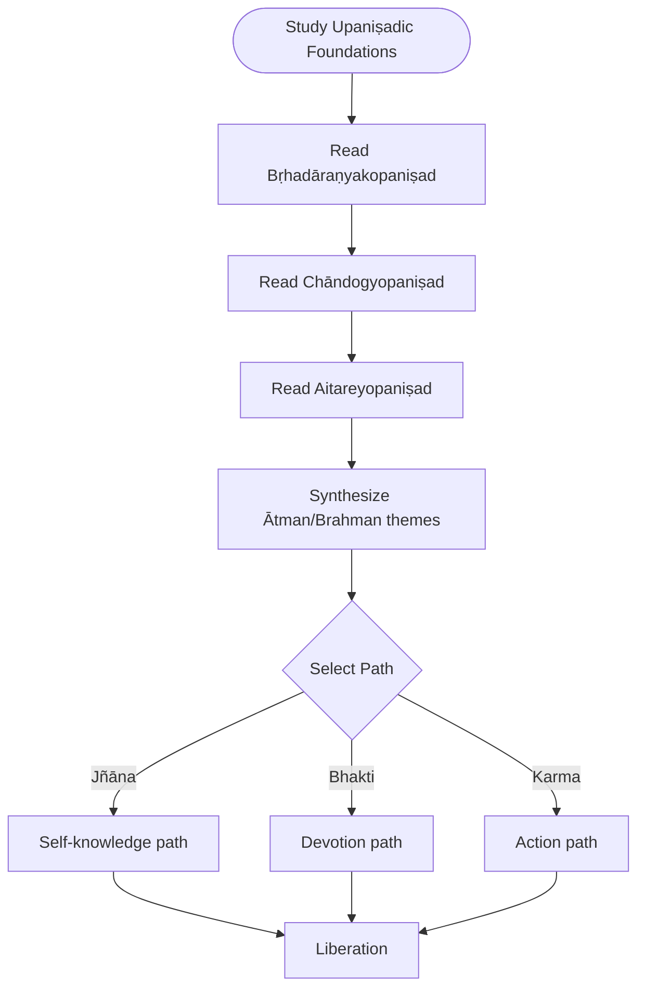
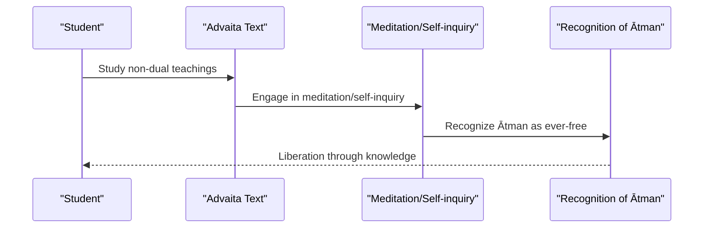
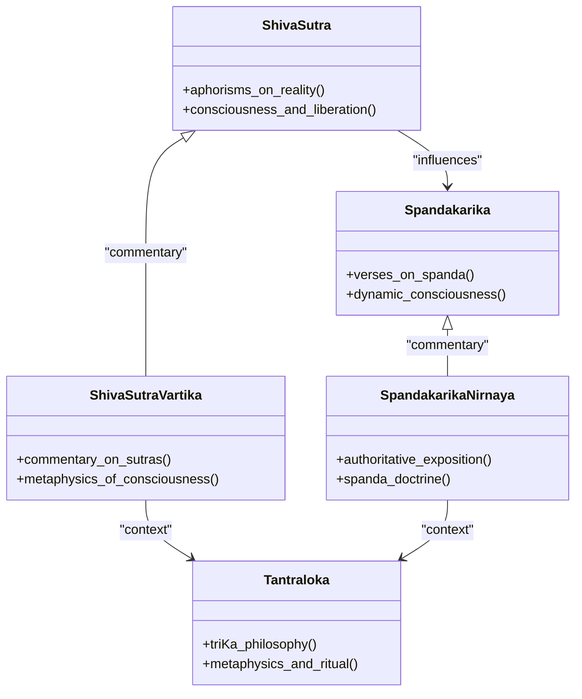
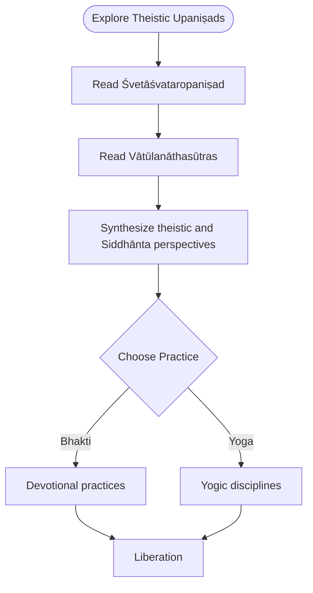
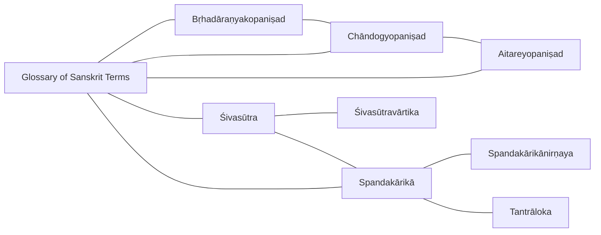
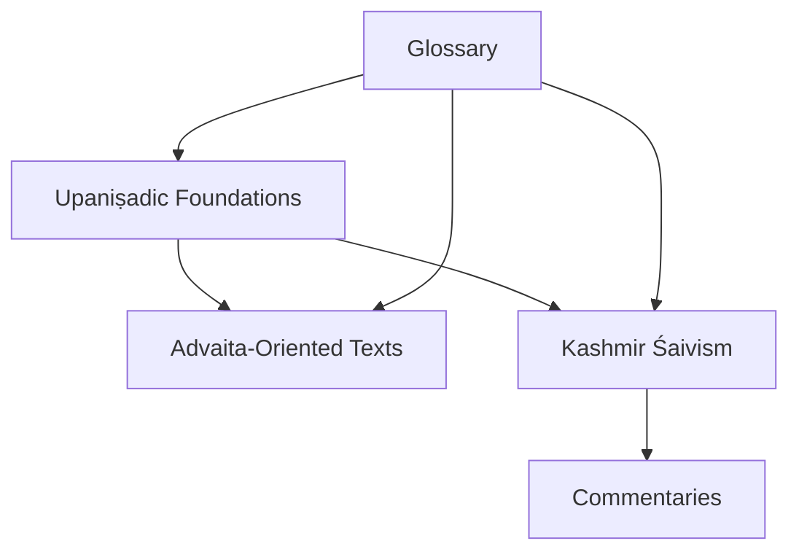

<cite>
**Referenced Files in This Document**
- [brhadaranyakopanisad.md](file://brhadaranyakopanisad.md)
- [chandogyopanisad.md](file://chandogyopanisad.md)
- [aitareyopanisad.md](file://aitareyopanisad.md)
- [spandakarika.md](file://spandakarika.md)
- [sivasutra.md](file://sivasutra.md)
- [sivasutravartika.md](file://sivasutravartika.md)
- [spandakarikanirnaya.md](file://spandakarikanirnaya.md)
- [tantraloka.md](file://tantraloka.md)
- [glossary-of-sanskrit-terms.md](file://glossary-of-sanskrit-terms.md)
- [astavakragita.md](file://astavakragita.md)
- [amrtabindupanisat.md](file://amrtabindupanisat.md)
- [svetasvataropanisad.md](file://svetasvataropanisad.md)
- [vatulanathasutras.md](file://vatulanathasutras.md)
</cite>

## Table of Contents
1. Introduction
2. Project Structure
3. Core Components
4. Architecture Overview
5. Detailed Component Analysis
6. Dependency Analysis
7. Performance Considerations
8. Troubleshooting Guide
9. Conclusion
10. Appendices

## Introduction
This document provides a comprehensive overview of Vedānta philosophical schools and their Upaniṣadic foundations, with attention to later systematic developments and the Spanda school of Kashmir Śaivism. It synthesizes key concepts such as Brahman, Ātman, māyā, avidyā, and paths to liberation (jñāna, bhakti, karma), grounded in foundational Upaniṣads like Bṛhadāraṇyaka, Chāndogya, and Aitareya. It also offers computational linguistics insights into how different traditions use similar Sanskrit terminology with varying interpretations, drawing on lemma frequency and related-text similarity from the repository’s indexed texts.

## Project Structure
The repository organizes primary texts and commentaries as individual markdown entries, each tagged with metadata (type, tags, knowledge-bank, sources). For this project:
- Upaniṣadic foundations are represented by dedicated files for Bṛhadāraṇyaka, Chāndogya, and Aitareya.
- Non-dual and devotional strands include Advaita-oriented works (e.g., Aṣṭāvakragīta, Amṛtabindūpaniṣat) and theistic Upaniṣads (e.g., Śvetāśvataropaniṣad).
- Kashmir Śaivism is covered through core texts (Śivasūtra, Spandakārikā) and authoritative commentaries (Śivasūtravārtika, Spandakārikānirṇaya, Tantrāloka).
- A glossary provides conceptual vocabulary across Vedānta, Yoga, Tantra, and Bhakti traditions.

**Diagram sources**
- [brhadaranyakopanisad.md:1-48](file://brhadaranyakopanisad.md#L1-L48)
- [chandogyopanisad.md:1-48](file://chandogyopanisad.md#L1-L48)
- [aitareyopanisad.md:1-87](file://aitareyopanisad.md#L1-L87)
- [astavakragita.md:1-32](file://astavakragita.md#L1-L32)
- [amrtabindupanisat.md:1-29](file://amrtabindupanisat.md#L1-L29)
- [svetasvataropanisad.md:1-12](file://svetasvataropanisad.md#L1-L12)
- [sivasutra.md:1-12](file://sivasutra.md#L1-L12)
- [spandakarika.md:1-30](file://spandakarika.md#L1-L30)
- [sivasutravartika.md:1-12](file://sivasutravartika.md#L1-L12)
- [spandakarikanirnaya.md:1-48](file://spandakarikanirnaya.md#L1-L48)
- [tantraloka.md:1-48](file://tantraloka.md#L1-L48)
- [glossary-of-sanskrit-terms.md:1-64](file://glossary-of-sanskrit-terms.md#L1-L64)

**Section sources**
- [brhadaranyakopanisad.md:1-48](file://brhadaranyakopanisad.md#L1-L48)
- [chandogyopanisad.md:1-48](file://chandogyopanisad.md#L1-L48)
- [aitareyopanisad.md:1-87](file://aitareyopanisad.md#L1-L87)
- [glossary-of-sanskrit-terms.md:1-64](file://glossary-of-sanskrit-terms.md#L1-L64)

## Core Components
- Foundational Upaniṣads:
  - Bṛhadāraṇyakopaniṣad: Longest principal Upaniṣad; profound teachings on Ātman and Brahman.
  - Chāndogyopaniṣad: Contains essential non-dual teaching “That Thou Art.”
  - Aitareyopaniṣad: Creation narrative centered on Ātman; doctrine of three births and liberation beyond them.
- Vedānta-oriented texts:
  - Aṣṭāvakragīta: Radical non-dual dialogue emphasizing direct self-knowledge.
  - Amṛtabindūpaniṣat: Yoga Upaniṣad focusing on meditation on Oṃkāra and realization of supreme Brahman.
  - Śvetāśvataropaniṣad: Theistic synthesis focused on Rudra-Śiva as supreme Lord.
- Kashmir Śaivism:
  - Śivasūtra: Foundational aphorisms on ultimate reality, consciousness, and liberation.
  - Spandakārikā: Verses on spanda (dynamic consciousness) as the principle of reality.
  - Śivasūtravārtika: Commentary elaborating metaphysics of consciousness and liberation.
  - Spandakārikānirṇaya: Authoritative commentary by Kṣemarāja on the Spanda doctrine.
  - Tantrāloka: Comprehensive treatise by Abhinavagupta on Trika philosophy, metaphysics, and ritual.
- Reference:
  - Glossary of Sanskrit Terms: Conceptual vocabulary spanning Vedānta, Yoga, Tantra, and Bhakti.

**Section sources**
- [brhadaranyakopanisad.md:1-48](file://brhadaranyakopanisad.md#L1-L48)
- [chandogyopanisad.md:1-48](file://chandogyopanisad.md#L1-L48)
- [aitareyopanisad.md:1-87](file://aitareyopanisad.md#L1-L87)
- [astavakragita.md:1-32](file://astavakragita.md#L1-L32)
- [amrtabindupanisat.md:1-29](file://amrtabindupanisat.md#L1-L29)
- [svetasvataropanisad.md:1-12](file://svetasvataropanisad.md#L1-L12)
- [sivasutra.md:1-12](file://sivasutra.md#L1-L12)
- [spandakarika.md:1-30](file://spandakarika.md#L1-L30)
- [sivasutravartika.md:1-12](file://sivasutravartika.md#L1-L12)
- [spandakarikanirnaya.md:1-48](file://spandakarikanirnaya.md#L1-L48)
- [tantraloka.md:1-48](file://tantraloka.md#L1-L48)
- [glossary-of-sanskrit-terms.md:1-64](file://glossary-of-sanskrit-terms.md#L1-L64)

## Architecture Overview
Conceptually, the repository models a layered architecture:
- Base layer: Upaniṣadic foundations (Bṛhadāraṇyaka, Chāndogya, Aitareya).
- Middle layer: Systematic Vedānta orientations (non-dual Advaita, theistic Upaniṣads).
- Upper layer: Kashmir Śaivism (Spanda and Trika), including core texts and authoritative commentaries.
- Cross-cutting reference: Glossary providing shared vocabulary and conceptual anchors.

[No sources needed since this diagram shows conceptual workflow, not actual code structure]

## Detailed Component Analysis

### Upaniṣadic Foundations
- Bṛhadāraṇyakopaniṣad: Emphasizes Ātman and Brahman; high-frequency lemmas reflect its dense philosophical discourse.
- Chāndogyopaniṣad: Central non-dual declaration “That Thou Art”; frequent lemmas indicate extensive didactic style.
- Aitareyopaniṣad: Creation narrative via Ātman; introduces three births and liberation beyond them; includes morphological analysis of key terms.

**Section sources**
- [brhadaranyakopanisad.md:1-48](file://brhadaranyakopanisad.md#L1-L48)
- [chandogyopanisad.md:1-48](file://chandogyopanisad.md#L1-L48)
- [aitareyopanisad.md:1-87](file://aitareyopanisad.md#L1-L87)

### Advaita Vedānta Orientation
- Aṣṭāvakragīta: Direct non-dual teaching; emphasizes recognition of already-free consciousness.
- Amṛtabindūpaniṣat: Meditation on Oṃkāra and realization of supreme Brahman; warns against mere scriptural study without practice.

**Section sources**
- [astavakragita.md:1-32](file://astavakragita.md#L1-L32)
- [amrtabindupanisat.md:1-29](file://amrtabindupanisat.md#L1-L29)

### Kashmir Śaivism and the Spanda School
- Śivasūtra: Foundational aphorisms on ultimate reality, consciousness, and liberation.
- Spandakārikā: Verses on spanda (dynamic consciousness) as the principle of reality.
- Śivasūtravārtika: Commentary elaborating metaphysics of consciousness and liberation.
- Spandakārikānirṇaya: Authoritative commentary by Kṣemarāja on the Spanda doctrine.
- Tantrāloka: Comprehensive treatise by Abhinavagupta on Trika philosophy, metaphysics, and ritual.

**Diagram sources**
- [sivasutra.md:1-12](file://sivasutra.md#L1-L12)
- [spandakarika.md:1-30](file://spandakarika.md#L1-L30)
- [sivasutravartika.md:1-12](file://sivasutravartika.md#L1-L12)
- [spandakarikanirnaya.md:1-48](file://spandakarikanirnaya.md#L1-L48)
- [tantraloka.md:1-48](file://tantraloka.md#L1-L48)

**Section sources**
- [sivasutra.md:1-12](file://sivasutra.md#L1-L12)
- [spandakarika.md:1-30](file://spandakarika.md#L1-L30)
- [sivasutravartika.md:1-12](file://sivasutravartika.md#L1-L12)
- [spandakarikanirnaya.md:1-48](file://spandakarikanirnaya.md#L1-L48)
- [tantraloka.md:1-48](file://tantraloka.md#L1-L48)

### Theistic Upaniṣads and Śaiva Siddhānta
- Śvetāśvataropaniṣad: Theistic Upaniṣad synthesizing Sāṃkhya and Yoga, focused on Rudra-Śiva as supreme Lord.
- Vātūlanāthasūtras: Śaiva Siddhānta text of the Vātūla tradition; aphorisms on Śaiva philosophy, yoga, and liberation.

**Section sources**
- [svetasvataropanisad.md:1-12](file://svetasvataropanisad.md#L1-L12)
- [vatulanathasutras.md:1-30](file://vatulanathasutras.md#L1-L30)

### Computational Linguistics Insights
- Lemma frequencies reveal stylistic and thematic emphasis:
  - Bṛhadāraṇyakopaniṣad and Chāndogyopaniṣad show high usage of demonstratives and particles indicative of didactic exposition.
  - Aitareyopaniṣad’s creation narrative uses specific lemmas tied to cosmology and selfhood.
  - Kashmir Śaivism texts (Spandakārikā, Tantrāloka) exhibit rich lexical patterns around consciousness and dynamic reality.
- Related-text similarity highlights conceptual proximity:
  - Upaniṣads cluster together, indicating shared vocabulary and themes.
  - Kashmir Śaivism texts cluster with commentaries and broader tantric literature.
  - Glossary serves as a cross-reference anchor across traditions.

**Diagram sources**
- [brhadaranyakopanisad.md:1-48](file://brhadaranyakopanisad.md#L1-L48)
- [chandogyopanisad.md:1-48](file://chandogyopanisad.md#L1-L48)
- [aitareyopanisad.md:1-87](file://aitareyopanisad.md#L1-L87)
- [sivasutra.md:1-12](file://sivasutra.md#L1-L12)
- [spandakarika.md:1-30](file://spandakarika.md#L1-L30)
- [spandakarikanirnaya.md:1-48](file://spandakarikanirnaya.md#L1-L48)
- [sivasutravartika.md:1-12](file://sivasutravartika.md#L1-L12)
- [tantraloka.md:1-48](file://tantraloka.md#L1-L48)
- [glossary-of-sanskrit-terms.md:1-64](file://glossary-of-sanskrit-terms.md#L1-L64)

**Section sources**
- [brhadaranyakopanisad.md:1-48](file://brhadaranyakopanisad.md#L1-L48)
- [chandogyopanisad.md:1-48](file://chandogyopanisad.md#L1-L48)
- [aitareyopanisad.md:1-87](file://aitareyopanisad.md#L1-L87)
- [spandakarika.md:1-30](file://spandakarika.md#L1-L30)
- [spandakarikanirnaya.md:1-48](file://spandakarikanirnaya.md#L1-L48)
- [tantraloka.md:1-48](file://tantraloka.md#L1-L48)
- [glossary-of-sanskrit-terms.md:1-64](file://glossary-of-sanskrit-terms.md#L1-L64)

## Dependency Analysis
- Upaniṣadic texts form the conceptual base for both Advaita-oriented and theistic streams.
- Kashmir Śaivism builds upon Upaniṣadic vocabulary while introducing distinct metaphysical emphases (spanda, Trika).
- Commentaries depend on core texts to elaborate doctrines and provide interpretive frameworks.
- The glossary acts as a shared lexicon enabling cross-traditional understanding.

[No sources needed since this diagram shows conceptual relationships, not specific file mappings]

## Performance Considerations
- Reading strategy:
  - Begin with Upaniṣadic foundations to establish core vocabulary and themes.
  - Progress to systematized texts (Advaita-oriented or Kashmir Śaivism) based on interest.
  - Use the glossary to clarify terminology and cross-reference concepts.
- Lexical analysis:
  - Focus on high-frequency lemmas to identify thematic emphasis.
  - Compare related-text similarity to map conceptual proximity across traditions.

[No sources needed since this section provides general guidance]

## Troubleshooting Guide
- If encountering unfamiliar terminology:
  - Consult the glossary for concise definitions and cross-references.
  - Review lemma indices to see contextual usage within specific texts.
- If navigating complex commentaries:
  - Start with core texts (e.g., Śivasūtra, Spandakārikā) before engaging commentaries (e.g., Śivasūtravārtika, Spandakārikānirṇaya).
- If comparing schools:
  - Use related-text similarity tables to identify overlapping vocabulary and divergent emphases.

**Section sources**
- [glossary-of-sanskrit-terms.md:1-64](file://glossary-of-sanskrit-terms.md#L1-L64)
- [spandakarikanirnaya.md:1-48](file://spandakarikanirnaya.md#L1-L48)
- [sivasutravartika.md:1-12](file://sivasutravartika.md#L1-L12)

## Conclusion
The repository provides a structured pathway from Upaniṣadic foundations to systematic Vedānta orientations and Kashmir Śaivism, enriched by a shared glossary and computational insights into lexical patterns. By studying the foundational Upaniṣads and progressing to specialized texts and commentaries, readers can appreciate how similar Sanskrit terminology is employed across traditions with distinct interpretations, supporting both philosophical understanding and linguistic analysis.

[No sources needed since this section summarizes without analyzing specific files]

## Appendices

### Key Concepts Across Traditions
- Brahman: Ultimate reality; interpreted variously as non-dual absolute (Advaita) or personal supreme (theistic traditions).
- Ātman: Self; identified with Brahman in non-dual frameworks; distinguished in dualistic or qualified non-dual frameworks.
- Māyā/Avidyā: Illusion/ignorance; explained differently across schools regarding the nature of appearance and reality.
- Paths to Liberation:
  - Jñāna: Knowledge-based path emphasizing self-realization.
  - Bhakti: Devotion-based path emphasizing love and surrender.
  - Karma: Action-based path emphasizing righteous duty and purification.

**Section sources**
- [glossary-of-sanskrit-terms.md:1-64](file://glossary-of-sanskrit-terms.md#L1-L64)
- [astavakragita.md:1-32](file://astavakragita.md#L1-L32)
- [amrtabindupanisat.md:1-29](file://amrtabindupanisat.md#L1-L29)
- [svetasvataropanisad.md:1-12](file://svetasvataropanisad.md#L1-L12)
