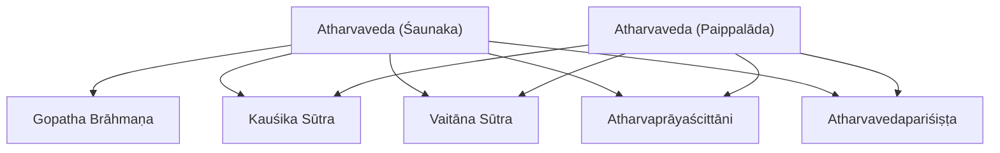
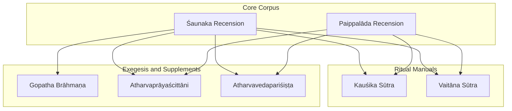
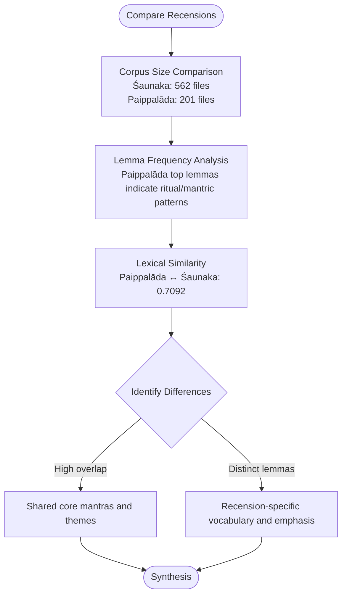
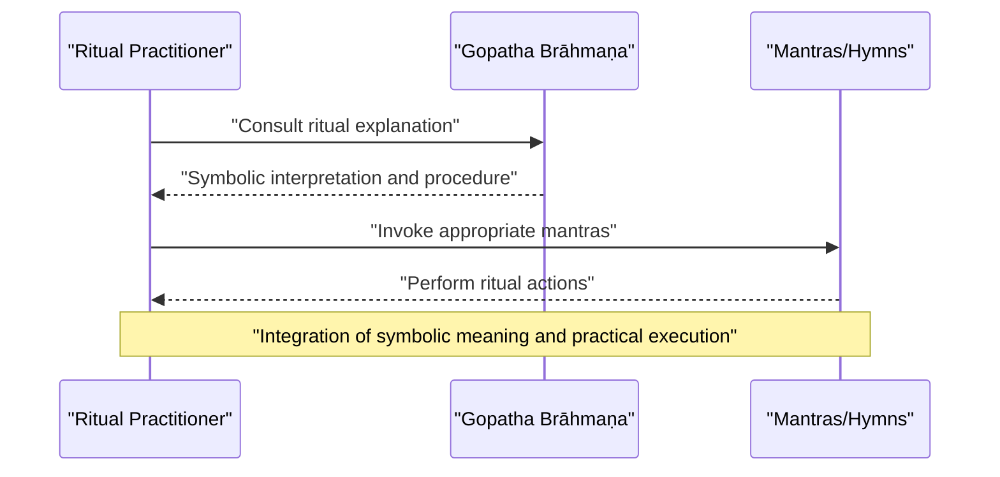
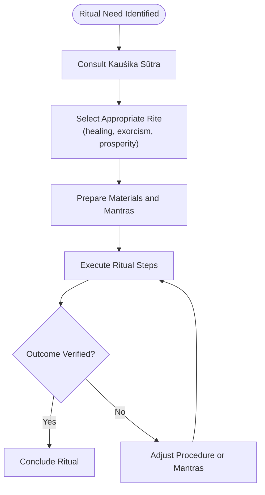
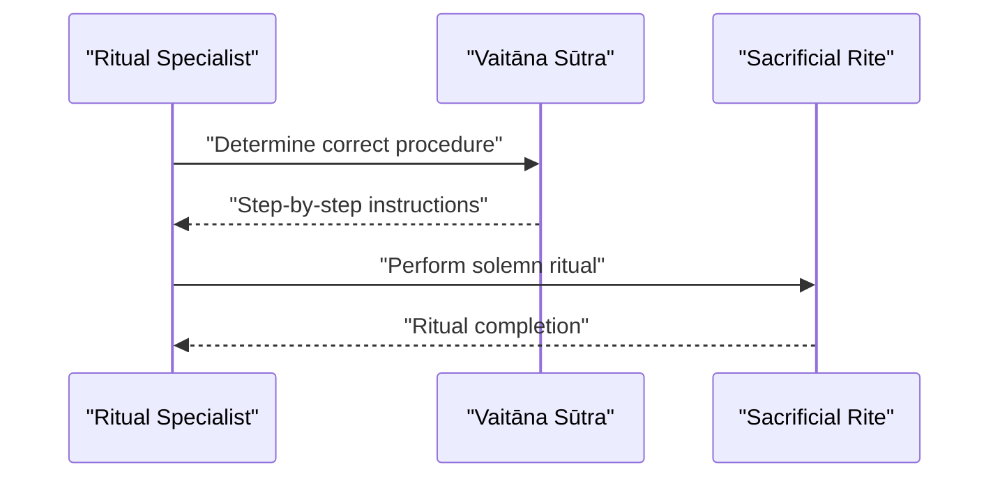
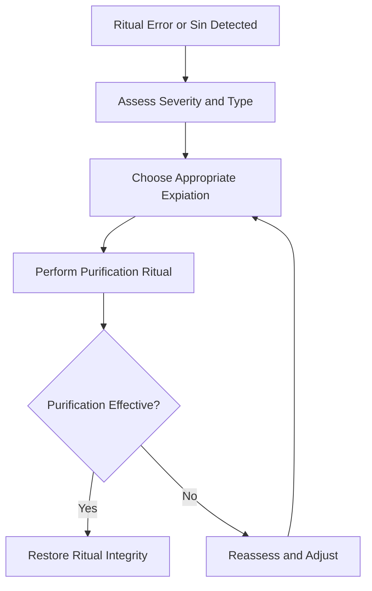
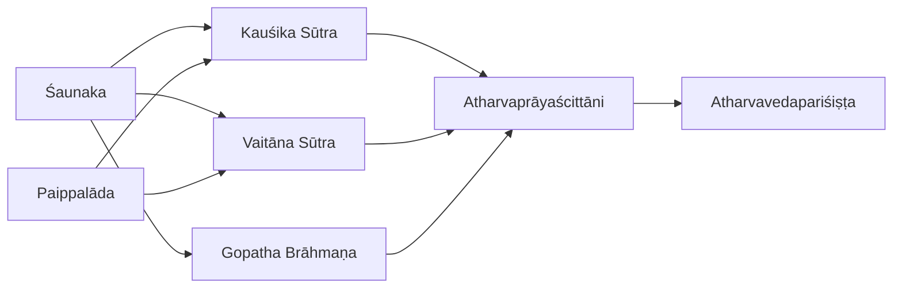

<cite>
**Referenced Files in This Document**
- [atharvaveda-saunaka.md](file://atharvaveda-saunaka.md)
- [atharvaveda-paippalada.md](file://atharvaveda-paippalada.md)
- [gopathabrahmana.md](file://gopathabrahmana.md)
- [kausikasutra.md](file://kausikasutra.md)
- [atavaprayascittani.md](file://atavaprayascittani.md)
- [vaitanasutra.md](file://vaitanasutra.md)
- [atharvavedaparisishta.md](file://atharvavedaparisishta.md)
- [INDEX.md](file://INDEX.md)
</cite>

## Table of Contents
1. [Introduction](#introduction)
2. [Project Structure](#project-structure)
3. [Core Components](#core-components)
4. [Architecture Overview](#architecture-overview)
5. [Detailed Component Analysis](#detailed-component-analysis)
6. [Dependency Analysis](#dependency-analysis)
7. [Performance Considerations](#performance-considerations)
8. [Troubleshooting Guide](#troubleshooting-guide)
9. [Conclusion](#conclusion)

## Introduction
This document presents a comprehensive overview of the Atharvaveda traditions preserved in the repository, focusing on the two surviving recensions—Śaunaka and Paippalāda—and their associated ritual and exegetical literature. It explains the Gopatha Brāhmaṇa as the sole surviving Brāhmaṇa of the Atharvaveda, outlines the Kauśika Sūtra as the principal manual for domestic and magical rites, and documents the Ati-prāyaścittāni (expiatory rites), Vaitāna Sūtra (solemn rituals), and Atharvaveda Pariśiṣṭa (supplementary texts). It also highlights computational insights available in the repository that reveal differences between recensions and patterns in magical formulas through lemma frequency and similarity metrics.

## Project Structure
The repository organizes each text as a concept file with metadata describing its scope, corpus size (in CoNLL-U files), related texts by lexical similarity, and notable lemmas. For the Atharvaveda tradition, the relevant entries include:
- The Śaunaka and Paippalāda recensions of the Atharvaveda
- The Gopatha Brāhmaṇa
- The Kauśika Sūtra
- The Vaitāna Sūtra
- The Atharvaprāyaścittāni
- The Atharvavedapariśiṣṭa

**Diagram sources**
- [atharvaveda-saunaka.md:1-12](file://atharvaveda-saunaka.md#L1-L12)
- [atharvaveda-paippalada.md:1-48](file://atharvaveda-paippalada.md#L1-L48)
- [gopathabrahmana.md:1-48](file://gopathabrahmana.md#L1-L48)
- [kausikasutra.md:1-48](file://kausikasutra.md#L1-L48)
- [vaitanasutra.md:1-48](file://vaitanasutra.md#L1-L48)
- [atavaprayascittani.md:1-12](file://atavaprayascittani.md#L1-L12)
- [atharvavedaparisishta.md:1-12](file://atharvavedaparisishta.md#L1-L12)

**Section sources**
- [INDEX.md:29-32](file://INDEX.md#L29-L32)
- [atharvaveda-saunaka.md:1-12](file://atharvaveda-saunaka.md#L1-L12)
- [atharvaveda-paippalada.md:1-48](file://atharvaveda-paippalada.md#L1-L48)
- [gopathabrahmana.md:1-48](file://gopathabrahmana.md#L1-L48)
- [kausikasutra.md:1-48](file://kausikasutra.md#L1-L48)
- [vaitanasutra.md:1-48](file://vaitanasutra.md#L1-L48)
- [atavaprayascittani.md:1-12](file://atavaprayascittani.md#L1-L12)
- [atharvavedaparisishta.md:1-12](file://atharvavedaparisishta.md#L1-L12)

## Core Components
- Atharvaveda (Śaunaka): The most widely preserved recension, comprising 20 books of hymns, magical formulae, and philosophical speculations; represented by a large corpus (562 CoNLL-U files).
- Atharvaveda (Paippalāda): The other surviving recension, containing hymns, spells, and incantations for healing, prosperity, and protection; represented by 201 CoNLL-U files.
- Gopatha Brāhmaṇa: The only surviving Brāhmaṇa of the Atharva Veda, explaining symbolism and performance of sacrifices from the Atharvan perspective; represented by 192 CoNLL-U files.
- Kauśika Sūtra: Principal ritual sūtra of the Atharva Veda, detailing domestic and magical rites including healing, exorcism, and prosperity rituals based on Atharvan hymns; represented by 101 CoNLL-U files.
- Vaitāna Sūtra: Śrauta (solemn) ritual sūtra of the Atharva Veda prescribing Vedic sacrifices according to Atharvan tradition; represented by 53 CoNLL-U files.
- Atharvaprāyaścittāni: Expiatory rites covering atonement and purification rituals for sins, ritual errors, and portents; represented by 43 CoNLL-U files.
- Atharvavedapariśiṣṭa: Later ancillary supplement providing additional rules, rituals, and explanatory material for the Atharva Veda tradition; represented by 1 CoNLL-U file.

**Section sources**
- [atharvaveda-saunaka.md:1-12](file://atharvaveda-saunaka.md#L1-L12)
- [atharvaveda-paippalada.md:1-48](file://atharvaveda-paippalada.md#L1-L48)
- [gopathabrahmana.md:1-48](file://gopathabrahmana.md#L1-L48)
- [kausikasutra.md:1-48](file://kausikasutra.md#L1-L48)
- [vaitanasutra.md:1-48](file://vaitanasutra.md#L1-L48)
- [atavaprayascittani.md:1-12](file://atavaprayascittani.md#L1-L12)
- [atharvavedaparisishta.md:1-12](file://atharvavedaparisishta.md#L1-L12)

## Architecture Overview
The Atharvaveda tradition in this repository is structured around a core corpus (the two recensions) supported by ritual manuals (Kauśika and Vaitāna), an exegetical Brāhmaṇa (Gopatha), expiation texts (Ati-prāyaścittāni), and supplementary materials (Pariśiṣṭa). Computational annotations provide lexical similarity and lemma frequency data that help identify textual relationships and thematic emphases across these components.

**Diagram sources**
- [atharvaveda-saunaka.md:1-12](file://atharvaveda-saunaka.md#L1-L12)
- [atharvaveda-paippalada.md:1-48](file://atharvaveda-paippalada.md#L1-L48)
- [gopathabrahmana.md:1-48](file://gopathabrahmana.md#L1-L48)
- [kausikasutra.md:1-48](file://kausikasutra.md#L1-L48)
- [vaitanasutra.md:1-48](file://vaitanasutra.md#L1-L48)
- [atavaprayascittani.md:1-12](file://atavaprayascittani.md#L1-L12)
- [atharvavedaparisishta.md:1-12](file://atharvavedaparisishta.md#L1-L12)

## Detailed Component Analysis

### Atharvaveda Recensions: Śaunaka vs. Paippalāda
- Śaunaka: The most widely preserved version, organized into 20 books, encompassing hymns, magical formulae, and philosophical speculations. Its large corpus (562 CoNLL-U files) indicates extensive preservation and study.
- Paippalāda: Another surviving recension, emphasizing hymns, spells, and incantations for healing, prosperity, and protection. Its corpus (201 CoNLL-U files) reflects a distinct but substantial transmission.

Computational insights:
- Lemma frequency analysis in Paippalāda shows high-frequency function words and divine names (e.g., mad, tvad, yad, tad, idam, as, ca, deva, ā, indra), indicating recurring rhetorical and invocative structures typical of ritual and magical texts.
- Lexical similarity metrics show strong overlap between the two recensions (Paippalāda–Śaunaka similarity ~0.7092), confirming shared core content while allowing for recension-specific variations.

**Diagram sources**
- [atharvaveda-saunaka.md:1-12](file://atharvaveda-saunaka.md#L1-L12)
- [atharvaveda-paippalada.md:1-48](file://atharvaveda-paippalada.md#L1-L48)

**Section sources**
- [atharvaveda-saunaka.md:1-12](file://atharvaveda-saunaka.md#L1-L12)
- [atharvaveda-paippalada.md:1-48](file://atharvaveda-paippalada.md#L1-L48)

### Gopatha Brāhmaṇa: Ritual Symbolism and Esoteric Interpretations
- Role: The only surviving Brāhmaṇa of the Atharva Veda, providing explanations of ritual symbolism and performance from the Atharvan perspective.
- Corpus: 192 CoNLL-U files, with lemma frequency highlighting connective and performative markers (tad, iti, eva, etad, yad, vai, idam, ca, bhū, deva), consistent with ritual exposition and narrative framing.
- Related texts: Highest lexical similarity to major Brāhmaṇas (e.g., Śatapatha, Kauṣītaki, Aitareya), situating it within the broader Brāhmaṇa genre while maintaining Atharvan characteristics.

**Diagram sources**
- [gopathabrahmana.md:1-48](file://gopathabrahmana.md#L1-L48)

**Section sources**
- [gopathabrahmana.md:1-48](file://gopathabrahmana.md#L1-L48)

### Kauśika Sūtra: Domestic and Magical Rites
- Role: Principal ritual sūtra of the Atharva Veda, detailing domestic and magical rites including healing, exorcism, and prosperity rituals grounded in Atharvan hymns.
- Corpus: 101 CoNLL-U files; lemma frequency emphasizes performative markers (iti, mad, tad, yad, tvad, agni, hu, ca, idam, etad), reflecting procedural instructions and invocations.
- Related texts: Strong similarity to domestic ritual manuals (gṛhya sūtras), indicating shared concerns with household rites and community practices.

**Diagram sources**
- [kausikasutra.md:1-48](file://kausikasutra.md#L1-L48)

**Section sources**
- [kausikasutra.md:1-48](file://kausikasutra.md#L1-L48)

### Vaitāna Sūtra: Solemn Rituals
- Role: Śrauta (solemn) ritual sūtra of the Atharva Veda, prescribing the performance of Vedic sacrifices according to Atharvan tradition.
- Corpus: 53 CoNLL-U files; lemma frequency includes performative and divine terms (iti, tvad, mad, agni, yad, tad, ca, as, deva, indra), aligning with solemn sacrifice procedures.
- Related texts: High similarity to other śrauta sūtras, situating it within the broader śrauta tradition while preserving Atharvan specifics.

**Diagram sources**
- [vaitanasutra.md:1-48](file://vaitanasutra.md#L1-L48)

**Section sources**
- [vaitanasutra.md:1-48](file://vaitanasutra.md#L1-L48)

### Ati-prāyaścittāni: Expiatory Rites
- Role: Prescribes atonement and purification rituals for sins, errors in ritual performance, and portents within the Atharva Veda tradition.
- Corpus: 43 CoNLL-U files; serves as a corrective and restorative complement to primary ritual manuals.
- Integration: Often referenced alongside Kauśika Sūtra in similarity analyses, indicating functional linkage between routine rites and expiations.

**Diagram sources**
- [atavaprayascittani.md:1-12](file://atavaprayascittani.md#L1-L12)

**Section sources**
- [atavaprayascittani.md:1-12](file://atavaprayascittani.md#L1-L12)

### Atharvaveda Pariśiṣṭa: Supplementary Texts
- Role: Later ancillary supplement providing additional rules, rituals, and explanatory material for the Atharva Veda tradition.
- Corpus: 1 CoNLL-U file; functions as a concise extension to core texts, likely addressing specialized or later developments.

**Section sources**
- [atharvavedaparisishta.md:1-12](file://atharvavedaparisishta.md#L1-L12)

### Unique Features: Magic, Healing, and Folk Traditions
- Magic and Healing: Both recensions contain spells and incantations for healing, prosperity, and protection; Kauśika Sūtra operationalizes these into detailed ritual procedures.
- Folk Traditions: The presence of diverse lemmas and high similarity to domestic ritual manuals suggests integration of folk practices into formalized rites.
- Computational Patterns: Lemma frequencies and similarity metrics highlight recurring motifs (invocations, performative markers) and thematic overlaps across texts, aiding identification of magical and healing formulae.

[No sources needed since this section synthesizes features without analyzing specific code]

## Dependency Analysis
The Atharvaveda tradition exhibits clear dependencies among its components:
- Core recensions (Śaunaka, Paippalāda) underpin ritual manuals (Kauśika, Vaitāna) and exegetical works (Gopatha Brāhmaṇa).
- Expiatory rites (Ati-prāyaścittāni) depend on both core and ritual manuals for corrective procedures.
- Supplementary texts (Pariśiṣṭa) extend and clarify core and ritual content.

**Diagram sources**
- [atharvaveda-saunaka.md:1-12](file://atharvaveda-saunaka.md#L1-L12)
- [atharvaveda-paippalada.md:1-48](file://atharvaveda-paippalada.md#L1-L48)
- [gopathabrahmana.md:1-48](file://gopathabrahmana.md#L1-L48)
- [kausikasutra.md:1-48](file://kausikasutra.md#L1-L48)
- [vaitanasutra.md:1-48](file://vaitanasutra.md#L1-L48)
- [atavaprayascittani.md:1-12](file://atavaprayascittani.md#L1-L12)
- [atharvavedaparisishta.md:1-12](file://atharvavedaparisishta.md#L1-L12)

**Section sources**
- [INDEX.md:29-32](file://INDEX.md#L29-L32)

## Performance Considerations
- Corpus Size: Larger corpora (e.g., Śaunaka with 562 files) enable more robust statistical analysis and pattern detection compared to smaller ones (e.g., Pariśiṣṭa with 1 file).
- Lemma Frequency: High-frequency function words and divine names facilitate identification of ritual structure and thematic focus.
- Similarity Metrics: Cosine similarity helps map relationships between texts, guiding comparative studies and cross-referencing.

[No sources needed since this section provides general guidance]

## Troubleshooting Guide
- If ritual outcomes are unsatisfactory, consult the Ati-prāyaścittāni for expiation procedures and verify adherence to Kauśika or Vaitāna instructions.
- For interpretive challenges, refer to the Gopatha Brāhmaṇa for symbolic explanations and contextualize findings using similarity-based relationships to other Brāhmaṇas.
- When comparing recensions, use lemma frequency and similarity metrics to identify shared and distinctive elements, ensuring accurate attribution of variations.

**Section sources**
- [atavaprayascittani.md:1-12](file://atavaprayascittani.md#L1-L12)
- [gopathabrahmana.md:1-48](file://gopathabrahmana.md#L1-L48)
- [kausikasutra.md:1-48](file://kausikasutra.md#L1-L48)
- [vaitanasutra.md:1-48](file://vaitanasutra.md#L1-L48)
- [atharvaveda-paippalada.md:1-48](file://atharvaveda-paippalada.md#L1-L48)

## Conclusion
The Atharvaveda traditions in this repository offer a rich tapestry of recensions, ritual manuals, exegetical works, and supplementary texts. The Śaunaka and Paippalāda recensions provide foundational material, while the Gopatha Brāhmaṇa, Kauśika Sūtra, Vaitāna Sūtra, Ati-prāyaścittāni, and Atharvaveda Pariśiṣṭa collectively address ritual performance, symbolism, expiation, and supplementation. Computational annotations enhance understanding by revealing lexical patterns, similarities, and differences, supporting scholarly analysis of magical formulas, healing practices, and folk traditions embedded within the Atharvaveda corpus.
