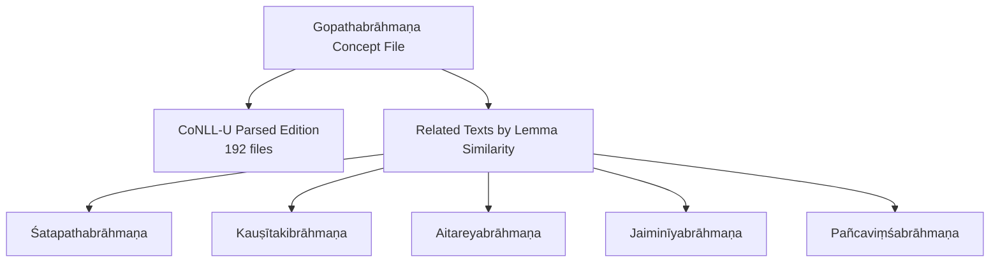
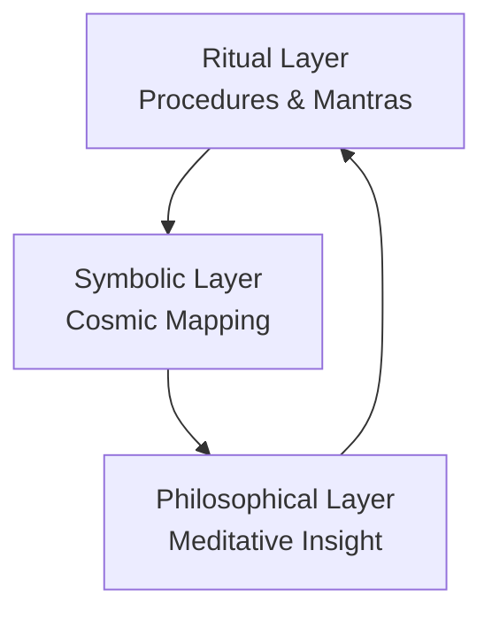
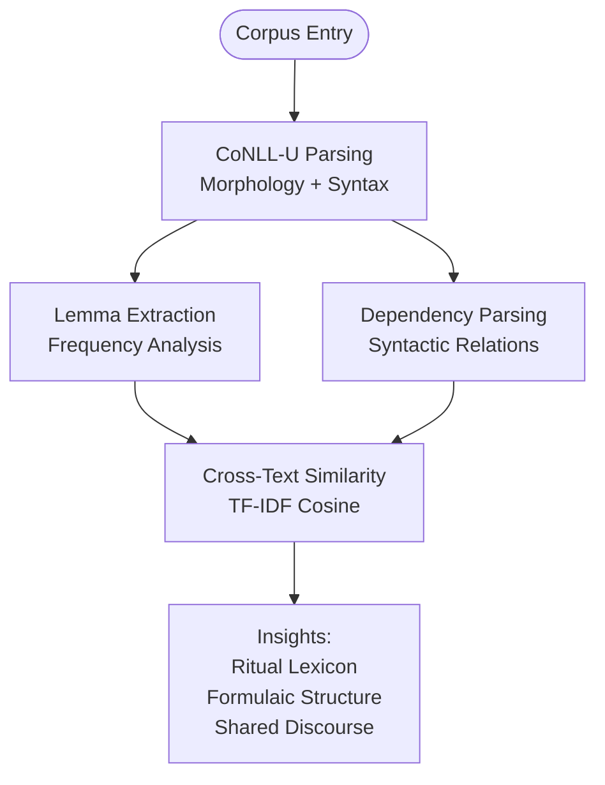
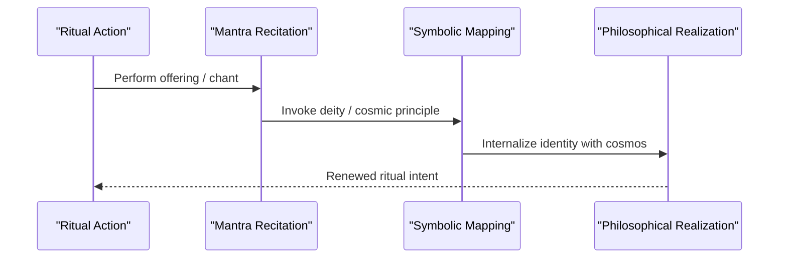
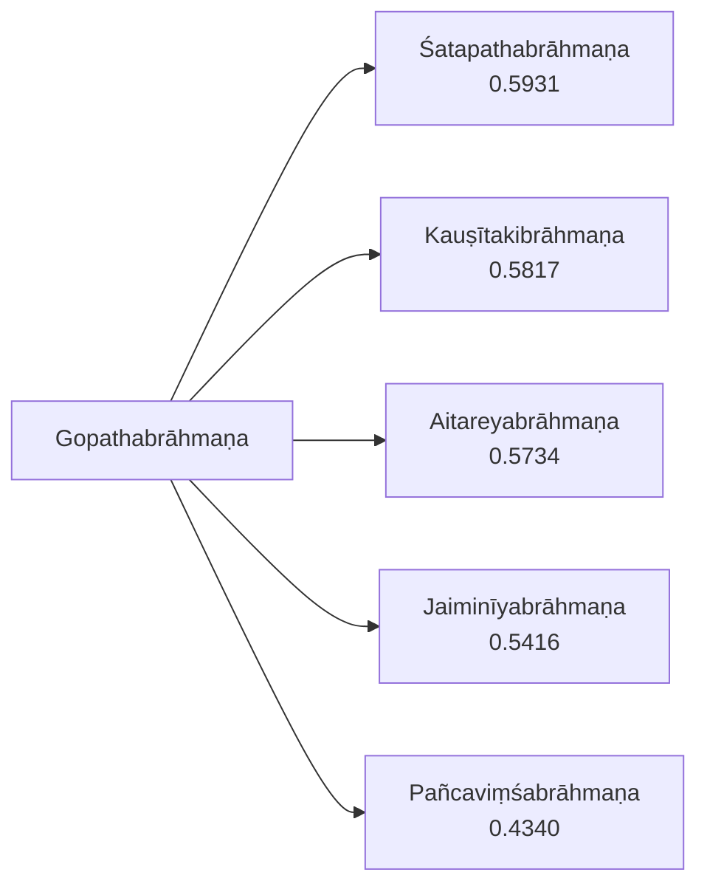

<cite>
**Referenced Files in This Document**
- [gopathabrahmana.md](file://gopathabrahmana.md)
- [INDEX.md](file://INDEX.md)
- [aitareyabrahmana.md](file://aitareyabrahmana.md)
- [satapathabrahmana.md](file://satapathabrahmana.md)
- [jaiminiyabrahmana.md](file://jaiminiyabrahmana.md)
- [kausitakibrahmana.md](file://kausitakibrahmana.md)
- [pancavimsabrahmana.md](file://pancavimsabrahmana.md)
- [maitrayanisamhita.md](file://maitrayanisamhita.md)
- [kathakasamhita.md](file://kathakasamhita.md)
- [taittiriyasamhita.md](file://taittiriyasamhita.md)
- [vaitanasutra.md](file://vaitanasutra.md)
- [tittiriyaranyaka.md](file://taittiriyaranyaka.md)
- [aitareya-aranyaka.md](file://aitareya-aranyaka.md)
- [atharvaveda-saunaka.md](file://atharvaveda-saunaka.md)
- [atharvaveda-paippalada.md](file://atharvaveda-paippalada.md)
</cite>

## Table of Contents
1. [Introduction](#introduction)
2. [Project Structure](#project-structure)
3. [Core Components](#core-components)
4. [Architecture Overview](#architecture-overview)
5. [Detailed Component Analysis](#detailed-component-analysis)
6. [Dependency Analysis](#dependency-analysis)
7. [Performance Considerations](#performance-considerations)
8. [Troubleshooting Guide](#troubleshooting-guide)
9. [Conclusion](#conclusion)
10. [Appendices](#appendices)

## Introduction
The Gopatha Brāhmaṇa is the only surviving Brāhmaṇa text of the Atharvaveda tradition. It explains the symbolism and performance of Vedic sacrifices from an Atharvan perspective, bridging practical ritual instruction with esoteric and philosophical interpretation. In this repository, it is represented as a fully parsed digital edition comprising 192 CoNLL-U files, enabling computational linguistic analysis such as lemmatization, morphological annotation, and dependency parsing.

This document synthesizes the textual profile available in the repository with comparative context from related Brāhmaṇa texts to illuminate:
- The dual nature of the work: Brāhmaṇa prose for ritual procedure and Āraṇyaka-style mystical interpretation.
- Ritual symbolism and its identification with cosmic principles.
- Computational insights derived from the CoNLL-U dataset (lemmas, frequency patterns, and structural features).
- How practical rites are transformed into philosophical meditations across the Vedic corpus, using the Gopatha Brāhmaṇa as a focal point.

## Project Structure
The project organizes each major text as a standalone markdown concept file with metadata describing content type, description, knowledge bank, sources, and tags. For the Gopatha Brāhmaṇa:
- The concept file identifies it as the sole surviving Atharvaveda Brāhmaṇa and notes the presence of 192 CoNLL-U files.
- Related-text similarity tables show lexical proximity to other Brāhmaṇa and Saṃhitā texts, indicating shared ritual vocabulary and themes.
- A lemma frequency table highlights high-frequency function words and key ritual nouns/verbs typical of Brāhmaṇa prose.

**Diagram sources**
- [gopathabrahmana.md:1-11](file://gopathabrahmana.md#L1-L11)
- [gopathabrahmana.md:15-30](file://gopathabrahmana.md#L15-L30)

**Section sources**
- [gopathabrahmana.md:1-11](file://gopathabrahmana.md#L1-L11)
- [gopathabrahmana.md:15-30](file://gopathabrahmana.md#L15-L30)
- [INDEX.md:81-81](file://INDEX.md#L81-L81)

## Core Components
- Textual Identity: The Gopatha Brāhmaṇa is identified as the only surviving Brāhmaṇa of the Atharvaveda, focusing on ritual symbolism and performance from the Atharvan viewpoint.
- Digital Corpus: The edition comprises 192 CoNLL-U files, providing machine-readable morphological and syntactic annotations suitable for computational analysis.
- Lexical Profile: High-frequency lemmas include demonstratives and particles common in Brāhmaṇa prose, alongside ritual-relevant terms such as “deva” (deity), reflecting the text’s focus on divine agency in sacrifice.
- Comparative Positioning: The lemma-based similarity ranking places the Gopatha Brāhmaṇa closest to major Brāhmaṇa texts like the Śatapathabrāhmaṇa, Kauṣītakibrāhmaṇa, Aitareyabrāhmaṇa, and Jaiminīyabrāhmaṇa, underscoring shared ritual discourse.

Key implications:
- The presence of frequent function words indicates formulaic, repetitive structures typical of ritual manuals.
- The prominence of ritual nouns suggests a strong emphasis on deities and sacrificial agents.
- The similarity to other Brāhmaṇa texts supports the view that the Gopatha Brāhmaṇa participates in a broader Brāhmaṇa tradition while retaining Atharvan characteristics.

**Section sources**
- [gopathabrahmana.md:1-11](file://gopathabrahmana.md#L1-L11)
- [gopathabrahmana.md:31-47](file://gopathabrahmana.md#L31-L47)
- [gopathabrahmana.md:15-30](file://gopathabrahmana.md#L15-L30)

## Architecture Overview
At a high level, the Gopatha Brāhmaṇa can be understood as a layered composition:
- Ritual Layer: Procedural instructions for performing sacrifices, including mantras, offerings, and ceremonial actions.
- Symbolic Layer: Interpretive passages mapping ritual elements to cosmic entities (e.g., fire, breath, seasons, worlds).
- Philosophical Layer: Esoteric reflections aligning sacrifice with metaphysical principles, often resembling Āraṇyaka meditation.

[No sources needed since this diagram shows conceptual workflow, not actual code structure]

## Detailed Component Analysis

### Ritual Symbolism and Cosmic Identification
The Gopatha Brāhmaṇa’s ritual explanations frequently identify concrete ritual components with cosmic principles. This pattern is consistent with Brāhmaṇa exegesis across traditions, where:
- Fire (agni) represents transformative energy and cosmic order.
- Breath (prāṇa) symbolizes life force and internalized sacrifice.
- Seasons and directions encode cyclical time and spatial cosmology.
- Deities personify natural forces and ethical principles invoked during rites.

In the repository’s data, the prominence of “deva” among top lemmas reflects the centrality of divine agency in ritual action. The similarity to other Brāhmaṇa texts further confirms that these symbolic mappings are part of a shared interpretive framework.

**Section sources**
- [gopathabrahmana.md:31-47](file://gopathabrahmana.md#L31-L47)
- [gopathabrahmana.md:15-30](file://gopathabrahmana.md#L15-L30)

### Transformation from Practical Rites to Philosophical Meditations
Across the Vedic corpus, Brāhmaṇa texts often transition from external ritual performance to internalized meditation. The Gopatha Brāhmaṇa participates in this trajectory by:
- Equating ritual acts with inner processes (e.g., offering breath instead of material substances).
- Identifying the sacrificer with cosmic principles (e.g., self as altar, mind as priest).
- Encouraging contemplation of the unity between microcosm (individual) and macrocosm (universe).

Comparative context from related texts illustrates this pattern:
- The Aitareyabrāhmaṇa details Soma sacrifices and includes explanatory legends and etymological speculations.
- The Śatapathabrāhmaṇa provides extensive ritual explanations, myths, and philosophical speculations.
- The Jaiminīyabrāhmaṇa offers ritual explanations and legends characteristic of Sāmaveda Brāhmaṇa literature.

These parallels support reading the Gopatha Brāhmaṇa as both a practical manual and a site of philosophical reflection.

**Section sources**
- [aitareyabrahmana.md:19-36](file://aitareyabrahmana.md#L19-L36)
- [satapathabrahmana.md:1-12](file://satapathabrahmana.md#L1-L12)
- [jaiminiyabrahmana.md:25-25](file://jaiminiyabrahmana.md#L25-L25)

### Computational Linguistics: Lemmas, Morphology, and Dependency Patterns
The CoNLL-U edition enables systematic analysis:
- Lemma Frequency: Demonstratives and particles dominate, indicating formulaic repetition essential to ritual recitation.
- Ritual Vocabulary: Terms like “deva” appear frequently, highlighting the role of deities in sacrificial contexts.
- Structural Features: The presence of 192 files suggests modular organization aligned with chapters or sections, facilitating targeted analysis of specific ritual units.

Comparative similarity rankings provide additional insight:
- Closest matches to the Gopatha Brāhmaṇa include major Brāhmaṇa texts, confirming shared ritual lexicon and discourse patterns.
- Lower similarity to non-Brāhmaṇa texts underscores the distinctiveness of Brāhmaṇa style and content.

**Diagram sources**
- [gopathabrahmana.md:15-30](file://gopathabrahmana.md#L15-L30)
- [gopathabrahmana.md:31-47](file://gopathabrahmana.md#L31-L47)

**Section sources**
- [gopathabrahmana.md:15-30](file://gopathabrahmana.md#L15-L30)
- [gopathabrahmana.md:31-47](file://gopathabrahmana.md#L31-L47)

### Relationship Between Ritual Procedures and Metaphysical Concepts
The Gopatha Brāhmaṇa’s approach aligns with a broader Vedic tendency to read ritual actions as expressions of cosmic order:
- Sacrifice becomes a model for maintaining universal harmony.
- Mantras serve not only as invocations but as vehicles for realizing identity with cosmic principles.
- Ritual space mirrors cosmic space; ritual time mirrors cyclical time.

Context from related texts reinforces this reading:
- The Taittirīyāranyaka bridges ritual and philosophy within the Yajurveda tradition.
- The Aitareya Āraṇyaka explicitly connects ritual speech and inner realization.
- Atharvaveda materials (both Śaunaka and Paippalāda recensions) emphasize spells, healing, and protective formulas that also carry metaphysical significance.

[No sources needed since this diagram shows conceptual workflow, not actual code structure]

**Section sources**
- [taittiriyaranyaka.md:29-29](file://taittiriyaranyaka.md#L29-L29)
- [aitareya-aranyaka.md:19-27](file://aitareya-aranyaka.md#L19-L27)
- [atharvaveda-saunaka.md:1-12](file://atharvaveda-saunaka.md#L1-L12)
- [atharvaveda-paippalada.md:1-12](file://atharvaveda-paippalada.md#L1-L12)

## Dependency Analysis
The Gopatha Brāhmaṇa exhibits strong lexical dependencies on the broader Brāhmaṇa tradition:
- Highest similarity to Śatapathabrāhmaṇa indicates shared ritual terminology and explanatory style.
- Strong ties to Kauṣītakibrāhmaṇa and Aitareyabrāhmaṇa reflect common Ṛgvedic/Yajurvedic ritual frameworks adapted to Atharvan concerns.
- Moderate similarity to Jaiminīyabrāhmaṇa and Pañcaviṃśabrāhmaṇa shows overlap with Sāmaveda Brāhmaṇa discourse.

**Diagram sources**
- [gopathabrahmana.md:15-30](file://gopathabrahmana.md#L15-L30)

**Section sources**
- [gopathabrahmana.md:15-30](file://gopathabrahmana.md#L15-L30)

## Performance Considerations
When analyzing the Gopatha Brāhmaṇa computationally:
- Tokenization and Lemmatization: Ensure accurate handling of Vedic sandhi and compound forms to preserve ritual meaning.
- Morphological Annotation: Leverage case, number, gender, and verb features to distinguish ritual actors, instruments, and actions.
- Dependency Parsing: Use syntactic relations to trace how mantras link deities, offerings, and outcomes, revealing ritual logic.
- Cross-Text Comparison: Apply TF-IDF cosine similarity to situate the Gopatha Brāhmaṇa within the Brāhmaṇa corpus and identify unique Atharvan features.

[No sources needed since this section provides general guidance]

## Troubleshooting Guide
Common issues when working with the Gopatha Brāhmaṇa dataset:
- Sandhi Reconstruction: Verify pre-sandhi forms to avoid misinterpretation of ritual terms.
- Lemma Ambiguity: Disambiguate homographs using context and morphological features.
- File Modularity: Map CoNLL-U files to textual sections to ensure precise retrieval of ritual passages.
- Comparative Baselines: Use related Brāhmaṇa texts as baselines to validate similarity results and avoid overgeneralization.

[No sources needed since this section provides general guidance]

## Conclusion
The Gopatha Brāhmaṇa stands as the sole surviving Brāhmaṇa of the Atharvaveda tradition, offering a rich blend of ritual instruction and esoteric interpretation. Its CoNLL-U edition enables rigorous computational analysis, revealing lemma patterns, morphological features, and syntactic structures that illuminate both practical and philosophical dimensions. Through comparison with other Brāhmaṇa texts, we see how the Gopatha Brāhmaṇa participates in a shared tradition of identifying sacrifice with cosmic principles, transforming external rites into internal meditations.

[No sources needed since this section summarizes without analyzing specific files]

## Appendices

### Appendix A: Key Passages and Ritual Formulas
While specific verses are not quoted here, the repository’s CoNLL-U files provide full access to the text’s ritual formulas and explanatory passages. Researchers can use lemma indices and concordance links to locate key terms such as “deva,” “bhū,” and ritual verbs, then examine their contextual usage across the 192 files.

**Section sources**
- [gopathabrahmana.md:31-47](file://gopathabrahmana.md#L31-L47)

### Appendix B: Comparative Context
The Gopatha Brāhmaṇa’s position within the Brāhmaṇa corpus is clarified by similarity rankings and thematic overlaps:
- Closest matches confirm shared ritual discourse.
- Differences highlight Atharvan specificity, especially in spells, healing, and protective rites.
- Āraṇyaka connections illustrate the bridge from ritual to philosophy.

**Section sources**
- [gopathabrahmana.md:15-30](file://gopathabrahmana.md#L15-L30)
- [aitareyabrahmana.md:19-36](file://aitareyabrahmana.md#L19-L36)
- [satapathabrahmana.md:1-12](file://satapathabrahmana.md#L1-L12)
- [aitareya-aranyaka.md:19-27](file://aitareya-aranyaka.md#L19-L27)
