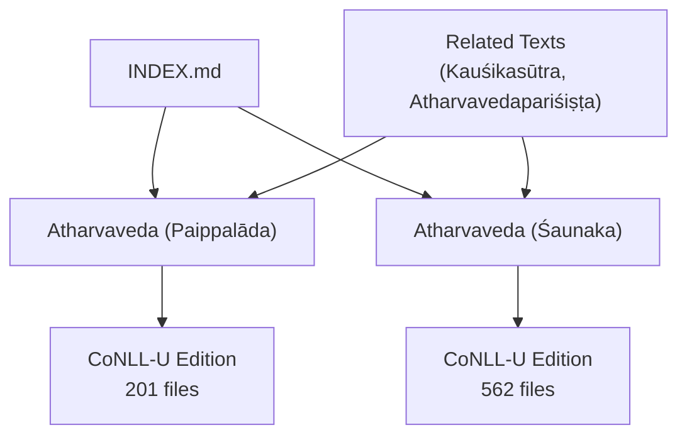
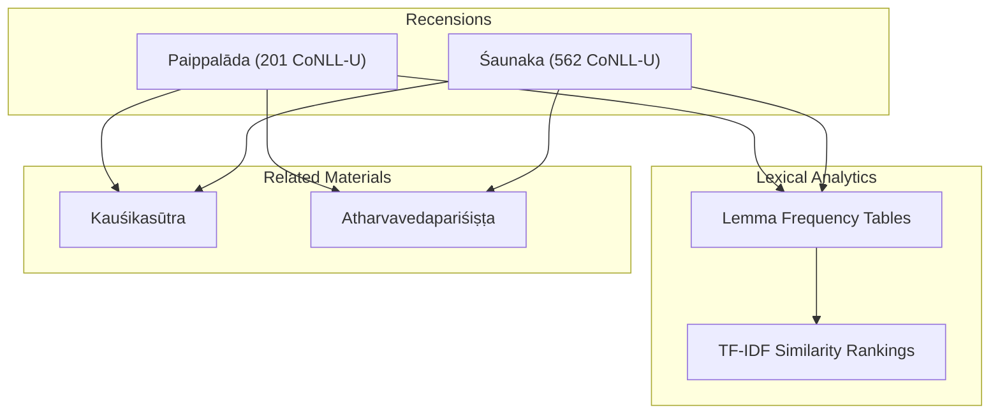
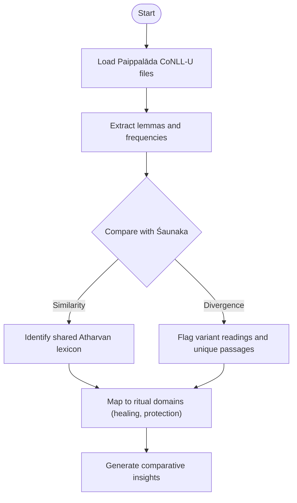
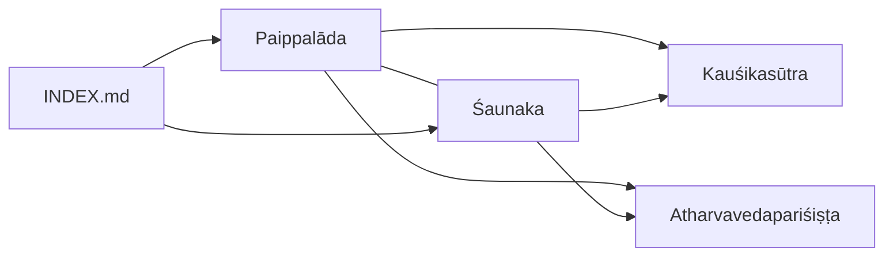

<cite>
**Referenced Files in This Document**
- [atharvaveda-paippalada.md](file://atharvaveda-paippalada.md)
- [atharvaveda-saunaka.md](file://atharvaveda-saunaka.md)
- [INDEX.md](file://INDEX.md)
- [astadhyayi.md](file://astadhyayi.md)
- [kausikasutra.md](file://kausikasutra.md)
- [atharvavedaparisishta.md](file://atharvavedaparisishta.md)
</cite>

## Table of Contents
1. [Introduction](#introduction)
2. [Project Structure](#project-structure)
3. [Core Components](#core-components)
4. [Architecture Overview](#architecture-overview)
5. [Detailed Component Analysis](#detailed-component-analysis)
6. [Dependency Analysis](#dependency-analysis)
7. [Performance Considerations](#performance-considerations)
8. [Troubleshooting Guide](#troubleshooting-guide)
9. [Conclusion](#conclusion)
10. [Appendices](#appendices)

## Introduction
This document presents a comprehensive overview of the Paippalāda recension of the Atharvaveda as represented in the repository, emphasizing its organizational structure and computational profile relative to the Śaunaka recension. It synthesizes available metadata from the corpus to outline how the two recensions differ in size, lemma distributions, and textual relationships, and it frames these differences within the broader context of Atharvan ritual and magical traditions preserved in related texts such as the Kauśikasūtra and the Atharvavedapariśiṣṭa.

## Project Structure
The repository provides concept pages for both surviving Atharvaveda recensions:
- Paippalāda: 201 CoNLL-U files representing a substantial parsed edition with lemmatization and morphological features.
- Śaunaka: 562 CoNLL-U files, reflecting a larger and more widely preserved tradition.

These entries are indexed centrally and cross-referenced across the corpus, enabling comparative studies through shared metadata fields (e.g., lemma frequency tables, similarity rankings).

**Diagram sources**
- [atharvaveda-paippalada.md:1-11](file://atharvaveda-paippalada.md#L1-L11)
- [atharvaveda-saunaka.md:1-11](file://atharvaveda-saunaka.md#L1-L11)
- [INDEX.md:30-32](file://INDEX.md#L30-L32)

**Section sources**
- [atharvaveda-paippalada.md:1-11](file://atharvaveda-paippalada.md#L1-L11)
- [atharvaveda-saunaka.md:1-11](file://atharvaveda-saunaka.md#L1-L11)
- [INDEX.md:30-32](file://INDEX.md#L30-L32)

## Core Components
- Paippalāda recension:
  - Described as one of the two surviving recensions of the fourth Veda, comprising hymns, spells, and incantations for healing, prosperity, and protection.
  - Digitally encoded in 201 CoNLL-U files with full lemmatization and morphological annotation.
  - Top frequent lemmas include personal pronouns and common function words, indicating high usage of address forms and connective particles typical of ritual speech.

- Śaunaka recension:
  - The most widely preserved version, organized into 20 books, with a significantly larger CoNLL-U footprint (562 files).
  - Contains a vast collection of hymns, magical formulae, and philosophical speculations.

- Related Atharvan materials:
  - Kauśikasūtra: principal ritual sūtra of the Atharva Veda covering domestic and magical rites, including healing and exorcism.
  - Atharvavedapariśiṣṭa: later ancillary text providing additional rules, rituals, and explanatory material for the Atharva Veda tradition.

**Section sources**
- [atharvaveda-paippalada.md:1-11](file://atharvaveda-paippalada.md#L1-L11)
- [atharvaveda-saunaka.md:1-11](file://atharvaveda-saunaka.md#L1-L11)
- [kausikasutra.md:1-11](file://kausikasutra.md#L1-L11)
- [atharvavedaparisishta.md:1-11](file://atharvavedaparisishta.md#L1-L11)

## Architecture Overview
At a high level, the corpus architecture supports comparative analysis by:
- Providing parallel CoNLL-U editions for each recension.
- Exposing lemma frequency tables and TF-IDF similarity rankings to identify lexical affinities between texts.
- Indexing related texts that share thematic or ritual vocabulary (e.g., Kauśikasūtra, Atharvavedapariśiṣṭa).

**Diagram sources**
- [atharvaveda-paippalada.md:15-30](file://atharvaveda-paippalada.md#L15-L30)
- [atharvaveda-saunaka.md:1-11](file://atharvaveda-saunaka.md#L1-L11)
- [kausikasutra.md:1-11](file://kausikasutra.md#L1-L11)
- [atharvavedaparisishta.md:1-11](file://atharvavedaparisishta.md#L1-L11)

## Detailed Component Analysis

### Paippalāda Recension: Computational Profile and Lexical Patterns
- Size and scope:
  - 201 CoNLL-U files provide a large-scale parsed edition suitable for quantitative analysis.
- Lemma distribution highlights:
  - Frequent use of second-person pronouns and demonstratives suggests direct address and deictic framing common in invocations and spells.
  - High-frequency function words indicate dense syntactic packaging typical of ritual language.
- Relatedness:
  - Highest lexical similarity is with the Śaunaka recension, confirming shared Atharvan core vocabulary despite structural divergences.

**Diagram sources**
- [atharvaveda-paippalada.md:15-48](file://atharvaveda-paippalada.md#L15-L48)
- [atharvaveda-saunaka.md:1-11](file://atharvaveda-saunaka.md#L1-L11)

**Section sources**
- [atharvaveda-paippalada.md:15-48](file://atharvaveda-paippalada.md#L15-L48)

### Śaunaka Recension: Comparative Baseline
- Size and organization:
  - 562 CoNLL-U files reflect a more extensive preservation and a 20-book structure.
- Content breadth:
  - Includes hymns, magical formulae, and philosophical speculations, offering a broad comparative baseline for lexical and thematic analysis against Paippalāda.

**Section sources**
- [atharvaveda-saunaka.md:1-11](file://atharvaveda-saunaka.md#L1-L11)

### Related Atharvan Texts: Ritual and Esoteric Context
- Kauśikasūtra:
  - Central manual for domestic and magical rites, including healing and exorcism; useful for contextualizing spell formulations and ritual procedures found in both recensions.
- Atharvavedapariśiṣṭa:
  - Later supplement adding rules, rituals, and explanations; helps trace evolution and expansion of Atharvan practice beyond the core saṃhitās.

**Section sources**
- [kausikasutra.md:1-11](file://kausikasutra.md#L1-L11)
- [atharvavedaparisishta.md:1-11](file://atharvavedaparisishta.md#L1-L11)

### Conceptual Overview: Organizational and Regional Characteristics
- Organizational differences:
  - Paippalāda’s smaller but substantial CoNLL-U footprint contrasts with Śaunaka’s larger, book-structured edition, suggesting different editorial priorities and transmission histories.
- Regional characteristics:
  - While the repository does not specify regional provenance directly, the distinct lemma profiles and relatedness metrics imply localized or sectarian preferences in preserving certain types of spells and formulas.

[No sources needed since this section provides conceptual synthesis without analyzing specific files]

## Dependency Analysis
The Paippalāda and Śaunaka recensions are linked through:
- Shared lemma patterns and high lexical similarity.
- Cross-references in the INDEX that position them alongside other Atharvan and Vedic texts.
- Related ritual manuals (Kauśikasūtra) and supplements (Atharvavedapariśiṣṭa) that inform interpretation of their content.

**Diagram sources**
- [atharvaveda-paippalada.md:15-30](file://atharvaveda-paippalada.md#L15-L30)
- [atharvaveda-saunaka.md:1-11](file://atharvaveda-saunaka.md#L1-L11)
- [INDEX.md:30-32](file://INDEX.md#L30-L32)
- [kausikasutra.md:1-11](file://kausikasutra.md#L1-L11)
- [atharvavedaparisishta.md:1-11](file://atharvavedaparisishta.md#L1-L11)

**Section sources**
- [atharvaveda-paippalada.md:15-30](file://atharvaveda-paippalada.md#L15-L30)
- [atharvaveda-saunaka.md:1-11](file://atharvaveda-saunaka.md#L1-L11)
- [INDEX.md:30-32](file://INDEX.md#L30-L32)

## Performance Considerations
- Scale:
  - The Śaunaka recension’s larger file count may require more computational resources for full-text operations compared to Paippalāda.
- Efficiency:
  - Using lemma-based comparisons and TF-IDF similarity can reduce processing overhead while still capturing meaningful textual relationships.
- Morphological analysis:
  - Leveraging CoNLL-U annotations enables precise token-level operations, improving accuracy in variant detection and pattern extraction.

[No sources needed since this section provides general guidance]

## Troubleshooting Guide
- If comparing variants across recensions:
  - Ensure consistent preprocessing of CoNLL-U files (e.g., handling sandhi reconstruction and lemmatization) before computing similarities.
- When investigating ritual formulations:
  - Cross-reference with Kauśikasūtra and Atharvavedapariśiṣṭa to contextualize spells and procedures.
- For indexing issues:
  - Confirm that both recensions are properly referenced in the central index to maintain cross-link integrity.

[No sources needed since this section provides general guidance]

## Conclusion
The Paippalāda recension, as represented in the repository, offers a computationally rich dataset for studying Atharvan magical and ritual traditions. Its lemma distribution and high lexical similarity to the Śaunaka recension underscore shared core vocabulary, while differences in size and organization point to distinct editorial and possibly regional transmission histories. Related texts like the Kauśikasūtra and Atharvavedapariśiṣṭa provide essential context for interpreting the esoteric and practical dimensions of these recensions.

[No sources needed since this section summarizes without analyzing specific files]

## Appendices

### Appendix A: Notable Lemmas in Paippalāda
- Demonstrative and pronominal dominance indicates direct address and deictic structures common in invocations.
- Function word prevalence reflects compact ritual syntax.

**Section sources**
- [atharvaveda-paippalada.md:33-48](file://atharvaveda-paippalada.md#L33-L48)

### Appendix B: Comparative Metrics
- TF-IDF cosine similarity places Śaunaka as the closest relative to Paippalāda among listed texts, supporting shared Atharvan heritage.

**Section sources**
- [atharvaveda-paippalada.md:15-30](file://atharvaveda-paippalada.md#L15-L30)

### Appendix C: Related Texts for Ritual Context
- Kauśikasūtra and Atharvavedapariśiṣṭa serve as key references for understanding ritual practices and supplementary rules associated with Atharvan traditions.

**Section sources**
- [kausikasutra.md:1-11](file://kausikasutra.md#L1-L11)
- [atharvavedaparisishta.md:1-11](file://atharvavedaparisishta.md#L1-L11)
