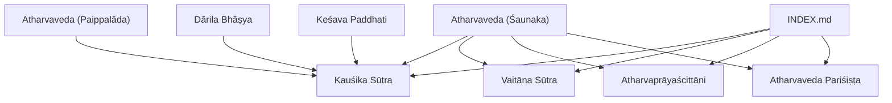
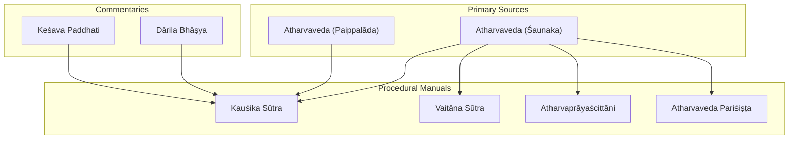
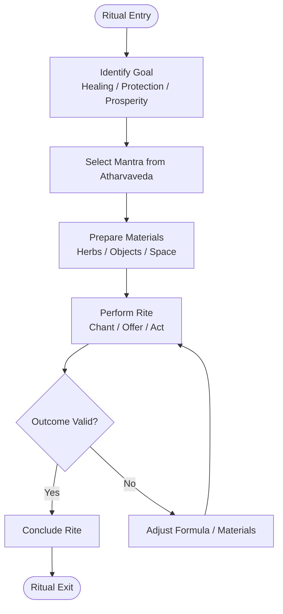
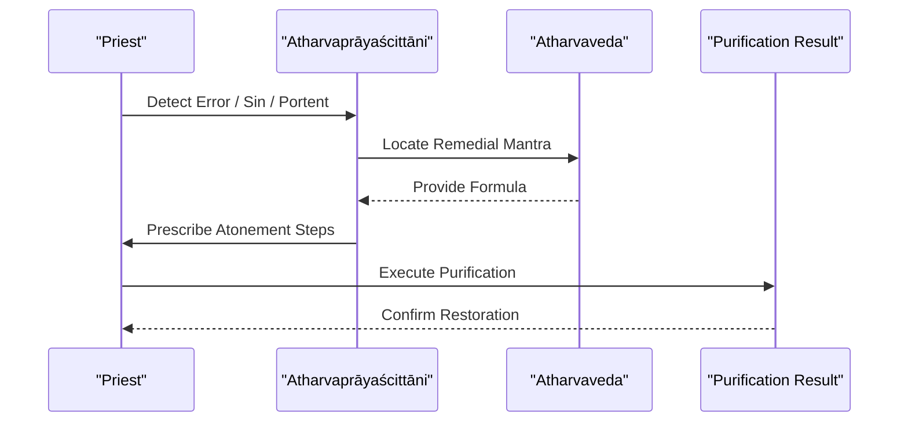
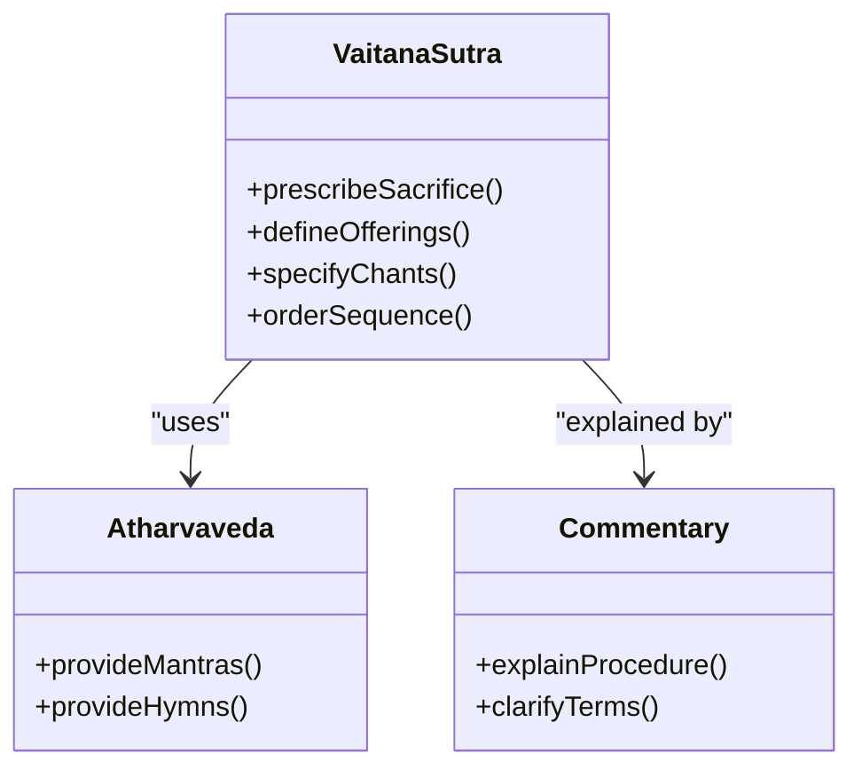
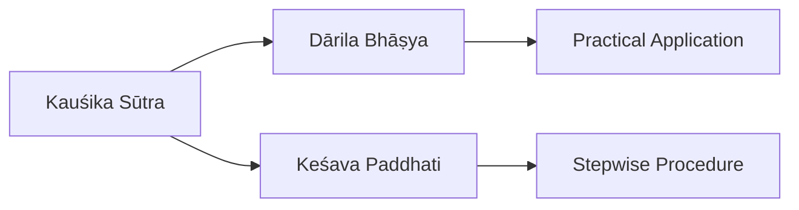
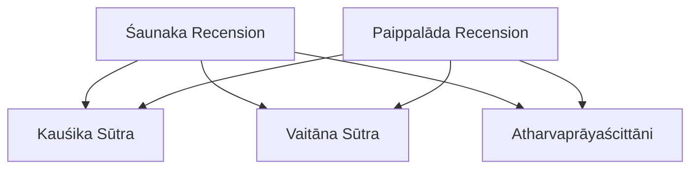
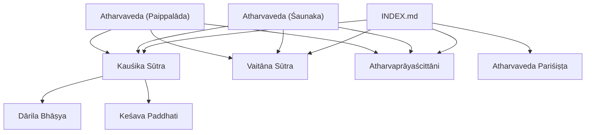

<cite>
**Referenced Files in This Document**
- [kausikasutra.md](file://kausikasutra.md)
- [atavaprayascittani.md](file://atavaprayascittani.md)
- [vaitanasutra.md](file://vaitanasutra.md)
- [atharvavedaparisishta.md](file://atharvavedaparisishta.md)
- [kausikasutradarilabhasya.md](file://kausikasutradarilabhasya.md)
- [kausikasutrakesavapaddhati.md](file://kausikasutrakesavapaddhati.md)
- [atharvaveda-saunaka.md](file://atharvaveda-saunaka.md)
- [atharvaveda-paippalada.md](file://atharvaveda-paippalada.md)
- [INDEX.md](file://INDEX.md)
</cite>

## Table of Contents
1. [Introduction](#introduction)
2. [Project Structure](#project-structure)
3. [Core Components](#core-components)
4. [Architecture Overview](#architecture-overview)
5. [Detailed Component Analysis](#detailed-component-analysis)
6. [Dependency Analysis](#dependency-analysis)
7. [Performance Considerations](#performance-considerations)
8. [Troubleshooting Guide](#troubleshooting-guide)
9. [Conclusion](#conclusion)
10. [Appendices](#appendices)

## Introduction
This document provides a comprehensive overview of the Atharvavedic ritual manuals and supplementary texts preserved in this repository, focusing on:
- Kauśika Sūtra: domestic and magical rites, healing, exorcism, and prosperity rituals grounded in Atharvan hymns
- Atharvaprāyaścittāni: expiatory and purification procedures for ritual errors and transgressions
- Vaitāna Sūtra: solemn (śrāuta) ritual prescriptions within the Atharvan tradition
- Atharvaveda Pariśiṣṭa: later ancillary material supplementing rules and explanations
- Commentarial traditions: Dārila’s bhāṣya and Keśava’s paddhati clarifying ritual application
- Recensions: Śaunaka and Paippalāda versions of the Atharvaveda as primary sources for formulas

The analysis emphasizes systematic organization of rituals, computational patterns in formulaic language, classification of magical practices, and the evolution from folk practice to codified ritual systems.

## Project Structure
The repository organizes each text as a concept file with metadata describing scope, recension, and related works. The four core texts are accompanied by commentaries and cross-referenced through an index that lists all topics and their relationships.

**Diagram sources**
- [kausikasutra.md:1-11](file://kausikasutra.md#L1-L11)
- [vaitanasutra.md:1-11](file://vaitanasutra.md#L1-L11)
- [atavaprayascittani.md:1-11](file://atavaprayascittani.md#L1-L11)
- [atharvavedaparisishta.md:1-11](file://atharvavedaparisishta.md#L1-L11)
- [kausikasutradarilabhasya.md:1-11](file://kausikasutradarilabhasya.md#L1-L11)
- [kausikasutrakesavapaddhati.md:1-11](file://kausikasutrakesavapaddhati.md#L1-L11)
- [atharvaveda-saunaka.md:1-11](file://atharvaveda-saunaka.md#L1-L11)
- [atharvaveda-paippalada.md:1-11](file://atharvaveda-paippalada.md#L1-L11)
- [INDEX.md:1-33](file://INDEX.md#L1-L33)

**Section sources**
- [INDEX.md:1-33](file://INDEX.md#L1-L33)
- [kausikasutra.md:1-11](file://kausikasutra.md#L1-L11)
- [vaitanasutra.md:1-11](file://vaitanasutra.md#L1-L11)
- [atavaprayascittani.md:1-11](file://atavaprayascittani.md#L1-L11)
- [atharvavedaparisishta.md:1-11](file://atharvavedaparisishta.md#L1-L11)

## Core Components
- Kauśika Sūtra: Principal Atharvan manual of domestic and magical rites; includes healing, exorcism, prosperity, and protective rituals based on Atharvan hymns. High-frequency lemmas indicate frequent use of deictic and performative markers typical of ritual instructions.
- Atharvaprāyaścittāni: Expiatory rites addressing sins, ritual errors, and portents; prescribes atonement and purification procedures within the Atharvan tradition.
- Vaitāna Sūtra: Solemn (śrāuta) ritual sūtra of the Atharva Veda; prescribes performance of Vedic sacrifices according to Atharvan tradition.
- Atharvaveda Pariśiṣṭa: Later ancillary text providing additional rules, rituals, and explanatory material for the Atharva Veda tradition.
- Commentaries: Dārila’s bhāṣya explains ritual application of spells and ceremonies; Keśava’s paddhati offers procedural guidance for Atharvan rituals.
- Recensions: Śaunaka and Paippalāda provide the foundational hymns, spells, and incantations used across these manuals.

**Section sources**
- [kausikasutra.md:1-11](file://kausikasutra.md#L1-L11)
- [atavaprayascittani.md:1-11](file://atavaprayascittani.md#L1-L11)
- [vaitanasutra.md:1-11](file://vaitanasutra.md#L1-L11)
- [atharvavedaparisishta.md:1-11](file://atharvavedaparisishta.md#L1-L11)
- [kausikasutradarilabhasya.md:1-11](file://kausikasutradarilabhasya.md#L1-L11)
- [kausikasutrakesavapaddhati.md:1-11](file://kausikasutrakesavapaddhati.md#L1-L11)
- [atharvaveda-saunaka.md:1-11](file://atharvaveda-saunaka.md#L1-L11)
- [atharvaveda-paippalada.md:1-11](file://atharvaveda-paippalada.md#L1-L11)

## Architecture Overview
The ritual system is structured around layered texts:
- Primary source: Atharvaveda recensions (Śaunaka and Paippalāda) supply mantras and spells
- Procedural manuals: Kauśika Sūtra (domestic/magical), Vaitāna Sūtra (solemn sacrifices), Atharvaprāyaścittāni (expiation)
- Ancillary supplements: Atharvaveda Pariśiṣṭa adds rules and explanations
- Commentarial layer: Dārila’s bhāṣya and Keśava’s paddhati clarify application and procedure

**Diagram sources**
- [kausikasutra.md:1-11](file://kausikasutra.md#L1-L11)
- [vaitanasutra.md:1-11](file://vaitanasutra.md#L1-L11)
- [atavaprayascittani.md:1-11](file://atavaprayascittani.md#L1-L11)
- [atharvavedaparisishta.md:1-11](file://atharvavedaparisishta.md#L1-L11)
- [kausikasutradarilabhasya.md:1-11](file://kausikasutradarilabhasya.md#L1-L11)
- [kausikasutrakesavapaddhati.md:1-11](file://kausikasutrakesavapaddhati.md#L1-L11)
- [atharvaveda-saunaka.md:1-11](file://atharvaveda-saunaka.md#L1-L11)
- [atharvaveda-paippalada.md:1-11](file://atharvaveda-paippalada.md#L1-L11)

## Detailed Component Analysis

### Kauśika Sūtra: Domestic and Magical Rites
- Purpose: Manual of domestic and magical rites including healing, exorcism, and prosperity rituals based on Atharvan hymns
- Computational patterns: Frequent use of performative markers and deictic terms suggests imperative structures common in ritual instructions; high frequency of “iti” indicates citation or quotation of formulas
- Related texts: Strong similarity to gṛhya sūtras and Atharvaprāyaścittāni indicates shared ritual vocabulary and procedural conventions

[No diagram sources needed since this flowchart shows conceptual workflow, not actual code structure]

**Section sources**
- [kausikasutra.md:1-11](file://kausikasutra.md#L1-L11)
- [kausikasutra.md:15-30](file://kausikasutra.md#L15-L30)
- [kausikasutra.md:31-48](file://kausikasutra.md#L31-L48)

### Atharvaprāyaścittāni: Expiatory and Purification Rites
- Purpose: Prescribes atonement and purification rituals for sins, ritual errors, and portents
- Computational patterns: Lexical emphasis on purification and corrective actions; frequent citation markers suggest quoting of prescribed remedies
- Relationship to other texts: Similar lemma usage to Kauśika Sūtra indicates overlapping ritual vocabulary for error correction and remediation

[No diagram sources needed since this sequence diagram shows conceptual workflow, not actual code structure]

**Section sources**
- [atavaprayascittani.md:1-11](file://atavaprayascittani.md#L1-L11)

### Vaitāna Sūtra: Solemn (Śrāuta) Rituals
- Purpose: Solemn ritual sūtra prescribing Vedic sacrifices according to Atharvan tradition
- Computational patterns: Frequent ritual terminology and deity references reflect formal sacrificial context; similarity to śrauta sūtras indicates standardized sacrifice procedures
- Integration: Works alongsidekauśika for household rites and atharvaprāyaścittāni for corrections

[No diagram sources needed since this class diagram shows conceptual relationships, not actual code structure]

**Section sources**
- [vaitanasutra.md:1-11](file://vaitanasutra.md#L1-L11)
- [vaitanasutra.md:15-30](file://vaitanasutra.md#L15-L30)
- [vaitanasutra.md:31-48](file://vaitanasutra.md#L31-L48)

### Atharvaveda Pariśiṣṭa: Ancillary Supplement
- Purpose: Later ancillary text providing additional rules, rituals, and explanatory material for the Atharva Veda tradition
- Role: Supplements core manuals with expanded rules and interpretations, bridging practical instruction and theoretical explanation

**Section sources**
- [atharvavedaparisishta.md:1-11](file://atharvavedaparisishta.md#L1-L11)

### Commentarial Traditions: Dārila and Keśava
- Dārila’s bhāṣya: Explains ritual application of Atharvan spells and ceremonies; notable lemmas include ritual objects and technical terms indicating detailed commentary on materials and procedures
- Keśava’s paddhati: Provides procedural guidance for Atharvan rituals; frequent verbs and markers suggest step-by-step operational instructions

**Diagram sources**
- [kausikasutradarilabhasya.md:1-11](file://kausikasutradarilabhasya.md#L1-L11)
- [kausikasutrakesavapaddhati.md:1-11](file://kausikasutrakesavapaddhati.md#L1-L11)
- [kausikasutra.md:1-11](file://kausikasutra.md#L1-L11)

**Section sources**
- [kausikasutradarilabhasya.md:1-11](file://kausikasutradarilabhasya.md#L1-L11)
- [kausikasutradarilabhasya.md:15-30](file://kausikasutradarilabhasya.md#L15-L30)
- [kausikasutradarilabhasya.md:31-48](file://kausikasutradarilabhasya.md#L31-L48)
- [kausikasutrakesavapaddhati.md:1-11](file://kausikasutrakesavapaddhati.md#L1-L11)
- [kausikasutrakesavapaddhati.md:13-30](file://kausikasutrakesavapaddhati.md#L13-L30)

### Recensions: Śaunaka and Paippalāda
- Śaunaka: Most widely preserved version of the fourth Veda; vast collection of hymns, magical formulae, and philosophical speculations
- Paippalāda: Alternative recension preserving hymns, spells, and incantations for healing, prosperity, and protection; strong lexical similarity to Śaunaka indicates shared ritual corpus

**Diagram sources**
- [atharvaveda-saunaka.md:1-11](file://atharvaveda-saunaka.md#L1-L11)
- [atharvaveda-paippalada.md:1-11](file://atharvaveda-paippalada.md#L1-L11)
- [kausikasutra.md:1-11](file://kausikasutra.md#L1-L11)
- [vaitanasutra.md:1-11](file://vaitanasutra.md#L1-L11)
- [atavaprayascittani.md:1-11](file://atavaprayascittani.md#L1-L11)

**Section sources**
- [atharvaveda-saunaka.md:1-11](file://atharvaveda-saunaka.md#L1-L11)
- [atharvaveda-paippalada.md:1-11](file://atharvaveda-paippalada.md#L1-L11)
- [atharvaveda-paippalada.md:15-30](file://atharvaveda-paippalada.md#L15-L30)
- [atharvaveda-paippalada.md:31-48](file://atharvaveda-paippalada.md#L31-L48)

## Dependency Analysis
The ritual system exhibits clear dependencies:
- Procedural manuals depend on primary source recensions for mantras and hymns
- Commentaries depend on Kauśika Sūtra for interpretation and procedural clarification
- Index serves as a cross-reference hub connecting all texts and their relationships

**Diagram sources**
- [INDEX.md:1-33](file://INDEX.md#L1-L33)
- [kausikasutra.md:1-11](file://kausikasutra.md#L1-L11)
- [vaitanasutra.md:1-11](file://vaitanasutra.md#L1-L11)
- [atavaprayascittani.md:1-11](file://atavaprayascittani.md#L1-L11)
- [atharvavedaparisishta.md:1-11](file://atharvavedaparisishta.md#L1-L11)
- [kausikasutradarilabhasya.md:1-11](file://kausikasutradarilabhasya.md#L1-L11)
- [kausikasutrakesavapaddhati.md:1-11](file://kausikasutrakesavapaddhati.md#L1-L11)
- [atharvaveda-saunaka.md:1-11](file://atharvaveda-saunaka.md#L1-L11)
- [atharvaveda-paippalada.md:1-11](file://atharvaveda-paippalada.md#L1-L11)

**Section sources**
- [INDEX.md:1-33](file://INDEX.md#L1-L33)

## Performance Considerations
- Manuscript preservation: Large CoNLL-U file counts indicate extensive textual preservation, enabling robust computational analysis
- Lemma frequency: High-frequency ritual markers facilitate pattern recognition in formulaic structures
- Cross-text similarity: TF-IDF cosine similarity helps identify related texts and shared ritual vocabulary

[No sources needed since this section provides general guidance]

## Troubleshooting Guide
Common issues in analyzing ritual texts:
- Ambiguity in ritual steps: Use commentaries (Dārila, Keśava) to clarify procedural details
- Variations between recensions: Compare Śaunaka and Paippalāda to understand divergent formulations
- Citation markers: Recognize “iti” as a signal for quoted formulas or authoritative statements

**Section sources**
- [kausikasutradarilabhasya.md:31-48](file://kausikasutradarilabhasya.md#L31-L48)
- [kausikasutrakesavapaddhati.md:13-30](file://kausikasutrakesavapaddhati.md#L13-L30)
- [atharvaveda-paippalada.md:31-48](file://atharvaveda-paippalada.md#L31-L48)

## Conclusion
The Atharvavedic ritual system in this repository demonstrates a layered architecture:
- Primary sources provide mantras and spells
- Procedural manuals organize domestic, solemn, and expiatory rites
- Ancillary supplements expand rules and explanations
- Commentaries clarify application and procedure
Computational analysis reveals consistent patterns in formulaic language, morphological variations, and syntactic constructions that support both practical ritual execution and theoretical understanding. The evolution from simple folk practices to complex ritual systems is evident in the structured organization and preservation of these texts.

[No sources needed since this section summarizes without analyzing specific files]

## Appendices

### Appendix A: Classification of Magical Practices
Based on the texts analyzed, magical practices can be classified into:
- Healing rituals: Therapeutic spells and remedies
- Protective rituals: Warding off evil and misfortune
- Prosperity rituals: Attracting wealth and success
- Exorcism rituals: Removing negative influences
- Expiatory rituals: Correcting ritual errors and sins

**Section sources**
- [kausikasutra.md:1-11](file://kausikasutra.md#L1-L11)
- [atavaprayascittani.md:1-11](file://atavaprayascittani.md#L1-L11)

### Appendix B: Evolution from Folk Practice to Codified Systems
- Early folk practices: Simple spells and charms for daily needs
- Codification: Systematic organization in sūtras with precise procedures
- Preservation: Written form ensures transmission across generations
- Expansion: Commentaries and supplements add depth and clarity

[No sources needed since this section provides general guidance]
