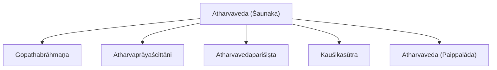
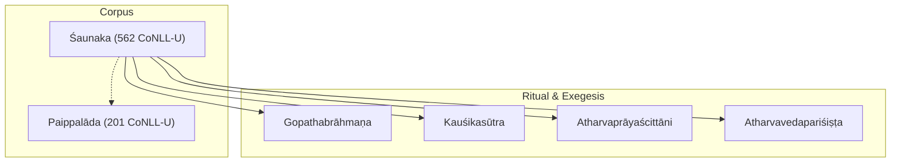
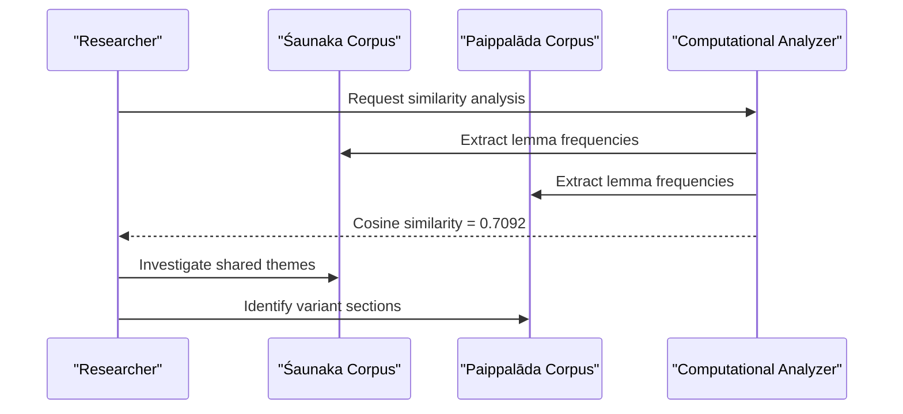
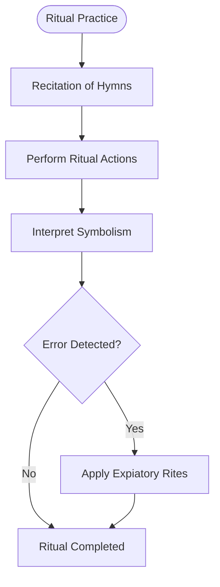
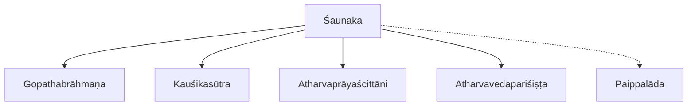

<cite>
**Referenced Files in This Document**
- [atharvaveda-saunaka.md](file://atharvaveda-saunaka.md)
- [atharvaveda-paippalada.md](file://atharvaveda-paippalada.md)
- [gopathabrahmana.md](file://gopathabrahmana.md)
- [atavaprayascittani.md](file://atavaprayascittani.md)
- [atharvavedaparisishta.md](file://atharvavedaparisishta.md)
- [kausikasutra.md](file://kausikasutra.md)
- [INDEX.md](file://INDEX.md)
</cite>

## Table of Contents
1. [Introduction](#introduction)
2. [Project Structure](#project-structure)
3. [Core Components](#core-components)
4. [Architecture Overview](#architecture-overview)
5. [Detailed Component Analysis](#detailed-component-analysis)
6. [Dependency Analysis](#dependency-analysis)
7. [Performance Considerations](#performance-considerations)
8. [Troubleshooting Guide](#troubleshooting-guide)
9. [Conclusion](#conclusion)
10. [Appendices](#appendices)

## Introduction
This document provides a comprehensive overview of the Śaunaka recension of the Atharvaveda, focusing on its textual characteristics, structure, and unique features. It explains how the corpus is organized into Kāṇḍas (books), outlines thematic coverage including healing spells, protective charms, domestic rituals, and philosophical hymns, and presents computational insights derived from lemma frequencies and morphological analysis available in the repository’s CoNLL-U editions. It also clarifies the relationship between the Śaunaka and Paippalāda recensions, highlighting shared material and textual variations, and situates the tradition within its ritual context, magical formulas, and folkloric elements preserved across related texts.

## Project Structure
The repository organizes Vedic and related texts as concept entries with metadata, descriptions, and links to CoNLL-U parsed editions. For the Atharvaveda:
- The Śaunaka recension entry documents the most widely preserved version of the fourth Veda, comprising 20 books (Kāṇḍas) and represented by 562 CoNLL-U files.
- The Paippalāda recension entry describes another surviving recension with 201 CoNLL-U files and includes similarity metrics to other texts.
- Related ritual and exegetical materials include the Gopathabrāhmaṇa (the only surviving Brāhmaṇa of the Atharva Veda), expiatory rites (Atharvaprāyaścittāni), and ancillary supplements (Atharvavedapariśiṣṭa).

**Diagram sources**
- [atharvaveda-saunaka.md:1-12](file://atharvaveda-saunaka.md#L1-L12)
- [gopathabrahmana.md:1-48](file://gopathabrahmana.md#L1-L48)
- [atavaprayascittani.md:1-12](file://atavaprayascittani.md#L1-L12)
- [atharvavedaparisishta.md:1-12](file://atharvavedaparisishta.md#L1-L12)
- [kausikasutra.md:1-30](file://kausikasutra.md#L1-L30)
- [atharvaveda-paippalada.md:1-48](file://atharvaveda-paippalada.md#L1-L48)

**Section sources**
- [atharvaveda-saunaka.md:1-12](file://atharvaveda-saunaka.md#L1-L12)
- [atharvaveda-paippalada.md:1-48](file://atharvaveda-paippalada.md#L1-L48)
- [gopathabrahmana.md:1-48](file://gopathabrahmana.md#L1-L48)
- [atavaprayascittani.md:1-12](file://atavaprayascittani.md#L1-L12)
- [atharvavedaparisishta.md:1-12](file://atharvavedaparisishta.md#L1-L12)
- [kausikasutra.md:1-30](file://kausikasutra.md#L1-L30)
- [INDEX.md:5-32](file://INDEX.md#L5-L32)

## Core Components
- Śaunaka Recension: The primary text under study; a vast collection of hymns, magical formulae, and philosophical speculations organized into 20 Kāṇḍas, digitized as 562 CoNLL-U files for computational analysis.
- Paippalāda Recension: A parallel surviving recension with distinct organization and content distribution; useful for comparative studies of shared and variant material.
- Gopathabrāhmaṇa: The sole extant Brāhmaṇa commentary for the Atharva Veda, providing ritual symbolism and performance details from the Atharvan perspective.
- Atharvaprāyaścittāni: Prescribes atonement and purification rituals, addressing errors in performance and portents within the Atharvan tradition.
- Atharvavedapariśiṣṭa: Ancillary rules and explanatory material supplementing the core Atharva Veda tradition.
- Kauśikasūtra: Principal ritual sūtra of the Atharva Veda detailing domestic and magical rites based on Atharvan hymns.

These components collectively enable both philological and computational exploration of the Atharvaveda’s linguistic patterns, ritual practices, and textual relationships.

**Section sources**
- [atharvaveda-saunaka.md:1-12](file://atharvaveda-saunaka.md#L1-L12)
- [atharvaveda-paippalada.md:1-48](file://atharvaveda-paippalada.md#L1-L48)
- [gopathabrahmana.md:1-48](file://gopathabrahmana.md#L1-L48)
- [atavaprayascittani.md:1-12](file://atavaprayascittani.md#L1-L12)
- [atharvavedaparisishta.md:1-12](file://atharvavedaparisishta.md#L1-L12)
- [kausikasutra.md:1-30](file://kausikasutra.md#L1-L30)

## Architecture Overview
The Atharvaveda Śaunaka recension functions as a central corpus that connects to ritual manuals, commentaries, and supplementary texts. Computational resources (CoNLL-U files) support morphological analysis, lemma frequency tracking, and syntactic parsing, enabling comparative studies with the Paippalāda recension and related texts.

**Diagram sources**
- [atharvaveda-saunaka.md:1-12](file://atharvaveda-saunaka.md#L1-L12)
- [atharvaveda-paippalada.md:1-48](file://atharvaveda-paippalada.md#L1-L48)
- [gopathabrahmana.md:1-48](file://gopathabrahmana.md#L1-L48)
- [kausikasutra.md:1-30](file://kausikasutra.md#L1-L30)
- [atavaprayascittani.md:1-12](file://atavaprayascittani.md#L1-L12)
- [atharvavedaparisishta.md:1-12](file://atharvavedaparisishta.md#L1-L12)

## Detailed Component Analysis

### Śaunaka Recension: Organization and Thematic Coverage
- Structure: Organized into 20 Kāṇḍas (books), each containing collections of hymns and formulae. The digital edition comprises 562 CoNLL-U files, facilitating granular computational analysis.
- Thematic Content: Includes healing spells, protective charms, domestic rituals, and philosophical hymns. These categories reflect the practical and contemplative dimensions of the Atharvan tradition.
- Ritual Context: The presence of the Gopathabrāhmaṇa and Kauśikasūtra indicates strong integration of ritual performance and symbolic interpretation within the Śaunaka corpus.

Computational Insights:
- Lemma Frequencies: While specific top lemmas for Śaunaka are not listed in this entry, the Paippalāda entry demonstrates how lemma indices can be used to identify frequent terms and patterns. Comparative TF-IDF cosine similarity shows high lexical overlap between Śaunaka and Paippalāda (0.7092), indicating substantial shared material.
- Morphological Patterns: CoNLL-U editions enable morphological tagging and parsing, allowing researchers to analyze verb forms, nominal inflections, and syntactic structures across Kāṇḍas.

**Section sources**
- [atharvaveda-saunaka.md:1-12](file://atharvaveda-saunaka.md#L1-L12)
- [atharvaveda-paippalada.md:1-48](file://atharvaveda-paippalada.md#L1-L48)
- [gopathabrahmana.md:1-48](file://gopathabrahmana.md#L1-L48)
- [kausikasutra.md:1-30](file://kausikasutra.md#L1-L30)

### Relationship Between Śaunaka and Paippalāda Recensions
- Shared Material: High cosine similarity (0.7092) suggests significant overlap in lemma usage, reflecting common Vedic heritage and overlapping ritual/philosophical content.
- Textual Variations: Differences in organization, inclusion/exclusion of certain hymns, and regional or sectarian preferences likely account for divergent lemma profiles and structural arrangements.
- Comparative Studies: Researchers can use the CoNLL-U datasets to align parallel passages, track variant readings, and map thematic distributions across recensions.

**Diagram sources**
- [atharvaveda-paippalada.md:15-30](file://atharvaveda-paippalada.md#L15-L30)
- [atharvaveda-saunaka.md:1-12](file://atharvaveda-saunaka.md#L1-L12)

**Section sources**
- [atharvaveda-paippalada.md:15-30](file://atharvaveda-paippalada.md#L15-L30)
- [atharvaveda-saunaka.md:1-12](file://atharvaveda-saunaka.md#L1-L12)

### Ritual Context, Magical Formulas, and Folk Traditions
- Ritual Manuals: The Kauśikasūtra provides detailed procedures for domestic and magical rites grounded in Atharvan hymns, illustrating the practical application of the Śaunaka corpus.
- Expiation and Purification: The Atharvaprāyaścittāni prescribes remedies for ritual errors and portents, emphasizing the ethical and corrective dimensions of Atharvan practice.
- Symbolism and Interpretation: The Gopathabrāhmaṇa offers ritual symbolism and performance guidance, bridging mantra and action.
- Folk Elements: Hymns and spells often incorporate folk motifs, local deities, and community-specific practices, preserving vernacular traditions within the Vedic framework.

**Diagram sources**
- [kausikasutra.md:1-30](file://kausikasutra.md#L1-L30)
- [atavaprayascittani.md:1-12](file://atavaprayascittani.md#L1-L12)
- [gopathabrahmana.md:1-48](file://gopathabrahmana.md#L1-L48)

**Section sources**
- [kausikasutra.md:1-30](file://kausikasutra.md#L1-L30)
- [atavaprayascittani.md:1-12](file://atavaprayascittani.md#L1-L12)
- [gopathabrahmana.md:1-48](file://gopathabrahmana.md#L1-L48)

### Computational Analysis: Morphological Patterns, Lemma Frequencies, Syntactic Structures
- Morphological Analysis: CoNLL-U files provide token-level annotations enabling identification of roots, affixes, and grammatical categories across the corpus.
- Lemma Frequencies: The Paippalāda entry illustrates how top lemmas can be extracted and compared; similar methods apply to Śaunaka to identify recurring vocabulary and stylistic markers.
- Syntactic Structures: Dependency parsing in CoNLL-U supports analysis of clause structure, argument relations, and rhetorical patterns typical of Vedic verse.

Example Workflow:
- Extract lemma counts per Kāṇḍa.
- Compute TF-IDF vectors for cross-recension comparison.
- Analyze syntactic dependencies to detect formulaic vs. expository passages.

[No sources needed since this section provides general guidance]

## Dependency Analysis
The Śaunaka recension depends on and relates to several ritual and exegetical texts that contextualize its mantras and spells. The Paippalāda recension serves as a comparative counterpart.

**Diagram sources**
- [atharvaveda-saunaka.md:1-12](file://atharvaveda-saunaka.md#L1-L12)
- [gopathabrahmana.md:1-48](file://gopathabrahmana.md#L1-L48)
- [kausikasutra.md:1-30](file://kausikasutra.md#L1-L30)
- [atavaprayascittani.md:1-12](file://atavaprayascittani.md#L1-L12)
- [atharvavedaparisishta.md:1-12](file://atharvavedaparisishta.md#L1-L12)
- [atharvaveda-paippalada.md:1-48](file://atharvaveda-paippalada.md#L1-L48)

**Section sources**
- [atharvaveda-saunaka.md:1-12](file://atharvaveda-saunaka.md#L1-L12)
- [atharvaveda-paippalada.md:1-48](file://atharvaveda-paippalada.md#L1-L48)
- [gopathabrahmana.md:1-48](file://gopathabrahmana.md#L1-L48)
- [kausikasutra.md:1-30](file://kausikasutra.md#L1-L30)
- [atavaprayascittani.md:1-12](file://atavaprayascittani.md#L1-L12)
- [atharvavedaparisishta.md:1-12](file://atharvavedaparisishta.md#L1-L12)

## Performance Considerations
- Data Volume: With 562 CoNLL-U files for Śaunaka, efficient indexing and chunked processing are essential for large-scale analyses.
- Lexical Overlap: High similarity with Paippalāda enables transfer learning techniques for lemma alignment and cross-corpus mapping.
- Morphological Complexity: Vedic Sanskrit exhibits archaic forms and irregularities; robust morphological analyzers should handle sandhi, suppletion, and rare declensions.

[No sources needed since this section provides general guidance]

## Troubleshooting Guide
Common issues when working with Atharvaveda data:
- Inconsistent Tokenization: Ensure consistent handling of sandhi and verse boundaries before analysis.
- Missing Annotations: Verify CoNLL-U completeness for tokens lacking morphological tags; consider fallback dictionaries or rule-based disambiguation.
- Cross-Recension Alignment: Use lemma indices and similarity metrics to align parallel passages; validate alignments manually for accuracy.

[No sources needed since this section provides general guidance]

## Conclusion
The Śaunaka recension of the Atharvaveda stands as a rich, multi-layered corpus encompassing healing spells, protective charms, domestic rituals, and philosophical hymns across 20 Kāṇḍas. Its extensive CoNLL-U edition enables detailed computational analysis of morphology, lemmata, and syntax. The close relationship with the Paippalāda recension, along with ritual manuals like the Kauśikasūtra and Gopathabrāhmaṇa, underscores the integrated nature of mantra, ritual, and interpretation in the Atharvan tradition. Together, these resources preserve both scholarly and folkloric dimensions of ancient Indian religious life.

[No sources needed since this section summarizes without analyzing specific files]

## Appendices

### Appendix A: Key Texts and Their Roles
- Śaunaka Recension: Primary corpus for study and analysis.
- Paippalāda Recension: Comparative recension with high lexical overlap.
- Gopathabrāhmaṇa: Ritual symbolism and performance guide.
- Kauśikasūtra: Practical manual for domestic and magical rites.
- Atharvaprāyaścittāni: Expiatory rites and purification protocols.
- Atharvavedapariśiṣṭa: Supplementary rules and explanations.

**Section sources**
- [atharvaveda-saunaka.md:1-12](file://atharvaveda-saunaka.md#L1-L12)
- [atharvaveda-paippalada.md:1-48](file://atharvaveda-paippalada.md#L1-L48)
- [gopathabrahmana.md:1-48](file://gopathabrahmana.md#L1-L48)
- [kausikasutra.md:1-30](file://kausikasutra.md#L1-L30)
- [atavaprayascittani.md:1-12](file://atavaprayascittani.md#L1-L12)
- [atharvavedaparisishta.md:1-12](file://atharvavedaparisishta.md#L1-L12)

### Appendix B: Computational Resources
- CoNLL-U Editions: Enable token-level morphological and syntactic analysis.
- Lemma Indices: Support frequency analysis and cross-text comparisons.
- Similarity Metrics: Facilitate recension alignment and thematic mapping.

**Section sources**
- [atharvaveda-paippalada.md:15-30](file://atharvaveda-paippalada.md#L15-L30)
- [astadhyayi.md:37-85](file://astadhyayi.md#L37-L85)
