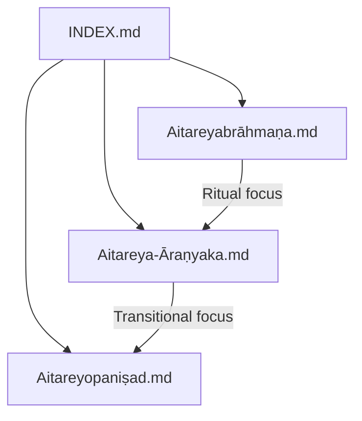
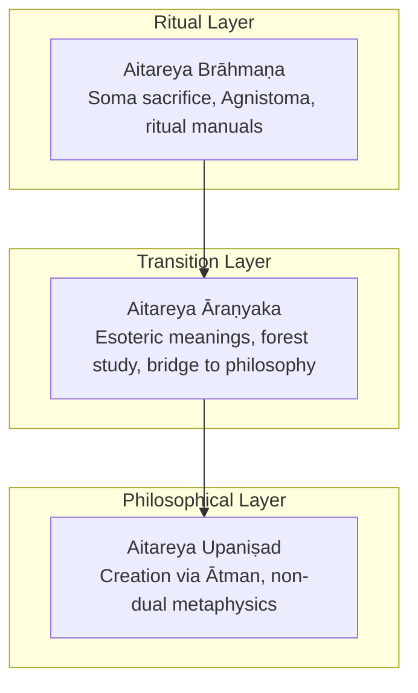
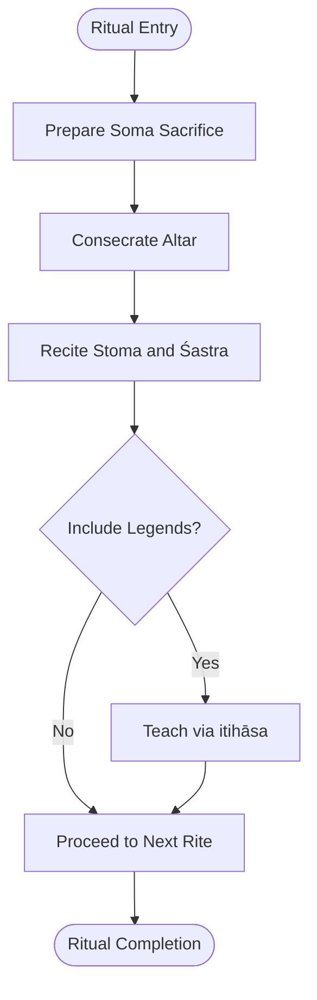
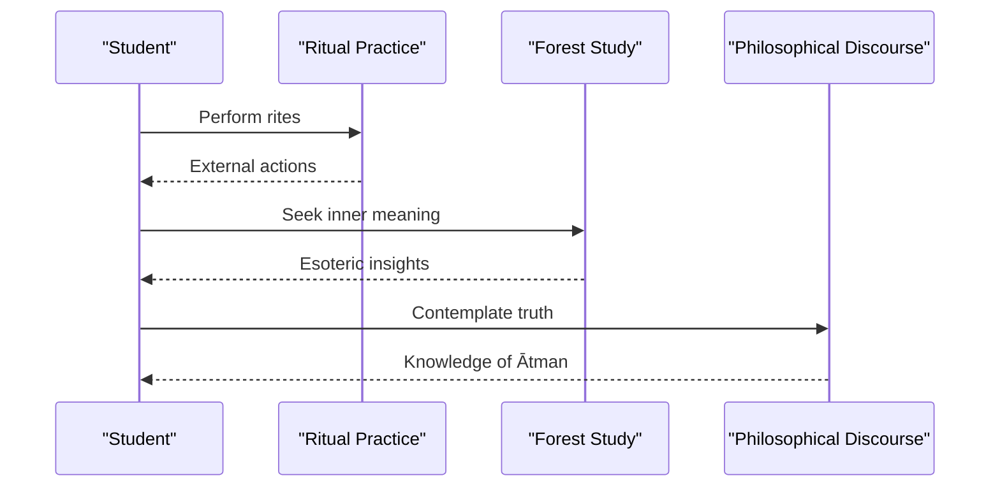
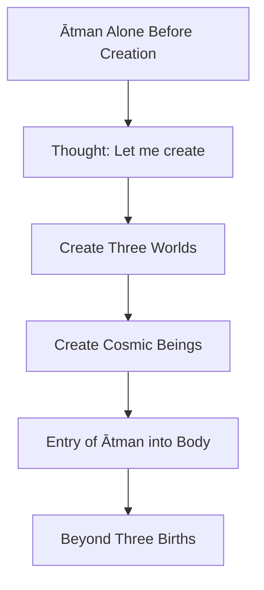
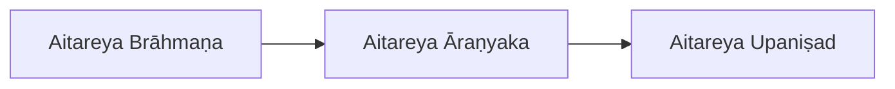

<cite>
**Referenced Files in This Document**
- [INDEX.md](file://INDEX.md)
- [Aitareyabrāhmaṇa](file://aitareyabrahmana.md)
- [Aitareya Āraṇyaka](file://aitareya-aranyaka.md)
- [Aitareyopaniṣad](file://aitareyopanisad.md)
</cite>

## Table of Contents
1. [Introduction](#introduction)
2. [Project Structure](#project-structure)
3. [Core Components](#core-components)
4. [Architecture Overview](#architecture-overview)
5. [Detailed Component Analysis](#detailed-component-analysis)
6. [Dependency Analysis](#dependency-analysis)
7. [Performance Considerations](#performance-considerations)
8. [Troubleshooting Guide](#troubleshooting-guide)
9. [Conclusion](#conclusion)
10. [Appendices](#appendices)

## Introduction
This document presents a cohesive interpretive framework for the Aitareya tradition across three interconnected texts: the Aitareya Brāhmaṇa, the Aitareya Āraṇyaka, and the Aitareya Upaniṣad. It explains how these works form a continuous trajectory from ritual instruction to philosophical inquiry within the Śākala recension of the Ṛgveda. The Brāhmaṇa provides detailed guidance on Soma sacrifices; the Āraṇyaka transitions from external ritual to internal contemplation; and the Upaniṣad articulates metaphysical teachings about Brahman, Atman, and creation. Additionally, this document outlines computational linguistic observations that illustrate the evolution from ritualistic language to philosophical discourse through morphological and syntactic patterns observable in CoNLL-U parsed editions.

## Project Structure
The repository organizes each text as a standalone topic file with metadata describing its scope, sources, tags, and related resources. The three Aitareya texts are cataloged together under the Sanskrit knowledge bank and cross-referenced in the index.

**Diagram sources**
- [INDEX.md:15-17](file://INDEX.md#L15-L17)

**Section sources**
- [INDEX.md:1-20](file://INDEX.md#L1-L20)
- [Aitareyabrāhmaṇa:1-20](file://aitareyabrahmana.md#L1-L20)
- [Aitareya Āraṇyaka:1-20](file://aitareya-aranyaka.md#L1-L20)
- [Aitareyopaniṣad:1-20](file://aitareyopanisad.md#L1-L20)

## Core Components
- Aitareya Brāhmaṇa: Principal Brāhmaṇa of the Śākla śākhā of the Ṛgveda, detailing Soma sacrifices (especially Agnistoma), ritual instructions, explanatory legends, and etymological speculations. It is preserved in a large CoNLL-U edition covering extensive Vedic ritual terminology and morphology.
- Aitareya Āraṇyaka: A “forest treatise” bridging Brāhmaṇa ritual prose and Upaniṣadic philosophy. It emphasizes esoteric meanings of rituals, transitional movement from karma-kāṇḍa to jñāna-kāṇḍa, and study in seclusion. It traditionally comprises five books, with the last three forming the Aitareya Upaniṣad.
- Aitareya Upaniṣad: One of the twelve principal Upaniṣads, presenting a profound non-dual creation narrative where the Ātman alone exists before manifestation and creates the universe through emanations. It also teaches the doctrine of the three births of the Self and liberation beyond them.

These components collectively demonstrate a coherent interpretive arc: ritual performance (Brāhmaṇa) → inner meaning and transition (Āraṇyaka) → metaphysical realization (Upaniṣad).

**Section sources**
- [Aitareyabrāhmaṇa:21-40](file://aitareyabrahmana.md#L21-L40)
- [Aitareya Āraṇyaka:21-38](file://aitareya-aranyaka.md#L21-L38)
- [Aitareyopaniṣad:22-44](file://aitareyopanisad.md#L22-L44)

## Architecture Overview
The Aitareya tradition can be visualized as a layered architecture where each layer builds upon the previous one:

**Diagram sources**
- [Aitareyabrāhmaṇa:21-40](file://aitareyabrahmana.md#L21-L40)
- [Aitareya Āraṇyaka:21-38](file://aitareya-aranyaka.md#L21-L38)
- [Aitareyopaniṣad:22-44](file://aitareyopanisad.md#L22-L44)

## Detailed Component Analysis

### Aitareya Brāhmaṇa: Ritual Commentary and Performance
The Brāhmaṇa focuses on the performance and significance of Ṛgvedic sacrifices, particularly the Soma ritual and Agnistoma. It includes:
- Opening cosmological framing establishing a hierarchy among deities.
- Organizational structure into adhyāyas and pañcikās.
- Coverage of Dīkṣaṇīyeṣṭi, altar construction, Stoma and Śastra recitations, legends such as Śunaḥśepa, and the Mahāvrata ceremony.
- A large CoNLL-U edition preserving saṃhitā-pāṭha with sandhi resolved in analysis, enabling computational study of ritual vocabulary and morphology.

[No sources needed since this diagram shows conceptual workflow, not actual code structure]

**Section sources**
- [Aitareyabrāhmaṇa:21-40](file://aitareyabrahmana.md#L21-L40)
- [Aitareyabrāhmaṇa:65-81](file://aitareyabrahmana.md#L65-L81)

### Aitareya Āraṇyaka: Transitional Text Between Ritual and Philosophy
The Āraṇyaka serves as a bridge between external ritual practice and internal philosophical contemplation:
- Opens with a prayer uniting speech and mind, setting the tone for coherence between ritual speech and inner realization.
- Emphasizes esoteric interpretation of rituals, moving from action to knowledge.
- Preserved in a CoNLL-U edition with full morphological analysis and dependency annotation, supporting computational linguistic study of transitional language patterns.

[No sources needed since this diagram shows conceptual workflow, not actual code structure]

**Section sources**
- [Aitareya Āraṇyaka:21-38](file://aitareya-aranyaka.md#L21-L38)

### Aitareya Upaniṣad: Philosophical Culmination
The Upaniṣad articulates metaphysical concepts central to Vedānta:
- Non-dual creation narrative: Ātman alone existed prior to manifestation and willed the cosmos into being through emanations.
- Creation of three worlds and cosmic beings, followed by the entry of Ātman into the body.
- Doctrine of three births of the Self (from parents, through sacrifice, through knowledge) and liberation beyond them.
- CoNLL-U edition covers key philosophical vocabulary with full morphological analysis, enabling computational tracking of conceptual shifts.

[No sources needed since this diagram shows conceptual workflow, not actual code structure]

**Section sources**
- [Aitareyopaniṣad:22-44](file://aitareyopanisad.md#L22-L44)
- [Aitareyopaniṣad:70-85](file://aitareyopanisad.md#L70-L85)

## Dependency Analysis
The three texts exhibit a clear dependency chain reflecting their historical and interpretive relationship:
- The Brāhmaṇa establishes ritual foundations.
- The Āraṇyaka interprets those rituals esoterically and transitions toward knowledge.
- The Upaniṣad transcends ritual entirely in favor of knowledge of the Ātman.

**Diagram sources**
- [Aitareyabrāhmaṇa:21-40](file://aitareyabrahmana.md#L21-L40)
- [Aitareya Āraṇyaka:21-38](file://aitareya-aranyaka.md#L21-L38)
- [Aitareyopaniṣad:22-44](file://aitareyopanisad.md#L22-L44)

**Section sources**
- [INDEX.md:15-17](file://INDEX.md#L15-L17)

## Performance Considerations
When analyzing these texts computationally:
- The Brāhmaṇa’s large CoNLL-U edition (285 files) supports robust statistical analysis of ritual vocabulary and frequent lemmas, aiding pattern recognition in ritual syntax.
- The Āraṇyaka’s 58 files provide a focused dataset for studying transitional language features and semantic shifts.
- The Upaniṣad’s 13 files enable concentrated analysis of philosophical vocabulary and argumentative structures.
- Morphological resolution and dependency annotation facilitate comparative studies across the three layers, highlighting changes in verb usage, nominalization, and clause complexity as texts move from ritual instruction to philosophical discourse.

[No sources needed since this section provides general guidance]

## Troubleshooting Guide
Common issues when working with CoNLL-U editions:
- Sandhi resolution: Ensure the analysis layer correctly resolves continuous text to individual tokens for accurate morphological tagging.
- Lemma indexing: Use lemma concordance links to verify frequency counts and contextual usage across texts.
- Cross-text similarity: When comparing lemma distributions, account for genre differences (ritual vs. philosophical) to avoid misinterpretation of similarity scores.

**Section sources**
- [Aitareyabrāhmaṇa:38-40](file://aitareyabrahmana.md#L38-L40)
- [Aitareya Āraṇyaka:36-38](file://aitareya-aranyaka.md#L36-L38)
- [Aitareyopaniṣad:42-44](file://aitareyopanisad.md#L42-L44)

## Conclusion
The Aitareya tradition forms a cohesive interpretive framework spanning ritual, transition, and philosophy. The Brāhmaṇa details Soma sacrifices and ritual performance; the Āraṇyaka bridges external rites with internal contemplation; and the Upaniṣad culminates in metaphysical teachings about Brahman and Ātman. Computational linguistic analysis of CoNLL-U editions reveals how morphological and syntactic patterns evolve across these layers, demonstrating a shift from ritualistic language to philosophical discourse. This tripartite structure offers both scholarly insight and practical tools for digital humanities research into Vedic literature.

[No sources needed since this section summarizes without analyzing specific files]

## Appendices

### Appendix A: Related Texts and Similarity Patterns
- The Brāhmaṇa shows high lexical similarity to other Brāhmaṇas and related ritual texts, indicating shared ritual vocabulary and formulaic structures.
- The Upaniṣad exhibits lower similarity to ritual texts but notable connections to other Upaniṣads and philosophical corpora, reflecting conceptual convergence.

**Section sources**
- [Aitareyabrāhmaṇa:51-64](file://aitareyabrahmana.md#L51-L64)
- [Aitareyopaniṣad:54-69](file://aitareyopanisad.md#L54-L69)

### Appendix B: Notable Lemmas Across Texts
- Frequent lemmas in the Brāhmaṇa include ritual markers and connectives, reflecting procedural and instructional language.
- The Upaniṣad’s top lemmas emphasize demonstratives, copulas, and verbs of being and becoming, aligning with metaphysical exposition.

**Section sources**
- [Aitareyabrāhmaṇa:65-81](file://aitareyabrahmana.md#L65-L81)
- [Aitareyopaniṣad:70-85](file://aitareyopanisad.md#L70-L85)
