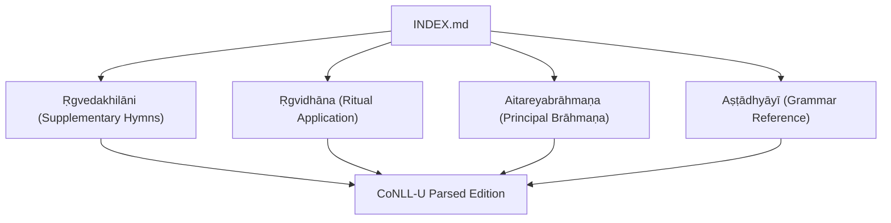
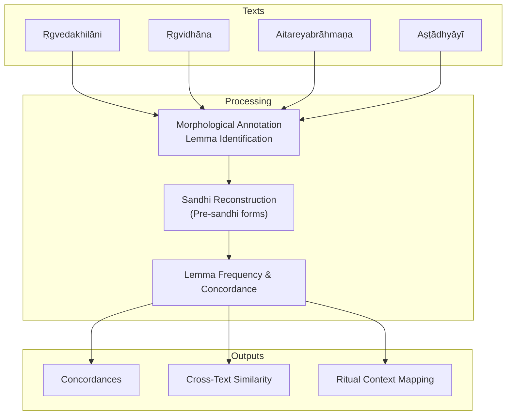
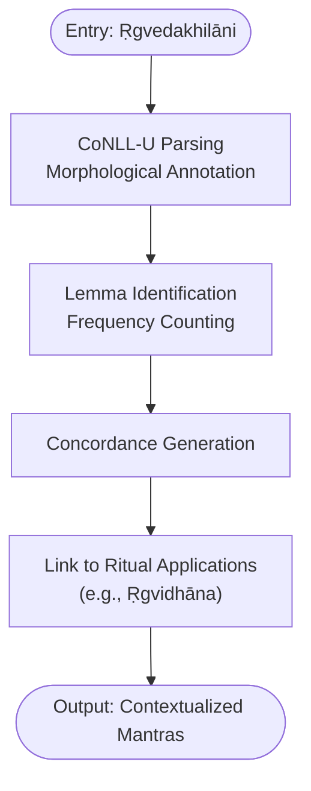
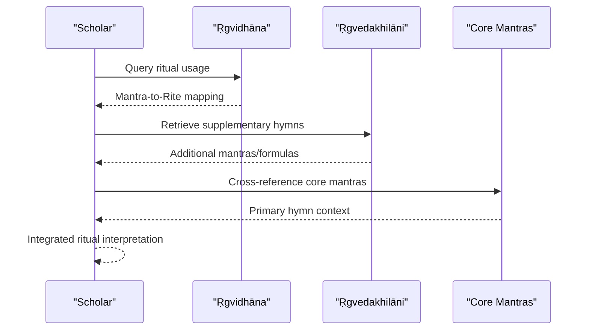
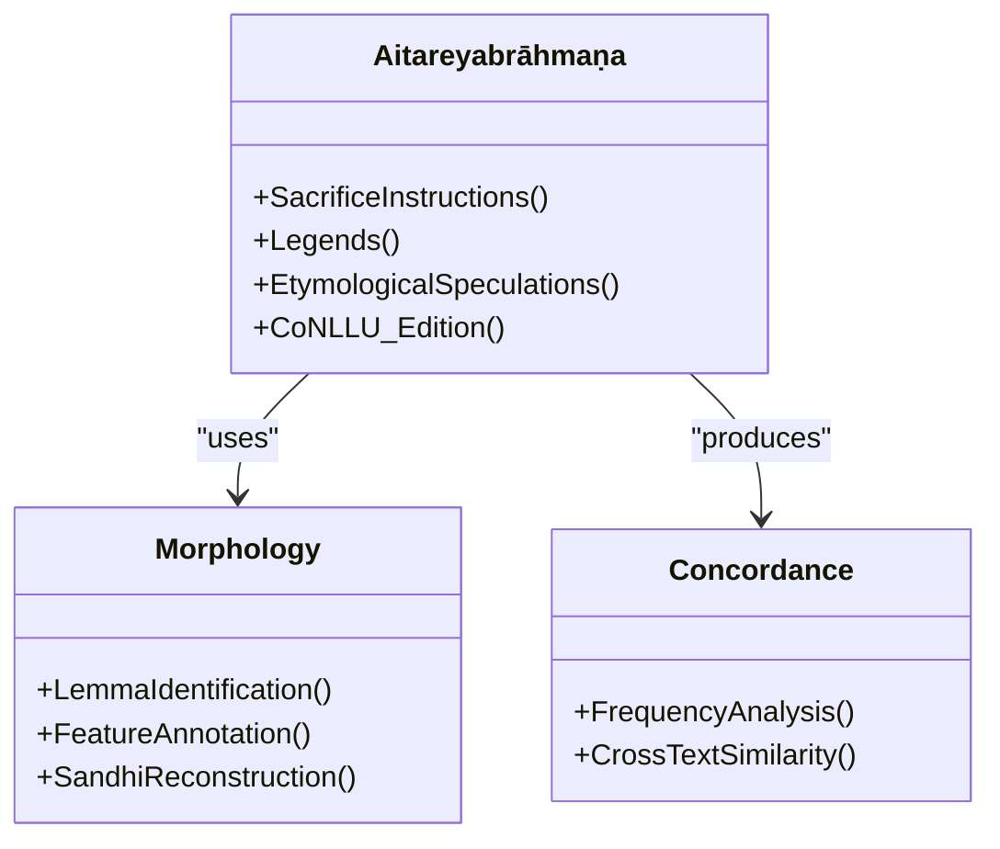
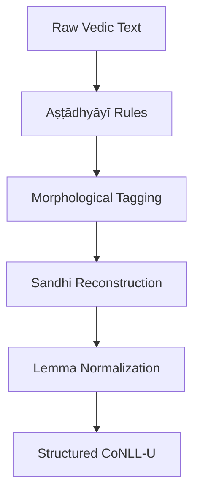
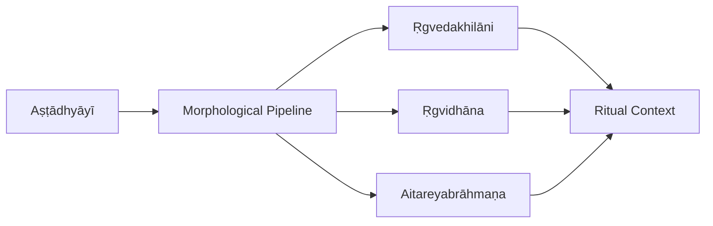

<cite>
**Referenced Files in This Document**
- [INDEX.md](file://INDEX.md)
- [rgvedakhilani.md](file://rgvedakhilani.md)
- [rgvidhana.md](file://rgvidhana.md)
- [aitareyabrahmana.md](file://aitareyabrahmana.md)
- [astadhyayi.md](file://astadhyayi.md)
</cite>

## Table of Contents
1. Introduction
2. Project Structure
3. Core Components
4. Architecture Overview
5. Detailed Component Analysis
6. Dependency Analysis
7. Performance Considerations
8. Troubleshooting Guide
9. Conclusion

## Introduction
This document presents a comprehensive overview of the core Ṛgveda texts and their supplementary materials within the repository, with a focus on the principal recension context and the Ṛgvedakhilāni as supplementary hymns and ritual formulas that complement the main Saṃhitā. It explains how these Vedic texts are represented as CoNLL-U parsed editions, including morphological annotation patterns typical for Vedic Sanskrit, sandhi reconstruction challenges, and lemma frequency analysis. It also clarifies the relationship between core mantras and their ritual applications, showing how supplementary texts like the Ṛgvidhāna provide additional context for understanding primary hymns. Finally, it addresses textual variants and recensional differences within the broader Vedic tradition as reflected by related texts in the corpus.

## Project Structure
The repository organizes Vedic literature alongside other Sanskrit corpora under a knowledge-bank index. The Ṛgveda-related entries include:
- Supplementary hymns (Khilāni)
- Ritual application of Ṛgvedic mantras (Vidhāna)
- Principal Brāhmaṇa of the Ṛgveda tradition (Aitareya Brāhmaṇa)
- Grammar reference (Aṣṭādhyāyī) used to support morphological analysis

**Diagram sources**
- [INDEX.md:192-194](file://INDEX.md#L192-L194)
- [rgvedakhilani.md:1-12](file://rgvedakhilani.md#L1-L12)
- [rgvidhana.md:1-12](file://rgvidhana.md#L1-L12)
- [aitareyabrahmana.md:1-82](file://aitareyabrahmana.md#L1-L82)
- [astadhyayi.md:37-48](file://astadhyayi.md#L37-L48)

**Section sources**
- [INDEX.md:192-194](file://INDEX.md#L192-L194)
- [rgvedakhilani.md:1-12](file://rgvedakhilani.md#L1-L12)
- [rgvidhana.md:1-12](file://rgvidhana.md#L1-L12)
- [aitareyabrahmana.md:1-82](file://aitareyabrahmana.md#L1-L82)
- [astadhyayi.md:37-48](file://astadhyayi.md#L37-L48)

## Core Components
- Ṛgvedakhilāni: Supplementary hymns appended to the Ṛgveda Saṃhitā, preserved in canonical tradition but not part of the core maṇḍalas; represented as 64 CoNLL-U files.
- Ṛgvidhāna: Prescribes the ritual and magical uses of Ṛgvedic mantras for specific purposes; represented as 12 CoNLL-U files.
- Aitareyabrāhmaṇa: Principal Brāhmaṇa of the Śākala recension of the Ṛgveda; detailed ritual instructions for Soma sacrifices (especially Agnistoma), legends, and etymological speculations; represented as 285 CoNLL-U files.
- Aṣṭādhyāyī: Foundational grammar providing lemmatisation, morphological feature annotation, and sandhi reconstruction for highly condensed sūtra language; supports computational analysis across Vedic texts.

These components collectively enable:
- Morphological annotation patterns specific to Vedic Sanskrit
- Sandhi reconstruction from continuous saṃhitā-pāṭha
- Lemma frequency analysis and concordance indexing
- Cross-text similarity and contextual linking between mantras and rituals

**Section sources**
- [rgvedakhilani.md:1-12](file://rgvedakhilani.md#L1-L12)
- [rgvidhana.md:1-12](file://rgvidhana.md#L1-L12)
- [aitareyabrahmana.md:19-40](file://aitareyabrahmana.md#L19-L40)
- [astadhyayi.md:37-48](file://astadhyayi.md#L37-L48)

## Architecture Overview
The computational architecture centers on CoNLL-U parsed editions of Vedic texts, enabling structured linguistic analysis and cross-referencing.

**Diagram sources**
- [rgvedakhilani.md:1-12](file://rgvedakhilani.md#L1-L12)
- [rgvidhana.md:1-12](file://rgvidhana.md#L1-L12)
- [aitareyabrahmana.md:38-40](file://aitareyabrahmana.md#L38-L40)
- [astadhyayi.md:37-48](file://astadhyayi.md#L37-L48)

## Detailed Component Analysis

### Ṛgvedakhilāni: Supplementary Hymns and Ritual Formulas
- Purpose: Additional mantras and formulas that complement the main Saṃhitā, preserving supplementary material outside the core maṇḍalas.
- Representation: 64 CoNLL-U files with full morphological analysis and sandhi reconstruction.
- Computational value: Enables lemma frequency analysis and concordance searches; supports comparative studies with core mantras and ritual manuals.

**Diagram sources**
- [rgvedakhilani.md:1-12](file://rgvedakhilani.md#L1-L12)
- [rgvidhana.md:1-12](file://rgvidhana.md#L1-L12)

**Section sources**
- [rgvedakhilani.md:1-12](file://rgvedakhilani.md#L1-L12)

### Ṛgvidhāna: Ritual Application of Ṛgvedic Mantras
- Purpose: Prescribes the use of Ṛgvedic mantras for specific purposes and desires, bridging core hymns with practical ritual contexts.
- Representation: 12 CoNLL-U files with morphological analysis and sandhi reconstruction.
- Relationship to core mantras: Provides explicit mappings of which mantras are applied in which rites, enhancing interpretive clarity for both scholars and practitioners.

**Diagram sources**
- [rgvidhana.md:1-12](file://rgvidhana.md#L1-L12)
- [rgvedakhilani.md:1-12](file://rgvedakhilani.md#L1-L12)

**Section sources**
- [rgvidhana.md:1-12](file://rgvidhana.md#L1-L12)

### Aitareyabrāhmaṇa: Principal Brāhmaṇa of the Ṛgveda
- Purpose: Detailed ritual instructions for Soma sacrifices (especially Agnistoma), explanatory legends, and etymological speculations on ritual formulas.
- Representation: 285 CoNLL-U files; largest single text in the corpus; preserves saṃhitā-pāṭha with sandhi resolved in the analysis layer.
- Computational value: Extensive coverage of Vedic ritual terminology and morphology; enables high-quality lemma frequency analysis and cross-text similarity comparisons.

**Diagram sources**
- [aitareyabrahmana.md:19-40](file://aitareyabrahmana.md#L19-L40)
- [astadhyayi.md:37-48](file://astadhyayi.md#L37-L48)

**Section sources**
- [aitareyabrahmana.md:19-40](file://aitareyabrahmana.md#L19-L40)

### Aṣṭādhyāyī: Grammar Reference for Morphological Analysis
- Purpose: Foundational grammar providing lemmatisation, morphological feature annotation, and sandhi reconstruction for highly condensed sūtra language.
- Role in Vedic analysis: Supports consistent morphological tagging and unsandhi restoration across Vedic texts, ensuring reliable lemma identification and frequency analysis.

**Diagram sources**
- [astadhyayi.md:37-48](file://astadhyayi.md#L37-L48)

**Section sources**
- [astadhyayi.md:37-48](file://astadhyayi.md#L37-L48)

## Dependency Analysis
The dependency structure shows how the Ṛgvedakhilāni and Ṛgvidhāna rely on shared processing pipelines (morphology, sandhi, lemmatization) and how the Aitareyabrāhmaṇa provides extensive ritual context that informs mantra usage.

**Diagram sources**
- [astadhyayi.md:37-48](file://astadhyayi.md#L37-L48)
- [rgvedakhilani.md:1-12](file://rgvedakhilani.md#L1-L12)
- [rgvidhana.md:1-12](file://rgvidhana.md#L1-L12)
- [aitareyabrahmana.md:19-40](file://aitareyabrahmana.md#L19-L40)

**Section sources**
- [astadhyayi.md:37-48](file://astadhyayi.md#L37-L48)
- [rgvedakhilani.md:1-12](file://rgvedakhilani.md#L1-L12)
- [rgvidhana.md:1-12](file://rgvidhana.md#L1-L12)
- [aitareyabrahmana.md:19-40](file://aitareyabrahmana.md#L19-L40)

## Performance Considerations
- Large-scale parsing: The Aitareyabrāhmaṇa’s 285 CoNLL-U files demand efficient processing pipelines for morphology and sandhi reconstruction.
- Lexical density: High-frequency function words and ritual-specific lemmas require robust normalization and filtering for meaningful frequency analysis.
- Cross-text similarity: TF-IDF-based similarity helps identify related texts and streamline research workflows.

[No sources needed since this section provides general guidance]

## Troubleshooting Guide
Common issues and resolutions when working with Vedic CoNLL-U editions:
- Sandhi ambiguity: Use the Aṣṭādhyāyī-based pipeline to reconstruct pre-sandhi forms consistently.
- Lemma misidentification: Verify morphological features (case, number, gender, verb forms) against grammar rules.
- Ritual context gaps: Cross-reference Ṛgvedakhilāni with Ṛgvidhāna and Aitareyabrāhmaṇa to fill interpretive gaps.

**Section sources**
- [astadhyayi.md:37-48](file://astadhyayi.md#L37-L48)
- [aitareyabrahmana.md:38-40](file://aitareyabrahmana.md#L38-L40)

## Conclusion
The repository provides a robust foundation for studying the core Ṛgveda texts and their supplementary materials through computationally annotated editions. The Ṛgvedakhilāni enriches the main Saṃhitā with additional mantras and formulas, while the Ṛgvidhāna bridges core mantras with ritual practice. The Aitareyabrāhmaṇa offers deep ritual context, and the Aṣṭādhyāyī ensures precise morphological analysis and sandhi reconstruction. Together, these resources enable advanced computational philology, supporting both scholarly research and practical understanding of Vedic traditions.

[No sources needed since this section summarizes without analyzing specific files]
