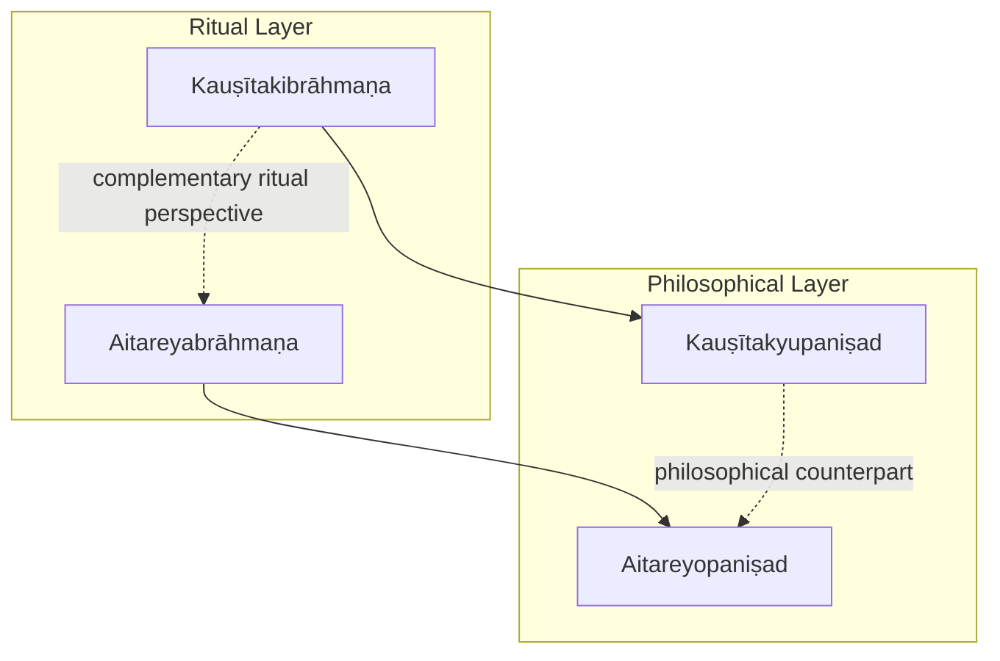
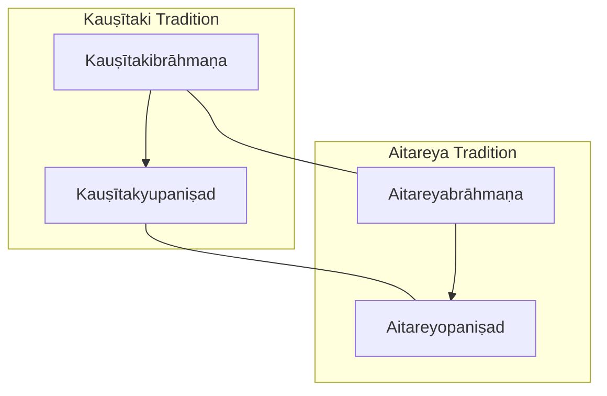
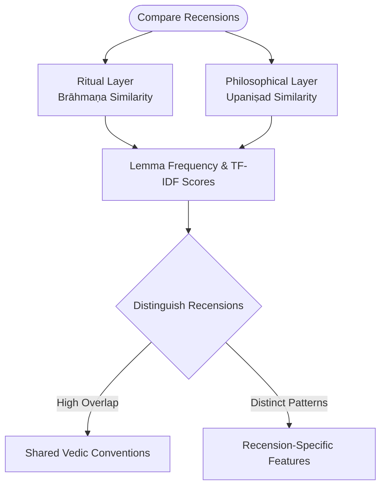
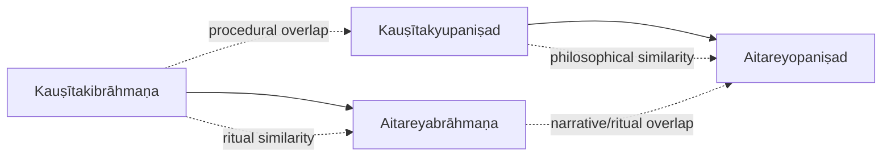

<cite>
**Referenced Files in This Document**
- [kausitakibrahmana.md](file://kausitakibrahmana.md)
- [kausitakyupanisad.md](file://kausitakyupanisad.md)
- [aitareyabrahmana.md](file://aitareyabrahmana.md)
- [aitareyopanisad.md](file://aitareyopanisad.md)
</cite>

## Table of Contents
1. [Introduction](#introduction)
2. [Project Structure](#project-structure)
3. [Core Components](#core-components)
4. [Architecture Overview](#architecture-overview)
5. [Detailed Component Analysis](#detailed-component-analysis)
6. [Dependency Analysis](#dependency-analysis)
7. [Performance Considerations](#performance-considerations)
8. [Troubleshooting Guide](#troubleshooting-guide)
9. [Conclusion](#conclusion)
10. [Appendices](#appendices)

## Introduction
This document presents a comprehensive overview of the Kauṣītaki tradition within the Ṛgveda corpus, focusing on two complementary components:
- The Kauṣītakibrāhmaṇa as an alternative ritual commentary to the Aitareya Brāhmaṇa, offering distinct perspectives on Vedic sacrifice and ceremony.
- The Kauṣītakyupaniṣad (also known as the Ārūṣi Upaniṣad), a significant philosophical text exploring consciousness, breath, and the nature of the self.

The analysis compares these texts with their Aitareya counterparts, highlighting similarities and differences in approach to interpreting Ṛgvedic material. It also includes computational insights derived from morphological patterns and lemma usage that help distinguish this recension from others.

## Project Structure
The repository contains concept pages for key texts in the Kauṣītaki and Aitareya traditions. These pages summarize textual scope, themes, and provide computational metadata such as related-text similarity and notable lemmas. The structure enables cross-referencing between ritual and philosophical layers across recensions.

[No sources needed since this diagram shows conceptual workflow, not actual code structure]

## Core Components
- Kauṣītakibrāhmaṇa: A Brāhmaṇa text of the Ṛgveda tradition containing ritual explanations, legends, and symbolic interpretations of Vedic sacrifices. It is also known as the Śāṅkhāyana Brāhmaṇa.
- Kauṣītakyupaniṣad: One of the twelve principal Upaniṣads belonging to the Ṛgveda, presenting a dialogue on the nature of Brahman and the path to immortality through knowledge.

These components represent the dual trajectory of the tradition: ritual exegesis in the Brāhmaṇa and metaphysical inquiry in the Upaniṣad.

**Section sources**
- [kausitakibrahmana.md:1-48](file://kausitakibrahmana.md#L1-L48)
- [kausitakyupanisad.md:1-48](file://kausitakyupanisad.md#L1-L48)

## Architecture Overview
The Kauṣītaki tradition can be understood as a layered architecture where ritual instruction (Brāhmaṇa) and philosophical reflection (Upaniṣad) are interrelated yet distinct. The Aitareya tradition provides a parallel architecture with its own Brāhmaṇa and Upaniṣad. Computational similarity metrics reveal how closely each component aligns with related texts.

**Diagram sources**
- [kausitakibrahmana.md:15-30](file://kausitakibrahmana.md#L15-L30)
- [kausitakyupanisad.md:15-30](file://kausitakyupanisad.md#L15-L30)
- [aitareyabrahmana.md:19-40](file://aitareyabrahmana.md#L19-L40)
- [aitareyopanisad.md:20-44](file://aitareyopanisad.md#L20-L44)

## Detailed Component Analysis

### Kauṣītakibrāhmaṇa: Ritual Commentary and Sacrificial Exegesis
The Kauṣītakibrāhmaṇa serves as an alternative Brāhmaṇa to the Aitareya Brāhmaṇa within the Ṛgveda tradition. It provides ritual explanations, legends, and symbolic interpretations of Vedic sacrifices. Its computational profile shows high similarity to other Brāhmaṇa texts, particularly the Śatapathabrāhmaṇa, indicating shared ritual vocabulary and stylistic features.

Key observations:
- High lexical similarity to Śatapathabrāhmaṇa suggests common ritual discourse conventions.
- Notable frequent lemmas include demonstratives and particles typical of Brāhmaṇa prose, reflecting explanatory and connective functions.
- The text’s size and structure support extensive coverage of sacrificial procedures and associated narratives.

**Section sources**
- [kausitakibrahmana.md:15-30](file://kausitakibrahmana.md#L15-L30)
- [kausitakibrahmana.md:31-48](file://kausitakibrahmana.md#L31-L48)

### Kauṣītakyupaniṣad: Philosophical Discourse on Consciousness and Self
The Kauṣītakyupaniṣad is a principal Upaniṣad of the Ṛgveda tradition, structured as a dialogue exploring Brahman and the path to immortality through knowledge. Its computational profile indicates moderate similarity to other Upaniṣadic and Brāhmaṇa texts, reflecting both philosophical continuity and distinctive terminology.

Key observations:
- Frequent lemmas include pronouns, copula forms, and philosophical terms, consistent with dialogic exposition.
- Similarity to Chāndogyopaniṣad and Bṛhadāraṇyakopaniṣad underscores shared philosophical concerns.
- The text’s compact size contrasts with the expansive Brāhmaṇa, emphasizing concentrated philosophical inquiry.

**Section sources**
- [kausitakyupanisad.md:15-30](file://kausitakyupanisad.md#L15-L30)
- [kausitakyupanisad.md:31-48](file://kausitakyupanisad.md#L31-L48)

### Aitareyabrāhmaṇa: Parallel Ritual Framework
The Aitareyabrāhmaṇa is the principal Brāhmaṇa of the Śākala śākhā of the Ṛgveda, detailing Soma sacrifices, especially the Agnistoma, along with explanatory legends and etymological speculations. Its computational profile shows strong similarity to the Kauṣītakibrāhmaṇa, confirming shared ritual discourse.

Key observations:
- Extensive coverage of ritual terminology and morphology supports detailed comparative analysis.
- High similarity to Śatapathabrāhmaṇa and Jaiminīyabrāhmaṇa reflects common Brāhmaṇa conventions.
- Prominent lemmas include ritual markers and narrative connectors, characteristic of procedural and mythic sections.

**Section sources**
- [aitareyabrahmana.md:19-40](file://aitareyabrahmana.md#L19-L40)
- [aitareyabrahmana.md:49-82](file://aitareyabrahmana.md#L49-L82)

### Aitareyopaniṣad: Philosophical Counterpart
The Aitareyopaniṣad is one of the twelve principal Upaniṣads of the Ṛgveda, forming the last three books of the Aitareya Āraṇyaka. It presents a profound cosmological and philosophical treatise on creation emanating from the Ātman. Its computational profile reveals similarity to other Upaniṣads and Brāhmaṇas, indicating thematic overlap and distinct philosophical vocabulary.

Key observations:
- Emphasis on creation narrative and the doctrine of the three births of the Self.
- Moderate similarity to Chāndogyopaniṣad and Bṛhadāraṇyakopaniṣad highlights shared metaphysical concerns.
- Frequent lemmas include pronouns, existential verbs, and philosophical nouns, consistent with dialogic and expository style.

**Section sources**
- [aitareyopanisad.md:20-44](file://aitareyopanisad.md#L20-L44)
- [aitareyopanisad.md:54-87](file://aitareyopanisad.md#L54-L87)

### Comparative Analysis: Kauṣītaki vs. Aitareya Traditions
The comparison reveals both convergence and divergence:
- Ritual layer: Both Brāhmaṇas share high lexical similarity, indicating common sacrificial discourse, but differ in specific ritual emphases and narrative details.
- Philosophical layer: Both Upaniṣads explore consciousness and the self, yet exhibit different rhetorical structures and terminological preferences.
- Computational metrics: Lemma frequency distributions and similarity scores help quantify textual relationships and distinguish recensional characteristics.

[No sources needed since this diagram shows conceptual workflow, not actual code structure]

## Dependency Analysis
The dependency relationships between texts can be visualized through similarity metrics and thematic links. The Brāhmaṇas depend on shared ritual vocabulary and narrative structures, while the Upaniṣads depend on philosophical concepts and dialogic forms.

**Diagram sources**
- [kausitakibrahmana.md:15-30](file://kausitakibrahmana.md#L15-L30)
- [kausitakyupanisad.md:15-30](file://kausitakyupanisad.md#L15-L30)
- [aitareyabrahmana.md:49-82](file://aitareyabrahmana.md#L49-L82)
- [aitareyopanisad.md:54-87](file://aitareyopanisad.md#L54-L87)

**Section sources**
- [kausitakibrahmana.md:15-30](file://kausitakibrahmana.md#L15-L30)
- [kausitakyupanisad.md:15-30](file://kausitakyupanisad.md#L15-L30)
- [aitareyabrahmana.md:49-82](file://aitareyabrahmana.md#L49-L82)
- [aitareyopanisad.md:54-87](file://aitareyopanisad.md#L54-L87)

## Performance Considerations
When analyzing large corpora like the Aitareyabrāhmaṇa (285 CoNLL-U files), computational efficiency becomes important:
- Tokenization and lemmatization should handle Vedic sandhi and archaic forms accurately.
- Similarity computations (TF-IDF cosine) benefit from normalized term frequencies and careful stopword handling.
- Memory usage scales with file count; batch processing and incremental indexing can improve performance.

[No sources needed since this section provides general guidance]

## Troubleshooting Guide
Common issues in computational philology of Vedic texts:
- Inconsistent lemma normalization across recensions may skew similarity scores.
- Missing or misaligned CoNLL-U annotations can affect morphological analysis.
- Cross-referencing requires consistent metadata tagging (e.g., tags, knowledge-bank fields).

Mitigation strategies:
- Validate annotation pipelines against known paradigms.
- Use standardized lemma indices and concordance tools for verification.
- Maintain version control for text editions and metadata updates.

[No sources needed since this section provides general guidance]

## Conclusion
The Kauṣītaki tradition offers a rich dual trajectory: the Kauṣītakibrāhmaṇa provides an alternative ritual commentary to the Aitareya Brāhmaṇa, while the Kauṣītakyupaniṣad presents a philosophical exploration of consciousness and the self comparable to the Aitareyopaniṣad. Computational analysis reveals both shared Vedic conventions and recension-specific features, enabling nuanced comparisons across ritual and philosophical layers.

[No sources needed since this section summarizes without analyzing specific files]

## Appendices
- Appendix A: Computational Metadata Summary
  - Lemma frequency tables and similarity scores for each text.
  - Concordance links for top lemmas.
- Appendix B: Textual Relationships
  - Cross-recension similarity matrices.
  - Thematic clustering based on lemma usage.

[No sources needed since this section provides general guidance]
