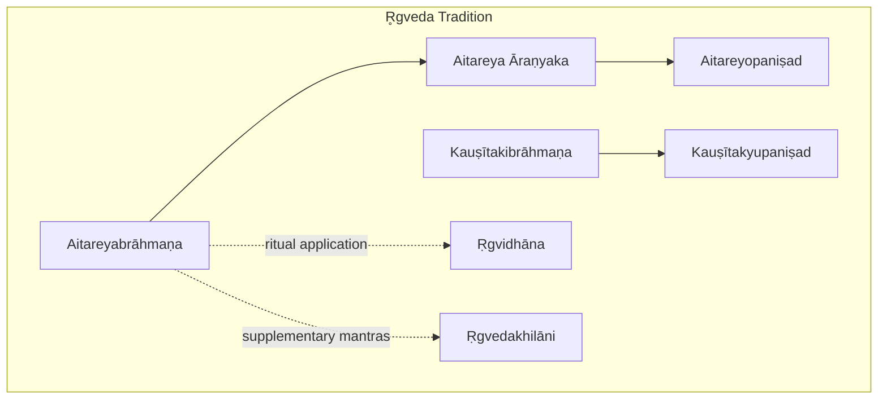
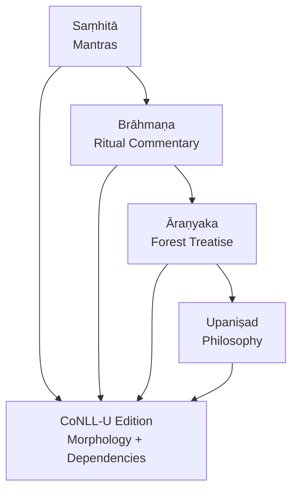
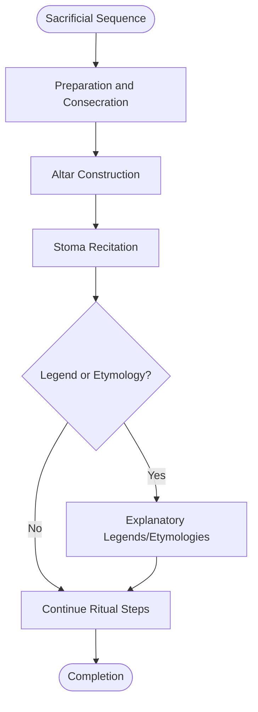
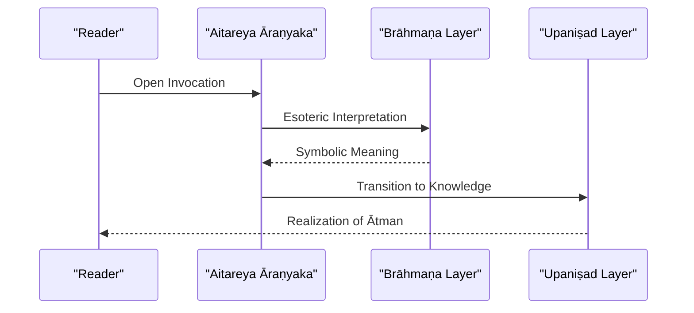
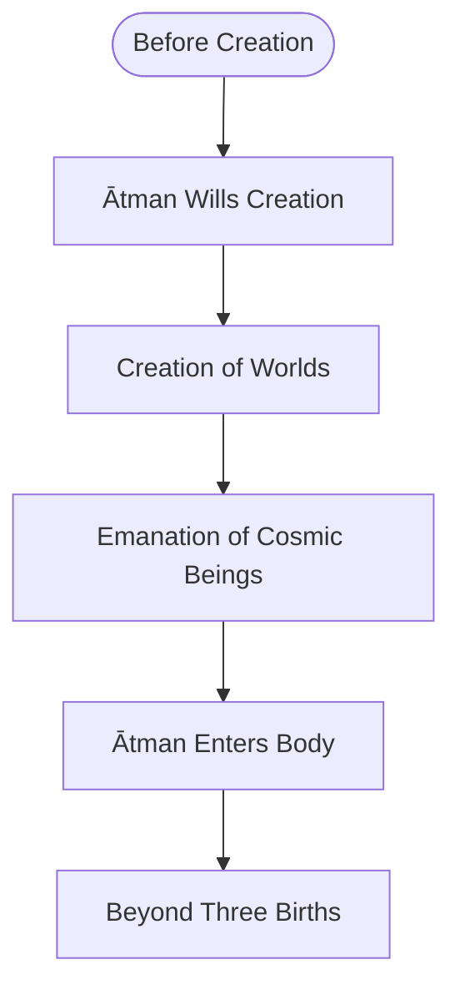
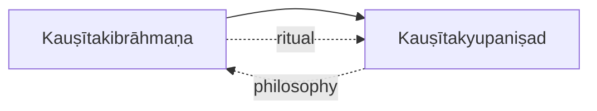
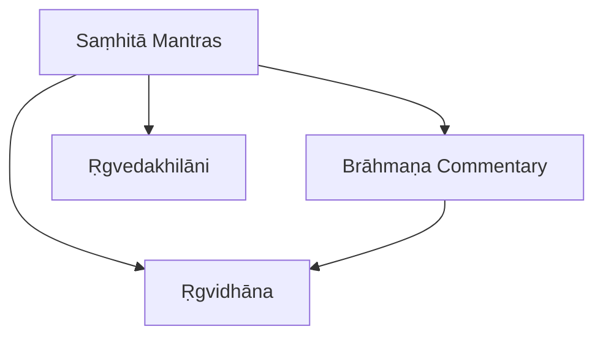
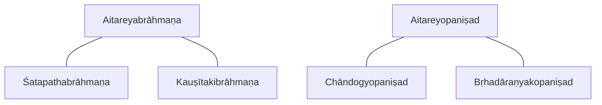

<cite>
**Referenced Files in This Document**
- [INDEX.md](file://INDEX.md)
- [aitareya-aranyaka.md](file://aitareya-aranyaka.md)
- [aitareyabrahmana.md](file://aitareyabrahmana.md)
- [aitareyopanisad.md](file://aitareyopanisad.md)
- [kausitakibrahmana.md](file://kausitakibrahmana.md)
- [kausitakyupanisad.md](file://kausitakyupanisad.md)
- [rgvedakhilani.md](file://rgvedakhilani.md)
- [rgvidhana.md](file://rgvidhana.md)
</cite>

## Table of Contents
1. Introduction
2. Project Structure
3. Core Components
4. Architecture Overview
5. Detailed Component Analysis
6. Dependency Analysis
7. Performance Considerations
8. Troubleshooting Guide
9. Conclusion
10. Appendices

## Introduction
This document presents a comprehensive overview of the Ṛgveda tradition as represented in the repository, focusing on the principal recension and its associated texts. It covers:
- The Aitareya Brāhmaṇa as the primary ritual commentary for the Śākala recension of the Ṛgveda
- The Aitareya Āraṇyaka as the bridge between ritual (Brāhmaṇa) and philosophy (Upaniṣad)
- The Aitareya Upaniṣad as a principal philosophical text within the same tradition
- The Kauṣītaki tradition’s Brāhmaṇa and Upaniṣad
- The computational analysis of these texts via CoNLL-U parsing, morphological annotation patterns, and lemma frequency analysis
- The relationship between Saṃhitā mantras and their ritual applications in the Brāhmaṇas and related texts

The materials are sourced from CoNLL-U parsed editions with full morphological analysis and dependency annotation, enabling both philological study and quantitative textual analysis.

## Project Structure
The repository organizes Vedic literature under a knowledge bank index that catalogs topics with concise metadata, including file counts of CoNLL-U files per text. For the Ṛgveda tradition, the relevant entries include:
- Aitareya Āraṇyaka (forest treatise bridging Brāhmaṇa and Upaniṣad)
- Aitareyabrāhmaṇa (principal Brāhmaṇa of the Ṛgveda)
- Aitareyopaniṣad (creation through the Ātman)
- Kauṣītakibrāhmaṇa (ritual explanations)
- Kauṣītakyupaniṣad (on Brahman and immortality)
- Supplementary materials such as Ṛgvedakhilāni and Ṛgvidhāna

**Diagram sources**
- [INDEX.md:15-17](file://INDEX.md#L15-L17)
- [INDEX.md:115-117](file://INDEX.md#L115-L117)
- [INDEX.md:192-194](file://INDEX.md#L192-L194)

**Section sources**
- [INDEX.md:1-20](file://INDEX.md#L1-L20)
- [INDEX.md:15-17](file://INDEX.md#L15-L17)
- [INDEX.md:115-117](file://INDEX.md#L115-L117)
- [INDEX.md:192-194](file://INDEX.md#L192-L194)

## Core Components
This section summarizes the core components of the Ṛgveda tradition present in the repository and highlights their roles, structure, and computational edition details.

- Aitareyabrāhmaṇa: Principal Brāhmaṇa of the Śākla recension; detailed instructions for Soma sacrifices (especially Agnistoma), explanatory legends, and etymological speculations; largest single text in the corpus with extensive ritual terminology; CoNLL-U parsed edition preserves saṃhitā-pāṭha with sandhi resolved in analysis layer.
- Aitareya Āraṇyaka: Forest treatise bridging Brāhmaṇa ritual prose and Upaniṣadic philosophy; opens with a prayer uniting speech and mind; traditionally five books, last three constituting the Aitareya Upaniṣad; CoNLL-U parsed edition includes full morphological analysis and dependency annotation.
- Aitareyopaniṣad: One of the twelve principal Upaniṣads; non-dual creation narrative centered on the Ātman; describes emanation of worlds and the “three births” doctrine; CoNLL-U parsed edition covers key philosophical vocabulary with morphological analysis.
- Kauṣītakibrāhmaṇa: Also known as the Śāṅkhāyana Brāhmaṇa; contains ritual explanations, legends, and symbolic interpretations of Vedic sacrifices; CoNLL-U parsed edition provides rich lemma usage for comparative analysis.
- Kauṣītakyupaniṣad: Principal Upaniṣad of the Kauṣītaki tradition; dialogue on the nature of Brahman and path to immortality; CoNLL-U parsed edition emphasizes philosophical lemmas such as brahman.
- Supplementary texts:
  - Ṛgvedakhilāni: Additional hymns appended to the Ṛgveda Saṃhitā, not part of the core maṇḍalas but preserved in canonical tradition.
  - Ṛgvidhāna: Prescribes magical and ritual uses of Ṛgvedic mantras for specific purposes and desires.

**Section sources**
- [aitareyabrahmana.md:19-40](file://aitareyabrahmana.md#L19-L40)
- [aitareya-aranyaka.md:19-38](file://aitareya-aranyaka.md#L19-L38)
- [aitareyopanisad.md:20-44](file://aitareyopanisad.md#L20-L44)
- [kausitakibrahmana.md:1-11](file://kausitakibrahmana.md#L1-L11)
- [kausitakyupanisad.md:1-11](file://kausitakyupanisad.md#L1-L11)
- [rgvedakhilani.md:1-12](file://rgvedakhilani.md#L1-L12)
- [rgvidhana.md:1-12](file://rgvidhana.md#L1-L12)

## Architecture Overview
The Ṛgveda tradition in this repository is structured as a layered corpus:
- Saṃhitā layer: Mantra collections (core and supplementary)
- Brāhmaṇa layer: Ritual manuals explaining performance and symbolism
- Āraṇyaka layer: Transitional texts interpreting rituals esoterically
- Upaniṣad layer: Philosophical discourses on Brahman/Ātman

Computationally, each text is available as a CoNLL-U parsed edition with morphological annotations and dependency structures, enabling lemma frequency analysis and cross-text similarity comparisons.

[No diagram sources needed since this diagram shows conceptual architecture, not direct code mapping]

## Detailed Component Analysis

### Aitareyabrāhmaṇa: Primary Ritual Commentary
- Role: Principal Brāhmaṇa of the Śākla recension; focuses on Soma sacrifices, especially Agnistoma
- Structure: Organized into adhyāyas and pañcikās; includes Dīkṣaṇīyeṣṭi, altar construction/consecration, Stoma/Śastra recitations, legends (e.g., Śunaḥśepa), and Mahāvrata
- Computational features: Largest single text in the corpus; extensive coverage of Vedic ritual terminology and morphology; CoNLL-U preserves saṃhitā-pāṭha with sandhi resolved in analysis layer
- Lemma frequency: High-frequency function words (tad, iti, vai, yad, eva, etad, idam, ca, ahar, ha) reflect ritual discourse patterns

**Section sources**
- [aitareyabrahmana.md:19-40](file://aitareyabrahmana.md#L19-L40)
- [aitareyabrahmana.md:65-81](file://aitareyabrahmana.md#L65-L81)

### Aitareya Āraṇyaka: Bridge Between Ritual and Philosophy
- Role: Forest treatise bridging Brāhmaṇa ritual prose and Upaniṣadic philosophy
- Themes: Opening invocation uniting speech and mind; esoteric interpretation of rituals; transitional genre moving from karma-kāṇḍa to jñāna-kāṇḍa
- Computational features: 58 CoNLL-U files with full morphological analysis, sandhi reconstruction, and dependency annotation

**Section sources**
- [aitareya-aranyaka.md:19-38](file://aitareya-aranyaka.md#L19-L38)

### Aitareyopaniṣad: Principal Philosophical Text
- Role: One of the twelve principal Upaniṣads; non-dual creation account centered on Ātman
- Themes: Creation through emanation; three births of the Self; transcendence of ritual in favor of knowledge
- Computational features: CoNLL-U parsed edition covers key philosophical vocabulary (ātman, prajñāna, prāṇa, loka) with morphological analysis

**Section sources**
- [aitareyopanisad.md:20-44](file://aitareyopanisad.md#L20-L44)
- [aitareyopanisad.md:70-85](file://aitareyopanisad.md#L70-L85)

### Kauṣītaki Tradition: Brāhmaṇa and Upaniṣad
- Kauṣītakibrāhmaṇa: Ritual explanations, legends, and symbolic interpretations; high similarity to Śatapathabrāhmaṇa and Aitareyabrāhmaṇa in lemma usage
- Kauṣītakyupaniṣad: Dialogue on Brahman and path to immortality; notable lemmas include brahman, indicating philosophical focus

**Section sources**
- [kausitakibrahmana.md:1-11](file://kausitakibrahmana.md#L1-L11)
- [kausitakibrahmana.md:31-46](file://kausitakibrahmana.md#L31-L46)
- [kausitakyupanisad.md:1-11](file://kausitakyupanisad.md#L1-L11)
- [kausitakyupanisad.md:31-46](file://kausitakyupanisad.md#L31-L46)

### Relationship Between Saṃhitā Mantras and Brāhmaṇa Applications
- Saṃhitā mantras serve as the foundational utterances
- Brāhmaṇas provide ritual procedures, symbolic meanings, and explanatory contexts for applying those mantras
- Supplementary texts like Ṛgvidhāna prescribe specific ritual/magical uses of Ṛgvedic mantras for particular aims
- Supplementary hymns (Ṛgvedakhilāni) extend the mantra corpus beyond core maṇḍalas

**Section sources**
- [rgvidhana.md:1-12](file://rgvidhana.md#L1-L12)
- [rgvedakhilani.md:1-12](file://rgvedakhilani.md#L1-L12)
- [aitareyabrahmana.md:19-40](file://aitareyabrahmana.md#L19-L40)

## Dependency Analysis
Cross-text similarity based on lemma usage reveals relationships among texts:
- Aitareyabrāhmaṇa shows highest similarity to Śatapathabrāhmaṇa and Kauṣītakibrāhmaṇa, reflecting shared ritual vocabulary
- Aitareyopaniṣad aligns more closely with other Upaniṣads (e.g., Chāndogyopaniṣad, Bṛhadāraṇyakopaniṣad) than with Brāhmaṇas
- Kauṣītakyupaniṣad shares similarities with Śāṅkhāyanāraṇyaka and Jaiminīya-Upaniṣad-Brāhmaṇa, indicating cross-tradition philosophical overlap

**Section sources**
- [aitareyabrahmana.md:49-64](file://aitareyabrahmana.md#L49-L64)
- [kausitakibrahmana.md:15-30](file://kausitakibrahmana.md#L15-L30)
- [aitareyopanisad.md:54-69](file://aitareyopanisad.md#L54-L69)
- [kausitakyupanisad.md:15-30](file://kausitakyupanisad.md#L15-L30)

## Performance Considerations
- Corpus size: Aitareyabrāhmaṇa is the largest single text (285 CoNLL-U files), requiring efficient indexing and query strategies for lemma analysis
- Morphological complexity: Vedic Sanskrit exhibits rich inflectional morphology; CoNLL-U annotations enable precise token-level analysis but may increase computational overhead
- Cross-text comparison: TF-IDF cosine similarity provides a scalable method for identifying lexical overlaps across large corpora

[No sources needed since this section provides general guidance]

## Troubleshooting Guide
Common issues when working with CoNLL-U parsed editions:
- Sandhi resolution: Ensure analysis layers correctly resolve sandhi forms to underlying morphemes for accurate lemma extraction
- Token alignment: Verify that morphological tags and dependency relations align consistently across files
- Lemma normalization: Use standardized lemma forms to avoid fragmentation due to variant spellings or diacritic differences

[No sources needed since this section provides general guidance]

## Conclusion
The Ṛgveda tradition in this repository offers a richly annotated corpus spanning ritual, transitional, and philosophical layers. The Aitareya Brāhmaṇa, Āraṇyaka, and Upaniṣad form a cohesive progression from external ritual to internal realization, while the Kauṣītaki tradition provides parallel ritual and philosophical materials. CoNLL-U parsing enables robust computational analysis, including lemma frequency studies and cross-text similarity assessments, supporting both traditional scholarship and digital humanities approaches.

[No sources needed since this section summarizes without analyzing specific files]

## Appendices

### Appendix A: CoNLL-U Parsing and Morphological Annotation Patterns
- Full morphological analysis: Each token is annotated with part-of-speech, case, number, gender, tense, mood, voice, etc.
- Dependency annotation: Captures syntactic relationships between tokens, enabling structural analysis of Vedic prose and verse
- Sandhi reconstruction: Analysis layer resolves continuous text into discrete morphological units for accurate processing

[No sources needed since this section provides general guidance]

### Appendix B: Lemma Frequency Analysis
- Function words dominate top frequencies across texts (e.g., tad, iti, vai, yad, eva), reflecting discourse patterns
- Domain-specific lemmas emerge in philosophical texts (e.g., ātman, brahman) and ritual texts (e.g., sacrifice-related terms)
- Comparative analysis using TF-IDF cosine similarity identifies textual affinities across traditions

**Section sources**
- [aitareyabrahmana.md:65-81](file://aitareyabrahmana.md#L65-L81)
- [aitareyopanisad.md:70-85](file://aitareyopanisad.md#L70-L85)
- [kausitakibrahmana.md:31-46](file://kausitakibrahmana.md#L31-L46)
- [kausitakyupanisad.md:31-46](file://kausitakyupanisad.md#L31-L46)
