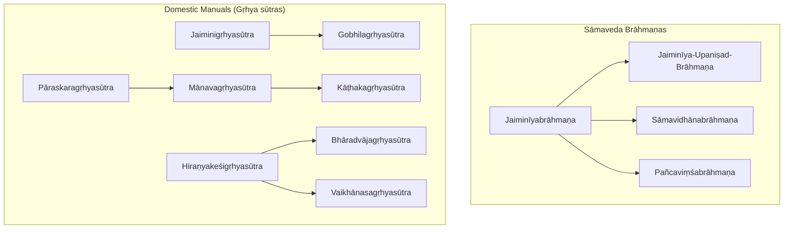
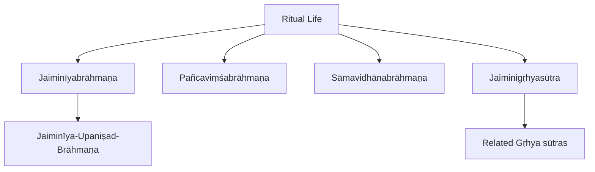
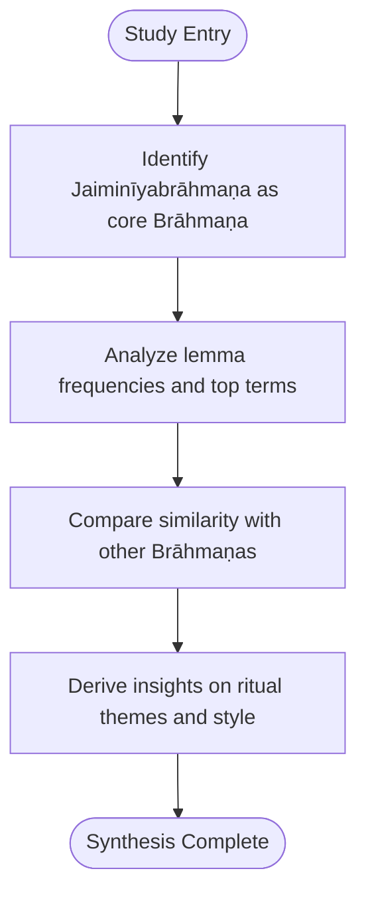
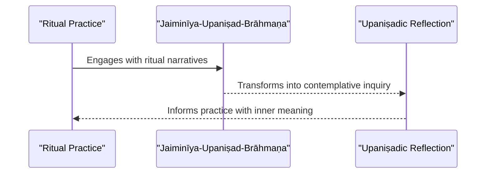
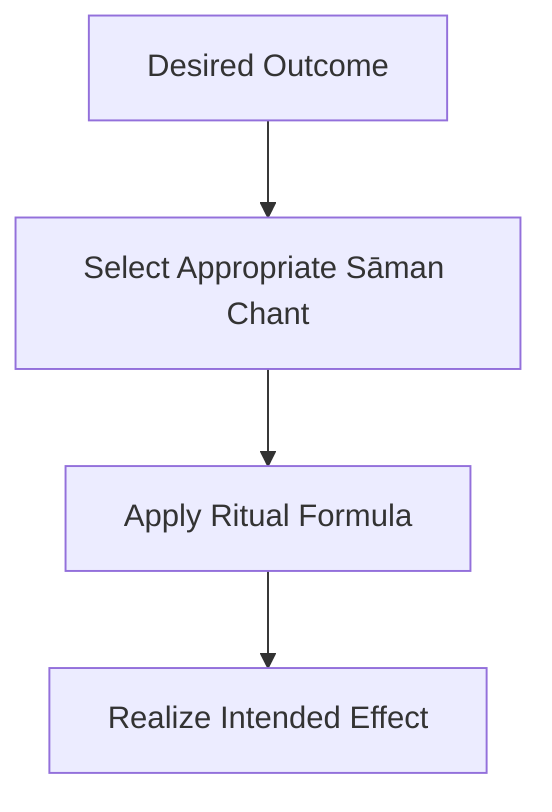
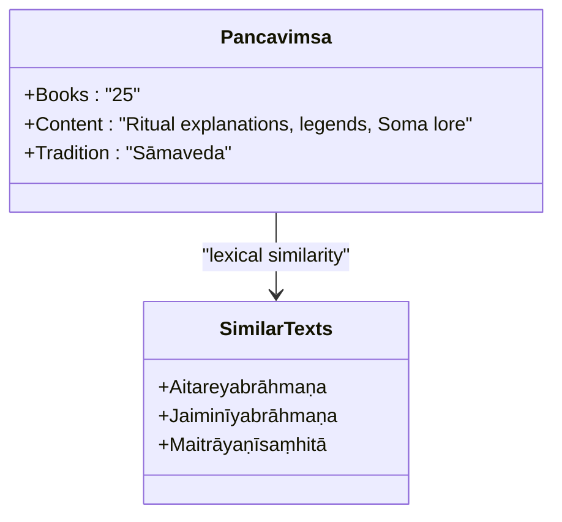
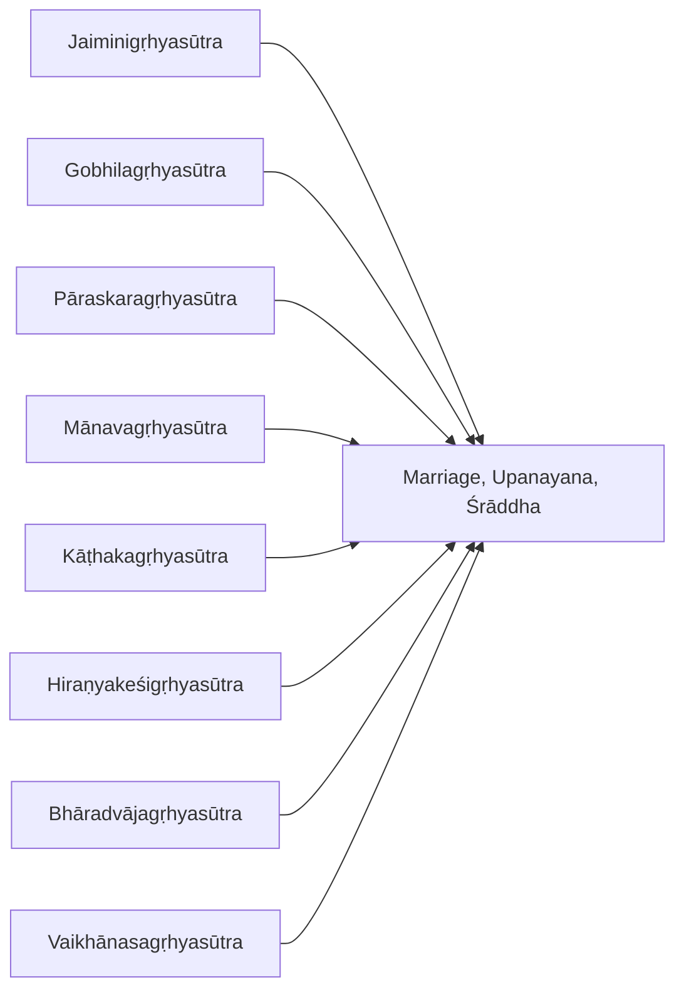
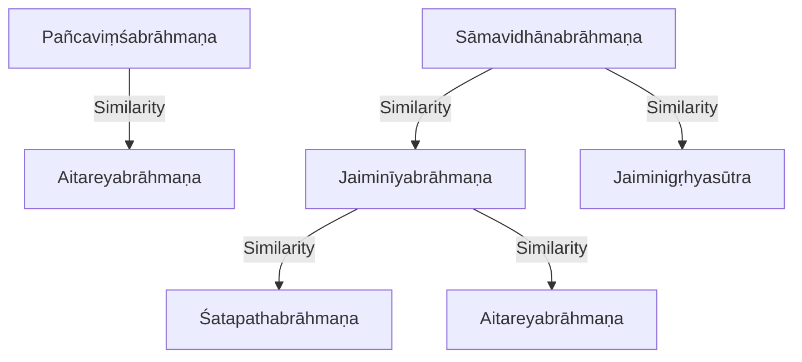

<cite>
**Referenced Files in This Document**
- [jaiminiyabrahmana.md](file://jaiminiyabrahmana.md)
- [jaiminiya-upanishad-brahmana.md](file://jaiminiya-upanishad-brahmana.md)
- [samavidhanabrahmana.md](file://samavidhanabrahmana.md)
- [pancavimsabrahmana.md](file://pancavimsabrahmana.md)
- [jaiminigrhyasutra.md](file://jaiminigrhyasutra.md)
- [gobhilagrhyasutra.md](file://gobhilagrhyasutra.md)
- [paraskaragrhyasutra.md](file://paraskaragrhyasutra.md)
- [manavagrhyasutra.md](file://manavagrhyasutra.md)
- [kathakagrhyasutra.md](file://kathakagrhyasutra.md)
- [hiranyakesigrhyasutra.md](file://hiranyakesigrhyasutra.md)
- [bharadvajagrhyasutra.md](file://bharadvajagrhyasutra.md)
- [vaikhanasagrhyasutra.md](file://vaikhanasagrhyasutra.md)
</cite>

## Table of Contents
1. [Introduction](#introduction)
2. [Project Structure](#project-structure)
3. [Core Components](#core-components)
4. [Architecture Overview](#architecture-overview)
5. [Detailed Component Analysis](#detailed-component-analysis)
6. [Dependency Analysis](#dependency-analysis)
7. [Performance Considerations](#performance-considerations)
8. [Troubleshooting Guide](#troubleshooting-guide)
9. [Conclusion](#conclusion)
10. [Appendices](#appendices)

## Introduction
This document presents a comprehensive overview of the Sāmaveda tradition with emphasis on its melodic and ritual dimensions. It focuses on:
- The Jaiminīya Brāhmaṇa as the primary ritual manual for Soma sacrifice and related rites.
- The Jaiminīya Upaniṣad-Brāhmaṇa as a philosophical bridge between ritual and contemplative traditions.
- The Samvidhāna Brāhmaṇa for practical applications of Sāman chants to achieve specific ritual aims.
- The Pañcaviṃśa Mahābrāhmaṇa (Tāṇḍya) as the most extensive Sāmavedic ritual compendium.
- Gṛhya sūtras from multiple schools, including Sāmavedic and closely related traditions, detailing domestic rituals such as marriage, upanayana, and śrāddha.
It also outlines computational insights available in this corpus—such as lemma frequency patterns and textual similarity—that help reveal recurring ritual formulas and structural regularities across texts.

## Project Structure
The repository organizes each text as a standalone concept file with metadata describing its tradition, scope, and dataset size. For the Sāmaveda tradition, the relevant files include:
- Core Brāhmaṇas: Jaiminīyabrāhmaṇa, Jaiminīya-Upaniṣad-Brāhmaṇa, Sāmavidhānabrāhmaṇa, Pañcaviṃśabrāhmaṇa.
- Domestic manuals (Gṛhya sūtras): Jaiminigṛhyasūtra, Gobhilagṛhyasūtra, plus related manuals from other traditions that share ritual vocabulary and practices.

**Diagram sources**
- [jaiminiyabrahmana.md:1-11](file://jaiminiyabrahmana.md#L1-L11)
- [jaiminiya-upanishad-brahmana.md:1-11](file://jaiminiya-upanishad-brahmana.md#L1-L11)
- [samavidhanabrahmana.md:1-11](file://samavidhanabrahmana.md#L1-L11)
- [pancavimsabrahmana.md:1-11](file://pancavimsabrahmana.md#L1-L11)
- [jaiminigrhyasutra.md:1-11](file://jaiminigrhyasutra.md#L1-L11)
- [gobhilagrhyasutra.md:1-11](file://gobhilagrhyasutra.md#L1-L11)
- [paraskaragrhyasutra.md:1-11](file://paraskaragrhyasutra.md#L1-L11)
- [manavagrhyasutra.md:1-11](file://manavagrhyasutra.md#L1-L11)
- [kathakagrhyasutra.md:1-11](file://kathakagrhyasutra.md#L1-L11)
- [hiranyakesigrhyasutra.md:1-11](file://hiranyakesigrhyasutra.md#L1-L11)
- [bharadvajagrhyasutra.md:1-11](file://bharadvajagrhyasutra.md#L1-L11)
- [vaikhanasagrhyasutra.md:1-11](file://vaikhanasagrhyasutra.md#L1-L11)

**Section sources**
- [jaiminiyabrahmana.md:1-11](file://jaiminiyabrahmana.md#L1-L11)
- [jaiminiya-upanishad-brahmana.md:1-11](file://jaiminiya-upanishad-brahmana.md#L1-L11)
- [samavidhanabrahmana.md:1-11](file://samavidhanabrahmana.md#L1-L11)
- [pancavimsabrahmana.md:1-11](file://pancavimsabrahmana.md#L1-L11)
- [jaiminigrhyasutra.md:1-11](file://jaiminigrhyasutra.md#L1-L11)
- [gobhilagrhyasutra.md:1-11](file://gobhilagrhyasutra.md#L1-L11)
- [paraskaragrhyasutra.md:1-11](file://paraskaragrhyasutra.md#L1-L11)
- [manavagrhyasutra.md:1-11](file://manavagrhyasutra.md#L1-L11)
- [kathakagrhyasutra.md:1-11](file://kathakagrhyasutra.md#L1-L11)
- [hiranyakesigrhyasutra.md:1-11](file://hiranyakesigrhyasutra.md#L1-L11)
- [bharadvajagrhyasutra.md:1-11](file://bharadvajagrhyasutra.md#L1-L11)
- [vaikhanasagrhyasutra.md:1-11](file://vaikhanasagrhyasutra.md#L1-L11)

## Core Components
- Jaiminīyabrāhmaṇa: A major Brāhmaṇa of the Sāmaveda tradition containing ritual explanations, legends, and philosophical speculations connected to the Soma sacrifice.
- Jaiminīya-Upaniṣad-Brāhmaṇa: An āraṇyaka-style text bridging Brāhmaṇa ritual and Upaniṣadic philosophy within the Sāmaveda tradition.
- Sāmavidhānabrāhmaṇa: Prescribes the ritual application of Sāman chants for various purposes and desires.
- Pañcaviṃśabrāhmaṇa (Tāṇḍya Mahābrāhmaṇa): A major, extensive Brāhmaṇa of the Sāmaveda with 25 books of ritual explanations, legends, and Soma sacrifice lore.
- Gṛhya sūtras: Domestic ritual manuals prescribing household rites (e.g., marriage, upanayana, śrāddha). The Jaiminigṛhyasūtra belongs to the Jaimini school of the Sāmaveda; other manuals listed here represent related traditions that share ritual vocabulary and practices.

These components collectively map the Sāmavedic world from grand public sacrifices to intimate domestic rites, with chant application and philosophical reflection woven throughout.

**Section sources**
- [jaiminiyabrahmana.md:1-11](file://jaiminiyabrahmana.md#L1-L11)
- [jaiminiya-upanishad-brahmana.md:1-11](file://jaiminiya-upanishad-brahmana.md#L1-L11)
- [samavidhanabrahmana.md:1-11](file://samavidhanabrahmana.md#L1-L11)
- [pancavimsabrahmana.md:1-11](file://pancavimsabrahmana.md#L1-L11)
- [jaiminigrhyasutra.md:1-11](file://jaiminigrhyasutra.md#L1-L11)
- [gobhilagrhyasutra.md:1-11](file://gobhilagrhyasutra.md#L1-L11)
- [paraskaragrhyasutra.md:1-11](file://paraskaragrhyasutra.md#L1-L11)
- [manavagrhyasutra.md:1-11](file://manavagrhyasutra.md#L1-L11)
- [kathakagrhyasutra.md:1-11](file://kathakagrhyasutra.md#L1-L11)
- [hiranyakesigrhyasutra.md:1-11](file://hiranyakesigrhyasutra.md#L1-L11)
- [bharadvajagrhyasutra.md:1-11](file://bharadvajagrhyasutra.md#L1-L11)
- [vaikhanasagrhyasutra.md:1-11](file://vaikhanasagrhyasutra.md#L1-L11)

## Architecture Overview
The Sāmaveda tradition can be understood as an integrated system where:
- Public ritual is codified in Brāhmaṇas (especially Jaiminīyabrāhmaṇa and Pañcaviṃśabrāhmaṇa).
- Philosophical reflection emerges through the Jaiminīya-Upaniṣad-Brāhmaṇa.
- Practical chant application is systematized in the Sāmavidhānabrāhmaṇa.
- Domestic life is regulated by Gṛhya sūtras, with the Jaiminigṛhyasūtra anchoring the Sāmavedic lineage.

[No sources needed since this diagram shows conceptual workflow, not actual code structure]

## Detailed Component Analysis

### Jaiminīyabrāhmaṇa
- Role: Primary Sāmavedic Brāhmaṇa providing ritual explanations, legends, and philosophical reflections tied to the Soma sacrifice.
- Computational profile: High-frequency lemmas reflect narrative and expository style typical of Brāhmaṇas; strong lexical overlap with other Brāhmaṇas indicates shared ritual discourse.
- Relatedness: Shows notable similarity to Śatapathabrāhmaṇa and Aitareyabrāhmaṇa, underscoring cross-traditional ritual vocabulary.

**Section sources**
- [jaiminiyabrahmana.md:1-11](file://jaiminiyabrahmana.md#L1-L11)
- [jaiminiyabrahmana.md:15-30](file://jaiminiyabrahmana.md#L15-L30)
- [jaiminiyabrahmana.md:31-48](file://jaiminiyabrahmana.md#L31-L48)

### Jaiminīya-Upaniṣad-Brāhmaṇa
- Role: Bridges Brāhmaṇa ritual exposition with Upaniṣadic philosophy in an āraṇyaka-style format within the Sāmaveda tradition.
- Significance: Provides a transition point from external ritual action to internal contemplation, aligning with broader Vedic intellectual evolution.

[No sources needed since this diagram shows conceptual workflow, not actual code structure]

**Section sources**
- [jaiminiya-upanishad-brahmana.md:1-11](file://jaiminiya-upanishad-brahmana.md#L1-L11)

### Sāmavidhānabrāhmaṇa
- Role: Prescribes the ritual application of Sāman chants for diverse purposes and desires, linking melody to outcome.
- Computational profile: Frequent use of connective and deictic particles suggests procedural and instructional style; high similarity to Jaiminīyabrāhmaṇa and several Gṛhya sūtras indicates shared ritual lexicon.

**Section sources**
- [samavidhanabrahmana.md:1-11](file://samavidhanabrahmana.md#L1-L11)
- [samavidhanabrahmana.md:15-30](file://samavidhanabrahmana.md#L15-L30)
- [samavidhanabrahmana.md:31-48](file://samavidhanabrahmana.md#L31-L48)

### Pañcaviṃśabrāhmaṇa (Tāṇḍya Mahābrāhmaṇa)
- Role: Extensive Brāhmaṇa of the Sāmaveda comprising 25 books of ritual explanations, legends, and Soma sacrifice lore.
- Computational profile: Rich lemma distribution reflects expansive content; notable similarity to Aitareyabrāhmaṇa and others highlights common ritual discourse across traditions.

**Diagram sources**
- [pancavimsabrahmana.md:1-11](file://pancavimsabrahmana.md#L1-L11)
- [pancavimsabrahmana.md:15-30](file://pancavimsabrahmana.md#L15-L30)
- [pancavimsabrahmana.md:31-48](file://pancavimsabrahmana.md#L31-L48)

**Section sources**
- [pancavimsabrahmana.md:1-11](file://pancavimsabrahmana.md#L1-L11)
- [pancavimsabrahmana.md:15-30](file://pancavimsabrahmana.md#L15-L30)
- [pancavimsabrahmana.md:31-48](file://pancavimsabrahmana.md#L31-L48)

### Gṛhya sūtras (Domestic Ritual Manuals)
- Jaiminigṛhyasūtra: Domestic ritual manual of the Jaimini tradition within the Sāmaveda; prescribes marriage, upanayana, śrāddha, and other household rites.
- Gobhilagṛhyasūtra: Domestic manual of the Gobhila tradition within the Sāmaveda; details household rites, sacrifices, and ceremonies for life events.
- Related manuals from other traditions (Pāraskara, Mānava, Kāṭhaka, Hiraṇyakeśin, Bhāradvāja, Vaikhānasa) provide comparative insight into shared ritual vocabulary and practices across Vedic lineages.

**Section sources**
- [jaiminigrhyasutra.md:1-11](file://jaiminigrhyasutra.md#L1-L11)
- [gobhilagrhyasutra.md:1-11](file://gobhilagrhyasutra.md#L1-L11)
- [paraskaragrhyasutra.md:1-11](file://paraskaragrhyasutra.md#L1-L11)
- [manavagrhyasutra.md:1-11](file://manavagrhyasutra.md#L1-L11)
- [kathakagrhyasutra.md:1-11](file://kathakagrhyasutra.md#L1-L11)
- [hiranyakesigrhyasutra.md:1-11](file://hiranyakesigrhyasutra.md#L1-L11)
- [bharadvajagrhyasutra.md:1-11](file://bharadvajagrhyasutra.md#L1-L11)
- [vaikhanasagrhyasutra.md:1-11](file://vaikhanasagrhyasutra.md#L1-L11)

## Dependency Analysis
Computational metrics in the repository reveal intertextual relationships:
- Lemma frequency profiles indicate stylistic and thematic affinities among Brāhmaṇas and Gṛhya sūtras.
- Cosine similarity tables highlight clusters of texts sharing ritual vocabulary, aiding reconstruction of shared liturgical culture.

**Diagram sources**
- [jaiminiyabrahmana.md:15-30](file://jaiminiyabrahmana.md#L15-L30)
- [pancavimsabrahmana.md:15-30](file://pancavimsabrahmana.md#L15-L30)
- [samavidhanabrahmana.md:15-30](file://samavidhanabrahmana.md#L15-L30)
- [jaiminigrhyasutra.md:15-30](file://jaiminigrhyasutra.md#L15-L30)

**Section sources**
- [jaiminiyabrahmana.md:15-30](file://jaiminiyabrahmana.md#L15-L30)
- [pancavimsabrahmana.md:15-30](file://pancavimsabrahmana.md#L15-L30)
- [samavidhanabrahmana.md:15-30](file://samavidhanabrahmana.md#L15-L30)
- [jaiminigrhyasutra.md:15-30](file://jaiminigrhyasutra.md#L15-L30)

## Performance Considerations
- Text size and complexity: Larger corpora like the Pañcaviṃśabrāhmaṇa demand careful indexing and retrieval strategies to support efficient analysis.
- Lexical density: High-frequency function words dominate lemma distributions; meaningful analysis should focus on domain-specific terms (ritual actions, deities, offerings).
- Cross-text comparison: Use similarity metrics judiciously; high similarity may reflect shared formulaic language rather than direct influence.

[No sources needed since this section provides general guidance]

## Troubleshooting Guide
When working with these texts computationally:
- Verify corpus alignment: Ensure tokenization and normalization are consistent across Brāhmaṇas and Gṛhya sūtras to avoid skewed similarity scores.
- Interpret lemma lists carefully: Common particles (iti, ca, vā) often dominate frequency lists; prioritize ritual-specific lemmas for thematic insights.
- Validate cross-references: Similarity tables suggest relationships but require contextual verification using philological knowledge.

**Section sources**
- [jaiminiyabrahmana.md:31-48](file://jaiminiyabrahmana.md#L31-L48)
- [samavidhanabrahmana.md:31-48](file://samavidhanabrahmana.md#L31-L48)
- [pancavimsabrahmana.md:31-48](file://pancavimsabrahmana.md#L31-L48)
- [jaiminigrhyasutra.md:31-48](file://jaiminigrhyasutra.md#L31-L48)

## Conclusion
The Sāmaveda tradition integrates melodic performance with ritual precision and philosophical depth. The Jaiminīyabrāhmaṇa anchors public ritual practice; the Jaiminīya-Upaniṣad-Brāhmaṇa bridges to contemplative inquiry; the Sāmavidhānabrāhmaṇa applies chants to achieve ritual ends; and the Pañcaviṃśa Mahābrāhmaṇa offers an expansive compendium of Sāmavedic lore. Gṛhya sūtras extend this tradition into domestic life, with the Jaiminigṛhyasūtra representing the Sāmavedic lineage alongside related manuals. Computational analyses—lemma frequencies and similarity measures—reveal recurring patterns in ritual formulas and melodic structures, supporting deeper understanding of how chant and ritual cohere across texts and traditions.

[No sources needed since this section summarizes without analyzing specific files]

## Appendices

### Appendix A: Computational Profiles Summary
- Jaiminīyabrāhmaṇa: Notable lemmas include frequent demonstratives and particles; similarity to other Brāhmaṇas underscores shared ritual discourse.
- Sāmavidhānabrāhmaṇa: Procedural style reflected in frequent connectives; close similarity to Jaiminīyabrāhmaṇa and Gṛhya sūtras indicates shared ritual vocabulary.
- Pañcaviṃśabrāhmaṇa: Broad lemma distribution and high similarity to key Brāhmaṇas reflect its extensive coverage of ritual and legend.
- Gṛhya sūtras: Frequent ritual verbs and particles; similarity networks show clusters of related domestic manuals across traditions.

**Section sources**
- [jaiminiyabrahmana.md:31-48](file://jaiminiyabrahmana.md#L31-L48)
- [samavidhanabrahmana.md:31-48](file://samavidhanabrahmana.md#L31-L48)
- [pancavimsabrahmana.md:31-48](file://pancavimsabrahmana.md#L31-L48)
- [jaiminigrhyasutra.md:31-48](file://jaiminigrhyasutra.md#L31-L48)
- [gobhilagrhyasutra.md:31-48](file://gobhilagrhyasutra.md#L31-L48)
- [paraskaragrhyasutra.md:31-48](file://paraskaragrhyasutra.md#L31-L48)
- [manavagrhyasutra.md:31-48](file://manavagrhyasutra.md#L31-L48)
- [kathakagrhyasutra.md:31-48](file://kathakagrhyasutra.md#L31-L48)
- [hiranyakesigrhyasutra.md:31-48](file://hiranyakesigrhyasutra.md#L31-L48)
- [bharadvajagrhyasutra.md:31-48](file://bharadvajagrhyasutra.md#L31-L48)
- [vaikhanasagrhyasutra.md:31-48](file://vaikhanasagrhyasutra.md#L31-L48)
