<cite>
**Referenced Files in This Document**
- [brhadaranyakopanisad.md](file://brhadaranyakopanisad.md)
- [chandogyopanisad.md](file://chandogyopanisad.md)
- [kathopanisad.md](file://kathopanisad.md)
- [mundakopanisad.md](file://mundakopanisad.md)
- [taittiriyopanisad.md](file://taittiriyopanisad.md)
- [svetasvataropanisad.md](file://svetasvataropanisad.md)
- [amrtabindupanisat.md](file://amrtabindupanisat.md)
- [nadabindupanisat.md](file://nadabindupanisat.md)
- [garbhopanisat.md](file://garbhopanisat.md)
- [sira-upanisad.md](file://sira-upanisad.md)
- [aitareyopanisad.md](file://aitareyopanisad.md)
</cite>

## Table of Contents
1. Introduction
2. Project Structure
3. Core Components
4. Architecture Overview
5. Detailed Component Analysis
6. Dependency Analysis
7. Performance Considerations
8. Troubleshooting Guide
9. Conclusion

## Introduction
This document presents a comprehensive overview of Upaniṣadic philosophy as represented in the repository’s texts, focusing on the principal Upaniṣads and their contributions to Vedānta thought. It highlights:
- The Bṛhadāraṇyaka Upaniṣad as the longest and most philosophically dense text among the principal Upaniṣads
- The Chāndogya Upaniṣad with its foundational “Tat Tvam Asi” teaching
- The Kaṭha Upaniṣad’s dialogue between Naciketas and Yama on the nature of the Ātman and immortality
- The Muṇḍaka Upaniṣad’s distinction between higher and lower knowledge
- The Taittirīya Upaniṣad’s exploration of ānanda (bliss)
- The Śvetāśvatara Upaniṣad’s theistic synthesis
- Minor Upaniṣads such as Garbhopaniṣad (embryology), Śira Upaniṣad (head meditation), Amṛtabindu Upaniṣad (Oṃkāra meditation), and Nādabindu Upaniṣad (sound meditation)
It also traces the evolution from ritual to philosophical inquiry and the development of key concepts like Brahman, Ātman, and mokṣa.

## Project Structure
The repository organizes each Upaniṣad as a discrete file with metadata describing its tradition, scope, and related texts. Principal Upaniṣads are accompanied by lemma frequency tables and similarity rankings that reveal thematic affinities across the corpus. Minor Upaniṣads often include concise descriptions and, in some cases, richer thematic notes.

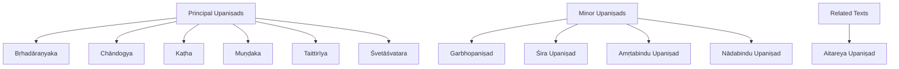

**Diagram sources**
- [brhadaranyakopanisad.md:1-11](file://brhadaranyakopanisad.md#L1-L11)
- [chandogyopanisad.md:1-11](file://chandogyopanisad.md#L1-L11)
- [kathopanisad.md:1-11](file://kathopanisad.md#L1-L11)
- [mundakopanisad.md:1-11](file://mundakopanisad.md#L1-L11)
- [taittiriyopanisad.md:1-11](file://taittiriyopanisad.md#L1-L11)
- [svetasvataropanisad.md:1-11](file://svetasvataropanisad.md#L1-L11)
- [garbhopanisat.md:1-11](file://garbhopanisat.md#L1-L11)
- [sira-upanisad.md:1-11](file://sira-upanisad.md#L1-L11)
- [amrtabindupanisat.md:1-18](file://amrtabindupanisat.md#L1-L18)
- [nadabindupanisat.md:1-11](file://nadabindupanisat.md#L1-L11)
- [aitareyopanisad.md:1-18](file://aitareyopanisad.md#L1-L18)

**Section sources**
- [brhadaranyakopanisad.md:1-11](file://brhadaranyakopanisad.md#L1-L11)
- [chandogyopanisad.md:1-11](file://chandogyopanisad.md#L1-L11)
- [kathopanisad.md:1-11](file://kathopanisad.md#L1-L11)
- [mundakopanisad.md:1-11](file://mundakopanisad.md#L1-L11)
- [taittiriyopanisad.md:1-11](file://taittiriyopanisad.md#L1-L11)
- [svetasvataropanisad.md:1-11](file://svetasvataropanisad.md#L1-L11)
- [garbhopanisat.md:1-11](file://garbhopanisat.md#L1-L11)
- [sira-upanisad.md:1-11](file://sira-upanisad.md#L1-L11)
- [amrtabindupanisat.md:1-18](file://amrtabindupanisat.md#L1-L18)
- [nadabindupanisat.md:1-11](file://nadabindupanisat.md#L1-L11)
- [aitareyopanisad.md:1-18](file://aitareyopanisad.md#L1-L18)

## Core Components
This section summarizes the core Upaniṣadic components present in the repository and their philosophical roles within Vedānta.

- Bṛhadāraṇyaka Upaniṣad: Longest principal Upaniṣad; profound teachings on Ātman, Brahman, and reality; attached to the Śatapatha Brāhmaṇa of the Śukla Yajurveda.
- Chāndogya Upaniṣad: Foundational Vedānta text containing the essential teaching “Tat Tvam Asi”; attached to the Sāmaveda.
- Kaṭha Upaniṣad: Dialogue between Naciketas and Yama on the nature of the Ātman, immortality, and the path to liberation; attached to the Yajurveda.
- Muṇḍaka Upaniṣad: Structured as a dialogue distinguishing higher and lower knowledge; belongs to the Atharva Veda.
- Taittirīya Upaniṣad: Three chapters covering śikṣā, brahmānanda (bliss of Brahman), and Bhr̥gu’s realization; belongs to the Kṛṣṇa Yajurveda.
- Śvetāśvatara Upaniṣad: Theistic synthesis focused on Rudra-Śiva as supreme Lord; belongs to the Kṛṣṇa Yajurveda.
- Minor Upaniṣads:
  - Garbhopaniṣad: Embryology and soul’s embodiment according to karma.
  - Śira Upaniṣad: Meditation on the self and Brahman via the head.
  - Amṛtabindu Upaniṣad: Oṃkāra meditation, mental discipline, and realization of Brahman beyond mere scriptural study.
  - Nādabindu Upaniṣad: Meditation on subtle sound (nāda) as a means to realize Brahman.
- Aitareya Upaniṣad: Creation narrative where Ātman alone exists before creation and emanates the universe; belongs to the Ṛgveda.

These components collectively trace the evolution from ritual to philosophical inquiry and articulate the development of Brahman, Ātman, and mokṣa.

**Section sources**
- [brhadaranyakopanisad.md:1-11](file://brhadaranyakopanisad.md#L1-L11)
- [chandogyopanisad.md:1-11](file://chandogyopanisad.md#L1-L11)
- [kathopanisad.md:1-11](file://kathopanisad.md#L1-L11)
- [mundakopanisad.md:1-11](file://mundakopanisad.md#L1-L11)
- [taittiriyopanisad.md:1-11](file://taittiriyopanisad.md#L1-L11)
- [svetasvataropanisad.md:1-11](file://svetasvataropanisad.md#L1-L11)
- [garbhopanisat.md:1-11](file://garbhopanisat.md#L1-L11)
- [sira-upanisad.md:1-11](file://sira-upanisad.md#L1-L11)
- [amrtabindupanisat.md:1-18](file://amrtabindupanisat.md#L1-L18)
- [nadabindupanisat.md:1-11](file://nadabindupanisat.md#L1-L11)
- [aitareyopanisad.md:1-18](file://aitareyopanisad.md#L1-L18)

## Architecture Overview
The conceptual architecture of Upaniṣadic philosophy in this repository can be visualized as a progression from ritual foundations to metaphysical insight and meditative practice.

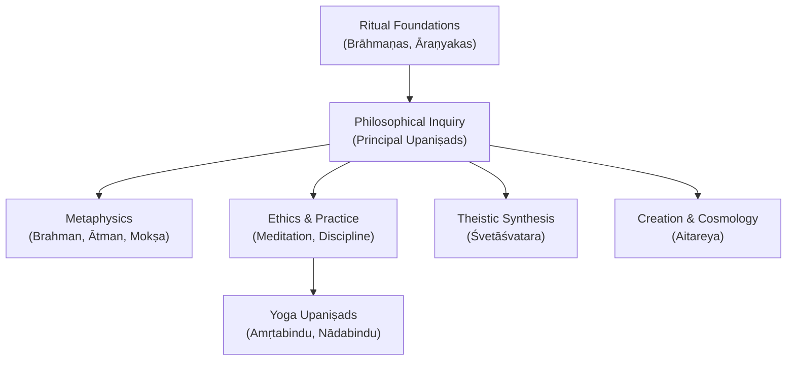

[No sources needed since this diagram shows conceptual workflow, not actual code structure]

## Detailed Component Analysis

### Bṛhadāraṇyaka Upaniṣad
- Role: Longest principal Upaniṣad; central to Vedānta metaphysics.
- Themes: Ātman, Brahman, nature of reality; attached to the Śatapatha Brāhmaṇa of the Śukla Yajurveda.
- Lexical profile: High-frequency lemmas indicate extensive use of demonstratives and connectives typical of philosophical exposition.

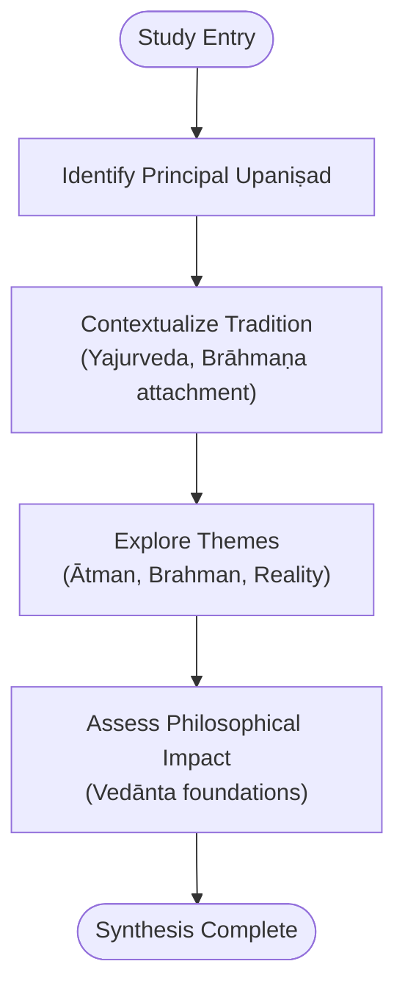

**Diagram sources**
- [brhadaranyakopanisad.md:1-11](file://brhadaranyakopanisad.md#L1-L11)

**Section sources**
- [brhadaranyakopanisad.md:1-11](file://brhadaranyakopanisad.md#L1-L11)

### Chāndogya Upaniṣad
- Role: Foundational Vedānta text; contains “Tat Tvam Asi.”
- Themes: Identity of individual self with ultimate reality; attached to the Sāmaveda.
- Lexical profile: Frequent use of demonstratives and existential verbs reflects identity statements and ontological claims.

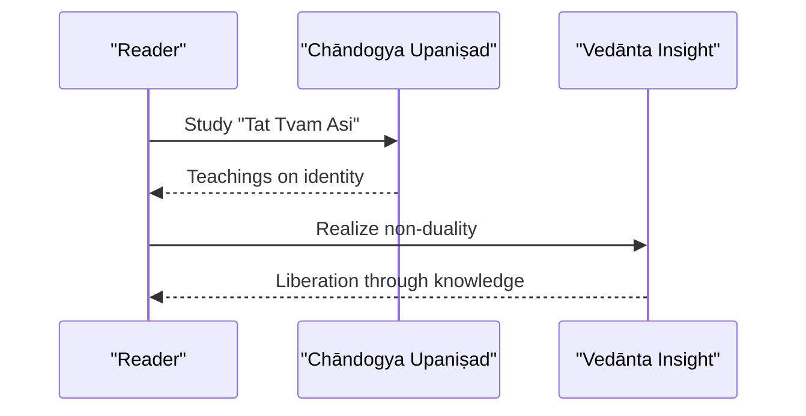

**Diagram sources**
- [chandogyopanisad.md:1-11](file://chandogyopanisad.md#L1-L11)

**Section sources**
- [chandogyopanisad.md:1-11](file://chandogyopanisad.md#L1-L11)

### Kaṭha Upaniṣad
- Role: Dialogic presentation of Ātman and immortality.
- Themes: Dialogue between Naciketas and Yama; path to liberation; attached to the Yajurveda.
- Lexical profile: Emphasis on pronouns and negation suggests dialectical method and apophatic insights.

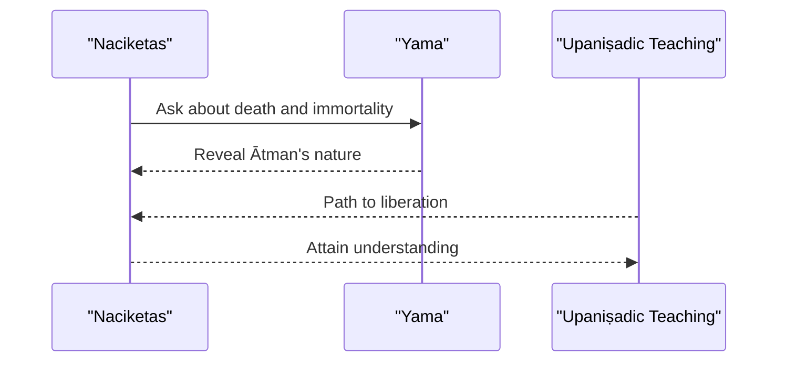

**Diagram sources**
- [kathopanisad.md:1-11](file://kathopanisad.md#L1-L11)

**Section sources**
- [kathopanisad.md:1-11](file://kathopanisad.md#L1-L11)

### Muṇḍaka Upaniṣad
- Role: Distinction between higher and lower knowledge.
- Themes: Dialogue between Śaunaka and Āṅgirasa; epistemological hierarchy; belongs to the Atharva Veda.
- Lexical profile: Prominent use of terms for knowledge and being indicates focus on jñāna vs. vidyā.

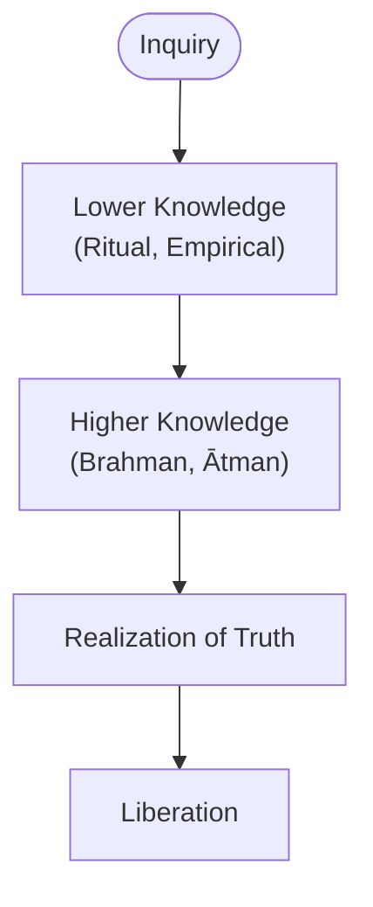

**Diagram sources**
- [mundakopanisad.md:1-11](file://mundakopanisad.md#L1-L11)

**Section sources**
- [mundakopanisad.md:1-11](file://mundakopanisad.md#L1-L11)

### Taittirīya Upaniṣad
- Role: Exploration of ānanda (bliss) and the layers of self.
- Themes: Three chapters on phonetics, bliss of Brahman, and Bhr̥gu’s realization; belongs to the Kṛṣṇa Yajurveda.
- Lexical profile: Frequent terms for food, self, and existence reflect progressive analysis of sheaths and bliss.

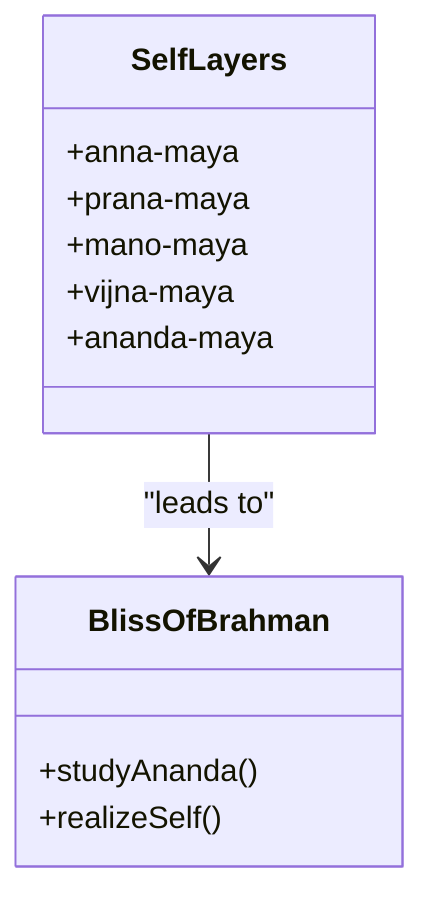

**Diagram sources**
- [taittiriyopanisad.md:1-11](file://taittiriyopanisad.md#L1-L11)

**Section sources**
- [taittiriyopanisad.md:1-11](file://taittiriyopanisad.md#L1-L11)

### Śvetāśvatara Upaniṣad
- Role: Theistic synthesis focusing on Rudra-Śiva as supreme Lord.
- Themes: Integration of Sāṃkhya and Yoga elements; belongs to the Kṛṣṇa Yajurveda.
- Lexical profile: Limited data but tagged as Saiva, indicating devotional orientation.

**Diagram sources**
- [svetasvataropanisad.md:1-11](file://svetasvataropanisad.md#L1-L11)

**Section sources**
- [svetasvataropanisad.md:1-11](file://svetasvataropanisad.md#L1-L11)

### Minor Upaniṣads

#### Garbhopaniṣad
- Focus: Embryology and soul’s embodiment according to karma.
- Significance: Bridges cosmology and physiology; illustrates how karmic patterns manifest in bodily formation.

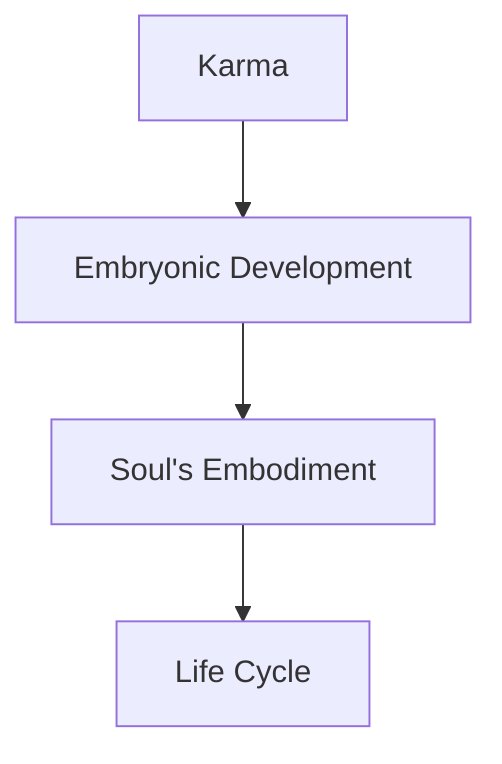

**Diagram sources**
- [garbhopanisat.md:1-11](file://garbhopanisat.md#L1-L11)

**Section sources**
- [garbhopanisat.md:1-11](file://garbhopanisat.md#L1-L11)

#### Śira Upaniṣad
- Focus: Meditation on the self and Brahman via the head.
- Significance: Meditative technique aligning subtle anatomy with metaphysical realization.

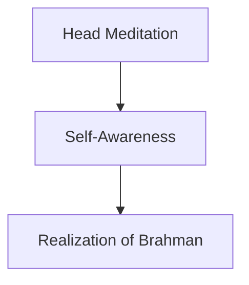

**Diagram sources**
- [sira-upanisad.md:1-11](file://sira-upanisad.md#L1-L11)

**Section sources**
- [sira-upanisad.md:1-11](file://sira-upanisad.md#L1-L11)

#### Amṛtabindu Upaniṣad
- Focus: Oṃkāra meditation, mental discipline, and realization of Brahman beyond scriptural study.
- Significance: Emphasizes direct experience over mere textual learning; uses chariot metaphor adapted to Oṃkāra.

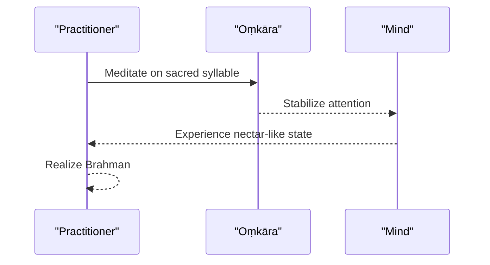

**Diagram sources**
- [amrtabindupanisat.md:1-18](file://amrtabindupanisat.md#L1-L18)

**Section sources**
- [amrtabindupanisat.md:1-18](file://amrtabindupanisat.md#L1-L18)

#### Nādabindu Upaniṣad
- Focus: Meditation on subtle sound (nāda) as a means to realize Brahman.
- Significance: Integrates auditory meditation with metaphysical insight.

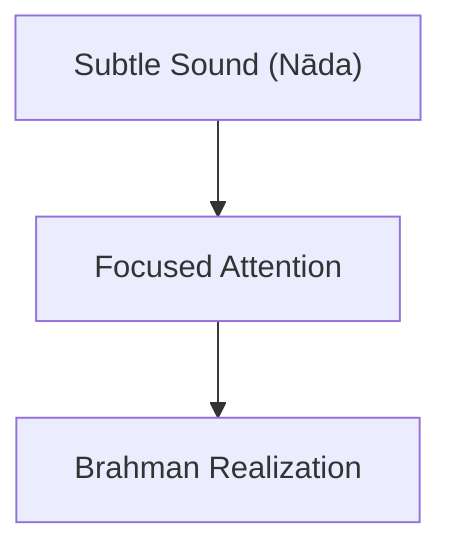

**Diagram sources**
- [nadabindupanisat.md:1-11](file://nadabindupanisat.md#L1-L11)

**Section sources**
- [nadabindupanisat.md:1-11](file://nadabindupanisat.md#L1-L11)

### Aitareya Upaniṣad
- Focus: Creation narrative where Ātman alone existed prior to manifestation and emanated the universe.
- Significance: Non-dual creation account; three births doctrine; culmination of Aitareya Āraṇyaka.

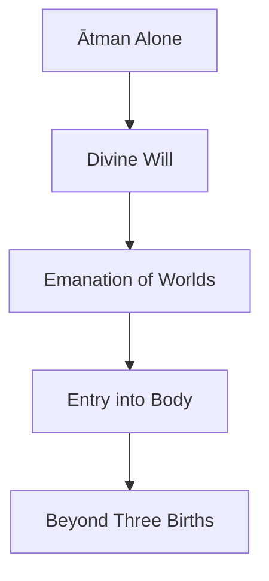

**Diagram sources**
- [aitareyopanisad.md:1-18](file://aitareyopanisad.md#L1-L18)

**Section sources**
- [aitareyopanisad.md:1-18](file://aitareyopanisad.md#L1-L18)

## Dependency Analysis
Thematic dependencies among Upaniṣads reveal shared vocabulary and conceptual affinities. Lemma frequency tables and similarity rankings help map these relationships.

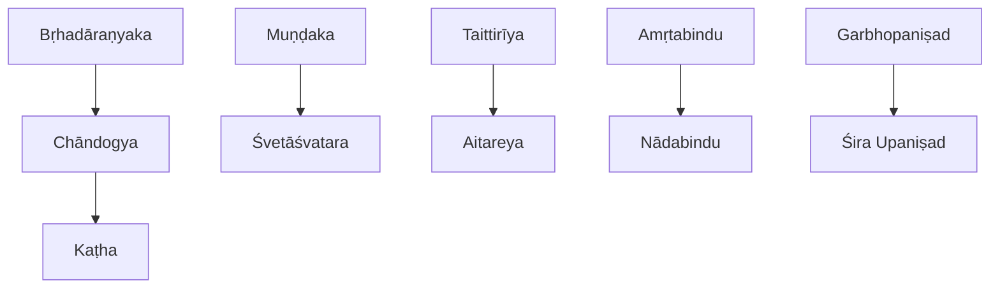

**Diagram sources**
- [brhadaranyakopanisad.md:15-30](file://brhadaranyakopanisad.md#L15-L30)
- [chandogyopanisad.md:15-30](file://chandogyopanisad.md#L15-L30)
- [kathopanisad.md:15-30](file://kathopanisad.md#L15-L30)
- [mundakopanisad.md:15-30](file://mundakopanisad.md#L15-L30)
- [svetasvataropanisad.md:1-11](file://svetasvataropanisad.md#L1-L11)
- [taittiriyopanisad.md:15-30](file://taittiriyopanisad.md#L15-L30)
- [amrtabindupanisat.md:1-18](file://amrtabindupanisat.md#L1-L18)
- [nadabindupanisat.md:1-11](file://nadabindupanisat.md#L1-L11)
- [garbhopanisat.md:1-11](file://garbhopanisat.md#L1-L11)
- [sira-upanisad.md:1-11](file://sira-upanisad.md#L1-L11)

**Section sources**
- [brhadaranyakopanisad.md:15-30](file://brhadaranyakopanisad.md#L15-L30)
- [chandogyopanisad.md:15-30](file://chandogyopanisad.md#L15-L30)
- [kathopanisad.md:15-30](file://kathopanisad.md#L15-L30)
- [mundakopanisad.md:15-30](file://mundakopanisad.md#L15-L30)
- [svetasvataropanisad.md:1-11](file://svetasvataropanisad.md#L1-L11)
- [taittiriyopanisad.md:15-30](file://taittiriyopanisad.md#L15-L30)
- [amrtabindupanisat.md:1-18](file://amrtabindupanisat.md#L1-L18)
- [nadabindupanisat.md:1-11](file://nadabindupanisat.md#L1-L11)
- [garbhopanisat.md:1-11](file://garbhopanisat.md#L1-L11)
- [sira-upanisad.md:1-11](file://sira-upanisad.md#L1-L11)

## Performance Considerations
- Reading strategy: Prioritize principal Upaniṣads for foundational Vedānta concepts; then explore minor Upaniṣads for specialized practices (meditation, embryology).
- Lexical analysis: Use lemma frequency tables to identify core themes and cross-reference similar texts for deeper study.
- Thematic mapping: Leverage similarity rankings to trace conceptual evolution across traditions (e.g., from ritual to non-dual metaphysics).

[No sources needed since this section provides general guidance]

## Troubleshooting Guide
- Misclassification: Ensure correct identification of principal vs. minor Upaniṣads based on metadata tags and descriptions.
- Contextual gaps: When studying minor Upaniṣads, consult related principal texts to understand broader Vedānta context.
- Lexical confusion: Refer to notable lemma tables to clarify recurring philosophical terms and their usage patterns.

[No sources needed since this section provides general guidance]

## Conclusion
The repository’s Upaniṣadic texts collectively chart the evolution from ritual to philosophical inquiry, articulating core Vedānta concepts such as Brahman, Ātman, and mokṣa. Principal Upaniṣads provide metaphysical depth and identity teachings, while minor Upaniṣads offer practical meditative techniques and specialized domains like embryology. Together, they form a cohesive framework for understanding the development of Indian philosophical thought.

[No sources needed since this section summarizes without analyzing specific files]
