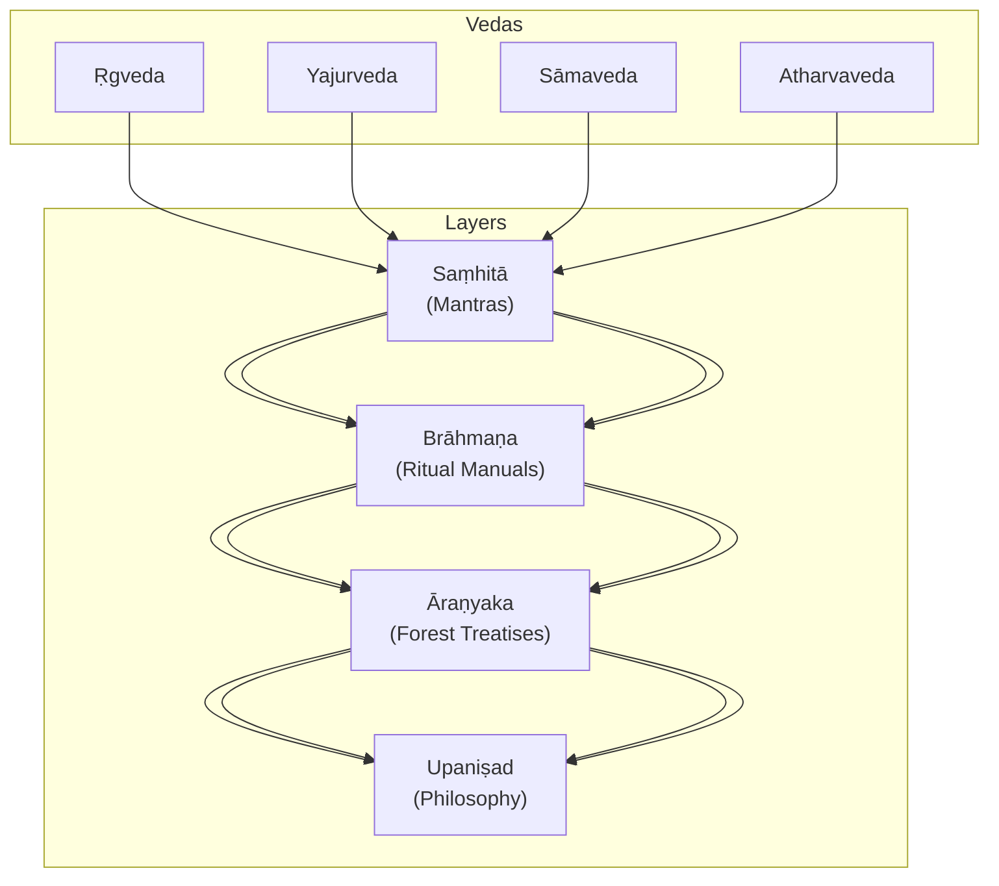
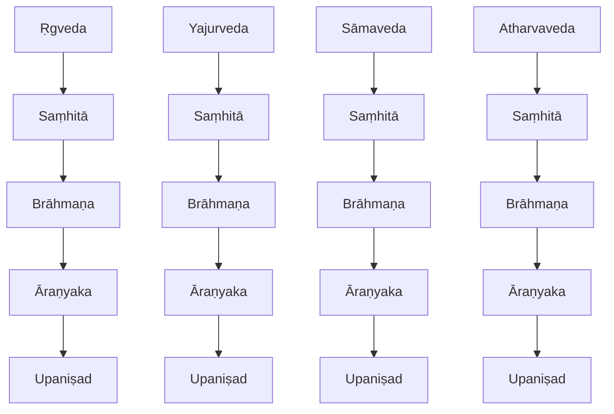
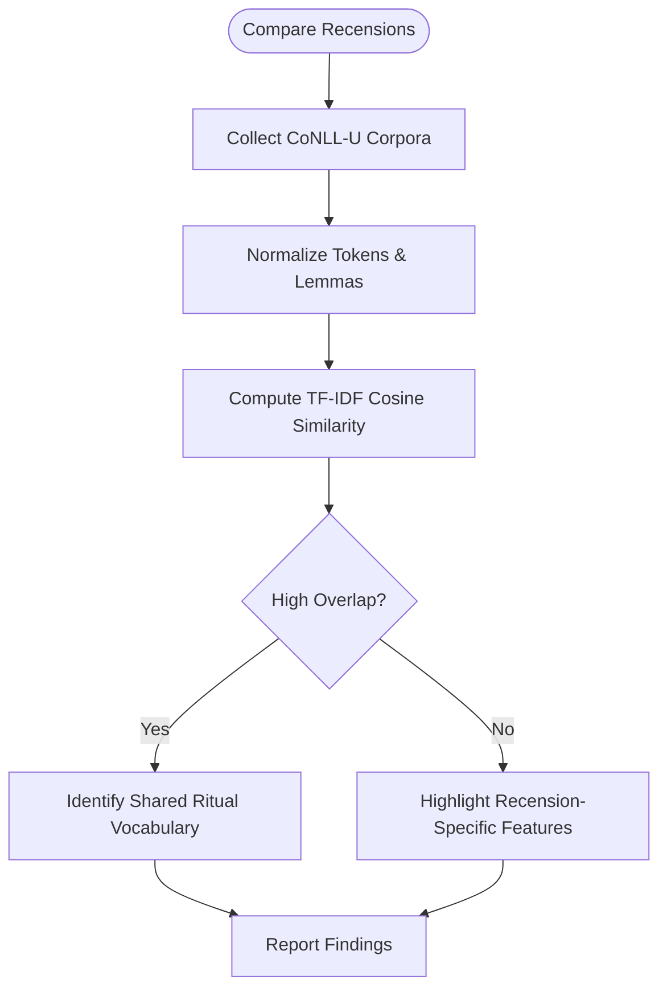
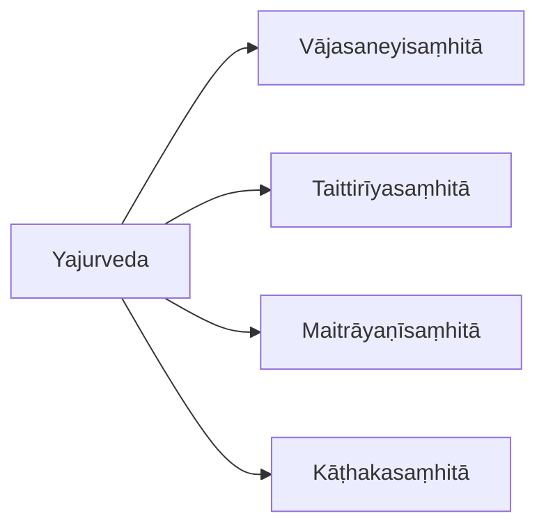
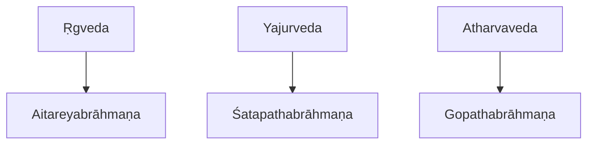
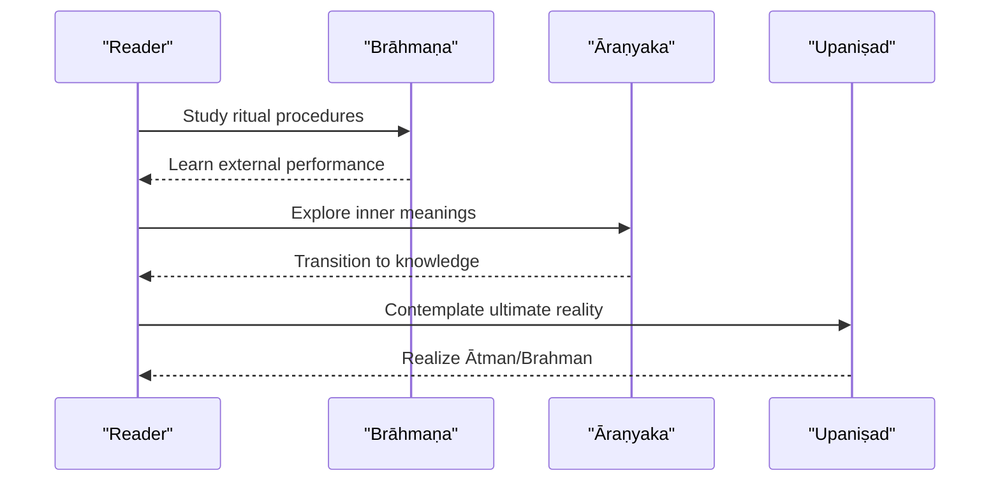
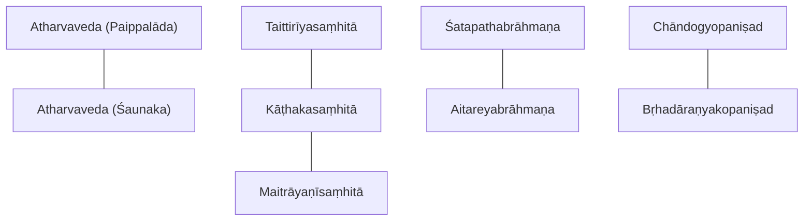
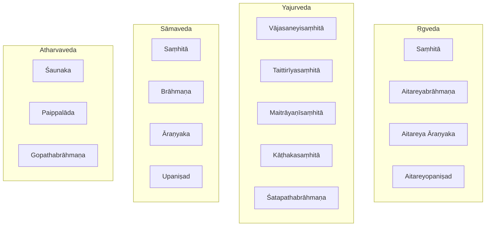

<cite>
**Referenced Files in This Document**
- [INDEX.md](file://INDEX.md)
- [atharvaveda-saunaka.md](file://atharvaveda-saunaka.md)
- [atharvaveda-paippalada.md](file://atharvaveda-paippalada.md)
- [rgvedakhilani.md](file://rgvedakhilani.md)
- [kathakasamhita.md](file://kathakasamhita.md)
- [aitareyabrahmana.md](file://aitareyabrahmana.md)
- [aitareya-aranyaka.md](file://aitareya-aranyaka.md)
- [aitareyopanisad.md](file://aitareyopanisad.md)
- [brhadaranyakopanisad.md](file://brhadaranyakopanisad.md)
- [chandogyopanisad.md](file://chandogyopanisad.md)
- [satapathabrahmana.md](file://satapathabrahmana.md)
- [gopathabrahmana.md](file://gopathabrahmana.md)
- [vajasaneyisamhita-madhyandina.md](file://vajasaneyisamhita-madhyandina.md)
- [maitrayanisamhita.md](file://maitrayanisamhita.md)
- [taittiriyasamhita.md](file://taittiriyasamhita.md)
</cite>

## Table of Contents
1. Introduction
2. Project Structure
3. Core Components
4. Architecture Overview
5. Detailed Component Analysis
6. Dependency Analysis
7. Performance Considerations
8. Troubleshooting Guide
9. Conclusion
10. Appendices

## Introduction
This document presents a comprehensive overview of the Vedic Literature collection in the repository, focusing on the four Vedas and their major subdivisions: Saṃhitās (mantra collections), Brāhmaṇas (ritual manuals), Āraṇyakas (forest treatises), and Upaniṣads (philosophical discourses). It explains the hierarchical relationships among these layers, highlights key recensions (especially Śaunaka vs Paippalāda for the Atharvaveda), outlines ritual contexts and philosophical evolution, and describes how computational analysis via CoNLL-U parsing supports lexicographic and structural studies of these ancient texts.

## Project Structure
The repository organizes Vedic materials as individual concept files with metadata describing each text’s tradition, genre, and CoNLL-U edition size. The INDEX provides a curated catalog linking to all topics, including Vedic literature, Upaniṣads, Dharmaśāstra, grammar, and more. Each Vedic file typically includes:
- A concise description of the text and its tradition
- Source references to raw CoNLL-U editions
- Tags indicating Veda, genre, and analytical features
- Related-text similarity tables and notable lemma lists derived from TF-IDF cosine similarity over parsed corpora

[No sources needed since this diagram shows conceptual workflow, not actual code structure]

**Section sources**
- [INDEX.md:1-20](file://INDEX.md#L1-L20)

## Core Components
This section maps the four Vedas to representative Saṃhitās, Brāhmaṇas, Āraṇyakas, and Upaniṣads present in the corpus, noting their traditions and CoNLL-U coverage.

- Ṛgveda
  - Saṃhitā layer: core hymns; supplementary material preserved in tradition
  - Brāhmaṇa: principal manual for Soma sacrifices
  - Āraṇyaka: forest treatise bridging ritual and philosophy
  - Upaniṣad: creation narrative centered on Ātman

- Yajurveda
  - Saṃhitās: multiple recensions (Śukla and Kṛṣṇa) preserving mantras and formulas
  - Brāhmaṇa: extensive ritual explanations and myths
  - Āraṇyaka/Upaniṣad: philosophical extensions attached to specific traditions

- Sāmaveda
  - Saṃhitā: chant collections used in rituals
  - Brāhmaṇa/Āraṇyaka/Upaniṣad: ritual application and philosophical teachings

- Atharvaveda
  - Two surviving recensions: Śaunaka (widely preserved) and Paippalāda (distinct corpus)
  - Brāhmaṇa: only surviving Atharvan Brāhmaṇa
  - Rituals: domestic, magical, healing, and protective rites

Representative files and their roles:
- Saṃhitās: Vājasaneyisaṃhitā (Mādhyandina), Taittirīyasaṃhitā, Maitrāyaṇīsaṃhitā, Kāṭhakasaṃhitā
- Brāhmaṇas: Śatapathabrāhmaṇa, Aitareyabrāhmaṇa, Gopathabrāhmaṇa
- Āraṇyakas: Aitareya Āraṇyaka
- Upaniṣads: Aitareyopaniṣad, Bṛhadāraṇyakopaniṣad, Chāndogyopaniṣad
- Supplementary: Ṛgvedakhilāni (supplementary hymns)
- Atharvaveda recensions: Śaunaka and Paippalāda

**Section sources**
- [vajasaneyisamhita-madhyandina.md:1-12](file://vajasaneyisamhita-madhyandina.md#L1-L12)
- [taittiriyasamhita.md:1-12](file://taittiriyasamhita.md#L1-L12)
- [maitrayanisamhita.md:1-12](file://maitrayanisamhita.md#L1-L12)
- [kathakasamhita.md:1-12](file://kathakasamhita.md#L1-L12)
- [satapathabrahmana.md:1-12](file://satapathabrahmana.md#L1-L12)
- [aitareyabrahmana.md:1-12](file://aitareyabrahmana.md#L1-L12)
- [gopathabrahmana.md:1-12](file://gopathabrahmana.md#L1-L12)
- [aitareya-aranyaka.md:1-12](file://aitareya-aranyaka.md#L1-L12)
- [aitareyopanisad.md:1-12](file://aitareyopanisad.md#L1-L12)
- [brhadaranyakopanisad.md:1-12](file://brhadaranyakopanisad.md#L1-L12)
- [chandogyopanisad.md:1-12](file://chandogyopanisad.md#L1-L12)
- [rgvedakhilani.md:1-12](file://rgvedakhilani.md#L1-L12)
- [atharvaveda-saunaka.md:1-12](file://atharvaveda-saunaka.md#L1-L12)
- [atharvaveda-paippalada.md:1-12](file://atharvaveda-paippalada.md#L1-L12)

## Architecture Overview
The Vedic corpus follows a layered architecture that evolves from liturgical mantras to philosophical inquiry. Each Veda preserves its own Saṃhitā, which is explicated by Brāhmaṇas, further internalized in Āraṇyakas, and culminates in Upaniṣadic teachings. Computational editions provide CoNLL-U annotations enabling lexical and syntactic analysis across traditions.

[No sources needed since this diagram shows conceptual workflow, not actual code structure]

## Detailed Component Analysis

### Recension Comparison: Atharvaveda (Śaunaka vs Paippalāda)
The Atharvaveda survives in two major recensions with distinct corpora and thematic emphases. Both are represented in the repository with CoNLL-U editions suitable for computational analysis.

- Śaunaka recension: widely preserved, larger corpus
- Paippalāda recension: distinct set of hymns, spells, and incantations

Computational insights:
- Lexical overlap between the two recensions is substantial but not complete, reflecting shared heritage and divergent transmission
- Similarity metrics show strong association with other Vedic corpora, indicating cross-recensional ritual vocabulary

**Diagram sources**
- [atharvaveda-saunaka.md:1-12](file://atharvaveda-saunaka.md#L1-L12)
- [atharvaveda-paippalada.md:1-12](file://atharvaveda-paippalada.md#L1-L12)

**Section sources**
- [atharvaveda-saunaka.md:1-12](file://atharvaveda-saunaka.md#L1-L12)
- [atharvaveda-paippalada.md:1-12](file://atharvaveda-paippalada.md#L1-L12)

### Yajurveda Saṃhitās: Multiple Traditions
The Yajurveda preserves multiple recensions, each with its own mantra collection and associated ritual literature.

- Vājasaneyisaṃhitā (Mādhyandina): main Śukla Yajurveda Saṃhitā
- Taittirīyasaṃhitā: main Kṛṣṇa Yajurveda Saṃhitā
- Maitrāyaṇīsaṃhitā and Kāṭhakasaṃhitā: additional Kṛṣṇa Yajurveda recensions

These texts share ritual vocabulary and formulaic structures, reflected in high similarity scores across recensions.

**Diagram sources**
- [vajasaneyisamhita-madhyandina.md:1-12](file://vajasaneyisamhita-madhyandina.md#L1-L12)
- [taittiriyasamhita.md:1-12](file://taittiriyasamhita.md#L1-L12)
- [maitrayanisamhita.md:1-12](file://maitrayanisamhita.md#L1-L12)
- [kathakasamhita.md:1-12](file://kathakasamhita.md#L1-L12)

**Section sources**
- [vajasaneyisamhita-madhyandina.md:1-12](file://vajasaneyisamhita-madhyandina.md#L1-L12)
- [taittiriyasamhita.md:1-12](file://taittiriyasamhita.md#L1-L12)
- [maitrayanisamhita.md:1-12](file://maitrayanisamhita.md#L1-L12)
- [kathakasamhita.md:1-12](file://kathakasamhita.md#L1-L12)

### Brāhmaṇas: Ritual Exegesis Across Traditions
Brāhmaṇas provide detailed ritual instructions, mythological narratives, and etymological speculations tied to each Veda.

- Śatapathabrāhmaṇa: principal Brāhmaṇa of Śukla Yajurveda
- Aitareyabrāhmaṇa: principal Brāhmaṇa of Ṛgveda
- Gopathabrāhmaṇa: sole surviving Brāhmaṇa of Atharvaveda

These texts exhibit rich ritual terminology and recurring formulaic patterns, visible in lemma frequency distributions and similarity networks.

**Diagram sources**
- [aitareyabrahmana.md:1-12](file://aitareyabrahmana.md#L1-L12)
- [satapathabrahmana.md:1-12](file://satapathabrahmana.md#L1-L12)
- [gopathabrahmana.md:1-12](file://gopathabrahmana.md#L1-L12)

**Section sources**
- [aitareyabrahmana.md:1-12](file://aitareyabrahmana.md#L1-L12)
- [satapathabrahmana.md:1-12](file://satapathabrahmana.md#L1-L12)
- [gopathabrahmana.md:1-12](file://gopathabrahmana.md#L1-L12)

### Āraṇyakas and Upaniṣads: From Ritual to Philosophy
Āraṇyakas serve as transitional texts between Brāhmaṇas and Upaniṣads, emphasizing esoteric meanings of rituals and preparing readers for philosophical inquiry. Upaniṣads articulate metaphysical doctrines such as the nature of Ātman and Brahman.

- Aitareya Āraṇyaka: bridges Ṛgvedic ritual and Upaniṣadic thought
- Aitareyopaniṣad: creation narrative through Ātman
- Bṛhadāraṇyakopaniṣad: longest principal Upaniṣad, deep teachings on reality
- Chāndogyopaniṣad: foundational Vedānta text with “Tat Tvam Asi”

**Diagram sources**
- [aitareyabrahmana.md:1-12](file://aitareyabrahmana.md#L1-L12)
- [aitareya-aranyaka.md:1-12](file://aitareya-aranyaka.md#L1-L12)
- [aitareyopanisad.md:1-12](file://aitareyopanisad.md#L1-L12)
- [brhadaranyakopanisad.md:1-12](file://brhadaranyakopanisad.md#L1-L12)
- [chandogyopanisad.md:1-12](file://chandogyopanisad.md#L1-L12)

**Section sources**
- [aitareya-aranyaka.md:1-12](file://aitareya-aranyaka.md#L1-L12)
- [aitareyopanisad.md:1-12](file://aitareyopanisad.md#L1-L12)
- [brhadaranyakopanisad.md:1-12](file://brhadaranyakopanisad.md#L1-L12)
- [chandogyopanisad.md:1-12](file://chandogyopanisad.md#L1-L12)

### Supplementary Hymns: Ṛgvedakhilāni
Supplementary hymns extend the core Saṃhitā with additional mantras preserved in canonical tradition, enriching the ritual and poetic repertoire.

**Section sources**
- [rgvedakhilani.md:1-12](file://rgvedakhilani.md#L1-L12)

## Dependency Analysis
Lexical dependencies and similarities reveal how texts relate across recensions and genres. High similarity often indicates shared ritual vocabulary or common source material.

**Diagram sources**
- [atharvaveda-paippalada.md:15-30](file://atharvaveda-paippalada.md#L15-L30)
- [kathakasamhita.md:15-30](file://kathakasamhita.md#L15-L30)
- [maitrayanisamhita.md:15-30](file://maitrayanisamhita.md#L15-L30)
- [taittiriyasamhita.md:15-30](file://taittiriyasamhita.md#L15-L30)
- [aitareyabrahmana.md:49-64](file://aitareyabrahmana.md#L49-L64)
- [chandogyopanisad.md:15-30](file://chandogyopanisad.md#L15-L30)
- [brhadaranyakopanisad.md:15-30](file://brhadaranyakopanisad.md#L15-L30)

**Section sources**
- [atharvaveda-paippalada.md:15-30](file://atharvaveda-paippalada.md#L15-L30)
- [kathakasamhita.md:15-30](file://kathakasamhita.md#L15-L30)
- [maitrayanisamhita.md:15-30](file://maitrayanisamhita.md#L15-L30)
- [taittiriyasamhita.md:15-30](file://taittiriyasamhita.md#L15-L30)
- [aitareyabrahmana.md:49-64](file://aitareyabrahmana.md#L49-L64)
- [chandogyopanisad.md:15-30](file://chandogyopanisad.md#L15-L30)
- [brhadaranyakopanisad.md:15-30](file://brhadaranyakopanisad.md#L15-L30)

## Performance Considerations
- Corpus scale: Large CoNLL-U editions (e.g., Aitareyabrāhmaṇa, Taittirīyasaṃhitā) require efficient tokenization and indexing for similarity computations
- Normalization: Consistent handling of sandhi and morphological analysis improves cross-text comparability
- Storage: Structured directories per text facilitate scalable querying and retrieval
- Indexing: Lemma indices enable fast concordance lookups and frequency analysis

[No sources needed since this section provides general guidance]

## Troubleshooting Guide
Common issues when working with CoNLL-U editions:
- Inconsistent normalization across recensions can skew similarity results; ensure uniform preprocessing
- Missing or incomplete metadata may hinder filtering by Veda or genre; verify tags and descriptions
- Large file counts increase processing time; consider chunked processing and caching strategies
- Cross-references rely on accurate lemma mapping; validate concordance links and index integrity

[No sources needed since this section provides general guidance]

## Conclusion
The Vedic Literature collection offers a rich, computationally accessible corpus spanning the four Vedas and their layered subdivisions. By combining traditional scholarship with modern NLP techniques—particularly CoNLL-U parsing—the repository enables robust comparative studies of ritual language, philosophical development, and recensional variation. The hierarchical progression from Saṃhitās to Upaniṣads reflects both historical evolution and enduring intellectual continuity.

[No sources needed since this section summarizes without analyzing specific files]

## Appendices

### Appendix A: Hierarchical Map of Vedic Texts in the Repository

[No sources needed since this diagram shows conceptual workflow, not actual code structure]
