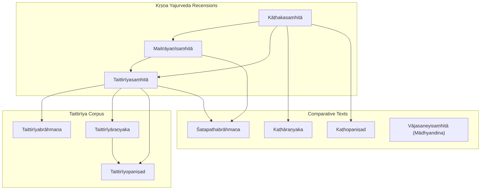
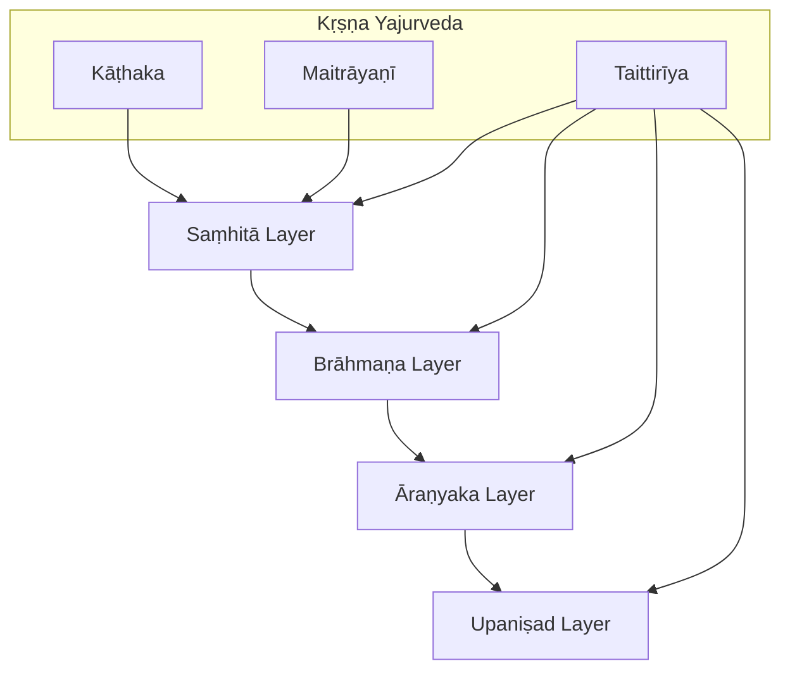
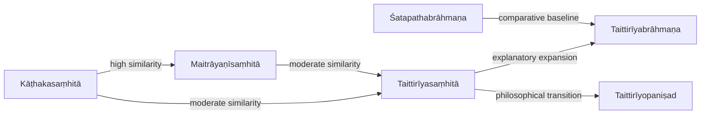

<cite>
**Referenced Files in This Document**
- [kathakasamhita.md](file://kathakasamhita.md)
- [maitrayanisamhita.md](file://maitrayanisamhita.md)
- [taittiriyasamhita.md](file://taittiriyasamhita.md)
- [satapathabrahmana.md](file://satapathabrahmana.md)
- [taittiriyabrahmana.md](file://taittiriyabrahmana.md)
- [taittiriyaranyaka.md](file://taittiriyaranyaka.md)
- [taittiriyopanisad.md](file://taittiriyopanisad.md)
- [katharanyaka.md](file://katharanyaka.md)
- [kathopanisad.md](file://kathopanisad.md)
- [vajasaneyisamhita-madhyandina.md](file://vajasaneyisamhita-madhyandina.md)
</cite>

## Table of Contents
1. [Introduction](#introduction)
2. [Project Structure](#project-structure)
3. [Core Components](#core-components)
4. [Architecture Overview](#architecture-overview)
5. [Detailed Component Analysis](#detailed-component-analysis)
6. [Dependency Analysis](#dependency-analysis)
7. [Performance Considerations](#performance-considerations)
8. [Troubleshooting Guide](#troubleshooting-guide)
9. [Conclusion](#conclusion)
10. [Appendices](#appendices)

## Introduction
This document provides a comprehensive overview of the Kṛṣṇa (Black) Yajurveda traditions represented in the repository, focusing on three major recensions: Kāṭhaka, Maitrāyaṇī, and Taittirīya. It outlines their distinctive features—organizational structure, ritual content, and philosophical developments—and offers a computational linguistic perspective comparing morphological patterns, lexical choices, and syntactic structures across these recensions. The Taittirīya corpus is treated extensively, covering its Saṃhitā, Brāhmaṇa, Āraṇyaka, and Upaniṣad layers. The Śatapatha Brāhmaṇa is also addressed as a comparative benchmark for Brāhmaṇa literature. Where relevant, examples are referenced via source links rather than quoted verbatim.

## Project Structure
The repository contains concept pages for each text, including metadata such as description, knowledge-bank classification, sources, tags, related texts, and notable lemmas. These pages summarize textual scope and provide computational insights into lexical frequency and similarity with other texts.

**Diagram sources**
- [kathakasamhita.md:1-48](file://kathakasamhita.md#L1-L48)
- [maitrayanisamhita.md:1-48](file://maitrayanisamhita.md#L1-L48)
- [taittiriyasamhita.md:1-48](file://taittiriyasamhita.md#L1-L48)
- [taittiriyabrahmana.md:1-48](file://taittiriyabrahmana.md#L1-L48)
- [taittiriyaranyaka.md:1-48](file://taittiriyaranyaka.md#L1-L48)
- [taittiriyopanisad.md:1-48](file://taittiriyopanisad.md#L1-L48)
- [katharanyaka.md:1-48](file://katharanyaka.md#L1-L48)
- [kathopanisad.md:1-48](file://kathopanisad.md#L1-L48)
- [satapathabrahmana.md:1-12](file://satapathabrahmana.md#L1-L12)
- [vajasaneyisamhita-madhyandina.md:1-48](file://vajasaneyisamhita-madhyandina.md#L1-L48)

**Section sources**
- [kathakasamhita.md:1-48](file://kathakasamhita.md#L1-L48)
- [maitrayanisamhita.md:1-48](file://maitrayanisamhita.md#L1-L48)
- [taittiriyasamhita.md:1-48](file://taittiriyasamhita.md#L1-L48)

## Core Components
- Kāṭhakasaṃhitā: A Kṛṣṇa Yajurveda Saṃhitā of the Kāṭhaka school comprising Vedic mantras and ritual formulas; organized into 102 CoNLL-U files.
- Maitrāyaṇīsaṃhitā: A Kṛṣṇa Yajurveda Saṃhitā of the Maitrāyaṇīya school with 345 CoNLL-U files.
- Taittirīyasaṃhitā: The principal Saṃhitā of the Kṛṣṇa Yajurveda (Taittirīya recension), structured in seven kāṇḍas and represented by 407 CoNLL-U files.
- Taittirīyabrāhmaṇa: Ritual explanations and legends associated with sacrifices, in 348 CoNLL-U files.
- Taittirīyāraṇyaka: Forest text bridging Brāhmaṇa ritual and Upaniṣadic philosophy, in 147 CoNLL-U files.
- Taittirīyopaniṣad: One of the twelve principal Upaniṣads, structured in three chapters (vallis) covering śikṣā, brahmānanda, and Bhr̥gu’s realization, in 10 CoNLL-U files.
- Kaṭhāraṇyaka and Kaṭhopaniṣad: Kāṭhaka tradition forest text and principal Upaniṣad, respectively.
- Śatapathabrāhmaṇa: The most extensive Brāhmaṇa text (of the Śukla Yajurveda), providing a comparative reference for Brāhmaṇa style and content.
- Vājasaneyisaṃhitā (Mādhyandina): Included for cross-recension comparison.

**Section sources**
- [kathakasamhita.md:1-48](file://kathakasamhita.md#L1-L48)
- [maitrayanisamhita.md:1-48](file://maitrayanisamhita.md#L1-L48)
- [taittiriyasamhita.md:1-48](file://taittiriyasamhita.md#L1-L48)
- [taittiriyabrahmana.md:1-48](file://taittiriyabrahmana.md#L1-L48)
- [taittiriyaranyaka.md:1-48](file://taittiriyaranyaka.md#L1-L48)
- [taittiriyopanisad.md:1-48](file://taittiriyopanisad.md#L1-L48)
- [katharanyaka.md:1-48](file://katharanyaka.md#L1-L48)
- [kathopanisad.md:1-48](file://kathopanisad.md#L1-L48)
- [satapathabrahmana.md:1-12](file://satapathabrahmana.md#L1-L12)
- [vajasaneyisamhita-madhyandina.md:1-48](file://vajasaneyisamhita-madhyandina.md#L1-L48)

## Architecture Overview
The Kṛṣṇa Yajurveda traditions can be viewed as layered corpora:
- Saṃhitā layer: Mantra collections used in rituals.
- Brāhmaṇa layer: Explanatory prose detailing ritual procedures and mythic contexts.
- Āraṇyaka layer: Transitional texts blending ritual exegesis with early philosophical reflection.
- Upaniṣad layer: Philosophical teachings exploring metaphysics, epistemology, and soteriology.

[No sources needed since this diagram shows conceptual workflow, not actual code structure]

## Detailed Component Analysis

### Kāṭhaka Tradition
- Kāṭhakasaṃhitā: Contains mantra and formula material for ritual use; computational analysis highlights frequent lemmas such as pronouns and particles, indicating a high proportion of performative and deictic language typical of liturgical texts.
- Kaṭhāraṇyaka: Bridges ritual and philosophical discourse within the Kāṭhaka lineage.
- Kaṭhopaniṣad: A principal Upaniṣad presenting dialogic philosophical inquiry.

Computational notes:
- Lexical emphasis on demonstratives and particles suggests strong ritual deixis and formulaic repetition.
- Related-text similarity indicates close ties to Maitrāyaṇī and Taittirīya Saṃhitās, reflecting shared liturgical heritage.

**Section sources**
- [kathakasamhita.md:1-48](file://kathakasamhita.md#L1-L48)
- [katharanyaka.md:1-48](file://katharanyaka.md#L1-L48)
- [kathopanisad.md:1-48](file://kathopanisad.md#L1-L48)

### Maitrāyaṇī Tradition
- Maitrāyaṇīsaṃhitā: Extensive mantra collection with rich ritual vocabulary; computational profiles show elevated frequencies of personal pronouns and verbs, suggesting more direct address and invocation patterns.
- Strong similarity to Kāṭhaka and Taittirīya Saṃhitās underscores common ritual lexicon and structural parallels.

**Section sources**
- [maitrayanisamhita.md:1-48](file://maitrayanisamhita.md#L1-L48)

### Taittirīya Tradition
- Taittirīyasaṃhitā: Seven kāṇḍas organizing mantras and formulas; computational data reveal balanced usage of particles and ritual nouns, indicative of systematic liturgical composition.
- Taittirīyabrāhmaṇa: Provides detailed ritual explanations and legends; lemma patterns emphasize narrative markers and ritual verbs.
- Taittirīyāraṇyaka: Transitional text bridging ritual and philosophy; lemma distribution reflects both procedural and reflective language.
- Taittirīyopaniṣad: Three vallis addressing phonetics, Brahman-ananda, and Bhr̥gu’s realization; lemma prominence includes philosophical terms like “anna” and “brahman,” signaling thematic focus.

**Section sources**
- [taittiriyasamhita.md:1-48](file://taittiriyasamhita.md#L1-L48)
- [taittiriyabrahmana.md:1-48](file://taittiriyabrahmana.md#L1-L48)
- [taittiriyaranyaka.md:1-48](file://taittiriyaranyaka.md#L1-L48)
- [taittiriyopanisad.md:1-48](file://taittiriyopanisad.md#L1-L48)

### Comparative Perspective: Śatapatha Brāhmaṇa
- Described as the most extensive and important Brāhmaṇa text of the Śukla Yajurveda, offering a broad comparative baseline for Brāhmaṇa style, ritual detail, and mythological narratives.
- Similarity metrics indicate it is frequently related to Kṛṣṇa recensions, especially Maitrāyaṇī and Taittirīya, highlighting shared ritual and explanatory traditions.

**Section sources**
- [satapathabrahmana.md:1-12](file://satapathabrahmana.md#L1-L12)
- [maitrayanisamhita.md:1-48](file://maitrayanisamhita.md#L1-L48)
- [taittiriyasamhita.md:1-48](file://taittiriyasamhita.md#L1-L48)

## Dependency Analysis
Textual relationships inferred from similarity scores demonstrate interdependence among recensions:
- Kāṭhaka and Maitrāyaṇī Saṃhitās exhibit high similarity, indicating shared liturgical vocabulary and structure.
- Taittirīya Saṃhitā aligns closely with both Kāṭhaka and Maitrāyaṇī, reflecting a common core of ritual formulas.
- Brāhmaṇa texts (Taittirīyabrāhmaṇa and Śatapathabrāhmaṇa) show moderate similarity to Saṃhitās, consistent with explanatory expansions upon mantra bases.
- Upaniṣads display lower similarity to Saṃhitās/Brāhmaṇas, reflecting a shift toward philosophical discourse.

**Diagram sources**
- [kathakasamhita.md:15-30](file://kathakasamhita.md#L15-L30)
- [maitrayanisamhita.md:15-30](file://maitrayanisamhita.md#L15-L30)
- [taittiriyasamhita.md:15-30](file://taittiriyasamhita.md#L15-L30)
- [taittiriyabrahmana.md:15-30](file://taittiriyabrahmana.md#L15-L30)
- [satapathabrahmana.md:1-12](file://satapathabrahmana.md#L1-L12)
- [taittiriyopanisad.md:15-30](file://taittiriyopanisad.md#L15-L30)

**Section sources**
- [kathakasamhita.md:15-30](file://kathakasamhita.md#L15-L30)
- [maitrayanisamhita.md:15-30](file://maitrayanisamhita.md#L15-L30)
- [taittiriyasamhita.md:15-30](file://taittiriyasamhita.md#L15-L30)
- [taittiriyabrahmana.md:15-30](file://taittiriyabrahmana.md#L15-L30)
- [satapathabrahmana.md:1-12](file://satapathabrahmana.md#L1-L12)
- [taittiriyopanisad.md:15-30](file://taittiriyopanisad.md#L15-L30)

## Performance Considerations
- Tokenization and lemmatization quality significantly affect similarity computations; ensure consistent preprocessing across recensions.
- Frequency distributions should be normalized by corpus size to avoid bias from larger texts (e.g., Maitrāyaṇīsaṃhitā).
- For morphological analysis, consider verb aspect, mood, and case marking patterns to differentiate ritual vs. philosophical registers.
- Syntactic complexity measures (e.g., dependency depth) can help distinguish Brāhmaṇa prose from Saṃhitā mantras and Upaniṣadic dialogues.

[No sources needed since this section provides general guidance]

## Troubleshooting Guide
- If similarity scores seem unexpectedly low between expected related texts, verify that tokenization treats Vedic compounds and sandhi forms consistently.
- When analyzing lemma frequencies, account for genre-specific particles (e.g., iti, eva, vai) that may dominate ritual texts but carry less semantic weight.
- For cross-recension comparisons, ensure alignment of corpus boundaries (e.g., only compare Saṃhitā portions or only Brāhmaṇa portions).

[No sources needed since this section provides general guidance]

## Conclusion
The Kṛṣṇa Yajurveda traditions in this repository offer a rich multi-layered corpus spanning mantras, ritual exegesis, transitional forest texts, and philosophical Upaniṣads. Computational linguistic analysis reveals shared lexical and structural patterns across Kāṭhaka, Maitrāyaṇī, and Taittirīya recensions, while also highlighting genre-specific shifts from ritual performance to philosophical inquiry. The Taittirīya corpus stands out for its comprehensive coverage across all layers, and the Śatapatha Brāhmaṇa serves as a valuable comparative benchmark for Brāhmaṇa literature.

[No sources needed since this section summarizes without analyzing specific files]

## Appendices

### Appendix A: Computational Linguistics Comparison Across Recensions
- Morphological patterns:
  - High-frequency particles (eva, iti, vai) indicate formulaic and performative language in Saṃhitās.
  - Personal pronouns (mad, tvad) appear prominently in Maitrāyaṇī, suggesting direct address in invocations.
- Lexical choices:
  - Ritual nouns (agni, deva) dominate Saṃhitās and Brāhmaṇas.
  - Philosophical terms (brahman, anna) rise in Upaniṣads, particularly Taittirīyopaniṣad.
- Syntactic structures:
  - Saṃhitās favor concise, repetitive structures suitable for chanting.
  - Brāhmaṇas expand into narrative and procedural prose with increased clause chaining.
  - Upaniṣads employ dialogic and discursive syntax emphasizing argumentation and exposition.

**Section sources**
- [kathakasamhita.md:31-47](file://kathakasamhita.md#L31-L47)
- [maitrayanisamhita.md:31-47](file://maitrayanisamhita.md#L31-L47)
- [taittiriyasamhita.md:31-47](file://taittiriyasamhita.md#L31-L47)
- [taittiriyabrahmana.md:31-47](file://taittiriyabrahmana.md#L31-L47)
- [taittiriyaranyaka.md:31-47](file://taittiriyaranyaka.md#L31-L47)
- [taittiriyopanisad.md:31-47](file://taittiriyopanisad.md#L31-L47)
- [katharanyaka.md:31-47](file://katharanyaka.md#L31-L47)
- [kathopanisad.md:31-47](file://kathopanisad.md#L31-L47)
- [vajasaneyisamhita-madhyandina.md:31-47](file://vajasaneyisamhita-madhyandina.md#L31-L47)

### Appendix B: Examples Referenced by Source
- Ritual formulas: See lemma indices and concordance links in each text’s “Notable Lemmas” sections for recurring ritual vocabulary and formulaic patterns.
- Philosophical passages: Focus on Taittirīyopaniṣad and Kaṭhopaniṣad lemma lists for philosophical terminology and themes.
- Grammatical analysis: Use the provided lemma frequencies to identify morphological trends (e.g., particle usage, verb forms) and correlate with genre characteristics.

[No additional sources beyond those already cited above]
