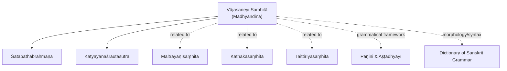
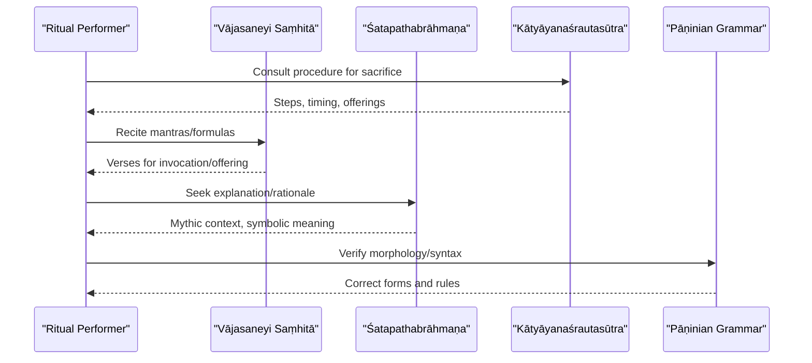
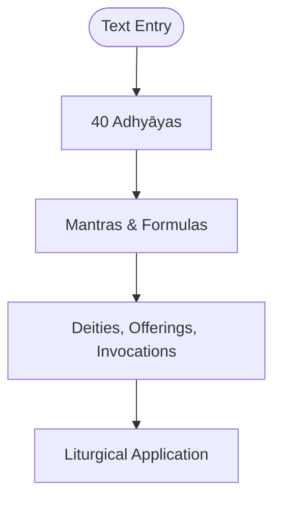
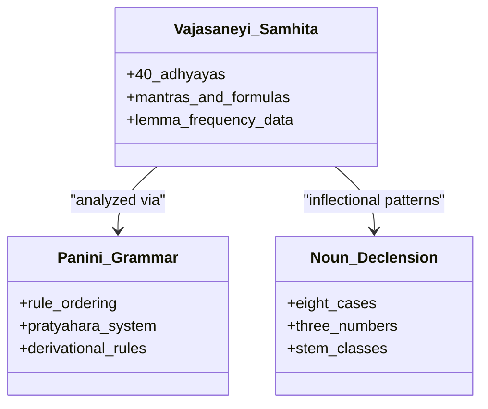
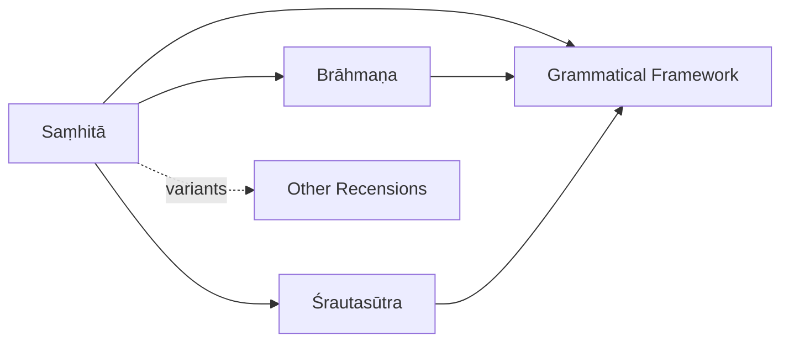

<cite>
**Referenced Files in This Document**
- [vajasaneyisamhita-madhyandina.md](file://vajasaneyisamhita-madhyandina.md)
- [satapathabrahmana.md](file://satapathabrahmana.md)
- [katyayanasrautasutra.md](file://katyayanasrautasutra.md)
- [maitrayanisamhita.md](file://maitrayanisamhita.md)
- [kathakasamhita.md](file://kathakasamhita.md)
- [aitareyabrahmana.md](file://aitareyabrahmana.md)
- [apastambasrautasutra.md](file://apastambasrautasutra.md)
- [panini-and-the-astadhyayi.md](file://panini-and-the-astadhyayi.md)
- [dictionary-of-sanskrit-grammar.md](file://dictionary-of-sanskrit-grammar.md)
- [sanskrit-noun-declension.md](file://sanskrit-noun-declension.md)
</cite>

## Table of Contents
1. [Introduction](#introduction)
2. [Project Structure](#project-structure)
3. [Core Components](#core-components)
4. [Architecture Overview](#architecture-overview)
5. [Detailed Component Analysis](#detailed-component-analysis)
6. [Dependency Analysis](#dependency-analysis)
7. [Performance Considerations](#performance-considerations)
8. [Troubleshooting Guide](#troubleshooting-guide)
9. [Conclusion](#conclusion)
10. [Appendices](#appendices)

## Introduction
This document provides a comprehensive overview of the Śukla (White) Yajurveda traditions, with a primary focus on the Vājasaneyi Saṃhitā in its Mādhyandina recension. It explains the text’s structure and organization, outlines the ritual context and ceremonial procedures described in the tradition (especially Agnihotra and Soma sacrifices), summarizes mantra collections and their liturgical applications, and presents computational linguistic insights derived from the available resources. Where appropriate, it also addresses textual variants across recensions and commentarial traditions.

## Project Structure
The repository includes a dedicated entry for the Vājasaneyi Saṃhitā (Mādhyandina), along with related texts that illuminate the Śukla Yajurveda’s ritual and grammatical landscape:
- The principal Saṃhitā entry describes the Mādhyandina recension as a collection of mantras and formulas organized into 40 adhyāyas (chapters).
- The Śatapathabrāhmaṇa is identified as the most important Brāhmaṇa of the Śukla Yajurveda, providing extensive ritual explanations and philosophical commentary.
- The Kātyāyanaśrautasūtra is recognized as a solemn ritual manual of the Śukla Yajurveda detailing major sacrifices.
- Comparative entries for other Yajurveda recensions (Kāṭhaka, Maitrāyaṇī, Taittirīya) enable cross-recensional analysis.
- Grammatical resources (Pāṇinian grammar, noun declension, dictionary of Sanskrit grammar) support morphological and syntactic analysis.

**Diagram sources**
- [vajasaneyisamhita-madhyandina.md:1-11](file://vajasaneyisamhita-madhyandina.md#L1-L11)
- [satapathabrahmana.md:1-12](file://satapathabrahmana.md#L1-L12)
- [katyayanasrautasutra.md:1-30](file://katyayanasrautasutra.md#L1-L30)
- [maitrayanisamhita.md:1-48](file://maitrayanisamhita.md#L1-L48)
- [kathakasamhita.md:1-48](file://kathakasamhita.md#L1-L48)
- [panini-and-the-astadhyayi.md:1-76](file://panini-and-the-astadhyayi.md#L1-L76)
- [dictionary-of-sanskrit-grammar.md:1-61](file://dictionary-of-sanskrit-grammar.md#L1-L61)

**Section sources**
- [vajasaneyisamhita-madhyandina.md:1-11](file://vajasaneyisamhita-madhyandina.md#L1-L11)
- [satapathabrahmana.md:1-12](file://satapathabrahmana.md#L1-L12)
- [katyayanasrautasutra.md:1-30](file://katyayanasrautasutra.md#L1-L30)

## Core Components
- Vājasaneyi Saṃhitā (Mādhyandina): The main Saṃhitā of the Śukla Yajurveda, structured into 40 adhyāyas; contains mantras and formulas used in ritual performance.
- Śatapathabrāhmaṇa: The principal Brāhmaṇa of the Śukla Yajurveda, offering detailed ritual explanations, myths, and philosophical speculations.
- Kātyāyanaśrautasūtra: A śrauta manual prescribing the performance of major Vedic sacrifices within the Śukla Yajurveda tradition.
- Related recensions: Kāṭhakasaṃhitā and Maitrāyaṇīsaṃhitā provide comparative material for understanding textual variants and shared ritual vocabulary.
- Grammatical tools: Pāṇinian grammar and lexical references underpin morphological and syntactic analysis of Vedic Sanskrit.

**Section sources**
- [vajasaneyisamhita-madhyandina.md:1-11](file://vajasaneyisamhita-madhyandina.md#L1-L11)
- [satapathabrahmana.md:1-12](file://satapathabrahmana.md#L1-L12)
- [katyayanasrautasutra.md:1-30](file://katyayanasrautasutra.md#L1-L30)
- [maitrayanisamhita.md:1-48](file://maitrayanisamhita.md#L1-L48)
- [kathakasamhita.md:1-48](file://kathakasamhita.md#L1-L48)
- [panini-and-the-astadhyayi.md:1-76](file://panini-and-the-astadhyayi.md#L1-L76)
- [dictionary-of-sanskrit-grammar.md:1-61](file://dictionary-of-sanskrit-grammar.md#L1-L61)

## Architecture Overview
The Śukla Yajurveda tradition integrates three layers:
- Saṃhitā layer: Mantras and formulas (Vājasaneyi Saṃhitā).
- Brāhmaṇa layer: Ritual exegesis and mythic elaboration (Śatapathabrāhmaṇa).
- Śrautasūtra layer: Procedural manuals for sacrifice (Kātyāyanaśrautasūtra).

These layers interact to guide the priestly performance of rituals such as Agnihotra and Soma sacrifices, while the grammatical tradition ensures accurate pronunciation and interpretation.

**Diagram sources**
- [vajasaneyisamhita-madhyandina.md:1-11](file://vajasaneyishita-madhyandina.md#L1-L11)
- [satapathabrahmana.md:1-12](file://satapathabrahmana.md#L1-L12)
- [katyayanasrautasutra.md:1-30](file://katyayanasrautasutra.md#L1-L30)
- [panini-and-the-astadhyayi.md:1-76](file://panini-and-the-astadhyayi.md#L1-L76)

## Detailed Component Analysis

### Vājasaneyi Saṃhitā (Mādhyandina): Structure and Organization
- The Mādhyandina recension comprises 40 adhyāyas (chapters), each containing mantras and formulas central to Śukla Yajurveda ritual practice.
- Computational lexicography highlights frequent lemmas such as pronouns, deities, and ritual markers, indicating thematic emphasis on invocations and sacrificial acts.

**Diagram sources**
- [vajasaneyisamhita-madhyandina.md:1-11](file://vajasaneyisamhita-madhyandina.md#L1-L11)

**Section sources**
- [vajasaneyisamhita-madhyandina.md:1-11](file://vajasaneyisamhita-madhyandina.md#L1-L11)

### Śatapathabrāhmaṇa: Ritual Explanations and Philosophy
- Identified as the most extensive Brāhmaṇa of the Śukla Yajurveda, it provides detailed ritual explanations, myths, and philosophical reflections complementing the Saṃhitā’s mantras.
- Its scope supports deeper understanding of ritual symbolism and theological context behind ceremonies.

**Section sources**
- [satapathabrahmana.md:1-12](file://satapathabrahmana.md#L1-L12)

### Kātyāyanaśrautasūtra: Solemn Ritual Procedures
- Prescribes the performance of major Vedic sacrifices within the Śukla Yajurveda tradition, including darśapūrṇamāsa, Agniṣṭoma, and Soma sacrifices.
- Provides step-by-step procedural guidance essential for correct ritual execution.

**Section sources**
- [katyayanasrautasutra.md:1-30](file://katyayanasrautasutra.md#L1-L30)

### Comparative Recensions: Variants and Shared Vocabulary
- Kāṭhakasaṃhitā and Maitrāyaṇīsaṃhitā show high similarity to the Vājasaneyi Saṃhitā in lemma usage patterns, indicating shared ritual vocabulary and overlapping formulae.
- These comparisons help identify textual variants and common liturgical elements across recensions.

**Section sources**
- [kathakasamhita.md:1-48](file://kathakasamhita.md#L1-L48)
- [maitrayanisamhita.md:1-48](file://maitrayanisamhita.md#L1-L48)

### Ritual Context: Agnihotra and Soma Sacrifices
- While specific procedural details are not quoted here, the Śukla Yajurveda tradition encompasses Agnihotra and Soma sacrifices, with the Kātyāyanaśrautasūtra outlining major sacrifices and the Śatapathabrāhmaṇa providing explanatory depth.
- Comparative materials from other traditions (e.g., Āpastambaśrautasūtra, Aitareyabrāhmaṇa) illustrate common ritual themes like establishment of sacred fires, lunar sacrifices, and Soma rites.

**Section sources**
- [katyayanasrautasutra.md:1-30](file://katyayanasrautasutra.md#L1-L30)
- [satapathabrahmana.md:1-12](file://satapathabrahmana.md#L1-L12)
- [apastambasrautasutra.md:1-34](file://apastambasrautasutra.md#L1-L34)
- [aitareyabrahmana.md:1-36](file://aitareyabrahmana.md#L1-L36)

### Mantra Collections and Liturgical Applications
- The Vājasaneyi Saṃhitā’s 40 chapters contain mantras and formulas used in various ritual contexts, supported by Brāhmaṇa explanations and Śrautasūtra procedures.
- Frequent lemmas reflect recurring ritual themes: deities (e.g., agni, indra), invocatory particles, and sacrificial markers.

**Section sources**
- [vajasaneyisamhita-madhyandina.md:1-11](file://vajasaneyisamhita-madhyandina.md#L1-L11)

### Computational Linguistic Analysis: Morphology, Lexicon, Syntax
- Lemma frequency data from the Vājasaneyi Saṃhitā indicates prominence of personal pronouns, verbs of being/moving, deities, and ritual interjections, aligning with liturgical usage.
- Pāṇinian grammar provides the formal framework for analyzing Vedic Sanskrit morphology and syntax, including rule ordering, pratyāhāra abbreviations, and derivational processes.
- Noun declension paradigms (eight cases, three numbers) underpin the inflectional patterns observed in ritual texts.

**Diagram sources**
- [vajasaneyisamhita-madhyandina.md:1-11](file://vajasaneyisamhita-madhyandina.md#L1-L11)
- [panini-and-the-astadhyayi.md:1-76](file://panini-and-the-astadhyayi.md#L1-L76)
- [sanskrit-noun-declension.md:1-41](file://sanskrit-noun-declension.md#L1-L41)

**Section sources**
- [vajasaneyisamhita-madhyandina.md:1-11](file://vajasaneyisamhita-madhyandina.md#L1-L11)
- [panini-and-the-astadhyayi.md:1-76](file://panini-and-the-astadhyayi.md#L1-L76)
- [dictionary-of-sanskrit-grammar.md:1-61](file://dictionary-of-sanskrit-grammar.md#L1-L61)
- [sanskrit-noun-declension.md:1-41](file://sanskrit-noun-declension.md#L1-L41)

## Dependency Analysis
The Śukla Yajurveda tradition exhibits clear dependencies:
- Saṃhitā depends on Brāhmaṇa for ritual explanation and on Śrautasūtra for procedural detail.
- All layers depend on grammatical frameworks for accurate transmission and interpretation.
- Cross-recensional relationships highlight shared ritual vocabulary and variant formulations.

**Diagram sources**
- [vajasaneyisamhita-madhyandina.md:1-11](file://vajasaneyisamhita-madhyandina.md#L1-L11)
- [satapathabrahmana.md:1-12](file://satapathabrahmana.md#L1-L12)
- [katyayanasrautasutra.md:1-30](file://katyayanasrautasutra.md#L1-L30)
- [panini-and-the-astadhyayi.md:1-76](file://panini-and-the-astadhyayi.md#L1-L76)

**Section sources**
- [vajasaneyisamhita-madhyandina.md:1-11](file://vajasaneyisamhita-madhyandina.md#L1-L11)
- [satapathabrahmana.md:1-12](file://satapathabrahmana.md#L1-L12)
- [katyayanasrautasutra.md:1-30](file://katyayanasrautasutra.md#L1-L30)
- [panini-and-the-astadhyayi.md:1-76](file://panini-and-the-astadhyayi.md#L1-L76)

## Performance Considerations
- Accurate ritual performance relies on precise adherence to Śrautasūtra procedures and correct recitation of Saṃhitā mantras.
- Grammatical precision ensures phonological and morphological correctness, critical for ritual efficacy.
- Comparative analysis across recensions helps resolve textual variants and standardize liturgical practice.

[No sources needed since this section provides general guidance]

## Troubleshooting Guide
- If ritual steps are unclear, consult the relevant Śrautasūtra for procedural clarity.
- For interpretive questions about mantras, refer to the Brāhmaṇa for contextual explanations.
- When encountering grammatical ambiguities, use Pāṇinian rules and lexical references to verify forms and meanings.

**Section sources**
- [katyayanasrautasutra.md:1-30](file://katyayanasrautasutra.md#L1-L30)
- [satapathabrahmana.md:1-12](file://satapathabrahmana.md#L1-L12)
- [panini-and-the-astadhyayi.md:1-76](file://panini-and-the-astadhyayi.md#L1-L76)
- [dictionary-of-sanskrit-grammar.md:1-61](file://dictionary-of-sanskrit-grammar.md#L1-L61)

## Conclusion
The Śukla Yajurveda tradition, centered on the Vājasaneyi Saṃhitā (Mādhyandina), integrates mantric, exegetical, and procedural dimensions through its Saṃhitā, Brāhmaṇa, and Śrautasūtra layers. Computational insights reveal consistent ritual vocabulary and thematic focus, while grammatical frameworks ensure precise transmission. Comparative study across recensions enhances understanding of textual variants and shared liturgical heritage.

[No sources needed since this section summarizes without analyzing specific files]

## Appendices

### Appendix A: Key Ritual Texts and Their Roles
- Vājasaneyi Saṃhitā: Mantras and formulas for ritual use.
- Śatapathabrāhmaṇa: Explanatory and philosophical context.
- Kātyāyanaśrautasūtra: Procedural manual for sacrifices.

**Section sources**
- [vajasaneyisamhita-madhyandina.md:1-11](file://vajasaneyisamhita-madhyandina.md#L1-L11)
- [satapathabrahmana.md:1-12](file://satapathabrahmana.md#L1-L12)
- [katyayanasrautasutra.md:1-30](file://katyayanasrautasutra.md#L1-L30)

### Appendix B: Computational Insights from Lemma Frequency
- High-frequency lemmas indicate ritual focus on deities, invocations, and sacrificial markers.
- Patterns align with liturgical needs for addressing divine beings and performing offerings.

**Section sources**
- [vajasaneyisamhita-madhyandina.md:1-11](file://vajasaneyisamhita-madhyandina.md#L1-L11)
