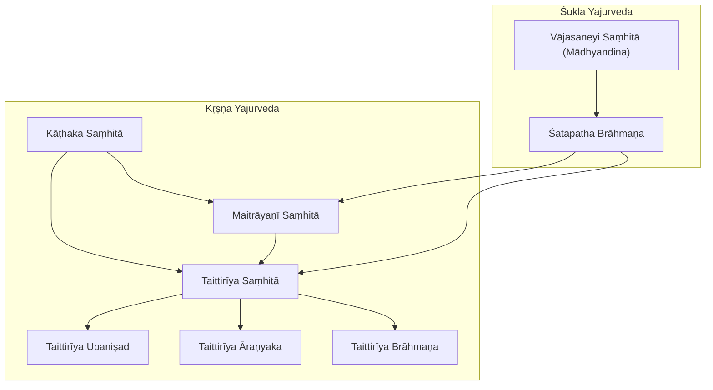
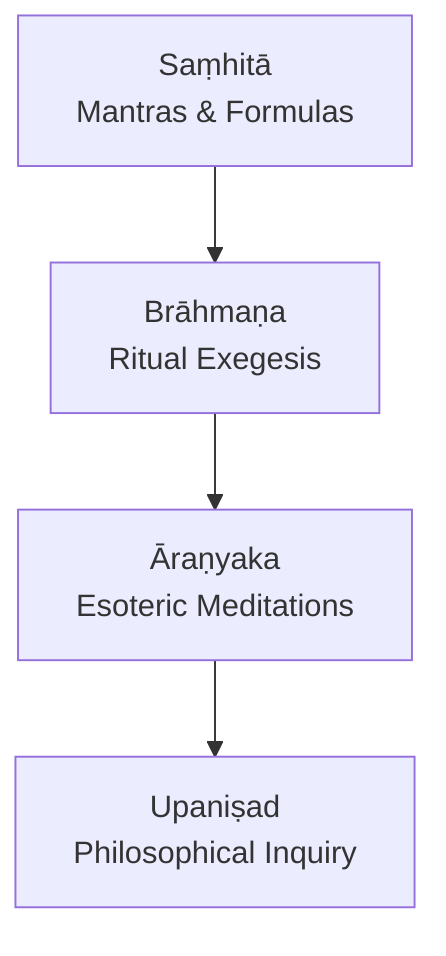
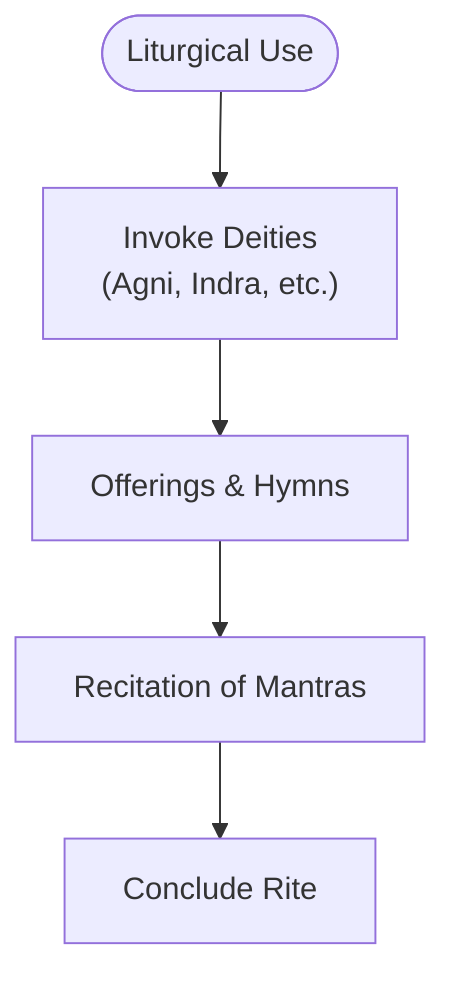
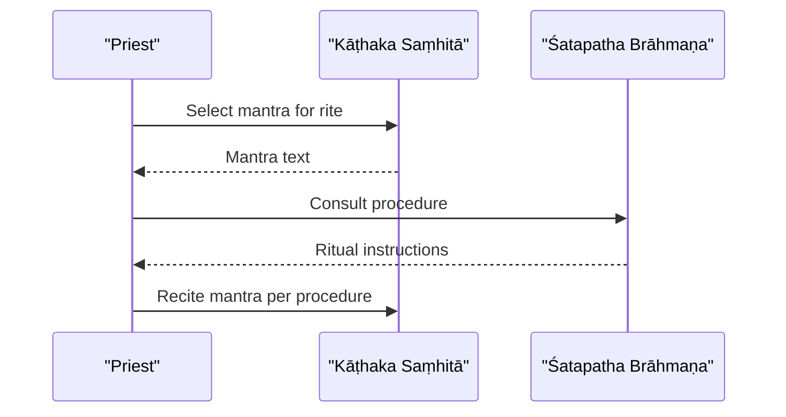
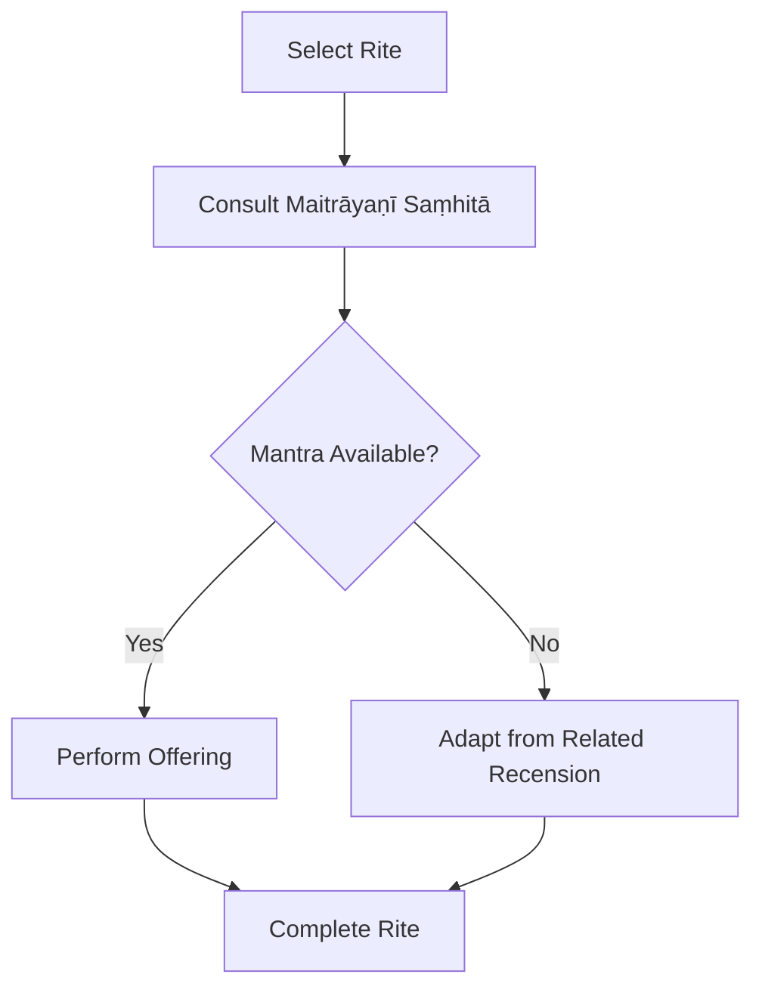
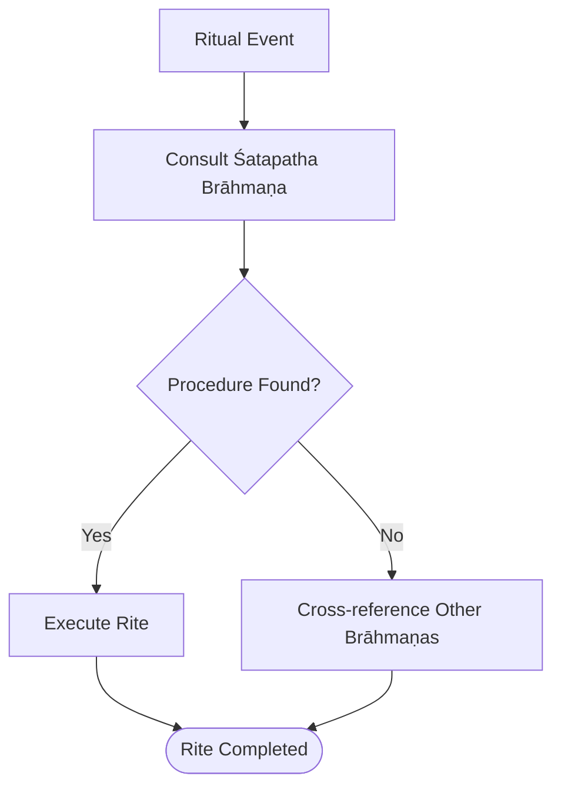
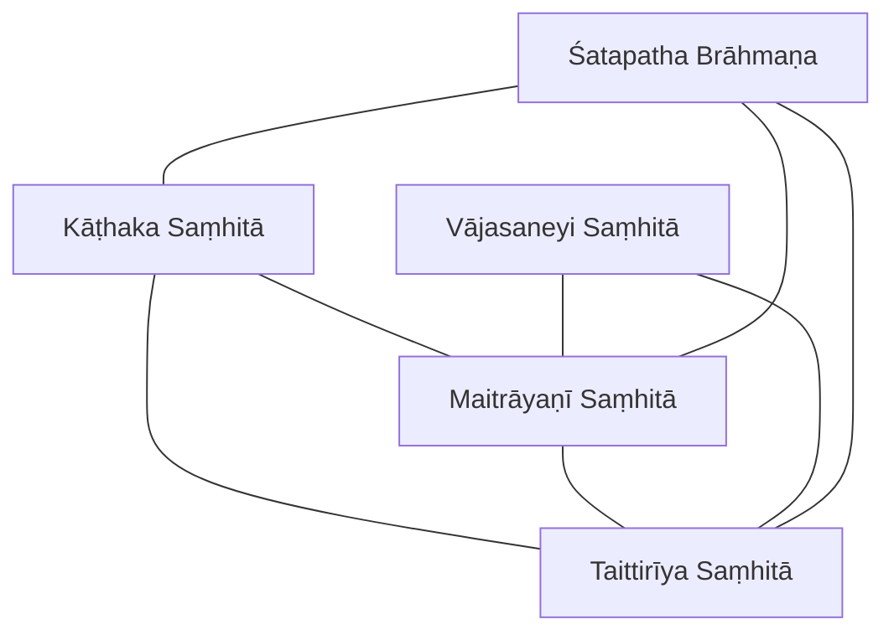

<cite>
**Referenced Files in This Document**
- [vajasaneyisamhita-madhyandina.md](file://vajasaneyisamhita-madhyandina.md)
- [kathakasamhita.md](file://kathakasamhita.md)
- [maitrayanisamhita.md](file://maitrayanisamhita.md)
- [taittiriyasamhita.md](file://taittiriyasamhita.md)
- [satapathabrahmana.md](file://satapathabrahmana.md)
- [taittiriyabrahmana.md](file://taittiriyabrahmana.md)
- [taittiriyaranyaka.md](file://taittiriyaranyaka.md)
- [taittiriyopanisad.md](file://taittiriyopanisad.md)
</cite>

## Table of Contents
1. [Introduction](#introduction)
2. [Project Structure](#project-structure)
3. [Core Components](#core-components)
4. [Architecture Overview](#architecture-overview)
5. [Detailed Component Analysis](#detailed-component-analysis)
6. [Dependency Analysis](#dependency-analysis)
7. [Performance Considerations](#performance-considerations)
8. [Troubleshooting Guide](#troubleshooting-guide)
9. [Conclusion](#conclusion)
10. [Appendices](#appendices)

## Introduction
This document presents a comprehensive overview of the Yajurveda traditions preserved in the repository, focusing on both Śukla (White) and Kṛṣṇa (Black) recensions. It highlights:
- The Vājasaneyi Saṃhitā (Mādhyandina recension) as the principal Śukla Yajurveda text
- The Kāṭhaka and Maitrāyaṇī recensions within the Kṛṣṇa Yajurveda
- The Taittirīya tradition as a complete corpus spanning Saṃhitā, Brāhmaṇa, Āraṇyaka, and Upaniṣad
- The Śatapatha Brāhmaṇa as the most extensive Brāhmaṇa text of the Śukla Yajurveda
It also includes computational linguistic insights derived from lemma frequency and lexical similarity across these texts to illuminate morphological patterns and inter-textual relationships.

## Project Structure
The repository organizes each major Yajurveda text as a concept entry with metadata describing its type, scope, source location, tags, and computed lexical statistics. These entries enable comparative analysis across recensions and genres (Saṃhitā, Brāhmaṇa, Āraṇyaka, Upaniṣad).

**Diagram sources**
- [vajasaneyisamhita-madhyandina.md:1-11](file://vajasaneyisamhita-madhyandina.md#L1-L11)
- [satapathabrahmana.md:1-12](file://satapathabrahmana.md#L1-L12)
- [kathakasamhita.md:1-11](file://kathakasamhita.md#L1-L11)
- [maitrayanisamhita.md:1-11](file://maitrayanisamhita.md#L1-L11)
- [taittiriyasamhita.md:1-11](file://taittiriyasamhita.md#L1-L11)
- [taittiriyabrahmana.md:1-11](file://taittiriyabrahmana.md#L1-L11)
- [taittiriyaranyaka.md:1-11](file://taittiriyaranyaka.md#L1-L11)
- [taittiriyopanisad.md:1-11](file://taittiriyopanisad.md#L1-L11)

**Section sources**
- [vajasaneyisamhita-madhyandina.md:1-11](file://vajasaneyisamhita-madhyandina.md#L1-L11)
- [satapathabrahmana.md:1-12](file://satapathabrahmana.md#L1-L12)
- [kathakasamhita.md:1-11](file://kathakasamhita.md#L1-L11)
- [maitrayanisamhita.md:1-11](file://maitrayanisamhita.md#L1-L11)
- [taittiriyasamhita.md:1-11](file://taittiriyasamhita.md#L1-L11)
- [taittiriyabrahmana.md:1-11](file://taittiriyabrahmana.md#L1-L11)
- [taittiriyaranyaka.md:1-11](file://taittiriyaranyaka.md#L1-L11)
- [taittiriyopanisad.md:1-11](file://taittiriyopanisad.md#L1-L11)

## Core Components
- Vājasaneyi Saṃhitā (Mādhyandina): Principal Śukla Yajurveda Saṃhitā; structured into 40 adhyāyas; provides mantra collections central to Śukla ritual practice.
- Kāṭhaka Saṃhitā: A Kṛṣṇa Yajurveda recension preserving mantras and formulas for ritual use.
- Maitrāyaṇī Saṃhitā: Another Kṛṣṇa Yajurveda recension with extensive ritual material.
- Taittirīya Saṃhitā: Main Kṛṣṇa Yajurveda Saṃhitā organized in seven kāṇḍas.
- Taittirīya Brāhmaṇa: Ritual explanations and legends associated with sacrifices.
- Taittirīya Āraṇyaka: Forest text bridging Brāhmaṇa ritual and Upaniṣadic philosophy.
- Taittirīya Upaniṣad: One of the twelve principal Upaniṣads, structured in three chapters covering phonetics, Brahman’s bliss, and Bhr̥gu’s realization.
- Śatapatha Brāhmaṇa: Most extensive Brāhmaṇa of the Śukla Yajurveda, comprising 14 kāṇḍas of ritual exegesis, myths, and philosophical reflections.

These components collectively map the evolution from liturgical mantras (Saṃhitā) through ritual exposition (Brāhmaṇa), esoteric meditations (Āraṇyaka), to philosophical inquiry (Upaniṣad).

**Section sources**
- [vajasaneyisamhita-madhyandina.md:1-11](file://vajasaneyisamhita-madhyandina.md#L1-L11)
- [kathakasamhita.md:1-11](file://kathakasamhita.md#L1-L11)
- [maitrayanisamhita.md:1-11](file://maitrayanisamhita.md#L1-L11)
- [taittiriyasamhita.md:1-11](file://taittiriyasamhita.md#L1-L11)
- [taittiriyabrahmana.md:1-11](file://taittiriyabrahmana.md#L1-L11)
- [taittiriyaranyaka.md:1-11](file://taittiriyaranyaka.md#L1-L11)
- [taittiriyopanisad.md:1-11](file://taittiriyopanisad.md#L1-L11)
- [satapathabrahmana.md:1-12](file://satapathabrahmana.md#L1-L12)

## Architecture Overview
The Yajurveda corpus exhibits a layered architecture:
- Mantra layer (Saṃhitās): Liturgical core used by priests during sacrifices
- Exegetical layer (Brāhmaṇas): Detailed ritual procedures, mythic narratives, and symbolic interpretations
- Esoteric layer (Āraṇyakas): Transitional texts linking ritual to contemplative practices
- Philosophical layer (Upaniṣads): Metaphysical and epistemological explorations

[No sources needed since this diagram shows conceptual workflow, not actual code structure]

## Detailed Component Analysis

### Vājasaneyi Saṃhitā (Mādhyandina) — Principal Śukla Text
- Scope: 40 adhyāyas of mantras and formulas forming the backbone of Śukla Yajurveda ritual
- Lexical profile: High-frequency lemmas include second-person pronouns and deities commonly invoked in invocations and offerings
- Inter-textual relations: Strongest lexical similarity with Maitrāyaṇī Saṃhitā; notable overlap with Atharvaveda and Taittirīya Saṃhitā

**Section sources**
- [vajasaneyisamhita-madhyandina.md:1-11](file://vajasaneyisamhita-madhyandina.md#L1-L11)
- [vajasaneyisamhita-madhyandina.md:15-48](file://vajasaneyisamhita-madhyandina.md#L15-L48)

### Kāṭhaka Saṃhitā — Kṛṣṇa Recension
- Scope: Mantras and formulas for ritual use within the Kṛṣṇa tradition
- Lexical profile: Frequent use of demonstratives and connective particles; strong deity vocabulary
- Inter-textual relations: Highest similarity with Maitrāyaṇī Saṃhitā; close ties to Taittirīya Saṃhitā and Brāhmaṇa literature

**Diagram sources**
- [kathakasamhita.md:1-11](file://kathakasamhita.md#L1-L11)
- [satapathabrahmana.md:1-12](file://satapathabrahmana.md#L1-L12)

**Section sources**
- [kathakasamhita.md:1-11](file://kathakasamhita.md#L1-L11)
- [kathakasamhita.md:15-48](file://kathakasamhita.md#L15-L48)

### Maitrāyaṇī Saṃhitā — Kṛṣṇa Recension
- Scope: Extensive collection of mantras and ritual formulas
- Lexical profile: Pronominal and connective elements dominate; rich deity lexicon
- Inter-textual relations: Very high similarity with Kāṭhaka Saṃhitā; strong alignment with Taittirīya Saṃhitā and Śatapatha Brāhmaṇa

**Section sources**
- [maitrayanisamhita.md:1-11](file://maitrayanisamhita.md#L1-L11)
- [maitrayanisamhita.md:15-48](file://maitrayanisamhita.md#L15-L48)

### Taittirīya Tradition — Complete Corpus
- Saṃhitā: Seven kāṇḍas of mantras and formulas
- Brāhmaṇa: Ritual explanations and legends
- Āraṇyaka: Bridge between ritual and philosophy
- Upaniṣad: Three chapters covering phonetics, Brahman’s bliss, and Bhr̥gu’s realization

**Diagram sources**
- [taittiriyasamhita.md:1-11](file://taittiriyasamhita.md#L1-L11)
- [taittiriyabrahmana.md:1-11](file://taittiriyabrahmana.md#L1-L11)
- [taittiriyaranyaka.md:1-11](file://taittiriyaranyaka.md#L1-L11)
- [taittiriyopanisad.md:1-11](file://taittiriyopanisad.md#L1-L11)

**Section sources**
- [taittiriyasamhita.md:1-11](file://taittiriyasamhita.md#L1-L11)
- [taittiriyabrahmana.md:1-11](file://taittiriyabrahmana.md#L1-L11)
- [taittiriyaranyaka.md:1-11](file://taittiriyaranyaka.md#L1-L11)
- [taittiriyopanisad.md:1-11](file://taittiriyopanisad.md#L1-L11)

### Śatapatha Brāhmaṇa — Most Extensive Brāhmaṇa
- Scope: 14 kāṇḍas of ritual explanations, myths, and philosophical speculations
- Role: Central exegetical authority for Śukla Yajurveda rituals
- Inter-textual relations: High lexical similarity with Kṛṣṇa recensions, reflecting shared ritual vocabulary and narrative motifs

**Section sources**
- [satapathabrahmana.md:1-12](file://satapathabrahmana.md#L1-L12)

## Dependency Analysis
Lexical similarity metrics reveal structural dependencies among recensions and genres:
- Kṛṣṇa recensions (Kāṭhaka and Maitrāyaṇī) show very high mutual similarity, indicating shared liturgical cores
- Both Kṛṣṇa recensions align closely with Taittirīya Saṃhitā and Brāhmaṇa literature
- Śukla Vājasaneyi Saṃhitā demonstrates moderate similarity with Kṛṣṇa recensions and Atharvaveda, suggesting cross-tradition borrowing or common Indo-Aryan roots
- Śatapatha Brāhmaṇa correlates strongly with Kṛṣṇa Saṃhitās, underscoring its role as a unifying exegetical resource

**Diagram sources**
- [kathakasamhita.md:15-48](file://kathakasamhita.md#L15-L48)
- [maitrayanisamhita.md:15-48](file://maitrayanisamhita.md#L15-L48)
- [taittiriyasamhita.md:15-48](file://taittiriyasamhita.md#L15-L48)
- [vajasaneyisamhita-madhyandina.md:15-48](file://vajasaneyisamhita-madhyandina.md#L15-L48)
- [satapathabrahmana.md:1-12](file://satapathabrahmana.md#L1-L12)

**Section sources**
- [kathakasamhita.md:15-48](file://kathakasamhita.md#L15-L48)
- [maitrayanisamhita.md:15-48](file://maitrayanisamhita.md#L15-L48)
- [taittiriyasamhita.md:15-48](file://taittiriyasamhita.md#L15-L48)
- [vajasaneyisamhita-madhyandina.md:15-48](file://vajasaneyisamhita-madhyandina.md#L15-L48)
- [satapathabrahmana.md:1-12](file://satapathabrahmana.md#L1-L12)

## Performance Considerations
- Comparative lexical analysis benefits from consistent tokenization and normalization across recensions
- High-frequency function words (pronouns, particles) can skew similarity metrics; consider weighting content words more heavily
- Genre-specific corpora (Saṃhitā vs. Brāhmaṇa) may require separate baselines due to stylistic divergence
- Cross-recension studies should account for regional and temporal variations in language use

[No sources needed since this section provides general guidance]

## Troubleshooting Guide
- If similarity scores appear unexpectedly low, verify that preprocessing pipelines are aligned across texts
- Discrepancies in lemma counts may reflect differences in segmentation or annotation standards
- When comparing Śukla and Kṛṣṇa materials, ensure genre-appropriate comparisons (e.g., Saṃhitā vs. Saṃhitā, Brāhmaṇa vs. Brāhmaṇa)

[No sources needed since this section provides general guidance]

## Conclusion
The Yajurveda traditions in this repository present a rich, multi-layered corpus spanning mantras, ritual exegesis, esoteric meditation, and philosophical inquiry. Computational linguistic analysis reveals strong internal cohesion within Kṛṣṇa recensions and meaningful cross-traditional links to Śukla materials. The Taittirīya corpus exemplifies the full arc from liturgy to philosophy, while the Śatapatha Brāhmaṇa stands as the definitive exegetical anchor for Śukla ritual practice. Together, these texts offer a robust foundation for studying Vedic ritual, language, and thought.

[No sources needed since this section summarizes without analyzing specific files]

## Appendices

### Appendix A: Lemma Frequency Highlights Across Recensions
- Vājasaneyi Saṃhitā: Prominent use of second-person forms and deity names in invocations
- Kāṭhaka Saṃhitā: Elevated presence of demonstratives and connectives alongside ritual vocabulary
- Maitrāyaṇī Saṃhitā: Rich pronominal and particle usage reflecting complex syntactic structures
- Taittirīya Saṃhitā: Balanced mix of functional and content words suitable for varied ritual contexts
- Taittirīya Brāhmaṇa: Narrative and procedural markers dominate
- Taittirīya Āraṇyaka: Transitional vocabulary bridging ritual and contemplative domains
- Taittirīya Upaniṣad: Philosophical terms such as “Brahman” emerge prominently
- Śatapatha Brāhmaṇa: Extensive ritual terminology and explanatory discourse

**Section sources**
- [vajasaneyisamhita-madhyandina.md:31-48](file://vajasaneyisamhita-madhyandina.md#L31-L48)
- [kathakasamhita.md:31-48](file://kathakasamhita.md#L31-L48)
- [maitrayanisamhita.md:31-48](file://maitrayanisamhita.md#L31-L48)
- [taittiriyasamhita.md:31-48](file://taittiriyasamhita.md#L31-L48)
- [taittiriyabrahmana.md:31-48](file://taittiriyabrahmana.md#L31-L48)
- [taittiriyaranyaka.md:31-48](file://taittiriyaranyaka.md#L31-L48)
- [taittiriyopanisad.md:31-48](file://taittiriyopanisad.md#L31-L48)
