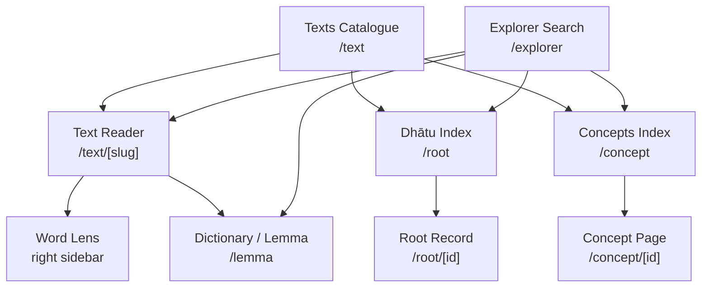
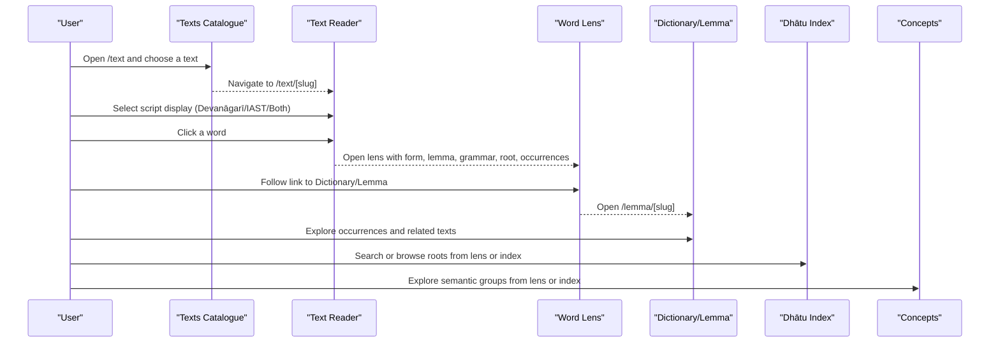
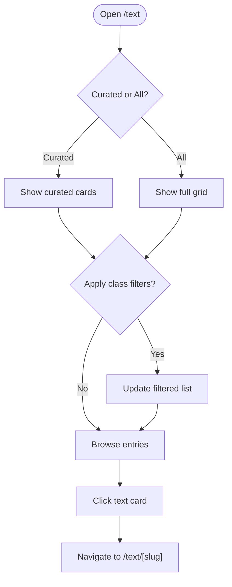
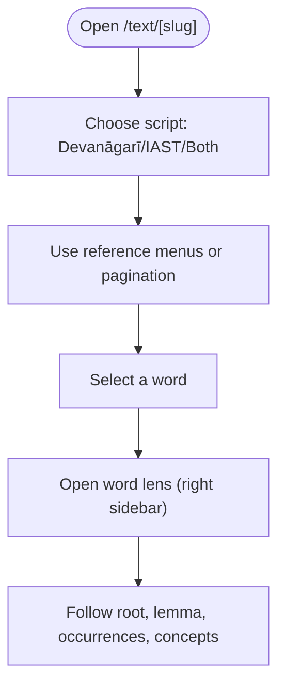
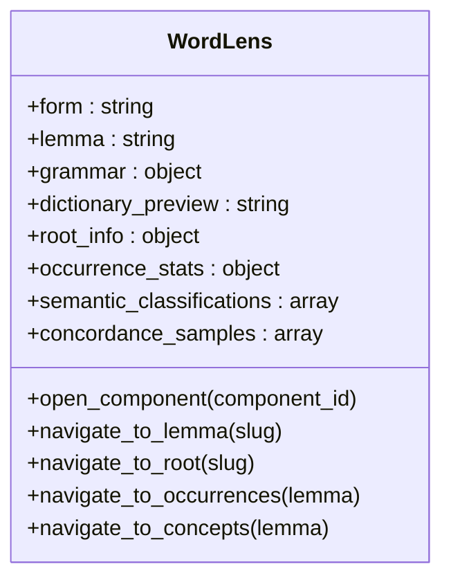
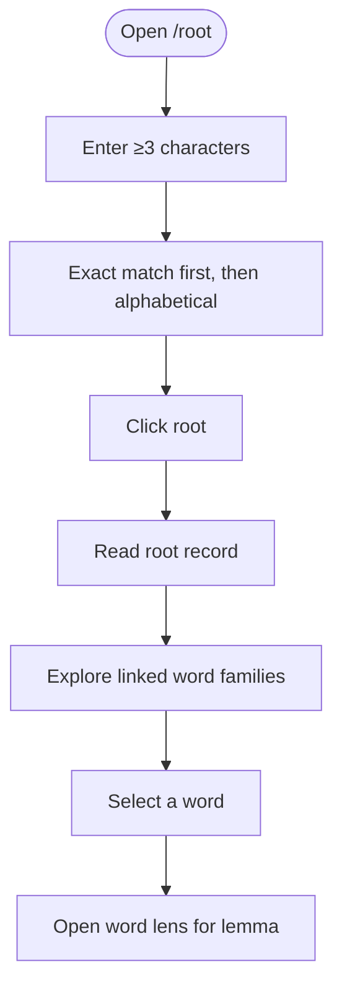
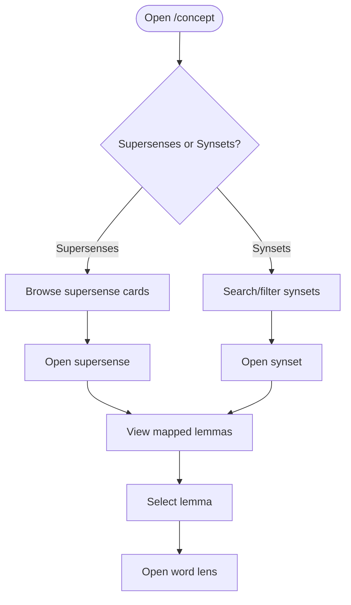
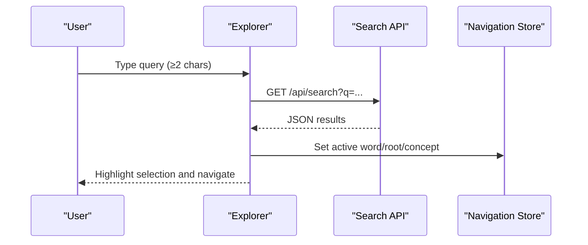
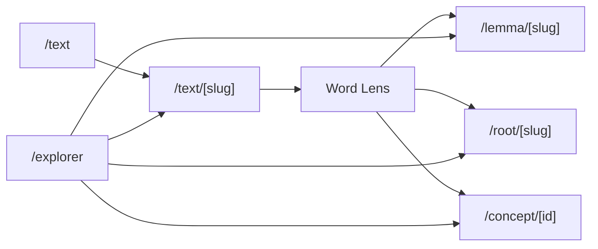

<cite>
**Referenced Files in This Document**
- [getting-started.md](file://src/routes/docs/user/getting-started.md)
- [reading-texts.md](file://src/routes/docs/user/reading-texts.md)
- [word-lens.md](file://src/routes/docs/user/word-lens.md)
- [exploring-dhatus.md](file://src/routes/docs/user/exploring-dhatus.md)
- [exploring-concepts.md](file://src/routes/docs/user/exploring-concepts.md)
- [finding-texts.md](file://src/routes/docs/user/finding-texts.md)
- [glossary.md](file://src/routes/docs/user/glossary.md)
- [discovery-pathways.md](file://src/routes/docs/user/discovery-pathways.md)
- [text catalogue page](file://src/routes/text/+page.svelte)
- [text reader page](file://src/routes/text/[slug]/+page.svelte)
- [dhātu index page](file://src/routes/root/+page.svelte)
- [concept index page](file://src/routes/concept/+page.svelte)
- [explorer page](file://src/routes/explorer/+page.svelte)
</cite>

## Table of Contents
1. Introduction
2. Project Structure
3. Core Components
4. Architecture Overview
5. Detailed Component Analysis
6. Dependency Analysis
7. Performance Considerations
8. Troubleshooting Guide
9. Conclusion
10. Appendices

## Introduction
FractalDharma is a Sanskrit corpus explorer that connects texts, word forms, lemmas, verbal roots (dhātus), and semantic concepts so you can begin with a passage and grow into research. The platform supports two complementary habits: close reading of a single passage and exploratory movement through the corpus via linked lexical and semantic data.

## Project Structure
The site is organized around user-facing routes for browsing texts, reading passages, exploring dhātus, and navigating concepts. Each route provides a focused interface for a specific exploration mode.

**Diagram sources**
- [text catalogue page](file://src/routes/text/+page.svelte)
- [text reader page](file://src/routes/text/[slug]/+page.svelte)
- [dhātu index page](file://src/routes/root/+page.svelte)
- [concept index page](file://src/routes/concept/+page.svelte)
- [explorer page](file://src/routes/explorer/+page.svelte)

**Section sources**
- [text catalogue page](file://src/routes/text/+page.svelte)
- [text reader page](file://src/routes/text/[slug]/+page.svelte)
- [dhātu index page](file://src/routes/root/+page.svelte)
- [concept index page](file://src/routes/concept/+page.svelte)
- [explorer page](file://src/routes/explorer/+page.svelte)

## Core Components
- Texts catalogue: Browse curated selections or filter by literary classes to find starting points.
- Text reader: Read passages in Devanāgarī, IAST, or both; navigate by native references; select words to open the word lens.
- Word lens: Right-side panel showing form, lemma, grammar, dictionary entry, root, occurrences, and semantics for the selected token.
- Dhātu explorer: Index and search verbal roots; view records and linked word families.
- Concept mapper: Semantic taxonomy grouping lemmas into broad categories for cross-text exploration.
- Explorer search: Centralized search to jump quickly to words, roots, or concepts.

**Section sources**
- [getting-started.md](file://src/routes/docs/user/getting-started.md)
- [finding-texts.md](file://src/routes/docs/user/finding-texts.md)
- [reading-texts.md](file://src/routes/docs/user/reading-texts.md)
- [word-lens.md](file://src/routes/docs/user/word-lens.md)
- [exploring-dhatus.md](file://src/routes/docs/user/exploring-dhatus.md)
- [exploring-concepts.md](file://src/routes/docs/user/exploring-concepts.md)

## Architecture Overview
At a high level, users move between pages via links that keep them within the same exploration model. The text reader anchors close reading; the word lens bridges to lexical and semantic resources; the dhātu and concept indexes provide alternative discovery pathways.

**Diagram sources**
- [text catalogue page](file://src/routes/text/+page.svelte)
- [text reader page](file://src/routes/text/[slug]/+page.svelte)
- [explorer page](file://src/routes/explorer/+page.svelte)
- [dhātu index page](file://src/routes/root/+page.svelte)
- [concept index page](file://src/routes/concept/+page.svelte)

## Detailed Component Analysis

### Texts Catalogue (/text)
- Purpose: Browse curated texts or filter by literary/intellectual classes.
- Key behaviors: Toggle curated vs. full list; apply class filters; click entries to open readers.
- Navigation: Links route to /text/[slug].

**Diagram sources**
- [text catalogue page](file://src/routes/text/+page.svelte)

**Section sources**
- [finding-texts.md](file://src/routes/docs/user/finding-texts.md)
- [text catalogue page](file://src/routes/text/+page.svelte)

### Text Reader (/text/[slug])
- Purpose: Read a selected range of a text with reference navigation and script display options.
- Script modes: Devanāgarī, IAST, Both.
- Navigation: Reference menus follow each work’s own structure; pagination controls; hash-based verse scrolling.
- Word selection: Click or keyboard focus + Enter/Space opens the word lens.

**Diagram sources**
- [text reader page](file://src/routes/text/[slug]/+page.svelte)
- [reading-texts.md](file://src/routes/docs/user/reading-texts.md)

**Section sources**
- [reading-texts.md](file://src/routes/docs/user/reading-texts.md)
- [text reader page](file://src/routes/text/[slug]/+page.svelte)

### Word Lens (Right Sidebar)
- Purpose: Turn a token in context into a rich lexical and corpus entry.
- Typical content: Headword/lemma, grammatical features, dictionary preview, root (dhātu), occurrence counts, corpus profile, semantic classifications, sample concordance contexts.
- Compounds: If resolved components are available, they are shown first; selecting one opens its independent entry.
- Usage guidance: Treat frequency and occurrence lists as corpus-specific patterns; always return to passages for interpretation.

**Diagram sources**
- [word-lens.md](file://src/routes/docs/user/word-lens.md)

**Section sources**
- [word-lens.md](file://src/routes/docs/user/word-lens.md)

### Dhātu Explorer (/root)
- Purpose: Index and search verbal roots; read root records; explore linked word families.
- Search behavior: At least three characters; exact matches prioritized; clear query with Escape or outside click.
- Root record: Displays IAST and Devanāgarī, meanings, gaṇa, pada, upasargas where available; blank fields indicate missing source metadata.
- Linked words: Grouped by beginning-of-word patterns (root, guṇa, vṛddhi, other); selecting a word opens its lemma entry in the lens.

**Diagram sources**
- [exploring-dhatus.md](file://src/routes/docs/user/exploring-dhatus.md)
- [dhātu index page](file://src/routes/root/+page.svelte)

**Section sources**
- [exploring-dhatus.md](file://src/routes/docs/user/exploring-dhatus.md)
- [dhātu index page](file://src/routes/root/+page.svelte)

### Concepts (/concept)
- Purpose: Use broad semantic classes (WordNet supersenses) to compare mapped vocabulary across texts.
- Views: Supersenses (default) and Synsets; counts show corpus coverage, not importance.
- Navigation: Open a supersense to see mapped lemmas; select a lemma to open its full entry; use local hierarchy graphs to orient.

**Diagram sources**
- [exploring-concepts.md](file://src/routes/docs/user/exploring-concepts.md)
- [concept index page](file://src/routes/concept/+page.svelte)

**Section sources**
- [exploring-concepts.md](file://src/routes/docs/user/exploring-concepts.md)
- [concept index page](file://src/routes/concept/+page.svelte)

### Explorer Search (/explorer)
- Purpose: Centralized search to quickly jump to words, roots, or concepts.
- Behavior: Debounced search; selects an exact match when possible; navigates to relevant entry and updates active state.

**Diagram sources**
- [explorer page](file://src/routes/explorer/+page.svelte)

**Section sources**
- [explorer page](file://src/routes/explorer/+page.svelte)

## Dependency Analysis
- Routes drive user flows: Texts → Reader → Word Lens → Dictionary/Lemma/Dhātu/Concepts.
- The explorer integrates search results into the same navigation model, enabling quick transitions between entities.
- Browser history preserves exploratory paths; most links keep users within the same model.

**Diagram sources**
- [text catalogue page](file://src/routes/text/+page.svelte)
- [text reader page](file://src/routes/text/[slug]/+page.svelte)
- [explorer page](file://src/routes/explorer/+page.svelte)
- [dhātu index page](file://src/routes/root/+page.svelte)
- [concept index page](file://src/routes/concept/+page.svelte)

**Section sources**
- [getting-started.md](file://src/routes/docs/user/getting-started.md)

## Performance Considerations
- Debounced search reduces server load during typing.
- Pagination limits verses per page to balance readability and interaction speed.
- Preloading hints on links improve perceived performance when navigating.

[No sources needed since this section provides general guidance]

## Troubleshooting Guide
- Missing information: Absent fields (e.g., no root, limited dictionary entry) reflect evolving data, not unimportance. Always return to passages for interpretation.
- Compound tokens: If resolution is unavailable, the lens will indicate so rather than guess.
- Coverage limitations: Corpus statistics describe this collection only; small counts do not imply insignificance.

**Section sources**
- [word-lens.md](file://src/routes/docs/user/word-lens.md)
- [exploring-dhatus.md](file://src/routes/docs/user/exploring-dhatus.md)
- [exploring-concepts.md](file://src/routes/docs/user/exploring-concepts.md)

## Conclusion
Begin with a passage, use the word lens to explore lexicon and semantics, and follow links to roots and concepts. Keep your question visible to turn wandering into cumulative research. Browser history helps retrace your path through the exploration model.

[No sources needed since this section summarizes without analyzing specific files]

## Appendices

### First Reading Session: Step-by-Step
1. Open Texts at /text and choose a curated text or a class such as Vedic Saṃhitās, Upaniṣads, or Darśanas.
2. Open the text. Use the reference menus to jump to a chapter, section, or verse in the text’s numbering system.
3. Choose Devanāgarī, IAST, or Both according to how you want to read.
4. Select a word. The word lens opens at right with its full available entry.
5. Follow a root, a related text, a concept, or an occurrence to continue your investigation.

**Section sources**
- [getting-started.md](file://src/routes/docs/user/getting-started.md)
- [reading-texts.md](file://src/routes/docs/user/reading-texts.md)

### How Links Behave and Browser History
- Most links keep you within the same exploration model: text → reader, lemma → word entry, root → dhātu entry, concept → semantic grouping.
- Use browser history to retrace an exploratory path.

**Section sources**
- [getting-started.md](file://src/routes/docs/user/getting-started.md)

### Coverage Limitations
- The corpus is evolving; a text may have extensive reader data but little descriptive material, or a word may have analysis before a full dictionary entry.
- Missing information means the relevant projection is not yet available in this edition; it does not mean the word or text is unimportant.

**Section sources**
- [getting-started.md](file://src/routes/docs/user/getting-started.md)

### Glossary Highlights
- Token, Form, Lemma, Dhātu/root, Gaṇa, Pada, Compound, Concordance, Occurrence, Concept, Supersense, Synset, Reference.

**Section sources**
- [glossary.md](file://src/routes/docs/user/glossary.md)

### Discovery Pathways
- From a passage to a lexical family; from a lemma to its contexts; from a text class to a comparison set; from a concept to a reading list; keep a question visible.

**Section sources**
- [discovery-pathways.md](file://src/routes/docs/user/discovery-pathways.md)
