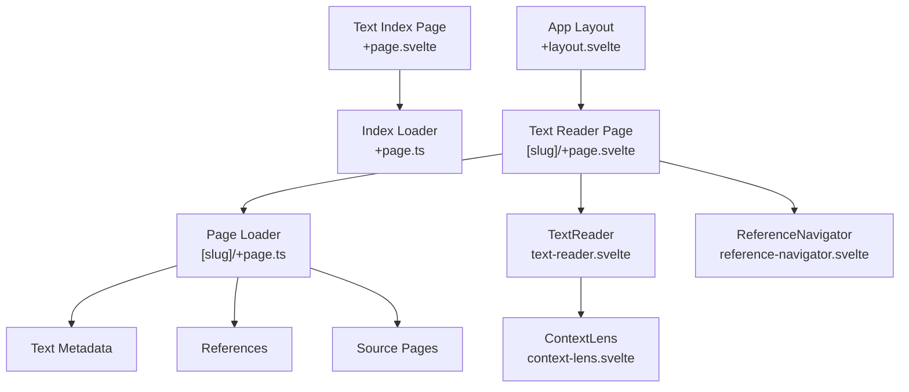
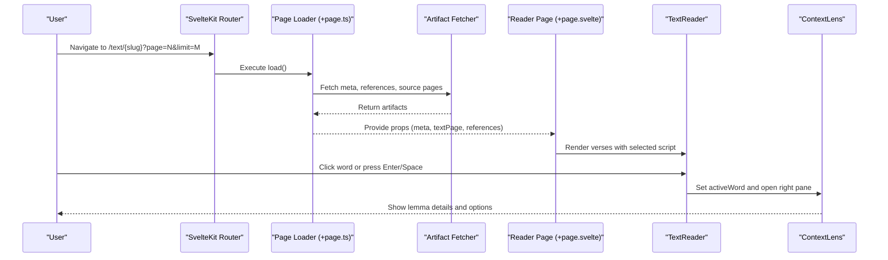
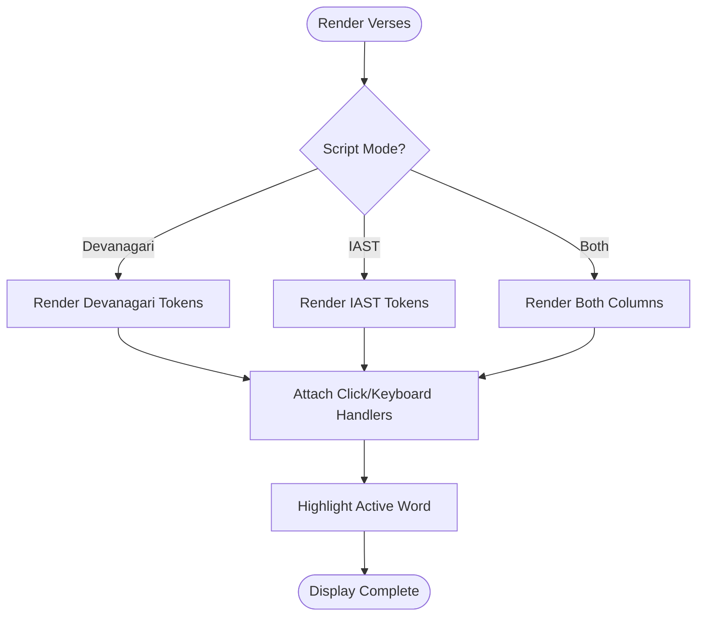
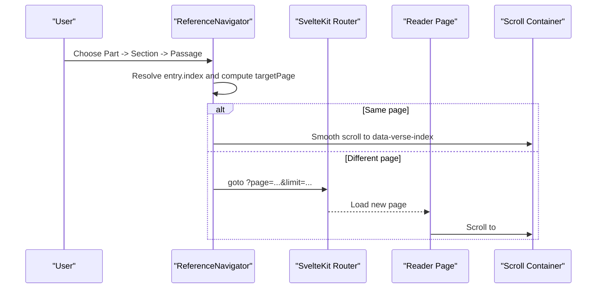
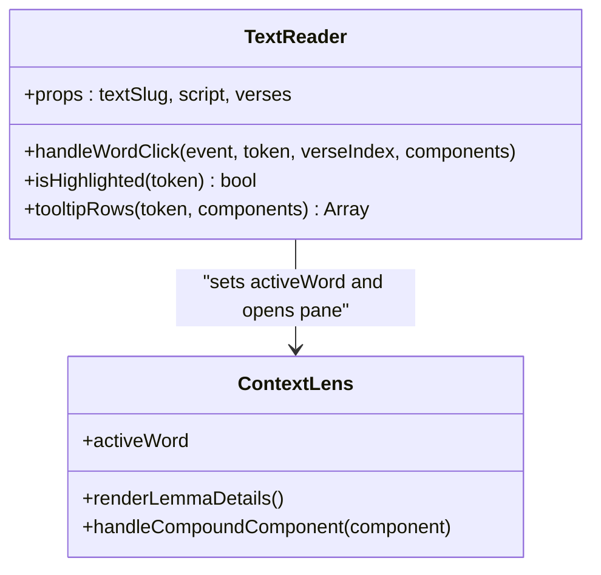
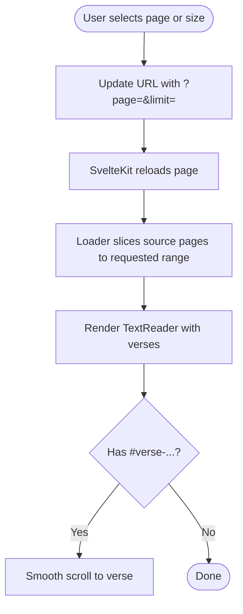
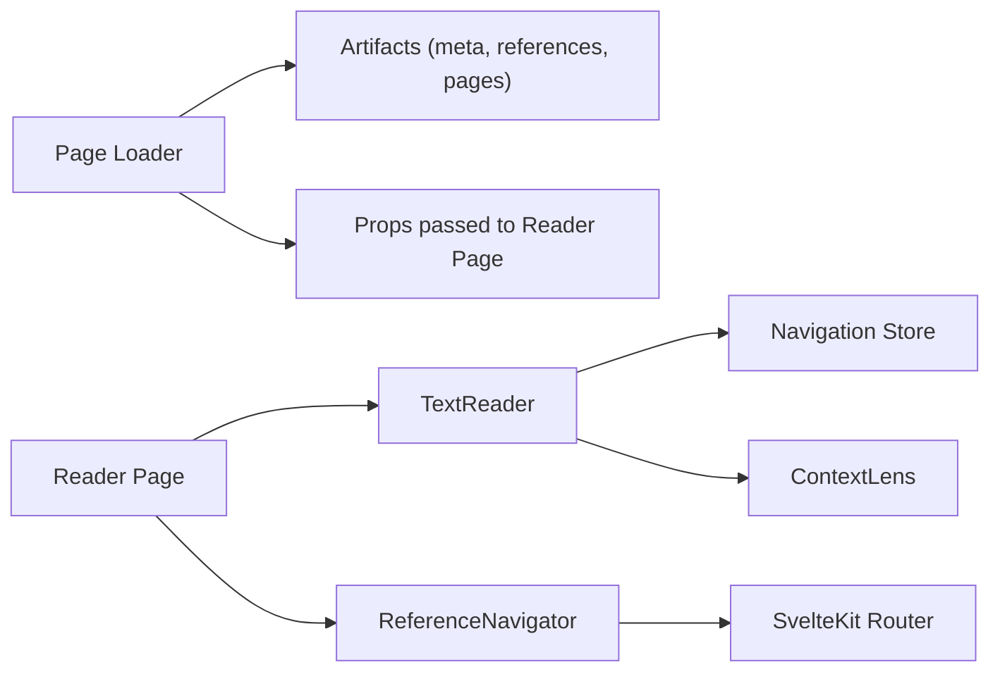

<cite>
**Referenced Files in This Document**
- [text page component](file://src/routes/text/[slug]/+page.svelte)
- [text page loader](file://src/routes/text/[slug]/+page.ts)
- [text index page](file://src/routes/text/+page.svelte)
- [text index loader](file://src/routes/text/+page.ts)
- [text reader component](file://src/lib/components/text-reader.svelte)
- [reference navigator component](file://src/lib/components/reference-navigator.svelte)
- [context lens component](file://src/lib/components/context-lens.svelte)
- [layout shell](file://src/routes/+layout.svelte)
- [user docs: reading texts](file://src/routes/docs/user/reading-texts.md)
- [developer docs: reader and lens](file://src/routes/docs/developer/reader-and-lens.md)
</cite>

## Table of Contents
1. Introduction
2. Project Structure
3. Core Components
4. Architecture Overview
5. Detailed Component Analysis
6. Dependency Analysis
7. Performance Considerations
8. Troubleshooting Guide
9. Conclusion
10. Appendices

## Introduction
This document explains the text reading functionality in FractalDharma, focusing on how users navigate and study Dharmic texts with multi-script display, verse-by-verse navigation, reference menus, interactive word selection with a context lens, pagination, search, and accessibility features. It also provides practical workflows for different text types (Vedic Saṃhitās, Upaniṣads, Darśanas) and guidance for close reading and research.

## Project Structure
The reading experience is implemented as SvelteKit routes and reusable components:
- A text index route lists available texts and filters by class.
- A per-text route loads metadata, references, and paginated verses, then renders the reader and controls.
- The reader component displays Devanāgarī, IAST, or both, and wires word interactions to the context lens.
- A reference navigator enables jumping to chapters, sections, or verses using the text’s native numbering.

**Diagram sources**
- [text index page](file://src/routes/text/+page.svelte)
- [text index loader](file://src/routes/text/+page.ts)
- [text page component](file://src/routes/text/[slug]/+page.svelte)
- [text page loader](file://src/routes/text/[slug]/+page.ts)
- [text reader component](file://src/lib/components/text-reader.svelte)
- [reference navigator component](file://src/lib/components/reference-navigator.svelte)
- [context lens component](file://src/lib/components/context-lens.svelte)
- [layout shell](file://src/routes/+layout.svelte)

**Section sources**
- [text index page](file://src/routes/text/+page.svelte)
- [text index loader](file://src/routes/text/+page.ts)
- [text page component](file://src/routes/text/[slug]/+page.svelte)
- [text page loader](file://src/routes/text/[slug]/+page.ts)

## Core Components
- TextReader: Renders a slice of verses with Devanāgarī, IAST, or dual-script views. Handles word clicks, keyboard activation, highlighting, and mobile lens placement.
- ReferenceNavigator: Builds hierarchical passage selectors from the text’s reference strings; navigates to pages and scrolls to specific verses.
- ContextLens: Displays lexical details for the active word, including compound resolution and lemma data.
- Text Reader Page: Orchestrates script mode, pagination, and navigation state; smooth-scrolls to hash targets.

Key responsibilities:
- Script display toggles between Devanāgarī, IAST, and Both without altering underlying data.
- Pagination uses URL query parameters (page, limit) and supports 20/50/100 verses per page.
- Reference navigation maps to native numbering systems and jumps to exact verses via hash anchors.
- Word selection updates a global active word and opens the lens pane.

**Section sources**
- [text reader component](file://src/lib/components/text-reader.svelte)
- [reference navigator component](file://src/lib/components/reference-navigator.svelte)
- [text page component](file://src/routes/text/[slug]/+page.svelte)

## Architecture Overview
The reader follows a clear separation of concerns:
- Data loading occurs in route loaders, fetching metadata, references, and source pages.
- UI state (script mode, active word) is managed in components and shared stores.
- Navigation uses SvelteKit routing with query parameters and hash anchors for precise positioning.

**Diagram sources**
- [text page loader](file://src/routes/text/[slug]/+page.ts)
- [text page component](file://src/routes/text/[slug]/+page.svelte)
- [text reader component](file://src/lib/components/text-reader.svelte)
- [context lens component](file://src/lib/components/context-lens.svelte)

## Detailed Component Analysis

### Multi-script Display System
- Modes: Devanāgarī only, IAST only, or Both side-by-side.
- Rendering: Each token is wrapped in an interactive span with tooltip rows showing part-of-speech and grammatical features when available.
- Highlighting: Selected words are highlighted across visible tokens based on lemma identity or compound matching.
- Mobile behavior: On smaller screens, the context lens appears inline within the selected verse.

**Diagram sources**
- [text reader component](file://src/lib/components/text-reader.svelte)

**Section sources**
- [text reader component](file://src/lib/components/text-reader.svelte)

### Verse-by-Verse Navigation and Reference Menus
- Native references: Each verse carries a reference string; labels are displayed using a utility that strips redundant corpus prefixes.
- Hierarchical navigation: ReferenceNavigator parses levels (e.g., Maṇḍala → Sūkta → Ṛca for Ṛgveda; Section → Verse for Atharvaveda Paippalāda). Generic texts derive numeric levels from the stored reference.
- Jump-to-verse: Selecting the final level computes the target page and navigates with a hash anchor (#verse-index), scrolling smoothly into view.

**Diagram sources**
- [reference navigator component](file://src/lib/components/reference-navigator.svelte)
- [text page component](file://src/routes/text/[slug]/+page.svelte)

**Section sources**
- [reference navigator component](file://src/lib/components/reference-navigator.svelte)
- [text page component](file://src/routes/text/[slug]/+page.svelte)

### Interactive Word Selection and Context Lens
- Activation: Click or keyboard Enter/Space on a word sets the active word and opens the right pane.
- Compound handling: Unresolved compounds show available components first; selecting one replaces the active word.
- Lexical detail: Normal words trigger on-demand fetch of lemma details; stale responses are ignored if the active slug changes.
- Accessibility: Words have role="button", tabindex="0", and keyboard handlers for activation.

**Diagram sources**
- [text reader component](file://src/lib/components/text-reader.svelte)
- [context lens component](file://src/lib/components/context-lens.svelte)

**Section sources**
- [text reader component](file://src/lib/components/text-reader.svelte)
- [context lens component](file://src/lib/components/context-lens.svelte)
- [developer docs: reader and lens](file://src/routes/docs/developer/reader-and-lens.md)

### Pagination Controls
- URL-driven: page and limit parameters control which verses are shown.
- Page size options: 20, 50, or 100 verses per page; larger sizes reduce navigation overhead for continuous reading.
- Previous/Next buttons and page selector dropdown provide quick navigation.
- Hash-based verse targeting ensures smooth scrolling to the correct position after navigation.

**Diagram sources**
- [text page component](file://src/routes/text/[slug]/+page.svelte)
- [text page loader](file://src/routes/text/[slug]/+page.ts)

**Section sources**
- [text page component](file://src/routes/text/[slug]/+page.svelte)
- [text page loader](file://src/routes/text/[slug]/+page.ts)

### Search Within Texts
- Global search bar allows searching lemmas and navigating to lemma pages.
- While not a full-text search inside passages, it complements the reader by enabling quick lookup of terms encountered during reading.

Practical usage:
- Type a term in the search bar to see results.
- Click a result to open the lemma page where you can explore occurrences and related entries.

**Section sources**
- [layout shell](file://src/routes/+layout.svelte)

### Bookmarking Capabilities
- Current implementation does not include explicit bookmarking. Users can leverage browser bookmarks or shareable URLs with page and hash anchors to return to specific passages.
- Example URL pattern: /text/{slug}?page=N&limit=M#verse-I

[No sources needed since this section provides general guidance]

## Dependency Analysis
The reader depends on:
- Route loaders for artifact fetching (metadata, references, source pages).
- Shared utilities for text reference formatting and token visibility.
- Navigation store for active word and pane management.
- Context lens for lexical details and compound resolution.

**Diagram sources**
- [text page loader](file://src/routes/text/[slug]/+page.ts)
- [text page component](file://src/routes/text/[slug]/+page.svelte)
- [text reader component](file://src/lib/components/text-reader.svelte)
- [reference navigator component](file://src/lib/components/reference-navigator.svelte)

**Section sources**
- [text page loader](file://src/routes/text/[slug]/+page.ts)
- [text page component](file://src/routes/text/[slug]/+page.svelte)
- [text reader component](file://src/lib/components/text-reader.svelte)
- [reference navigator component](file://src/lib/components/reference-navigator.svelte)

## Performance Considerations
- Bounded requests: Source pages remain small (canonical 20 verses); larger page sizes are achieved by fetching consecutive chunks and slicing in memory.
- Efficient rendering: Visible tokens are computed to avoid unnecessary work; highlighting is scoped to current viewport.
- Mobile optimization: Inline lens placement reduces layout shifts and improves readability on small screens.
- Navigation efficiency: Hash-based scrolling avoids full-page reflows; smooth scrolling enhances UX.

[No sources needed since this section provides general guidance]

## Troubleshooting Guide
- No verses on page: Ensure the page number is valid and within total pages; check URL parameters.
- Reference navigation not working: Verify reference structure for the text; some texts require specific mappings (e.g., Ṛgveda, Atharvaveda Paippalāda).
- Word lens not opening: Confirm active word is set and right pane is enabled; check network errors for lemma fetch.
- Keyboard activation not working: Ensure words have tabindex and keydown handlers; test Enter/Space keys.

**Section sources**
- [text reader component](file://src/lib/components/text-reader.svelte)
- [reference navigator component](file://src/lib/components/reference-navigator.svelte)

## Conclusion
FractalDharma’s reader provides a robust, accessible, and flexible environment for studying Sanskrit texts. With multi-script display, native reference navigation, interactive word selection, and efficient pagination, it supports both close reading and research workflows across diverse text types.

[No sources needed since this section summarizes without analyzing specific files]

## Appendices

### Practical Examples and Workflows

#### Vedic Saṃhitās (e.g., Ṛgveda)
- Use reference menus to select Maṇḍala → Sūkta → Ṛca.
- For continuous reading, choose 100 verses/page; for detailed analysis, use 20 verses/page.
- Click words to explore lexicon; resolve compounds via the lens.

#### Upaniṣads
- Navigate by Part → Section → Passage using generic reference levels.
- Toggle script modes to compare Devanāgarī and IAST readings.
- Use search to look up key terms and cross-reference with lemma pages.

#### Darśanas (Philosophical Treatises)
- Leverage reference navigation for structured sections and subsections.
- Employ keyboard navigation for hands-free reading and precise word selection.
- Combine reader with explorer tools for conceptual mapping.

**Section sources**
- [user docs: reading texts](file://src/routes/docs/user/reading-texts.md)
- [developer docs: reader and lens](file://src/routes/docs/developer/reader-and-lens.md)

### Accessibility Features
- Keyboard navigation: Words are focusable and activatable via Enter/Space.
- Screen reader support: Semantic roles (button, tooltip) and aria-labels improve assistive technology compatibility.
- Visual clarity: Highlighting and tooltips aid comprehension without relying solely on color.

**Section sources**
- [text reader component](file://src/lib/components/text-reader.svelte)
- [reference navigator component](file://src/lib/components/reference-navigator.svelte)
